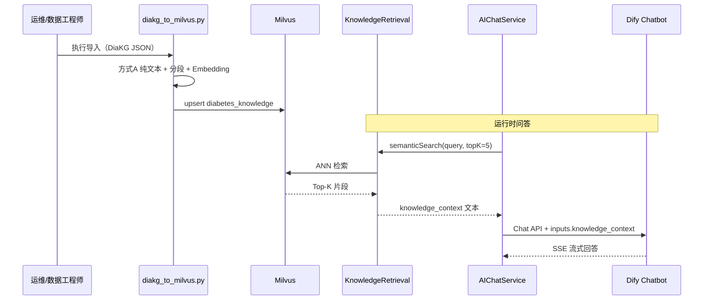

# Milvus 医学知识库落地指南

本文档描述医学知识库建设方案：将 DiaKG 等源数据经纯文本转换后写入 Milvus，由后端 `KnowledgeRetrieval` 统一检索，再注入 Dify 工作流（科普问答、问诊等）。

下载地址：[中文糖尿病科研文献实体关系数据集DiaKG_数据集-阿里云天池](https://tianchi.aliyun.com/dataset/88836)

将数据集放在diakg/目录下

---

## 1. 架构概览

### 1.1 分层职责


| 层级   | 组件                                    | 职责                                             |
| ---- | ------------------------------------- | ---------------------------------------------- |
| 数据源  | `diakg/*.json`                        | 原始医学知识                                         |
| ETL  | `scripts/diakg_to_milvus.py`          | 纯文本提取 → 导出 `diakg_text/` → 分段 → Embedding → 入库 |
| 向量库  | Milvus `diabetes_knowledge`           | 统一知识存储（SSOT）                                   |
| 检索服务 | `home-service` → `KnowledgeRetrieval` | 语义检索、过滤、重排、日志                                  |
| 编排层  | Dify Chatbot / Workflow               | 接收 `knowledge_context`，调用 LLM                  |
| 模型层  | DeepSeek 等                            | 生成回答                                           |


### 1.2 与 `article_knowledge` 的区别


| Collection           | 服务                | 用途       | 数据内容              |
| -------------------- | ----------------- | -------- | ----------------- |
| `article_knowledge`  | `article-service` | 资讯语义推荐   | 资讯标题+摘要向量         |
| `diabetes_knowledge` | `home-service` 等  | 医学知识 RAG | DiaKG 指南片段、药典、文献等 |


两者共用同一 Milvus 实例，**Collection 相互独立**，Embedding 模型与维度须各自配置一致。

### 1.3 端到端时序




---


## 2. 前置条件


### 2.1 基础设施


| 项目                      | 版本/说明                                                    |
| ----------------------- | -------------------------------------------------------- |
| Docker / Docker Compose | Milvus 2.4+（项目已配置 `docker-compose.yml`）                  |
| MinIO                   | Milvus 依赖的对象存储（compose 已包含）                              |
| Python                  | 3.10+（导入脚本）                                              |
| Embedding 服务            | Ollama / OpenAI 兼容 API（推荐 `qwen3-embedding:0.6b`，1024 维） |


### 2.2 启动 Milvus

```bash
cd d:\programdata\diabetes_dev
docker-compose up -d milvus minio
curl http://localhost:9091/healthz
```


### 2.3 环境变量

在 `.env` 中配置（与 `.env.example` 对齐）：

```env
MILVUS_ENABLED=true
MILVUS_HOST=localhost          # Docker 内服务互调用 milvus
MILVUS_PORT=19530
MILVUS_DIMENSION=1024          # 须与 Embedding 模型输出维度一致

EMBEDDING_PROVIDER=openai
EMBEDDING_BASE_URL=http://localhost:11434
EMBEDDING_API_KEY=ollama
EMBEDDING_MODEL=qwen3-embedding:0.6b
```

拉取 Embedding 模型：

```bash
ollama pull qwen3-embedding:0.6b
```


### 2.4 Python 依赖

```bash
pip install pymilvus requests
```

---


## 3. 阶段一：DiaKG 转纯文本（方式 A）


### 3.1 源数据说明

`diakg/` 目录含 **41** 个 DiaKG 标注 JSON（约 **2292** 段、**28 万**字），结构如下：

```
doc_id
└── paragraphs[]
    ├── paragraph_id
    ├── paragraph          ← 直接使用（纯文本）
    └── sentences[]        ← 含 entities / relations，入库时忽略
        ├── sentence
        ├── entities[]
        └── relations[]
```

**转换原则（方式 A）：**

- 只提取 `paragraphs[].paragraph` 字段
- **不**将实体、关系标注写入 `content`（避免干扰 Embedding 与 LLM 阅读）
- 文档标题 = 首段 `paragraph`（DiaKG 惯例为首行标题）


### 3.2 单文件提取逻辑

```python
import json
from pathlib import Path

def extract_plain_text(json_path: str) -> tuple[str, list[str]]:
    data = json.loads(Path(json_path).read_text(encoding="utf-8"))
    paragraphs = [
        p["paragraph"].strip()
        for p in data["paragraphs"]
        if p["paragraph"].strip()
    ]
    title = paragraphs[0] if paragraphs else f"doc_{data['doc_id']}"
    body = paragraphs[1:] if len(paragraphs) > 1 else paragraphs
    return title, body
```


### 3.3 导出为 TXT（一期默认目录 `diakg_text/`）

```bash
python scripts/diakg_to_milvus.py --export-only --input diakg --output diakg_text
```

输出目录 `diakg_text/` 下每篇一个 `{doc_id}.txt`，并生成 `diakg_text/manifest.json` 汇总元数据，便于肉眼检查转换质量。

**一期范围：** 仅 DiaKG 源数据，统一 `doc_type=guideline`。

---


## 4. 阶段二：分段（Chunking）


### 4.1 策略说明

DiaKG 单段平均约 **125 字**，过短。建议**按文档内顺序合并**至 **400~600 字**再入库，保证检索片段上下文完整。


| 参数            | 推荐值 | 说明                     |
| ------------- | --- | ---------------------- |
| `target_size` | 500 | 单 chunk 目标字符数          |
| `overlap`     | 80  | 相邻 chunk 重叠字符数（避免语义截断） |


### 4.2 合并逻辑

```python
def merge_chunks(paragraphs: list[str], target_size=500, overlap=80) -> list[str]:
    chunks, buf, size = [], [], 0
    for para in paragraphs:
        if size + len(para) > target_size and buf:
            chunks.append("\n\n".join(buf))
            tail = buf[-1] if buf else ""
            buf = [tail, para] if len(tail) <= overlap else [para]
            size = sum(len(x) for x in buf) + 2 * max(len(buf) - 1, 0)
        else:
            buf.append(para)
            size += len(para) + 2
    if buf:
        chunks.append("\n\n".join(buf))
    return chunks
```


### 4.3 规模预估


| 指标       | 预估值                            |
| -------- | ------------------------------ |
| 源文件      | 41 篇 JSON                      |
| 原始段落     | ~2292 段                        |
| 入库 chunk | ~~500~~800 条                   |
| 导入耗时     | 10~30 分钟（取决于 Embedding API 速度） |


---


## 5. 阶段三：Milvus Collection 设计


### 5.1 Schema

Collection 名称：`diabetes_knowledge`


| 字段            | 类型                 | 说明                                                                  |
| ------------- | ------------------ | ------------------------------------------------------------------- |
| `id`          | VARCHAR(64) PK     | 主键，如 `diakg_1_0`                                                    |
| `vector`      | FLOAT_VECTOR(1024) | Embedding 向量                                                        |
| `content`     | VARCHAR(65535)     | 纯文本片段（喂给 LLM）                                                       |
| `doc_title`   | VARCHAR(256)       | 源文档标题                                                               |
| `doc_source`  | VARCHAR(256)       | 来源路径，如 `diakg/1.json`                                               |
| `doc_type`    | VARCHAR(64)        | `guideline` / `pharmacology` / `literature` / `diet` / `health_edu` |
| `page_num`    | INT64              | 页码（DiaKG 默认 0）                                                      |
| `chunk_index` | INT64              | 文档内分段序号                                                             |
| `created_at`  | INT64              | Unix 时间戳                                                            |


### 5.2 索引

```yaml
索引字段: vector
索引类型: IVF_FLAT
距离度量: COSINE
参数: nlist=128（数据量 < 10 万时可取 128；百万级可调至 1024）
检索参数: nprobe=16
```


---


## 6. 阶段四：导入 Milvus


### 6.1 使用导入脚本

项目提供统一脚本：

```bash
# 全量导入 diakg/*.json
python scripts/diakg_to_milvus.py \
  --input diakg \
  --collection diabetes_knowledge \
  --host localhost \
  --port 19530 \
  --embed-url http://localhost:11434 \
  --embed-model qwen3-embedding:0.6b \
  --embed-key ollama \
  --dim 1024 \
  --chunk-size 500 \
  --chunk-overlap 80

# 仅导出 TXT 到 diakg_text/，不写 Milvus
python scripts/diakg_to_milvus.py --export-only --input diakg --output diakg_text

# 仅导入 Milvus（跳过 TXT 导出，推荐生产重导时使用）
python scripts/diakg_to_milvus.py --import-only --input diakg --batch-size 8
```


### 6.2 主键规则

```
id = diakg_{doc_id}_{chunk_index}
```

同一 `id` 再次 upsert 会覆盖，便于增量更新。

### 6.3 导入后检查

```python
from pymilvus import connections, Collection

connections.connect(host="localhost", port="19530")
col = Collection("diabetes_knowledge")
col.load()
print("总条数:", col.num_entities)
```

或使用 [Attu](https://github.com/zilliztech/attu) 连接 `localhost:19530` 可视化查看。

---


## 7. 阶段五：检索验证


### 7.1 命令行抽检

```bash
python scripts/diakg_to_milvus.py --search "胰岛素促泌剂适合哪些患者？" --top-k 5
```

期望返回与「胰岛素促泌剂」「2 型糖尿病」相关的指南片段，相似度 > 0.7。

### 7.2 knowledge_context 拼接格式

检索结果拼接：

```text
【片段1 | 来源: 中国成人2型糖尿病胰岛素促泌剂应用的专家共识 | 相似度: 0.912】
2型糖尿病患者在饮食和运动控制基础上，如 HbA1c 仍高于目标值，可考虑启用胰岛素促泌剂...

【片段2 | 来源: ... | 相似度: 0.887】
...
```

**拼接规则：**

- 片段之间空一行
- `来源` 取 `doc_title`
- `相似度` 保留 3 位小数
- 无检索结果时返回空字符串（Dify 侧标注「基于通用医学知识」）

---


## 8. 阶段六：后端服务接入


### 8.1 待实现组件（home-service）


| 类/模块                    | 路径（规划）                                     | 职责                   |
| ----------------------- | ------------------------------------------ | -------------------- |
| `KnowledgeRetrieval`    | `home-service/.../KnowledgeRetrieval.java` | 语义检索入口               |
| `MilvusKnowledgeClient` | `home-service/.../milvus/`                 | Milvus CRUD / search |
| `EmbeddingClient`       | `common` 或 `home-service`                  | 文本向量化                |
| `AIChatService`         | `home-service/.../AIChatService.java`      | 编排：检索 → Dify → SSE   |


可参考 `article-service` 中已有实现：

- `MilvusArticleClient.java`
- `ArticleEmbeddingService.java`
- `MilvusArticleSearchService.java`


### 8.2 KnowledgeRetrieval 接口

```java
public interface KnowledgeRetrieval {
    /** @return 检索到的文档片段，按相似度降序 */
    List<DocumentChunk> semanticSearch(String query, int topK);

    /** 可选：BGE-Reranker 重排 */
    List<DocumentChunk> rerank(String query, List<DocumentChunk> chunks);

    /** 拼接为 Dify inputs.knowledge_context */
    String buildKnowledgeContext(List<DocumentChunk> chunks);
}
```


### 8.3 DocumentChunk 结构

```java
public record DocumentChunk(
    String id,
    String content,
    String docTitle,
    String docSource,
    String docType,
    double score
) {}
```


### 8.4 检索流程

```
1. query 非空校验
2. EmbeddingClient.embed(query) → float[]
3. MilvusKnowledgeClient.search(vector, topK=5, docTypeFilter=null)
4. 过滤 score < 0.7 的结果（阈值可配置）
5. 可选 rerank → 取 Top-3~5
6. buildKnowledgeContext(chunks) → String
7. 记录检索日志（query、命中 id、score、耗时）
```


### 8.5 application.yml 配置（规划）

```yaml
milvus:
  enabled: ${MILVUS_ENABLED:false}
  host: ${MILVUS_HOST:localhost}
  port: ${MILVUS_PORT:19530}
  collection: diabetes_knowledge
  dimension: ${MILVUS_DIMENSION:1024}
  metric-type: COSINE
  index-type: IVF_FLAT
  search-top-k: 5
  score-threshold: 0.7
  embedding:
    provider: ${EMBEDDING_PROVIDER:openai}
    openai-base-url: ${EMBEDDING_BASE_URL:}
    openai-api-key: ${EMBEDDING_API_KEY:}
    openai-model: ${EMBEDDING_MODEL:qwen3-embedding:0.6b}
```

---


## 9. 阶段七：Dify 对接


### 9.1 Chatbot 配置


| 项目      | 配置                                |
| ------- | --------------------------------- |
| 应用类型    | Chatbot                           |
| API     | `POST /v1/chat-messages`          |
| 响应模式    | `streaming`                       |
| 自定义变量   | `knowledge_context`（String，由后端传入） |
| **知识库** | **不挂载** Dify 内置知识库                |


### 9.2 请求示例

```json
{
  "query": "胰岛素促泌剂适合哪些患者？",
  "user": "usr_001",
  "response_mode": "streaming",
  "inputs": {
    "knowledge_context": "【片段1 | 来源: 中国成人2型糖尿病胰岛素促泌剂应用的专家共识 | 相似度: 0.912】\n..."
  }
}
```


### 9.3 系统提示词要点

- 优先依据 `{{knowledge_context}}` 回答
- 无检索内容时标注「基于通用医学知识」
- Markdown 排版，约 500 字以内
- 末尾固定免责声明
- 拒答诊断/处方类请求

### 9.4 多工作流复用


| 工作流  | 契约文档                | knowledge_context 来源                      |
| ---- | ------------------- | ----------------------------------------- |
| 科普问答 | `科普问答工作流数据契约.md`    | `home-service` / 全库                       |
| 问诊辅助 | `问诊工作流数据契约.md`      | 可按 `doc_type` 过滤 guideline + pharmacology |
| 方案生成 | `Dify工作流数据契约.md` §4 | 可按 `doc_type` 过滤 diet 等                   |


---


## 10. 阶段八：运维与治理


### 10.1 全量更新

```bash
# 1. 重新导入（upsert 覆盖同 id）
python scripts/diakg_to_milvus.py --input diakg

# 2. 验证条数与抽检检索
python scripts/diakg_to_milvus.py --search "HbA1c 控制目标"
```


### 10.2 增量更新

新增 JSON 或修订文档时：

```bash
python scripts/diakg_to_milvus.py --input diakg/42.json
```


### 10.3 删除文档

按 `doc_source` 删除该文档全部 chunk（脚本需提供 `--delete-by-source diakg/1.json`）。

### 10.4 监控项


| 指标            | 说明                                   |
| ------------- | ------------------------------------ |
| Milvus 健康     | `curl http://localhost:9091/healthz` |
| Collection 条数 | 与导入日志一致                              |
| 检索 P99 延迟     | 目标 < 500ms（Embedding + Milvus）       |
| 空结果率          | 过高时检查 Embedding 模型或阈值                |
| Embedding 失败率 | 降级策略见 §10.5                          |


### 10.5 降级策略


| 条件                    | 行为                                       |
| --------------------- | ---------------------------------------- |
| Milvus 不可用            | 仍调用 Dify，`knowledge_context=""`，回答标注通用知识 |
| 检索无结果                 | 同上                                       |
| Embedding 失败          | 记录错误，跳过 Milvus，走降级                       |
| 未配置 `DIFY_QA_API_KEY` | 返回静态 FAQ 或 503                           |


---


## 11. 实施 checklist

```text
□ 启动 Milvus + MinIO（docker-compose）
□ 配置 .env（MILVUS_*、EMBEDDING_*）
□ 拉取 Embedding 模型（ollama pull qwen3-embedding:0.6b）
□ pip install pymilvus requests
□ 执行 scripts/diakg_to_milvus.py --export-only 导出 diakg_text/
□ 执行 scripts/diakg_to_milvus.py 全量导入 Milvus（doc_type=guideline）
□ 验证 col.num_entities > 0
□ 检索抽检（胰岛素促泌剂、HbA1c、饮食等）
□ 实现 home-service KnowledgeRetrieval
□ 实现 AIChatService 对接 Dify Chat API
□ Dify Chatbot 配置 knowledge_context 变量（不挂内置知识库）
□ 端到端测试 POST /api/v1/chat/qa
```

