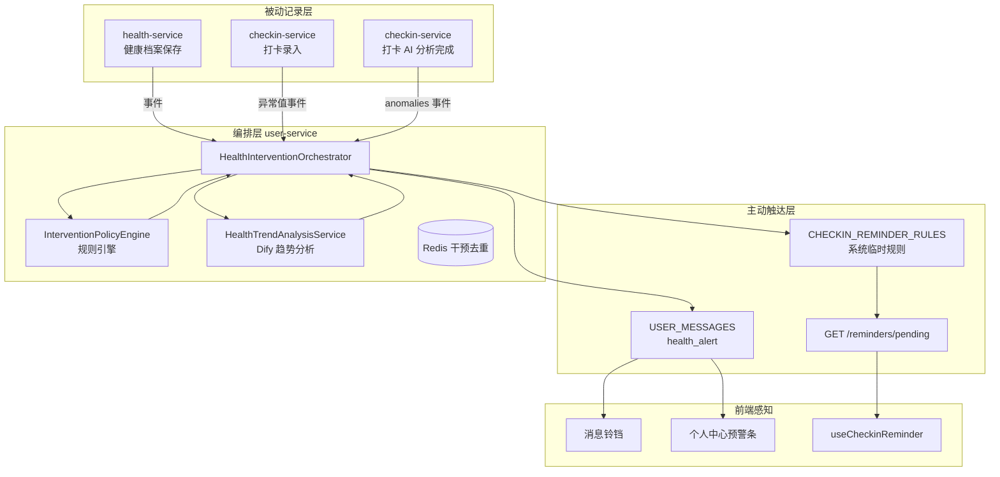
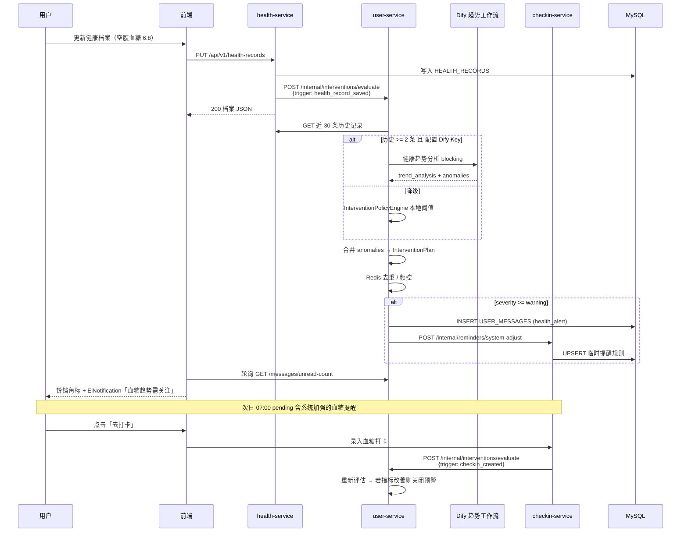
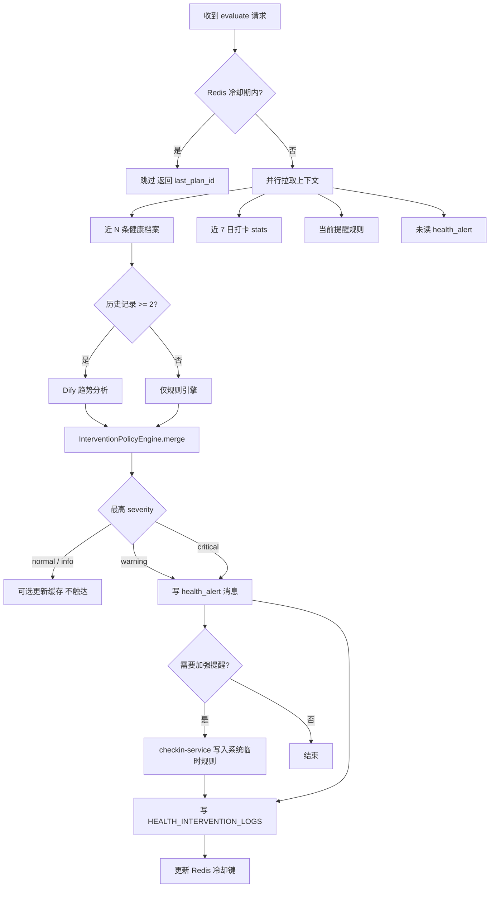

# 主动健康干预闭环设计方案


| 项目   | 说明                                                                                                                                                                                                        |
| ---- | --------------------------------------------------------------------------------------------------------------------------------------------------------------------------------------------------------- |
| 文档版本 | v1.0                                                                                                                                                                                                      |
| 编写日期 | 2026-07-02                                                                                                                                                                                                |
| 创新定位 | **被动记录 → 主动干预** — 将健康趋势 AI、消息中心、打卡提醒三模块串联为可闭环的自我管理链路                                                                                                                                                      |
| 关联服务 | `user-service`（编排入口 + 消息写入）、`health-service`（健康档案与趋势分析）、`checkin-service`（打卡事件与提醒规则）                                                                                                                      |
| 关联平台 | Dify 健康趋势分析工作流（Workflow #7）、Redis（干预去重缓存）                                                                                                                                                                 |
| 文档依据 | [健康趋势分析工作流数据契约.md](./健康趋势分析工作流数据契约.md)、[消息中心模块产品设计说明书.md](./消息中心模块产品设计说明书.md)、[打卡提醒模块产品设计说明书.md](./打卡提醒模块产品设计说明书.md)、[用户健康画像Agent设计方案.md](./用户健康画像Agent设计方案.md)、[模块设计与交互原型设计.md](./模块设计与交互原型设计.md) §2.1.6 |


---

## 1. 背景与问题

### 1.1 现状：三模块各自独立

本项目已具备趋势分析契约、消息中心、打卡提醒的 **独立设计**，但尚未形成 **跨模块闭环**：


| 模块         | 当前状态                                                                                                                         | 用户感知                                   |
| ---------- | ---------------------------------------------------------------------------------------------------------------------------- | -------------------------------------- |
| **健康趋势分析** | Dify 契约已定义（Workflow #7）；后端 `HealthTrendAnalysisService` **未实现**；前端 `getHealthTrendSummary()` / `getHealthAlert()` 为 **Mock** | 个人中心仅展示静态占位文案，异常无法触达                   |
| **消息中心**   | 已实现 4 类消息（`risk_assess` / `plan_generate` / `consult_reply` / `checkin_analysis`）                                            | 仅通知「用户主动触发的 AI 任务结果」，**不含**系统主动发现的健康风险 |
| **打卡提醒**   | 规则 CRUD + `GET /pending` 轮询 + 前端 `useCheckinReminder` **已实现**                                                                | 提醒时段 **完全静态**，与用户实际健康/行为数据 **无联动**     |


**数据流断裂示意（现状）：**

```mermaid
graph LR
    subgraph 被动记录
        HR[健康档案保存]
        CK[生活打卡录入]
    end

    subgraph 分析层-割裂
        TA[趋势分析 Mock]
        CA[打卡 AI 分析]
    end

    subgraph 触达层-割裂
        MC[消息中心 4 类]
        RM[静态打卡提醒]
    end

    HR -.->|未触发| TA
    CK --> CA
    TA -.x|无写入| MC
    CA -->|仅 completed| MC
    CA -.->|文案建议| RM
    RM -.x|无动态调整| CK
```


### 1.2 核心问题

1. **分析结果滞留页面**：趋势异常仅在个人中心 Mock 展示，用户离开页面后无感知。
2. **提醒与健康数据脱节**：打卡提醒按固定 `HH:mm` 触发，不因「血糖趋势上升」「连续漏打卡」而加强。
3. **打卡分析建议无法落地**：Dify 打卡分析 `improvements[]` 含「开启打卡提醒」「加强餐后血糖监测」，但 **无编排层** 将其转化为消息或规则变更。
4. **缺少统一干预策略**：LLM 输出与医学阈值规则未合并，存在过度提醒或遗漏风险。


### 1.3 创新目标

构建 **主动健康干预闭环（Proactive Health Intervention Loop）**：


| 阶段  | 名称       | 说明                             |
| --- | -------- | ------------------------------ |
| ①   | **被动记录** | 用户保存健康档案、录入打卡（含异常血糖值）          |
| ②   | **智能检测** | 规则引擎 + Dify 趋势分析，识别异常模式与风险等级   |
| ③   | **干预编排** | 将检测结果映射为 **消息预警** + **提醒策略调整** |
| ④   | **主动触达** | 消息中心 `health_alert` + 动态打卡提醒   |
| ⑤   | **行为反馈** | 用户查看预警 → 打卡/更新档案 → 回到 ①，形成闭环   |


> **一句话定位**：用户只管记录，系统在后台读懂趋势并在合适时机 **推消息、调提醒**，把「事后看报告」升级为「事前被叫醒」。


### 1.4 设计边界


| 范围内                   | 范围外                 |
| --------------------- | ------------------- |
| 登录用户个人级干预             | 群体流行病学、admin 统计告警   |
| 消息通知 + 提醒规则 **建议性调整** | 自动修改健康方案、自动发药、在线处方  |
| 规则引擎 + Dify 双轨，后端最终裁决 | LLM 直接写库、绕过策略引擎     |
| 首期不新增微服务进程            | 独立推送网关、短信/微信（P3 评估） |
| 与现有 4 类消息中心消息 **并存**  | 替换消息中心或打卡提醒模块       |


---


## 2. 总体架构


### 2.1 逻辑分层




### 2.2 编排宿主：user-service

选定 `user-service` 作为 **干预编排入口**，理由：


| 因素           | 说明                                                                     |
| ------------ | ---------------------------------------------------------------------- |
| 域归属          | 个人中心、健康趋势 API、消息中心均在 user-service                                      |
| 已有客户端        | `HealthServiceClient`、`CheckinServiceClient`（待扩展）、`UserMessageService` |
| 网关路由         | `/api/v1/user/health-trend`、`/api/v1/user/messages` 已规划/实现             |
| 与画像 Agent 关系 | 本方案为画像 Agent Phase 0 的 **轻量子集**（仅趋势 + 触达，不做全量画像）                       |


`health-service` 负责健康档案 CRUD 与 Dify 趋势工作流调用封装；`checkin-service` 负责提醒规则写入与 pending 计算；**干预决策与消息创建** 集中在 user-service。

### 2.3 与现有模块关系


| 已有模块         | 本方案关系                                                                  |
| ------------ | ---------------------------------------------------------------------- |
| 健康趋势分析工作流    | **复用** Workflow #7 契约；扩展后端 `InterventionPolicyEngine` 消费 `anomalies[]` |
| 消息中心         | **扩展** 第 5 类消息 `health_alert`；触达规则沿用 in_app + browser_push             |
| 打卡提醒         | **扩展** 系统临时规则（`source=system`）；用户规则不被覆盖                                |
| 用户健康画像 Agent | 本方案为 **前置闭环**；画像 Agent 上线后可替换/增强编排层输入                                  |
| 打卡 AI 分析     | 分析完成且含 `anomalies` 时 **触发** 干预评估（与趋势分析结果合并去重）                          |


---


## 3. 闭环业务流程


### 3.1 端到端时序（主路径：健康档案更新）




### 3.2 触发源定义


| 触发代号                    | 触发服务                           | 触发时机                                | 传入上下文                                               |
| ----------------------- | ------------------------------ | ----------------------------------- | --------------------------------------------------- |
| `health_record_saved`   | health-service → user-service  | `PUT/POST` 健康档案成功后（异步）              | `userId`, `recordId`, 最新指标快照                        |
| `checkin_created`       | checkin-service → user-service | 打卡写入成功后；**血糖类型** 或 **当日首条**         | `userId`, `checkinType`, `checkinDate`, `payload`   |
| `checkin_analysis_done` | checkin-service → user-service | Dify 打卡分析返回且 `anomalies.length > 0` | `userId`, `period`, `anomalies[]`, `improvements[]` |
| `scheduler_daily`       | user-service                   | 每日 08:00（`Asia/Shanghai`）           | 近 7 日有档案或打卡记录的活跃用户                                  |
| `manual_refresh`        | user-service                   | 用户主动 `GET /health-trend?force=true` | `userId`                                            |


> **异步原则**：`health_record_saved` / `checkin_created` 采用 **事件异步**（`@Async` 或 Spring `ApplicationEvent`），**不阻塞** 用户主请求响应。


### 3.3 干预决策流程




---


## 4. 干预策略引擎


### 4.1 设计原则


| 原则         | 说明                                                              |
| ---------- | --------------------------------------------------------------- |
| **后端裁决**   | Dify 输出为建议输入；最终 `severity` 与触达动作由 `InterventionPolicyEngine` 决定 |
| **医学阈值优先** | 硬编码阈值可 **升级** LLM 评级，不可 **降级** critical 级别                      |
| **最小打扰**   | 同用户同类型异常 24h 内 upsert，不重复弹窗                                     |
| **可解释**    | 每条干预附带 `evidence[]`（数据来源 + 指标快照）                                |


### 4.2 规则引擎阈值（本地降级基准）

与 `MedicalCalculator`、`健康趋势分析工作流数据契约` §4 对齐：


| 信号类型                       | 条件                                                                                 | 最低 severity | 建议动作             |
| -------------------------- | ---------------------------------------------------------------------------------- | ----------- | ---------------- |
| `glucose_fasting_high`     | 空腹血糖 ≥ 7.0 mmol/L                                                                  | `warning`   | 消息 + 建议复查        |
| `glucose_fasting_critical` | 空腹血糖 ≥ 11.1 mmol/L                                                                 | `critical`  | 消息 + 加强空腹/餐后血糖提醒 |
| `glucose_trend_rising`     | 近 30 天空腹血糖升幅 ≥ 15% 且末值 ≥ 6.1                                                       | `warning`   | 消息 + 趋势图链接       |
| `bp_high`                  | 收缩压 ≥ 140 或 舒张压 ≥ 90                                                               | `warning`   | 消息               |
| `checkin_missed_streak`    | 连续 3 日四类打卡均为 0                                                                     | `warning`   | 消息 + 启用/加强默认提醒模板 |
| `checkin_glucose_abnormal` | 打卡血糖值 ≥ 11.1                                                                       | `critical`  | 消息 + 当日额外血糖提醒    |
| `checkin_analysis_anomaly` | Dify 分析 `anomalies[].type` ∈ `missed_all`, `glucose_abnormal`, `medication_missed` | 按 type 映射   | 消息 + 对应类型提醒加强    |


### 4.3 Dify 趋势输出 → 干预映射

消费 `[健康趋势分析工作流数据契约.md](./健康趋势分析工作流数据契约.md)` 中 `outputs.trend_analysis`：


| Dify 字段                  | 映射到 InterventionPlan                           |
| ------------------------ | ---------------------------------------------- |
| `risk_level`             | `attention` → 最低 warning；`critical` → critical |
| `anomalies[].severity`   | 与规则引擎取 **较高** 等级                               |
| `anomalies[].type`       | 决定 `link_path` 与提醒 `checkin_type`              |
| `anomalies[].suggestion` | 写入消息 `summary` 与 `extra.suggestion`            |
| `summary`                | 消息摘要补充 / 个人中心趋势文案                              |


**不扩展 Dify 输出 Schema**（首期）：干预动作由后端策略表决定，降低 LLM 不可控风险。Phase 2 可在工作流增加 `recommended_actions[]` 供引擎 **参考**（非强制执行）。

### 4.4 干预计划对象 `InterventionPlan`

```json
{
  "plan_id": "ivp_20260702_u001",
  "user_id": "u_test001",
  "trigger": "health_record_saved",
  "severity": "warning",
  "risk_level": "attention",
  "summary": "近30天空腹血糖呈上升趋势，最新值 6.8 mmol/L，建议关注并加强监测。",
  "evidence": [
    {
      "source": "health_records",
      "metric": "fasting_glucose",
      "value": 6.8,
      "threshold": 6.1,
      "recorded_at": "2026-07-02T08:00:00"
    },
    {
      "source": "dify_trend",
      "metric": "glucose_trend.change_rate",
      "value": 15.4
    }
  ],
  "actions": [
    {
      "type": "message",
      "message_type": "health_alert",
      "title": "健康指标需关注",
      "link_path": "/user-center",
      "link_query": { "section": "health-alert" }
    },
    {
      "type": "reminder_adjust",
      "adjustments": [
        {
          "checkin_type": 4,
          "action": "ensure_enabled",
          "times": ["07:00", "10:00"],
          "duration_days": 7,
          "reason": "glucose_trend_rising"
        }
      ]
    }
  ],
  "expires_at": "2026-07-09T08:00:00"
}
```

---


## 5. 消息中心扩展


### 5.1 新增消息类型 `health_alert`


| 项目        | 说明                                                                  |
| --------- | ------------------------------------------------------------------- |
| 类型代号      | `health_alert`                                                      |
| 触发        | 干预编排层 severity ≥ `warning`                                          |
| 与现有 4 类差异 | **系统主动发现**，非用户主动触发 AI 任务                                            |
| 默认跳转      | `/user-center?section=health-alert` 或 `/health-evaluation`（含趋势 Tab） |
| status    | 仅 `completed`（无 failed；分析失败时降级规则引擎，仍可能产出 warning）                   |


### 5.2 触达策略

沿用 [消息中心模块产品设计说明书.md](./消息中心模块产品设计说明书.md) §3 双通道规则：


| 条件                               | 行为                                          |
| -------------------------------- | ------------------------------------------- |
| `health_alert_notify !== false`  | 写入 `USER_MESSAGES` 并触达                      |
| 用户已在个人中心且 `section=health-alert` | 仅更新页内预警条，**不弹** L3                          |
| 用户不在相关页                          | 铃铛 L1 + `ElNotification` L3                 |
| 标签页后台 + Notification 已授权         | `browser_push`                              |
| severity = `critical`            | L3 `duration: 0`（需手动关闭）+ 可选 `type: warning` |


### 5.3 通知开关


| 字段                    | 默认值                                             | 控制范围                     |
| --------------------- | ----------------------------------------------- | ------------------------ |
| `health_alert_notify` | `true`                                          | **仅** `health_alert` 类消息 |
| `message_notify`      | `true`                                          | 原有 4 类 AI 任务结果           |
| 读取逻辑                  | `health_alert_notify ?? message_notify ?? true` | 未单独配置时继承总消息开关            |


**个人中心 UI 扩展**（隐私与通知区块）：

```
┌─────────────────────────────────────────────────────┐
│ 健康预警通知                          [ 开关 ON ]    │
│ 指标异常或趋势风险时主动提醒您                       │
├─────────────────────────────────────────────────────┤
│ 消息通知                              [ 开关 ON ]    │
│ 风险评估、健康方案、医生回复、打卡分析完成或失败时…   │
├─────────────────────────────────────────────────────┤
│ 打卡提醒                              [ 开关 ON ]    │
│ 到点提醒完成饮食/运动/用药/血糖打卡（含系统加强时段）│
└─────────────────────────────────────────────────────┘
```


### 5.4 消息文案模板


| severity   | title   | summary 示例                       |
| ---------- | ------- | -------------------------------- |
| `warning`  | 健康指标需关注 | 近30天空腹血糖呈上升趋势（6.8 mmol/L），建议加强监测 |
| `critical` | 健康指标异常  | 空腹血糖 11.2 mmol/L 明显偏高，请尽快复查并联系医生 |


`extra` 字段：

```json
{
  "severity": "warning",
  "risk_level": "attention",
  "trigger": "health_record_saved",
  "anomaly_types": ["glucose"],
  "plan_id": "ivp_20260702_u001",
  "suggestion": "建议复查空腹血糖，如持续偏高请内分泌科就诊"
}
```


### 5.5 合并与去重


| 规则        | 说明                                                   |
| --------- | ---------------------------------------------------- |
| upsert 键  | `userId + message_type=health_alert + bizId=plan_id` |
| 同类型 24h 内 | 更新 `summary` / `extra`，**不**新增未读（若用户已读则重新计未读）        |
| 每日上限      | 同一用户 `health_alert` 最多 **2 条/天**（critical 除外）        |


---


## 6. 打卡提醒动态调整


### 6.1 与用户规则的关系


| 规则来源 | `RULE_SOURCE` | 优先级 | 说明                                             |
| ---- | ------------- | --- | ---------------------------------------------- |
| 用户自建 | `user`        | 高   | 用户于 `/checkin-reminder-settings` 配置，**不被系统删除** |
| 系统干预 | `system`      | 低   | 由干预编排写入，带 `expires_at`，过期自动失效                  |


**合并逻辑**（`CheckinReminderService.getPending` 扩展）：

1. 加载用户规则 + 未过期的 `system` 规则
2. 同一 `checkin_type + remind_time` 去重，**user 规则优先**
3. 系统规则仅 **新增** 时段或 **enable** 已被用户禁用的类型的临时时段（不修改 user 规则的 `remind_time`）


### 6.2 系统临时规则数据模型

扩展 `CHECKIN_REMINDER_RULES`（`db/init.sql` 增量迁移）：

```sql
ALTER TABLE CHECKIN_REMINDER_RULES
    ADD C AFTER ENABLOLUMN RULE_SOURCE VARCHAR(16) NOT NULL DEFAULT 'user'
        COMMENT 'user=用户配置 system=系统干预'ED,
    ADD COLUMN INTERVENTION_ID VARCHAR(32) DEFAULT NULL
        COMMENT '关联 HEALTH_INTERVENTION_LOGS.PLAN_ID' AFTER RULE_SOURCE,
    ADD COLUMN EXPIRES_AT DATETIME DEFAULT NULL
        COMMENT '系统规则过期时间 NULL=永久' AFTER INTERVENTION_ID;
```


### 6.3 干预 → 提醒动作映射


| 干预原因                       | checkin_type      | 动作               | 典型时段                | 持续天数 |
| -------------------------- | ----------------- | ---------------- | ------------------- | ---- |
| `glucose_trend_rising`     | 4 血糖              | `add_times`      | 07:00, 10:00        | 7    |
| `glucose_critical`         | 4 血糖              | `add_times`      | 07:00, 10:00, 14:00 | 14   |
| `checkin_missed_streak`    | 1~4               | `apply_defaults` | §2.3 推荐模板           | 7    |
| `medication_missed`        | 3 用药              | `ensure_enabled` | 用户已有或 08:00, 20:00  | 7    |
| `checkin_analysis_suggest` | 按 improvements 解析 | `add_times`      | 解析失败则跳过             | 7    |


**internal API**（checkin-service）：

```
POST /api/v1/internal/reminders/system-adjust
Header: X-Internal-Key
Body: { user_id, intervention_id, adjustments[], expires_at }
```


### 6.4 前端展示

`/checkin-reminder-settings` 规则列表增加标签：

- 用户规则：无标签
- 系统规则：`el-tag type="info"`「系统建议 · 7天后失效」

干预消息 CTA 按钮：


| 消息 actions          | 按钮文案   | 跳转                                  |
| ------------------- | ------ | ----------------------------------- |
| 含 `reminder_adjust` | 查看加强提醒 | `/checkin-reminder-settings`        |
| 仅趋势异常               | 查看趋势   | `/user-center?section=health-alert` |
| 血糖异常                | 去测血糖   | `/checkin-records?tab=glucose`      |


---


## 7. 数据模型


### 7.1 干预日志表 `HEALTH_INTERVENTION_LOGS`

库：`DIABETES_USER`

```sql
CREATE TABLE HEALTH_INTERVENTION_LOGS (
    PLAN_ID        VARCHAR(32)   NOT NULL PRIMARY KEY COMMENT '干预计划ID ivp_',
    USER_ID        VARCHAR(32)   NOT NULL COMMENT '用户ID',
    TRIGGER_TYPE   VARCHAR(32)   NOT NULL COMMENT 'health_record_saved/checkin_created/...',
    SEVERITY       VARCHAR(16)   NOT NULL COMMENT 'info/warning/critical',
    RISK_LEVEL     VARCHAR(16)   DEFAULT NULL COMMENT 'normal/attention/warning/critical',
    SUMMARY        VARCHAR(500)  NOT NULL COMMENT '干预摘要',
    EVIDENCE       JSON          DEFAULT NULL COMMENT 'evidence 数组',
    ACTIONS        JSON          NOT NULL COMMENT 'actions 数组',
    MESSAGE_ID     VARCHAR(32)   DEFAULT NULL COMMENT '关联 USER_MESSAGES',
    STATUS         VARCHAR(16)   NOT NULL DEFAULT 'active' COMMENT 'active/resolved/expired',
    EXPIRES_AT     DATETIME      DEFAULT NULL COMMENT '干预过期时间',
    RESOLVED_AT    DATETIME      DEFAULT NULL COMMENT '指标改善后关闭时间',
    CREATED_AT     DATETIME      NOT NULL DEFAULT CURRENT_TIMESTAMP,
    UPDATED_AT     DATETIME      NOT NULL DEFAULT CURRENT_TIMESTAMP ON UPDATE CURRENT_TIMESTAMP,
    FOREIGN KEY (USER_ID) REFERENCES USERS(USER_ID) ON DELETE CASCADE,
    INDEX IDX_USER_STATUS (USER_ID, STATUS, CREATED_AT DESC)
) ENGINE=InnoDB DEFAULT CHARSET=utf8mb4 COLLATE=utf8mb4_unicode_ci COMMENT='主动健康干预日志';
```


### 7.2 Redis 去重缓存


| Key                                                     | TTL | 值                  |
| ------------------------------------------------------- | --- | ------------------ |
| `diabetes:intervention:cooldown:{userId}`               | 4h  | 上次 evaluate 时间戳    |
| `diabetes:intervention:daily_count:{userId}:{yyyyMMdd}` | 25h | 当日 health_alert 条数 |


---


## 8. API 设计


### 8.1 用户侧 API（user-service）


| 方法  | 路径                           | 说明                                                |
| --- | ---------------------------- | ------------------------------------------------- |
| GET | `/api/v1/user/health-trend`  | 健康趋势分析（实现既有契约）；`?limit=30&force=false`            |
| GET | `/api/v1/user/health-alert`  | 当前 **active** 预警（个人中心横幅）；无则 `{ "active": false }` |
| GET | `/api/v1/user/interventions` | 分页干预历史（P2，可选）                                     |


`GET /health-alert` **响应示例**：

```json
{
  "code": 200,
  "data": {
    "active": true,
    "severity": "warning",
    "title": "健康指标需关注",
    "message": "近30天空腹血糖呈上升趋势，最新 6.8 mmol/L",
    "suggestion": "建议复查空腹血糖，如持续偏高请内分泌科就诊",
    "plan_id": "ivp_20260702_u001",
    "link_path": "/user-center",
    "link_query": { "section": "health-alert" },
    "created_at": "2026-07-02T09:15:00"
  }
}
```


### 8.2 内部 API


| 方法   | 路径                                         | 调用方                                                | 说明                                |
| ---- | ------------------------------------------ | -------------------------------------------------- | --------------------------------- |
| POST | `/api/v1/internal/interventions/evaluate`  | health-service, checkin-service, user-service 定时任务 | 触发干预评估（异步）                        |
| POST | `/api/v1/internal/messages`                | user-service 编排层                                   | 已有；扩展 `message_type=health_alert` |
| POST | `/api/v1/internal/reminders/system-adjust` | user-service                                       | checkin-service 执行                |


**evaluate 请求体**：

```json
{
  "user_id": "u_test001",
  "trigger": "health_record_saved",
  "context": {
    "record_id": "hr_004",
    "fasting_glucose": 6.8,
    "checkin_type": null
  }
}
```


### 8.3 健康趋势 API 实现要点

`HealthTrendAnalysisService`（user-service 或 health-service，推荐 **user-service** 编排 + **health-service** 提供历史数据 internal API）：


| 步骤  | 说明                                                                                |
| --- | --------------------------------------------------------------------------------- |
| 1   | `HealthServiceClient.getHistory(userId, limit)`                                   |
| 2   | 若 `history.size() < 2` → 返回 `{ summary: "数据不足...", anomalies: [] }`               |
| 3   | 若配置 `DIFY_HEALTH_TREND_API_KEY` → 调用 Workflow #7                                  |
| 4   | 解析 `trend_analysis` → `HealthTrendVO`                                             |
| 5   | 调用 `InterventionPolicyEngine` → 若 severity ≥ warning 则 **同步** 执行触达（evaluate 路径去重） |
| 6   | Dify 失败 → 本地折线 + 规则引擎 anomalies                                                   |


---


## 9. 后端组件清单


| 组件                                | 服务              | 职责                                |
| --------------------------------- | --------------- | --------------------------------- |
| `HealthInterventionOrchestrator`  | user-service    | evaluate 入口、上下文聚合、触达分发            |
| `InterventionPolicyEngine`        | user-service    | 规则阈值 + 合并 Dify anomalies          |
| `HealthTrendAnalysisService`      | user-service    | Dify Workflow #7 + HealthTrendVO  |
| `HealthInterventionLogService`    | user-service    | 干预日志 CRUD、resolved 判定             |
| `InterventionScheduler`           | user-service    | `@Scheduled` 每日扫描                 |
| `InternalInterventionController`  | user-service    | internal evaluate API             |
| `DifyHealthTrendWorkflowContract` | user-service    | 契约类 + schema.json                 |
| `UserMessageClientHelper`         | common          | 新增 `notifyHealthAlert(...)`       |
| `HealthRecordController` 扩展       | health-service  | 保存成功后 publish evaluate 事件         |
| `CheckinService` 扩展               | checkin-service | 打卡写入 / AI 分析后 publish evaluate    |
| `CheckinReminderService` 扩展       | checkin-service | system 规则 merge、system-adjust API |
| `InternalReminderController`      | checkin-service | system-adjust 内部接口                |


### 9.1 环境变量


| 变量                             | 说明                        |
| ------------------------------ | ------------------------- |
| `DIFY_HEALTH_TREND_API_KEY`    | 健康趋势分析工作流 Key             |
| `INTERVENTION_COOLDOWN_HOURS`  | 评估冷却，默认 `4`               |
| `INTERVENTION_DAILY_ALERT_MAX` | 每日 health_alert 上限，默认 `2` |
| `INTERVENTION_SCHEDULER_CRON`  | 默认定时 `0 0 8 * * ?`        |


---


## 10. 前端实现要点


| 文件                                                         | 改动                                                                                                |
| ---------------------------------------------------------- | ------------------------------------------------------------------------------------------------- |
| `frontend/src/api/user.js`                                 | `getHealthTrendSummary` → 真实 `GET /user/health-trend`；`getHealthAlert` → `GET /user/health-alert` |
| `frontend/src/composables/useMessageCenter.js`             | 支持 `health_alert` 类型标题/图标；critical 样式                                                             |
| `frontend/src/components/MessageCenter/MessagePopover.vue` | 新增类型图标与「查看趋势」按钮                                                                                   |
| `frontend/src/views/UserCenter/index.vue`                  | 预警条绑定真实 API；`section=health-alert` 定位；趋势 ECharts（P1）                                              |
| `frontend/src/views/CheckinReminderSettings/`              | 展示 system 规则标签                                                                                    |
| `frontend/src/views/CheckinAnalysis/index.vue`             | improvements 含提醒文案时展示「已为您加强提醒」反馈（P2）                                                              |


### 10.1 个人中心预警条 UI

```
┌──────────────────────────────────────────────────────────────┐
│ ⚠ 健康指标需关注                                              │
│ 近30天空腹血糖呈上升趋势，最新 6.8 mmol/L。                     │
│ 建议复查空腹血糖，如持续偏高请内分泌科就诊。                     │
│ [ 查看趋势 ]  [ 去测血糖 ]  [ 知道了 ]                          │
└──────────────────────────────────────────────────────────────┘
```

- `severity=critical`：`el-alert type="error"`
- `severity=warning`：`el-alert type="warning"`
- 点击「知道了」→ `POST /user/interventions/{planId}/ack`（标记已读，不关闭 active 直到指标改善）

---


## 11. 闭环 resolved 判定

当以下条件 **任一** 满足时，将干预计划置为 `resolved`：


| 条件   | 说明                                      |
| ---- | --------------------------------------- |
| 指标回归 | 最新空腹血糖 < 6.1 且 trend direction ≠ rising |
| 用户行动 | 触发干预后 48h 内完成 ≥ 3 次血糖打卡                 |
| 自然过期 | 到达 `expires_at`                         |
| 用户确认 | 用户点击「知道了」且 7 日内无新 critical              |


resolved 后：

- 关联 `health_alert` 消息保留历史，不再弹 L3
- 系统临时提醒规则随 `expires_at` 失效
- 个人中心预警条 `active: false`

---


## 12. 分期交付


| 阶段               | 范围                                                                                                | 闭环能力          |
| ---------------- | ------------------------------------------------------------------------------------------------- | ------------- |
| **Phase 1（MVP）** | `InterventionPolicyEngine` 纯规则 + `health_alert` 消息 + `GET /health-alert` + health_record_saved 触发 | 档案异常 → 消息预警   |
| **Phase 2**      | `HealthTrendAnalysisService` + Dify Workflow #7 + `GET /health-trend` 实装                          | 趋势 AI → 消息预警  |
| **Phase 3**      | 系统临时提醒 + `system-adjust` API + pending merge                                                      | 消息 + **动态提醒** |
| **Phase 4**      | checkin 事件触发 + 每日 scheduler + resolved 判定 + 干预日志表                                                 | **完整闭环**      |
| **Phase 5（可选）**  | 与画像 Agent 打通；WebSocket 替代轮询                                                                       | 智能化增强         |


### Phase 1 最小验收路径

```
用户更新健康档案（空腹血糖 7.2）
  → health-service 异步 evaluate
  → 规则引擎 severity=warning
  → USER_MESSAGES 写入 health_alert
  → 导航栏铃铛 + ElNotification
  → 个人中心展示预警条
```

---


## 13. 验收清单

- [ ] 健康档案保存后 5s 内（异步）可收到 `health_alert`（severity ≥ warning）
- [ ] `health_alert_notify=false` 时不写入消息、不弹通知
- [ ] 同用户 24h 内同类异常 upsert，角标不无限增长
- [ ] `GET /health-trend` 返回真实折线；Dify 不可用时本地降级
- [ ] 历史记录 < 2 条时不调用 Dify，返回「数据不足」
- [ ] 系统临时提醒出现在 `GET /pending`，过期后不再出现
- [ ] 用户自建提醒规则不被系统规则覆盖或删除
- [ ] critical 级别消息需手动关闭 ElNotification
- [ ] 打卡 AI 分析含 `glucose_abnormal` 时触发 evaluate 并可能产生预警
- [ ] 指标改善后 `GET /health-alert` 返回 `active: false`
- [ ] 每日 scheduler 对活跃用户执行 evaluate，且不重复冷却期内评估

---


## 14. 风险与合规


| 风险       | 缓解                                                    |
| -------- | ----------------------------------------------------- |
| LLM 过度预警 | 后端规则引擎裁决 + 每日条数上限 + 冷却期                               |
| LLM 漏报   | 硬编码 critical 阈值（如 11.1 mmol/L）不可被 LLM 降级              |
| 医疗合规     | 消息与通知均含「AI 健康管理建议，非医疗诊断」；critical 建议就医                |
| 提醒骚扰     | 系统规则带 `expires_at`；snooze 与消息去重                       |
| 跨服务一致性   | evaluate 幂等键 `userId+trigger+contextHash`；失败写日志不阻断主流程 |


---


## 15. 与相关文档差异 / 衔接


| 文档                                         | 衔接说明                                                  |
| ------------------------------------------ | ----------------------------------------------------- |
| [消息中心模块产品设计说明书.md](./消息中心模块产品设计说明书.md)     | 新增第 5 类 `health_alert`；§10 开关增加 `health_alert_notify` |
| [打卡提醒模块产品设计说明书.md](./打卡提醒模块产品设计说明书.md)     | 扩展 `RULE_SOURCE` / `EXPIRES_AT`；§8 增加 system-adjust   |
| [健康趋势分析工作流数据契约.md](./健康趋势分析工作流数据契约.md)     | 本方案 **实现** 该契约，并在 §5.3 触达层消费 anomalies                |
| [用户健康画像Agent设计方案.md](./用户健康画像Agent设计方案.md) | 画像 Agent 上线后可作为 evaluate 的 **增强上下文源**；本方案不阻塞画像开发      |


**核心创新表述（建议用于论文/答辩）：**

> **构建「趋势分析 → 干预编排 → 消息预警 → 动态提醒」四段式主动健康闭环，将用户被动录入的健康档案与打卡数据转化为可触达、可执行、可反馈的自管理干预链路，在 LLM 趋势解读与本地医学阈值双轨保障下实现低打扰的 proactive care。**

---


## 16. 变更记录


| 日期         | 版本   | 说明              |
| ---------- | ---- | --------------- |
| 2026-07-02 | v1.0 | 初版：主动健康干预闭环总体设计 |


---

*文档结束*