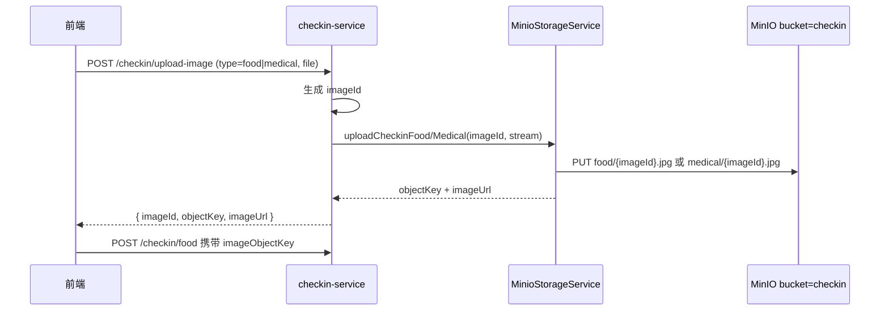
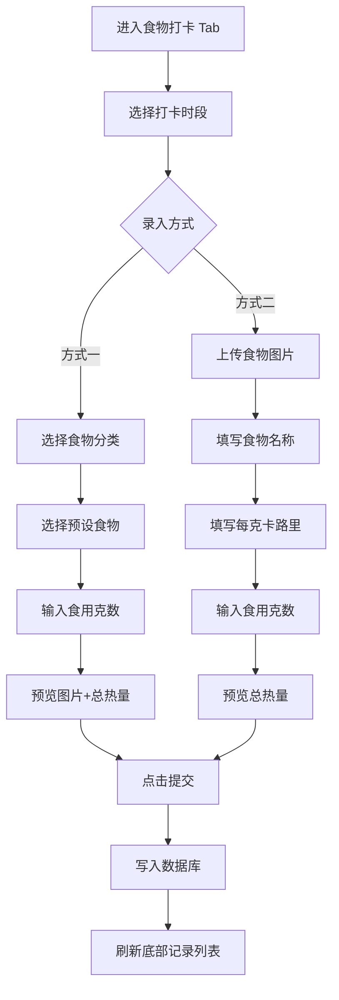
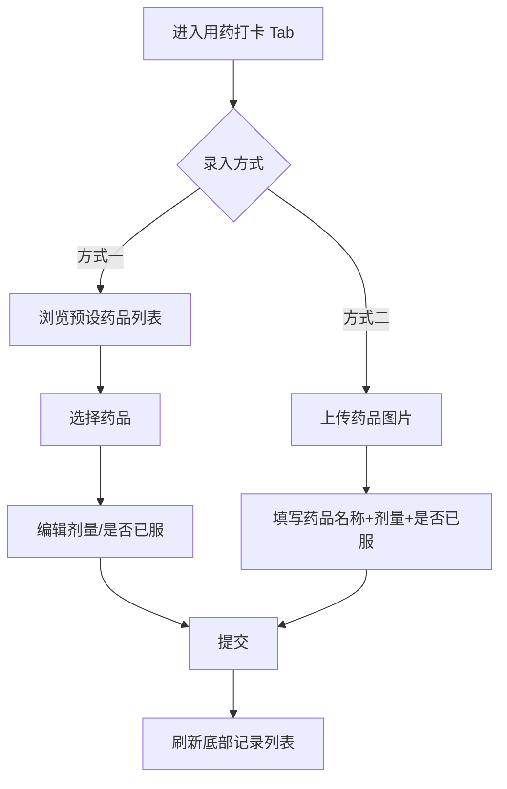
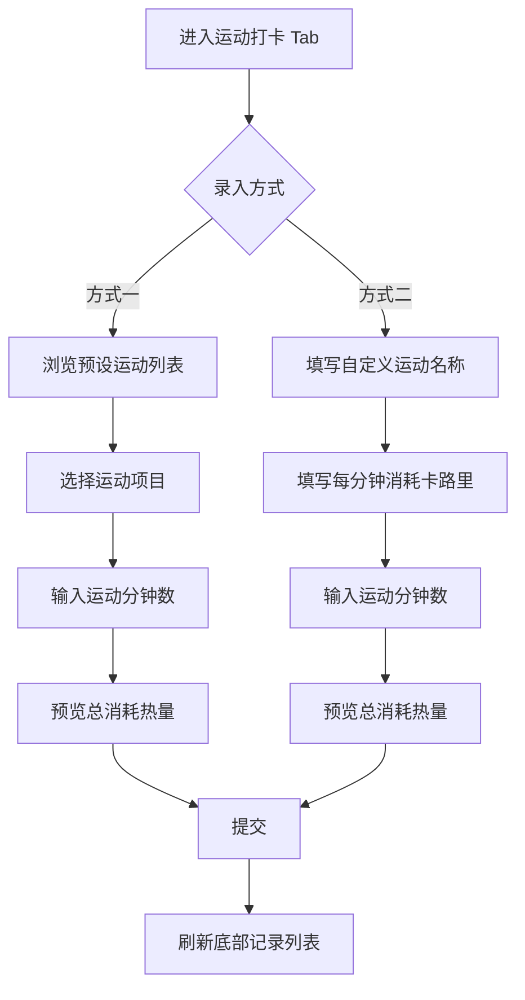

# 健康打卡模块产品设计说明书

| 项目 | 说明 |
|------|------|
| 文档版本 | v1.2 |
| 编写日期 | 2026-06-25 |
| 关联服务 | `checkin-service`（`backend/checkin-service/`） |
| 关联库 | `DIABETES_CHECKIN`（见 `db/init.sql`） |
| 范围边界 | **仅包含**食物打卡、用药打卡、运动打卡三条需求；不新增需求以外的功能、模块或业务逻辑 |

---

## 1. 需求范围与边界

### 1.1 本文档覆盖范围

| 模块 | 需求编号 | 核心能力 |
|------|----------|----------|
| 食物打卡 | 1.1 ~ 1.5 | 预设食物库、时段分类、选用/自定义录入、底部列表展示 |
| 用药打卡 | 2.1 ~ 2.2 | 预设药品库、选用/自定义完整用药记录 |
| 运动打卡 | 3.1 ~ 3.2 | 预设运动库、选用/自定义运动项目 |

### 1.2 明确不包含（超出给定需求）

以下现有系统能力**不在本次设计范围内**，本文档不对其做功能扩展或界面改造说明：

- 血糖 / 血压 / 体重 / 复诊打卡（`CHECKIN_TYPE` 4~7）
- 积分、连续打卡、成就徽章（**业务逻辑不扩展**；现有展示 UI 保留，见 §1.3）
- 打卡统计分析、AI 行为总结、数据导出（**现有入口保留，不在本次改造范围**）
- 打卡提醒、个人中心联动（见 [打卡提醒模块产品设计说明书.md](./打卡提醒模块产品设计说明书.md)）
- 与健康方案、风险预测等模块的联动逻辑

> 说明：数据库主表 `CHECKIN_RECORDS` 可继续复用作为三类打卡的统一流水载体；页面在改造三类打卡录入区与记录列表的同时，**保留**现有页面中超出上述三条需求的 UI 区块（见 §1.3）。

### 1.3 与现有页面对齐（保留策略）

当前前端页面 `frontend/src/views/CheckinRecords/index.vue` 在实现三类打卡改造时，**以下现有 UI 原样保留，不做删除或功能扩展**：

| 保留区块 | 说明 |
|----------|------|
| 顶部英雄区（总积分、连续打卡、今日完成环） | 继续展示，本模块改造不写入积分逻辑 |
| 日期选择条 | 三类打卡共用，筛选当日记录 |
| 血糖等其它类型入口（若有） | 保留现有 Tab/入口，本文档不改造其交互 |
| 成就墙 | 保留展示 |
| 打卡统计分析入口 banner | 保留跳转 |

**改造范围**仅替换/增强：食物、用药、运动三个 Tab 内的**录入区**与**底部记录列表**，以及对应后端 API。旧接口 `POST /api/v1/checkin` 可在实现阶段标记废弃，由 §8 新接口替代。

---

## 2. 数据库现状分析（基于 `db/init.sql`）

### 2.1 现有相关表结构摘要

**库：`DIABETES_CHECKIN`**

| 表名 | 用途 | 与需求匹配度 |
|------|------|--------------|
| `CHECKIN_RECORDS` | 打卡主表（类型、日期、用户） | 可复用；饮食类「一餐多次录入」需调整约束策略 |
| `CHECKIN_DIET_DETAILS` | 饮食明细 | **不满足** — 缺预设食物关联、每克热量、克数、图片、加餐细分 |
| `CHECKIN_MEDICATION_DETAILS` | 用药明细 | **部分满足** — 缺预设药品库、自定义图片 |
| `CHECKIN_EXERCISE_DETAILS` | 运动明细 | **部分满足** — 缺预设运动库、自定义项目标识 |
| （无） | 食物分类 / 预设食物 | **缺失** |
| （无） | 预设药品 | **缺失** |
| （无） | 预设运动 | **缺失** |

### 2.2 关键字段差距对照

#### 食物打卡（需求 1.1 ~ 1.5）

| 需求字段/能力 | 现有表字段 | 差距 |
|---------------|------------|------|
| 食物分类 | 无 | 需新建分类表 |
| 食物名称 | `FOOD_DESC`（文本描述） | 需独立 `FOOD_NAME`，并区分预设/自定义 |
| 每克卡路里 | 无 | 需 `CALORIES_PER_GRAM` |
| 配套图片 | 无 | MinIO bucket `checkin`，Object Key `food/{FOOD_ID}.jpg`；明细存 `IMAGE_OBJECT_KEY` |
| 液体类食物（如牛奶） | 无特殊支持 | 支持 ml 录入，按 `ML_TO_G_RATIO` 换算为 g（见 §4.1.1） |
| 打卡时段：早餐/午餐/晚餐/上午加餐/下午加餐/晚上加餐 | `MEAL_PERIOD` 仅 1早 2午 3晚 4加餐 | 需扩展为 6 档，取消「其他时段」 |
| 选用预设食物 | 无 `FOOD_ID` | 需关联预设食物 ID |
| 自定义：上传图片 + 每克卡路里 + 食用量 | 无 | 需 `SOURCE_TYPE`、`INPUT_UNIT`、`INPUT_AMOUNT`、`GRAMS`、`IMAGE_OBJECT_KEY` 等 |
| 单条记录在页面下方列表展示 | 当前 `CHECKIN_ID` 为明细主键，一对一 | 需支持**同一用户同一天多条饮食打卡记录** |

#### 用药打卡（需求 2.1 ~ 2.2）

| 需求字段/能力 | 现有表字段 | 差距 |
|---------------|------------|------|
| 系统预录入药品库 | 无 | 需新建 `MEDICATION_PRESETS` |
| 直接选择预设药品 | 无 `DRUG_ID` | 明细表需增加外键 |
| 自定义：上传 + 完整用药记录 | 仅有 `DRUG_NAME`、`DOSAGE`、`TAKEN` | 预设图存 MinIO `checkin/medical/{DRUG_ID}.jpg`；自定义图同目录 `{ID}.jpg`；需 `SOURCE_TYPE` |

#### 运动打卡（需求 3.1 ~ 3.2）

| 需求字段/能力 | 现有表字段 | 差距 |
|---------------|------------|------|
| 系统预录入运动项目及卡路里消耗数值 | 无 | 需新建 `EXERCISE_PRESETS` |
| 选用预设运动 | 无 `EXERCISE_ID` | 明细表需增加外键 |
| 自定义新增运动项目 | 仅有 `EXERCISE_TYPE` 文本 | 需 `SOURCE_TYPE`、自定义名称及消耗数值规则 |

### 2.3 现有一致性约束问题

当前业务逻辑（`CheckinService`）对「同一用户 + 同一类型 + 同一日期」存在**唯一打卡**限制（`countByUserTypeDate`）。  

与需求冲突点：

- **食物打卡**：用户可在同一天、同一餐次多次添加不同食物（1.5 要求底部陈列多条记录）。
- **用药 / 运动**：需求未禁止同一天多次录入，应允许多条记录。

**结论（设计层，非代码）**：  
保留 `CHECKIN_RECORDS` 作为每条打卡流水；**取消或放宽**「每类型每日仅一条」约束，改为「每条录入产生一条 `CHECKIN_RECORDS` + 对应明细」。

---

## 3. 数据库表变更设计（仅需求相关）

> 以下均为 `DIABETES_CHECKIN` 库内变更建议，不涉及其他库。

### 3.1 新增表

#### 3.1.0 列表排序规则（统一）

食物分类、预设食物、预设药品、预设运动在接口返回与页面展示时，**均按名称（`name` 字段）字母顺序升序排列**，不使用 `SORT_ORDER` 等人工排序字段。

| 数据 | 排序字段 | SQL 示例 |
|------|----------|----------|
| 食物分类 | `CATEGORY_NAME` | `ORDER BY CATEGORY_NAME ASC` |
| 预设食物（分类内） | `FOOD_NAME` | `ORDER BY FOOD_NAME ASC` |
| 预设药品 | `DRUG_NAME` | `ORDER BY DRUG_NAME ASC` |
| 预设运动 | `EXERCISE_NAME` | `ORDER BY EXERCISE_NAME ASC` |

> 中文名称按数据库默认字符集排序（utf8mb4_unicode_ci）；前端不再做二次排序。

#### 3.1.1 `FOOD_CATEGORIES` — 食物分类（需求 1.1）

| 字段 | 类型 | 说明 |
|------|------|------|
| `CATEGORY_ID` | VARCHAR(32) PK | 分类 ID |
| `CATEGORY_NAME` | VARCHAR(50) NOT NULL | 分类名称（如：主食、蛋白、蔬菜、水果、饮品） |
| `DEL_FLAG` | TINYINT DEFAULT 0 | 逻辑删除 |
| `CREATED_AT` / `UPDATED_AT` | DATETIME | 审计字段 |

#### 3.1.2 `FOOD_PRESETS` — 系统预设食物（需求 1.1）

| 字段 | 类型 | 说明 |
|------|------|------|
| `FOOD_ID` | VARCHAR(32) PK | 食物 ID，兼作 MinIO 图片文件名（见 §3.5） |
| `CATEGORY_ID` | VARCHAR(32) FK | 所属分类 |
| `FOOD_NAME` | VARCHAR(100) NOT NULL | 食物名称（含牛奶等液体类） |
| `CALORIES_PER_GRAM` | DECIMAL(8,4) NOT NULL | 每克卡路里（kcal/g） |
| `IS_LIQUID` | TINYINT DEFAULT 0 | 是否液体类；为 1 时 UI 允许 ml/g 切换 |
| `ML_TO_G_RATIO` | DECIMAL(6,4) DEFAULT 1.0000 | ml→g 换算系数：`克数 = 毫升数 × ML_TO_G_RATIO`（如水/饮品默认 1.0，牛奶可设 1.03） |
| `DEL_FLAG` | TINYINT DEFAULT 0 | 逻辑删除 |
| `CREATED_AT` / `UPDATED_AT` | DATETIME | 审计字段 |

> **图片不在库中存 URL**。预设食物配图存放于 MinIO bucket `checkin`，Object Key：`food/{FOOD_ID}.jpg`（见 §3.5）。

索引建议：`IDX_CATEGORY (CATEGORY_ID, DEL_FLAG)`

#### 3.1.3 `MEDICATION_PRESETS` — 系统预设药品（需求 2.1）

| 字段 | 类型 | 说明 |
|------|------|------|
| `DRUG_ID` | VARCHAR(32) PK | 药品 ID，兼作 MinIO 图片文件名（见 §3.5） |
| `DRUG_NAME` | VARCHAR(100) NOT NULL | 药品名称 |
| `DEL_FLAG` | TINYINT DEFAULT 0 | 逻辑删除 |
| `CREATED_AT` / `UPDATED_AT` | DATETIME | 审计字段 |

> **图片不在库中存 URL**。预设药品配图存放于 MinIO bucket `checkin`，Object Key：`medical/{DRUG_ID}.jpg`（见 §3.5）。

#### 3.1.4 `EXERCISE_PRESETS` — 系统预设运动（需求 3.1）

| 字段 | 类型 | 说明 |
|------|------|------|
| `EXERCISE_ID` | VARCHAR(32) PK | 运动 ID |
| `EXERCISE_NAME` | VARCHAR(50) NOT NULL | 运动项目名称 |
| `CALORIES_PER_MINUTE` | DECIMAL(8,2) NOT NULL | 每分钟消耗卡路里（kcal/min），作为系统预置消耗数值 |
| `DEL_FLAG` | TINYINT DEFAULT 0 | 逻辑删除 |
| `CREATED_AT` / `UPDATED_AT` | DATETIME | 审计字段 |

> **已确认设计决策**：系统预置与用户自定义运动的消耗数值均采用 **kcal/min（每分钟千卡）**；总消耗 = `round(kcal/min × 运动分钟数)`。运动预设**不含图片**。

---

### 3.2 修改表

#### 3.2.1 `CHECKIN_DIET_DETAILS` — 改造为「单条食物打卡明细」（需求 1.2 ~ 1.5）

**建议调整：**

| 变更类型 | 字段 | 说明 |
|----------|------|------|
| 修改 | `MEAL_PERIOD` | 枚举扩展：**1早餐 2午餐 3晚餐 4上午加餐 5下午加餐 6晚上加餐**（取消原「4加餐」笼统值） |
| 新增 | `SOURCE_TYPE` | TINYINT：1=选用预设，2=自定义 |
| 新增 | `FOOD_ID` | VARCHAR(32) NULL，预设食物外键 |
| 新增 | `FOOD_NAME` | VARCHAR(100) NOT NULL，冗余存储便于列表展示 |
| 新增 | `CATEGORY_NAME` | VARCHAR(50) NULL，列表展示用 |
| 新增 | `CALORIES_PER_GRAM` | DECIMAL(8,4) NOT NULL |
| 新增 | `INPUT_UNIT` | TINYINT NOT NULL DEFAULT 1：1=按 g 录入，2=按 ml 录入（液体类可用） |
| 新增 | `INPUT_AMOUNT` | DECIMAL(8,2) NOT NULL，用户原始录入量（g 或 ml） |
| 新增 | `GRAMS` | DECIMAL(8,2) NOT NULL，换算后的食用克数（热量计算一律基于此项） |
| 新增 | `TOTAL_CALORIES` | INT NOT NULL，总热量 = 每克卡路里 × GRAMS（四舍五入） |
| 新增 | `IMAGE_OBJECT_KEY` | VARCHAR(200) NOT NULL，MinIO 完整 Object Key，格式 `food/{ID}.jpg`（见 §3.5） |
| 删除/弃用 | `FOOD_DESC` | 由 `FOOD_NAME` + 结构化字段替代 |
| 删除/弃用 | `IS_HIGH_SUGAR` | 超出需求范围，建议移除或不再使用 |

主键策略：保持 `CHECKIN_ID` 与 `CHECKIN_RECORDS` 1:1（**每条食物一条打卡流水**）。

#### 3.2.2 `CHECKIN_MEDICATION_DETAILS` — 扩展用药明细（需求 2.1 ~ 2.2）

| 变更类型 | 字段 | 说明 |
|----------|------|------|
| 新增 | `SOURCE_TYPE` | TINYINT：1=选用预设，2=自定义 |
| 新增 | `DRUG_ID` | VARCHAR(32) NULL，预设药品外键 |
| 新增 | `IMAGE_OBJECT_KEY` | VARCHAR(200) NOT NULL，MinIO 完整 Object Key，格式 `medical/{ID}.jpg`（见 §3.5） |
| 保留 | `DRUG_NAME` | 药品名称 |
| 保留 | `DOSAGE` | 剂量 |
| 保留 | `TAKEN` | 是否已服（1是/0否） |

「完整用药记录」字段边界（严格对应需求，不扩展）：

- 药品名称
- 剂量
- 用药图片（上传或预设图）
- 是否已服

#### 3.2.3 `CHECKIN_EXERCISE_DETAILS` — 扩展运动明细（需求 3.1 ~ 3.2）

| 变更类型 | 字段 | 说明 |
|----------|------|------|
| 新增 | `SOURCE_TYPE` | TINYINT：1=选用预设，2=自定义 |
| 新增 | `EXERCISE_ID` | VARCHAR(32) NULL，预设运动外键 |
| 新增 | `EXERCISE_NAME` | VARCHAR(50) NOT NULL，冗余展示名 |
| 新增 | `CALORIES_PER_MINUTE` | DECIMAL(8,2) NOT NULL，每分钟消耗 |
| 保留 | `DURATION_MINUTES` | 运动分钟数 |
| 修改 | `CALORIES_BURNED` | 总消耗 = `CALORIES_PER_MINUTE × DURATION_MINUTES` |
| 删除/弃用 | `INTENSITY` | 超出需求范围，建议移除或不再使用 |

#### 3.2.4 `CHECKIN_RECORDS` — 主表（约束层）

| 变更建议 | 说明 |
|----------|------|
| 保留 `CHECKIN_TYPE` | 1饮食 / 2运动 / 3用药（本文档仅使用此三类） |
| 移除「同用户同类型同日期唯一」业务约束 | 支持多条食物/用药/运动记录 |
| `POINTS_EARNED` 等字段 | 本模块改造**不写入**积分/连续天数字段；现有顶部 UI 保留展示（见 §1.3） |
| 可选新增 `MEAL_PERIOD` 冗余 | 非必须；饮食时段已在明细表存储 |

### 3.6 历史数据迁移（简要）

| 变更点 | 处理方式 |
|--------|----------|
| `MEAL_PERIOD` 原值 4（笼统加餐） | 迁移脚本映射为 4（上午加餐）或按业务约定拆分；新系统仅接受 1~6 |
| `FOOD_DESC` / `CALORIES` | 历史饮食记录只读保留或归档；新录入走新字段 |
| `EXERCISE_TYPE` |  rename 为 `EXERCISE_NAME` 或迁移时拷贝 |

---

### 3.3 不需变更的表（本文档范围内）

| 表名 | 原因 |
|------|------|
| `CHECKIN_GLUCOSE_DETAILS` | 超出需求范围 |
| `CHECKIN_BP_DETAILS` | 超出需求范围 |
| `CHECKIN_WEIGHT_DETAILS` | 超出需求范围 |

### 3.4 数据库变更汇总

| 操作 | 对象 |
|------|------|
| **新增** | `FOOD_CATEGORIES`、`FOOD_PRESETS`、`MEDICATION_PRESETS`、`EXERCISE_PRESETS` |
| **修改** | `CHECKIN_DIET_DETAILS`、`CHECKIN_MEDICATION_DETAILS`、`CHECKIN_EXERCISE_DETAILS` |
| **约束调整** | `CHECKIN_RECORDS` 业务唯一性策略（非必须改表结构） |
| **不动** | 血糖/血压/体重明细表 |

### 3.5 MinIO 图片存储规范

#### 3.5.1 基础设施（复用现有代码）

| 项 | 约定 |
|----|------|
| 实现位置 | 复用 `backend/common` 模块 `MinioStorageService`（与 `user-service` 头像上传同一套 MinIO 客户端） |
| 配置前缀 | `minio.*`（`endpoint`、`access-key`、`secret-key`、`public-base-url`，见 `MinioProperties`） |
| 新增配置项 | `minio.checkin-bucket: checkin`（建议，与现有 `profile-bucket` 并列） |
| 扩展方法 | 在 `MinioStorageService` 中新增 `uploadCheckinFood(id, stream, …)`、`uploadCheckinMedical(id, stream, …)`，模式同 `uploadProfileAvatar` |
| 上传服务归属 | `checkin-service` 提供 `POST /api/v1/checkin/upload-image`，内部调用 `MinioStorageService` |

#### 3.5.2 Bucket 与 Object Key

| 项 | 值 |
|----|-----|
| **Bucket 名称** | `checkin` |
| 食物 Object Key | `food/{ID}.jpg` |
| 药品 Object Key | `medical/{ID}.jpg` |
| 文件格式 | 固定 `.jpg` |
| `{ID}` 规则 | 预设：与 `FOOD_ID` / `DRUG_ID` 一致；自定义：系统生成唯一 ID（如 `img_xxx`） |

**`IMAGE_OBJECT_KEY` 存储规则（已拍板）：**

- 打卡明细表**统一存储 bucket 内完整 Object Key**，例如：
  - `food/food_001.jpg`
  - `medical/drug_001.jpg`
- **禁止**仅存裸 `{ID}` 或仅存文件名；预设选用时在提交打卡时由服务端写入 `food/{FOOD_ID}.jpg` / `medical/{DRUG_ID}.jpg`。
- 对外访问 URL（与头像 URL 规则一致）：

```
{minio.public-base-url}/checkin/{IMAGE_OBJECT_KEY}
→ 例：http://localhost:9000/checkin/food/food_001.jpg
```

#### 3.5.3 上传流程



| 步骤 | 说明 |
|------|------|
| 1 | 用户选图 → 调用上传接口，`type=food` 或 `type=medical` |
| 2 | 服务端写入 bucket `checkin`，返回 `objectKey`（如 `food/img_abc.jpg`） |
| 3 | 提交打卡时将 `objectKey` 写入明细表 `IMAGE_OBJECT_KEY` |
| 4 | 列表/详情接口返回 `imageUrl = publicBaseUrl + "/checkin/" + objectKey` |

**缺图处理：** MinIO 对象不存在时，前端展示默认占位图（灰色餐盘 / 药瓶 icon），不阻断打卡流程。

**运动模块：** 不设 MinIO 目录，无上传接口，无图片展示。

---

## 4. 功能梳理

### 4.1 食物打卡模块

| 编号 | 功能点 | 说明 |
|------|--------|------|
| F-1.1 | 浏览预设食物分类 | 从 `FOOD_CATEGORIES` + `FOOD_PRESETS` 加载；分类与食物均按名称字母序 |
| F-1.2 | 选择打卡时段 | 六选一：早餐 / 午餐 / 晚餐 / 上午加餐 / 下午加餐 / 晚上加餐 |
| F-1.3 | 方式一：选用已有食物 | 选分类 → 选食物 → 填食用量（g 或 ml）→ 自动换算并算总热量 |
| F-1.4 | 方式二：自定义新增食物 | 上传图片 → 填食物名称 → 填每克卡路里 → 填食用量（g/ml）→ 自动算总热量 |
| F-1.5 | 提交单条食物打卡 | 写入 `CHECKIN_RECORDS` + `CHECKIN_DIET_DETAILS` |
| F-1.6 | 底部列表展示 | 按当前所选日期，倒序展示该日全部食物打卡记录 |

**热量计算规则（唯一）：**

```
若按 g 录入：GRAMS = INPUT_AMOUNT
若按 ml 录入：GRAMS = INPUT_AMOUNT × ML_TO_G_RATIO（预设食物取 FOOD_PRESETS.ML_TO_G_RATIO；自定义默认 1.0，用户可改）
总热量(kcal) = round(CALORIES_PER_GRAM × GRAMS)
```

#### 4.1.1 液体类食物 ml/g 录入（已确认）

| 场景 | UI 行为 | 入库 |
|------|---------|------|
| 预设液体（`IS_LIQUID=1`） | 食用量输入框提供 **g / ml** 切换 | 存 `INPUT_UNIT`、`INPUT_AMOUNT`、换算后 `GRAMS` |
| 预设固体 | 仅 g | `INPUT_UNIT=1` |
| 自定义食物 | 用户可选「是否液体」；选是则允许 ml | 自定义液体默认 `ML_TO_G_RATIO=1.0`，可手动调整 |

列表展示可同时显示原始录入：`200ml（≈206g）` 或 `80g`。

### 4.2 用药打卡模块

| 编号 | 功能点 | 说明 |
|------|--------|------|
| M-2.1 | 浏览预设药品库 | 从 `MEDICATION_PRESETS` 加载；按药品名称字母序 |
| M-2.2 | 方式一：选用预设药品 | 选药品 → **手动填写剂量** → 确认是否已服 → 提交（**不预填默认剂量**） |
| M-2.3 | 方式二：自定义用药 | 上传图片 → 填药品名称 → 填剂量 → 确认是否已服 → 提交 |
| M-2.4 | 底部列表展示 | 按当前所选日期，展示该日全部用药打卡记录 |

### 4.3 运动打卡模块

| 编号 | 功能点 | 说明 |
|------|--------|------|
| E-3.1 | 浏览预设运动库 | 从 `EXERCISE_PRESETS` 加载；按运动名称字母序；无配图 |
| E-3.2 | 方式一：选用预设运动 | 选运动 → 填运动分钟数 → 自动算总消耗热量 → 提交 |
| E-3.3 | 方式二：自定义运动 | 填运动项目名称 → 填每分钟消耗卡路里 → 填运动分钟数 → 自动算总消耗 → 提交 |
| E-3.4 | 底部列表展示 | 按当前所选日期，展示该日全部运动打卡记录 |

**消耗计算规则（唯一）：**

```
总消耗(kcal) = round(每分钟消耗卡路里 × 运动分钟数)
```

---

## 5. 页面逻辑与信息架构

### 5.1 页面定位

- **页面名称**：健康打卡（仅含食物 / 用药 / 运动三个 Tab）
- **建议路由**：沿用 `/checkin-records`，Tab 切换三类模块
- **页面结构**：上录入区 + 下记录列表区（三类模块结构一致）

### 5.2 全局页面框架

```
┌─────────────────────────────────────┐
│  顶栏：健康打卡                        │
├─────────────────────────────────────┤
│  日期选择条（左右切换日期，默认今天）      │
├─────────────────────────────────────┤
│  Tab： [ 食物打卡 ] [ 用药打卡 ] [ 运动打卡 ] │  ← 模块区分度高
├─────────────────────────────────────┤
│                                     │
│           【录入区域】                 │  ← 当前 Tab 对应模块
│                                     │
├─────────────────────────────────────┤
│  标题：今日记录 / 当日记录              │
│  ┌─────────────────────────────┐   │
│  │  记录卡片 1                    │   │
│  └─────────────────────────────┘   │
│  ┌─────────────────────────────┐   │
│  │  记录卡片 2                    │   │  ← 1.5 底部统一陈列
│  └─────────────────────────────┘   │
│  空状态：暂无打卡记录                  │
└─────────────────────────────────────┘
```

### 5.3 食物打卡 — 页面逻辑

#### 5.3.1 录入区流程



#### 5.3.2 时段选择（需求 1.2）

| UI 标签 | 存储值 `MEAL_PERIOD` |
|---------|----------------------|
| 早餐 | 1 |
| 午餐 | 2 |
| 晚餐 | 3 |
| 上午加餐 | 4 |
| 下午加餐 | 5 |
| 晚上加餐 | 6 |

- 采用横向 **Segment / Chip** 选择，默认选中「早餐」
- **不提供**其他时段选项

#### 5.3.3 方式一：选用已有食物（需求 1.3）

1. 左侧或顶部：**分类 Tab**（来自 `FOOD_CATEGORIES`，按 `CATEGORY_NAME` 字母序）
2. 中部：**食物网格**（MinIO 图片 + 名称 + 每克卡路里小字；食物按 `FOOD_NAME` 字母序）
3. 点击食物 → 底部弹出 **半屏表单**：
   - 只读：食物图片（`imageUrl`）、名称、每克卡路里
   - 输入：食用量（必填，>0）；液体类可切换 **g / ml**
   - 只读：换算后克数（ml 时）、总热量（实时计算）
   - 按钮：「确认打卡」

#### 5.3.4 方式二：自定义新增食物（需求 1.4）

1. 录入区顶部切换：**「选择食物」|「自定义食物」**
2. 自定义表单字段：
   - 食物图片上传区（必填，先调 `POST /checkin/upload-image?type=food`）
   - 食物名称（必填）
   - 是否液体（选是则允许 ml 录入，换算系数默认 1.0 可改）
   - 每克卡路里 kcal/g（必填，>0）
   - 食用量 g 或 ml（必填，>0）
   - 总热量（自动计算，只读）
3. 按钮：「确认打卡」

#### 5.3.5 底部记录列表（需求 1.5）

每条卡片展示：

| 元素 | 内容 |
|------|------|
| 左 | 食物缩略图（`imageUrl`） |
| 中 | 食物名称、时段标签、原始食用量（g/ml）、换算克数、每克卡路里 |
| 右 | 总热量 kcal、打卡时间（时:分） |

- 按 `RECORD_TIME` **倒序**
- 仅展示当前所选日期的饮食类记录

---

### 5.4 用药打卡 — 页面逻辑

#### 5.4.1 录入区流程



#### 5.4.2 方式一：选用预设药品（需求 2.1）

- **药品列表**：卡片/列表，含图片（`imageUrl`）、名称；按 `DRUG_NAME` 字母序
- 点击 → 表单：
  - 只读：药品图片、名称
  - 输入：剂量（必填，**无默认值**）
  - 开关：是否已服
  - 「确认打卡」

#### 5.4.3 方式二：自定义用药（需求 2.2）

- Tab 切换：「选择药品」|「自定义药品」
- 表单：
  - 药品图片上传（必填，先调 `POST /checkin/upload-image?type=medical`）
  - 药品名称（必填）
  - 剂量（必填）
  - 是否已服（必填）
  - 「确认打卡」

#### 5.4.4 底部记录列表

每条卡片：缩略图 | 药品名称 + 剂量 + 已服/未服标签 | 打卡时间

- 按 `RECORD_TIME` **倒序**，仅展示当前所选日期

---

### 5.5 运动打卡 — 页面逻辑

#### 5.5.1 录入区流程



#### 5.5.2 方式一：选用预设运动（需求 3.1）

- 运动列表：项目名称 + 每分钟消耗 kcal/min（**纯文字列表，无图片**）；按 `EXERCISE_NAME` 字母序
- 点击 → 表单：
  - 只读：运动名称、每分钟消耗
  - 输入：运动分钟数（必填，>0）
  - 只读：总消耗热量
  - 「确认打卡」

#### 5.5.3 方式二：自定义运动（需求 3.2）

- Tab：「选择运动」|「自定义运动」
- 表单：
  - 运动项目名称（必填）
  - 每分钟消耗卡路里（必填，>0）
  - 运动分钟数（必填，>0）
  - 总消耗（自动计算）
  - 「确认打卡」

#### 5.5.4 底部记录列表

每条卡片：运动名称 | 时长 + 总消耗 kcal | 打卡时间

- 按 `RECORD_TIME` **倒序**，仅展示当前所选日期

---

## 6. UI 设计规范

### 6.1 设计风格关键词

**柔和清爽 · 分层清晰 · 模块区分 · 卡片简约 · 图文均衡**

### 6.2 配色方案

| 用途 | 色值 | 说明 |
|------|------|------|
| 页面背景 | `#F5F7FA` | 浅灰蓝底，降低视觉疲劳 |
| 卡片背景 | `#FFFFFF` | 主内容卡片 |
| 主色（食物） | `#0D9488` |  teal，食物 Tab  accent |
| 主色（用药） | `#6366F1` |  indigo，用药 Tab accent |
| 主色（运动） | `#F59E0B` |  amber，运动 Tab accent |
| 标题文字 | `#1E293B` | 深灰 |
| 次要文字 | `#64748B` | 中灰 |
| 分割线 | `#E2E8F0` | 浅分割线 |
| 危险/必填提示 | `#EF4444` | 仅用于表单校验 |

> 三个 Tab 使用各自 accent 色作为选中态下划线/边框，未选中为中性灰，保证**模块区分度高**。

### 6.3 布局与间距

| 元素 | 规范 |
|------|------|
| 页面左右边距 | 16px |
| 卡片圆角 | 12px |
| 卡片内边距 | 16px |
| 卡片间距 | 12px |
| 录入区与列表区间隔 | 24px + 细分隔标题 |
| 食物网格 | 3 列（小屏 2 列），图片 1:1 圆角 8px |

### 6.4 组件规范

| 组件 | 样式要求 |
|------|----------|
| Tab 栏 | 等宽三等分，选中项底部 2px 色条 + 字重 600 |
| 时段 Chip | 胶囊形，选中填充浅色背景 + accent 描边 |
| 录入方式切换 | 顶部双按钮 Segmented Control |
| 图片上传区 | 虚线边框 120×120，居中相机图标 +「上传图片」 |
| 数字输入框 | 大号数字键盘友好，右侧带单位（g、kcal/g、分钟） |
| 主按钮 | 全宽或 80% 居中，圆角 24px，高度 44px |
| 记录卡片 | 食物/用药：左图 56×56；运动：无缩略图；右信息两行，最右对齐数值 |

### 6.5 三类模块视觉差异（区分度）

| 模块 | Tab 图标建议 | 卡片左边框/标签色 | 列表强调信息 |
|------|-------------|-------------------|--------------|
| 食物 | 🍽 / 餐具 icon | `#0D9488` | 总热量 kcal |
| 用药 | 💊 / 药瓶 icon | `#6366F1` | 已服 / 未服 |
| 运动 | 🏃 / 运动 icon | `#F59E0B` | 总消耗 kcal |

### 6.6 空状态与反馈

| 场景 | 展示 |
|------|------|
| 当日无记录 | 居中插画 +「暂无打卡记录」 |
| 提交成功 | 顶部轻提示「打卡成功」+ 列表自动刷新 |
| 必填未填 | 输入框下方红色短文案，不弹复杂对话框 |
| 图片上传中 | 上传区 loading 遮罩 |

---

## 7. 页面线框说明（文字线框）

### 7.1 食物打卡 Tab

```
┌──────────────────────────────────────┐
│  ◀  2026年6月25日 · 今天  ▶           │
├──────────────────────────────────────┤
│ [ 食物打卡 ]  用药打卡   运动打卡        │
├──────────────────────────────────────┤
│ 打卡时段                              │
│ (早餐)(午餐)(晚餐)(上午加)(下午加)(晚上加)│
├──────────────────────────────────────┤
│ [ 选择食物 ] | 自定义食物               │
├──────────────────────────────────────┤
│ 主食 | 蛋白 | 蔬菜 | 水果 | 饮品        │  ← 分类 Tab
│ ┌────┐ ┌────┐ ┌────┐                  │
│ │图片│ │图片│ │图片│  ...               │  ← 预设食物网格
│ │米饭│ │鸡蛋│ │牛奶│                  │
│ │0.35│ │1.4 │ │0.54│ kcal/g           │
│ └────┘ └────┘ └────┘                  │
├──────────────────────────────────────┤
│ ── 今日食物记录 ──                      │
│ ┌──────────────────────────────────┐ │
│ │[图] 牛奶 · 上午加餐                  │ │
│ │    200ml ≈ 206g × 0.54 kcal/g  111 kcal│ │
│ └──────────────────────────────────┘ │
│ ┌──────────────────────────────────┐ │
│ │[图] 全麦面包 · 早餐                  │ │
│ │    80g × 2.65 kcal/g       212 kcal│ │
│ └──────────────────────────────────┘ │
└──────────────────────────────────────┘
```

### 7.2 用药打卡 Tab

> 顶部日期选择条、Tab 栏与 §5.2 全局框架一致（略）。

```
┌──────────────────────────────────────┐
│  ◀  2026年6月25日 · 今天  ▶           │
├──────────────────────────────────────┤
│  食物打卡  [ 用药打卡 ]  运动打卡        │
├──────────────────────────────────────┤
│ [ 选择药品 ] | 自定义药品               │
├──────────────────────────────────────┤
│ ┌──────────────────────────────────┐ │
│ │ [图] 二甲双胍片                     │ │
│ └──────────────────────────────────┘ │
│ ┌──────────────────────────────────┐ │
│ │ [图] 格列美脲片                     │ │
│ └──────────────────────────────────┘ │
├──────────────────────────────────────┤
│ ── 今日用药记录 ──                      │
│ ┌──────────────────────────────────┐ │
│ │[图] 二甲双胍片 0.5g      [已服] 08:30│ │
│ └──────────────────────────────────┘ │
└──────────────────────────────────────┘
```

### 7.3 运动打卡 Tab

> 顶部日期选择条、Tab 栏与 §5.2 全局框架一致（略）。

```
┌──────────────────────────────────────┐
│  ◀  2026年6月25日 · 今天  ▶           │
├──────────────────────────────────────┤
│  食物打卡   用药打卡  [ 运动打卡 ]       │
├──────────────────────────────────────┤
│ [ 选择运动 ] | 自定义运动               │
│ ┌────────────┐ ┌────────────┐         │
│ │ 快走        │ │ 游泳        │         │
│ │ 4.5 kcal/min│ │ 8.0 kcal/min│         │
│ └────────────┘ └────────────┘         │
├──────────────────────────────────────┤
│ ── 今日运动记录 ──                      │
│ ┌──────────────────────────────────┐ │
│ │ 快走 · 30分钟              135 kcal │ │
│ └──────────────────────────────────┘ │
└──────────────────────────────────────┘
```

---

## 8. 接口能力清单（设计层，供后续开发对齐）

> 仅列出支撑三条需求的最小接口；所有接口需 JWT，用户仅可访问本人记录。

| 方法 | 路径 | 说明 |
|------|------|------|
| POST | `/api/v1/checkin/upload-image` | 图片上传（`type=food\|medical`，multipart；写 bucket `checkin`；返回见 §8.1） |
| GET | `/api/v1/checkin/food/categories` | 食物分类（`ORDER BY CATEGORY_NAME ASC`） |
| GET | `/api/v1/checkin/food/presets` | 预设食物（`categoryId` 可选，`ORDER BY FOOD_NAME ASC`；含 `imageUrl`） |
| POST | `/api/v1/checkin/food` | 提交一条食物打卡（见 §8.2） |
| GET | `/api/v1/checkin/food/records` | 查询食物记录（`date=yyyy-MM-dd`，`RECORD_TIME DESC`） |
| GET | `/api/v1/checkin/medication/presets` | 预设药品（`ORDER BY DRUG_NAME ASC`；含 `imageUrl`） |
| POST | `/api/v1/checkin/medication` | 提交用药打卡（见 §8.3） |
| GET | `/api/v1/checkin/medication/records` | 查询用药记录（`date`，倒序） |
| GET | `/api/v1/checkin/exercise/presets` | 预设运动（`ORDER BY EXERCISE_NAME ASC`；无图片） |
| POST | `/api/v1/checkin/exercise` | 提交运动打卡（见 §8.4） |
| GET | `/api/v1/checkin/exercise/records` | 查询运动记录（`date`，倒序） |

### 8.1 上传图片响应

```json
{
  "code": 200,
  "data": {
    "imageId": "img_abc123",
    "objectKey": "food/img_abc123.jpg",
    "imageUrl": "http://localhost:9000/checkin/food/img_abc123.jpg"
  }
}
```

### 8.2 提交食物打卡请求体

```json
{
  "checkinDate": "2026-06-25",
  "mealPeriod": 4,
  "sourceType": 1,
  "foodId": "food_milk_001",
  "inputUnit": 2,
  "inputAmount": 200,
  "mlToGRatio": 1.03,
  "imageObjectKey": "food/food_milk_001.jpg"
}
```

| 字段 | 说明 |
|------|------|
| `sourceType` | 1=预设，2=自定义（自定义需传 `foodName`、`caloriesPerGram`） |
| `inputUnit` | 1=g，2=ml |
| `imageObjectKey` | 完整 key：`food/{ID}.jpg`；预设可传 `food/{foodId}.jpg` |

### 8.3 提交用药打卡请求体

```json
{
  "checkinDate": "2026-06-25",
  "sourceType": 1,
  "drugId": "drug_metformin_001",
  "drugName": "二甲双胍片",
  "dosage": "0.5g",
  "taken": true,
  "imageObjectKey": "medical/drug_metformin_001.jpg"
}
```

> 选用预设时 `dosage` **必填**，系统不返回、不预填默认剂量。

### 8.4 提交运动打卡请求体

```json
{
  "checkinDate": "2026-06-25",
  "sourceType": 1,
  "exerciseId": "ex_walk_001",
  "durationMinutes": 30
}
```

自定义时额外传 `exerciseName`、`caloriesPerMinute`（kcal/min）。

---

## 9. 预设数据种子（设计示例，非业务扩展）

### 9.1 食物分类示例

主食、蛋白、蔬菜、水果、饮品（展示顺序按分类名字母序，非录入顺序）

### 9.1.1 MinIO 预置图片示例（bucket=`checkin`）

| 类型 | ID | `IMAGE_OBJECT_KEY` | 访问 URL 示例 |
|------|-----|-------------------|---------------|
| 食物 | `food_milk_001` | `food/food_milk_001.jpg` | `{publicBaseUrl}/checkin/food/food_milk_001.jpg` |
| 药品 | `drug_metformin_001` | `medical/drug_metformin_001.jpg` | `{publicBaseUrl}/checkin/medical/drug_metformin_001.jpg` |

### 9.2 预设食物示例（含液体类）

| 名称 | 分类 | kcal/g | 液体 | ML_TO_G_RATIO |
|------|------|--------|------|---------------|
| 牛奶 | 饮品 | 0.54 | 是 | 1.03 |
| 糙米饭 | 主食 | 1.16 | 否 | — |
| 鸡蛋白 | 蛋白 | 0.52 | 否 | — |
| 苹果 | 水果 | 0.52 | 否 | — |

### 9.3 预设药品示例

二甲双胍片、格列美脲片、胰岛素（示例名称）

### 9.4 预设运动示例

| 名称 | kcal/min |
|------|----------|
| 快走 | 4.5 |
| 慢跑 | 7.0 |
| 游泳 | 8.0 |

---

## 10. 验收对照表

| 需求条目 | 设计覆盖 | 数据库支撑 |
|----------|----------|------------|
| 1.1 系统预录入食物分类与基础信息 | §4.1 F-1.1、§3.1.1~3.1.2 | `FOOD_CATEGORIES`、`FOOD_PRESETS` |
| 1.2 六档打卡时段 | §5.3.2 | `MEAL_PERIOD` 扩展为 1~6 |
| 1.3 选用已有食物 | §5.3.3 | `SOURCE_TYPE=1` + `FOOD_ID` |
| 1.4 自定义食物 | §5.3.4 | `SOURCE_TYPE=2` + 图片/每克卡路里/克数 |
| 1.5 底部列表展示 | §5.3.5、§7.1 | 多条 `CHECKIN_RECORDS` + 明细 |
| 2.1 预设药品库 | §4.2 M-2.1、§5.4.2 | `MEDICATION_PRESETS` |
| 2.2 自定义用药 | §5.4.3 | `SOURCE_TYPE=2` + 图片等 |
| 3.1 预设运动及消耗数值 | §4.3 E-3.1、§5.5.2 | `EXERCISE_PRESETS` |
| 3.2 自定义运动 | §5.5.3 | `SOURCE_TYPE=2` |
| UI 美观协调、模块区分 | §6 全文 | — |
| 列表按名称字母序 | §3.1.0 | 无 `SORT_ORDER` 字段 |
| 食物/用药 MinIO 存图 | §3.5 | bucket `checkin`，key `food/`、`medical/` |
| 运动无图片 | §3.1.4、§5.5.2 | 无图片字段 |
| 运动 kcal/min | §3.1.4、§4.3 | `CALORIES_PER_MINUTE` |
| 液体 ml 录入 | §4.1.1 | `INPUT_UNIT`、`ML_TO_G_RATIO` |
| 现有页面超出 UI 保留 | §1.3 | 英雄区/成就/分析入口保留 |
| 复用 MinioStorageService | §3.5.1 | 扩展 uploadCheckin* 方法 |

---

## 11. 修订记录

| 版本 | 日期 | 说明 |
|------|------|------|
| v1.0 | 2026-06-25 | 初稿：基于给定三条需求与 `db/init.sql` 现状输出，不含需求外功能 |
| v1.1 | 2026-06-25 | 列表统一按 name 字母序；运动去掉图片；食物/用药图片改 MinIO |
| v1.2 | 2026-06-25 | 拍板 IMAGE_OBJECT_KEY 完整 key；复用 MinioStorageService/bucket checkin；保留现有超出范围 UI；运动 kcal/min；液体 ml 换算；移除药品默认剂量；补充 §8 接口 JSON、§1.3/§3.6 |
