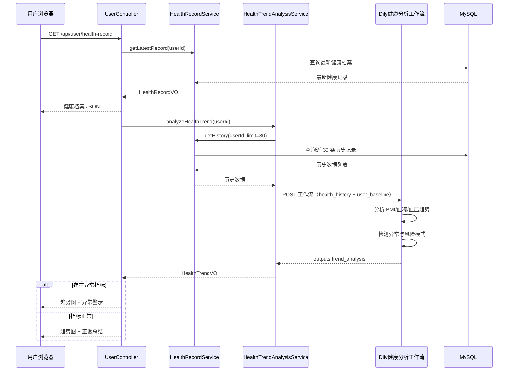

# 健康趋势分析工作流数据契约

本文档定义**个人中心健康档案趋势 AI 分析**所调用的 Dify 工作流数据契约，依据 [`模块设计与交互原型设计.md`](./模块设计与交互原型设计.md) **§2.1.6 个人中心管理模块设计类交互模型** 编写。

> 本工作流由 **user-service / health-service 后端代理调用** Dify Workflow API（`blocking` 模式），结果经 `HealthTrendAnalysisService` 转换为 `HealthTrendVO`，对外通过 `GET /api/user/health-trend` 返回。  
> 当前前端仍为 Mock（见 `前后端联调调用流程.md`），本文档为落地实现与 Dify 编排的契约基准。

---

## 1. 业务场景

| 项目 | 说明 |
|------|------|
| 触发角色 | 登录用户 |
| 调用方 | `HealthTrendAnalysisService`（后端） |
| 触发时机 | 用户查看健康档案（`GET /api/user/health-record`）或主动请求趋势分析（`GET /api/user/health-trend`） |
| 工作流职责 | 分析近 N 条健康记录的 BMI / 空腹血糖 / 血压变化趋势，检测异常波动，生成总结与图表数据 |
| 响应模式 | **blocking**（阻塞，一次返回完整结果） |
| 后续展示 | 前端 ECharts 折线图 + 异常警示条（`severity` 为 `warning` / `critical` 时高亮） |

### 1.1 交互时序（摘自 §2.1.6）



---

## 2. 调用方式

| 项目 | 说明 |
|------|------|
| 接口 | `POST {DIFY_BASE_URL}/v1/workflows/run` |
| 认证 | `Authorization: Bearer {DIFY_HEALTH_TREND_API_KEY}` |
| Content-Type | `application/json` |
| 响应模式 | `response_mode: "blocking"`（固定） |
| user 标识 | 当前用户 ID，如 `usr_001` |
| 输出变量名 | `trend_analysis` |

### 2.1 环境变量（规划）

| 变量 | 说明 |
|------|------|
| `DIFY_HEALTH_TREND_API_KEY` | 健康趋势分析工作流 API Key |
| `DIFY_BASE_URL` | Dify 服务根地址 |
| `DIFY_HEALTH_TREND_RESPONSE_MODE` | 固定 `blocking` |

> 落地时建议在 `user-service` 或 `health-service` 的 `application.yml` 增加 `dify.workflows.health-trend` 配置，并新增 `DifyHealthTrendWorkflowContract.java` 与 `health-trend-input.schema.json`。

### 2.2 契约查询 API（规划）

`GET /api/v1/user/health-trend/dify-workflow-spec`（或 health-service 等价路径）返回 Schema 与示例，风格与其他工作流 `dify-workflow-spec` 一致。

---

## 3. 传入数据

### 3.1 开始节点变量（平铺 3 字段）

本工作流开始节点配置 **3 个独立变量**（与打卡分析、健康方案工作流相同，**不使用** `inputs.inputs` 双层嵌套）。

| 字段 | 类型 | 数据来源 | 说明 |
|------|------|----------|------|
| `query` | string | **后端固定** | 固定为「请分析用户近期的健康指标变化趋势」 |
| `health_history` | string | **health_records 表** | 近 N 条（默认 30 条）健康记录的 **JSON 数组字符串** |
| `user_baseline` | string | **最新健康档案** | 用户当前最新一条记录的 **JSON 对象字符串**（基线对照） |

> **后端传入字段：** 仅 `query`、`health_history`、`user_baseline`。专家角色与输出约束写在 **LLM 节点系统提示词**中，不作为开始节点入参。

### 3.2 传入数据 JSON Schema（Dify 开始节点）

各开始变量类型如下；合并逻辑 Schema 便于对照：

```json
{
  "type": "object",
  "properties": {
    "query": {
      "type": "string"
    },
    "health_history": {
      "type": "string"
    },
    "user_baseline": {
      "type": "string"
    }
  },
  "required": [],
  "additionalProperties": true
}
```

**`health_history` 字符串解析后的数组元素 Schema：**

```json
{
  "type": "array",
  "items": {
    "type": "object",
    "properties": {
      "recordId": { "type": "string" },
      "recordedAt": { "type": "string" },
      "height": { "type": "number" },
      "weight": { "type": "number" },
      "bmi": { "type": "number" },
      "fastingGlucose": { "type": "number" },
      "postprandialGlucose": { "type": "number" },
      "systolicBp": { "type": "number" },
      "diastolicBp": { "type": "number" }
    },
    "required": [],
    "additionalProperties": true
  }
}
```

**`user_baseline` 字符串解析后的对象 Schema：** 与单条历史记录字段相同（最新一条快照）。

### 3.3 HTTP 请求体示例

```json
{
  "response_mode": "blocking",
  "user": "usr_001",
  "inputs": {
    "query": "请分析用户近期的健康指标变化趋势",
    "health_history": "[{\"recordId\":\"hr_001\",\"recordedAt\":\"2024-05-11T08:00:00\",\"height\":170,\"weight\":71,\"bmi\":24.1,\"fastingGlucose\":5.2,\"systolicBp\":120,\"diastolicBp\":80},{\"recordId\":\"hr_002\",\"recordedAt\":\"2024-05-21T08:00:00\",\"height\":170,\"weight\":71.5,\"bmi\":24.3,\"fastingGlucose\":5.8,\"systolicBp\":118,\"diastolicBp\":78},{\"recordId\":\"hr_003\",\"recordedAt\":\"2024-06-01T08:00:00\",\"height\":170,\"weight\":70.8,\"bmi\":24.2,\"fastingGlucose\":6.3,\"systolicBp\":119,\"diastolicBp\":79},{\"recordId\":\"hr_004\",\"recordedAt\":\"2024-06-10T08:00:00\",\"height\":170,\"weight\":70.5,\"bmi\":24.2,\"fastingGlucose\":6.8,\"systolicBp\":116,\"diastolicBp\":76}]",
    "user_baseline": "{\"recordId\":\"hr_004\",\"recordedAt\":\"2024-06-10T08:00:00\",\"height\":170,\"weight\":70.5,\"bmi\":24.2,\"fastingGlucose\":6.8,\"systolicBp\":116,\"diastolicBp\":76}"
  }
}
```

**`inputs` 内各字段（可读形式）：**

```json
{
  "query": "请分析用户近期的健康指标变化趋势",
  "health_history": [
    {
      "recordId": "hr_001",
      "recordedAt": "2024-05-11T08:00:00",
      "height": 170,
      "weight": 71,
      "bmi": 24.1,
      "fastingGlucose": 5.2,
      "systolicBp": 120,
      "diastolicBp": 80
    },
    {
      "recordId": "hr_002",
      "recordedAt": "2024-05-21T08:00:00",
      "height": 170,
      "weight": 71.5,
      "bmi": 24.3,
      "fastingGlucose": 5.8,
      "systolicBp": 118,
      "diastolicBp": 78
    },
    {
      "recordId": "hr_003",
      "recordedAt": "2024-06-01T08:00:00",
      "height": 170,
      "weight": 70.8,
      "bmi": 24.2,
      "fastingGlucose": 6.3,
      "systolicBp": 119,
      "diastolicBp": 79
    },
    {
      "recordId": "hr_004",
      "recordedAt": "2024-06-10T08:00:00",
      "height": 170,
      "weight": 70.5,
      "bmi": 24.2,
      "fastingGlucose": 6.8,
      "systolicBp": 116,
      "diastolicBp": 76
    }
  ],
  "user_baseline": {
    "recordId": "hr_004",
    "recordedAt": "2024-06-10T08:00:00",
    "height": 170,
    "weight": 70.5,
    "bmi": 24.2,
    "fastingGlucose": 6.8,
    "systolicBp": 116,
    "diastolicBp": 76
  }
}
```

> 实际 HTTP 请求中，`health_history` 与 `user_baseline` 需 **序列化为 JSON 字符串** 写入 `inputs`（与模块设计「类型 string」一致）。字段名与 `health-service` 实体 `HealthRecord` 对齐。

---

## 4. 工作流需返回的数据

### 4.1 结束节点输出（`outputs.trend_analysis`）

**HTTP 响应示例（blocking）：**

```json
{
  "data": {
    "status": "succeeded",
    "outputs": {
      "trend_analysis": {
        "summary": "近30天健康趋势分析：血糖水平呈上升趋势（从5.2mmol/L升至6.8mmol/L），BMI稳定在24左右，血压正常。建议关注血糖变化，必要时就医。",
        "risk_level": "attention",
        "bmi_trend": {
          "direction": "stable",
          "avg_value": 24.2,
          "change_rate": 0.5,
          "data_points": [
            { "date": "2024-05-11", "value": 24.1 },
            { "date": "2024-05-21", "value": 24.3 },
            { "date": "2024-06-01", "value": 24.2 },
            { "date": "2024-06-10", "value": 24.2 }
          ]
        },
        "glucose_trend": {
          "direction": "rising",
          "avg_value": 6.1,
          "change_rate": 15.4,
          "data_points": [
            { "date": "2024-05-11", "value": 5.2 },
            { "date": "2024-05-21", "value": 5.8 },
            { "date": "2024-06-01", "value": 6.3 },
            { "date": "2024-06-10", "value": 6.8 }
          ]
        },
        "bp_trend": {
          "direction": "stable",
          "avg_systolic": 118,
          "avg_diastolic": 78,
          "data_points": [
            { "date": "2024-05-11", "systolic": 120, "diastolic": 80 },
            { "date": "2024-06-10", "systolic": 116, "diastolic": 76 }
          ]
        },
        "anomalies": [
          {
            "type": "glucose",
            "date": "2024-06-10",
            "value": 6.8,
            "severity": "warning",
            "description": "空腹血糖6.8mmol/L，超过正常上限(6.1mmol/L)",
            "suggestion": "建议复查空腹血糖，如持续偏高请内分泌科就诊"
          }
        ]
      }
    }
  }
}
```

### 4.2 返回字段说明

| 字段 | 类型 | 说明 |
|------|------|------|
| `summary` | string | 健康趋势总结文本（80~300 字） |
| `risk_level` | string | 综合风险等级：`normal` / `attention` / `warning` / `critical` |
| `bmi_trend.direction` | string | 趋势方向：`rising` / `falling` / `stable` / `fluctuating` |
| `bmi_trend.avg_value` | number | BMI 平均值 |
| `bmi_trend.change_rate` | number | 变化率（%，相对首条记录） |
| `bmi_trend.data_points[]` | array | `{ date, value }` 折线图数据点 |
| `glucose_trend` | object | 空腹血糖趋势（结构与 `bmi_trend` 相同） |
| `bp_trend.direction` | string | 血压趋势方向 |
| `bp_trend.avg_systolic` / `avg_diastolic` | number | 收缩压 / 舒张压平均值 |
| `bp_trend.data_points[]` | array | `{ date, systolic, diastolic }` |
| `anomalies[].type` | string | 异常类型：`glucose` / `bmi` / `bp` |
| `anomalies[].date` | string | 异常发生日期 `YYYY-MM-DD` |
| `anomalies[].value` | number | 异常指标数值 |
| `anomalies[].severity` | string | `info` / `warning` / `critical` |
| `anomalies[].description` | string | 异常描述 |
| `anomalies[].suggestion` | string | 处理建议 |

### 4.3 LLM Structured Output JSON Schema（`trend_analysis`）

粘贴至 Dify LLM 节点或结束节点 Object 变量：

```json
{
  "type": "object",
  "properties": {
    "summary": { "type": "string" },
    "risk_level": { "type": "string" },
    "bmi_trend": {
      "type": "object",
      "properties": {
        "direction": { "type": "string" },
        "avg_value": { "type": "number" },
        "change_rate": { "type": "number" },
        "data_points": {
          "type": "array",
          "items": {
            "type": "object",
            "properties": {
              "date": { "type": "string" },
              "value": { "type": "number" }
            },
            "required": [],
            "additionalProperties": true
          }
        }
      },
      "required": [],
      "additionalProperties": true
    },
    "glucose_trend": {
      "type": "object",
      "properties": {
        "direction": { "type": "string" },
        "avg_value": { "type": "number" },
        "change_rate": { "type": "number" },
        "data_points": {
          "type": "array",
          "items": {
            "type": "object",
            "properties": {
              "date": { "type": "string" },
              "value": { "type": "number" }
            },
            "required": [],
            "additionalProperties": true
          }
        }
      },
      "required": [],
      "additionalProperties": true
    },
    "bp_trend": {
      "type": "object",
      "properties": {
        "direction": { "type": "string" },
        "avg_systolic": { "type": "number" },
        "avg_diastolic": { "type": "number" },
        "data_points": {
          "type": "array",
          "items": {
            "type": "object",
            "properties": {
              "date": { "type": "string" },
              "systolic": { "type": "number" },
              "diastolic": { "type": "number" }
            },
            "required": [],
            "additionalProperties": true
          }
        }
      },
      "required": [],
      "additionalProperties": true
    },
    "anomalies": {
      "type": "array",
      "items": {
        "type": "object",
        "properties": {
          "type": { "type": "string" },
          "date": { "type": "string" },
          "value": { "type": "number" },
          "severity": { "type": "string" },
          "description": { "type": "string" },
          "suggestion": { "type": "string" }
        },
        "required": [],
        "additionalProperties": true
      }
    }
  },
  "required": ["summary", "risk_level"],
  "additionalProperties": true
}
```

> 后端解析顺序：`data.outputs.trend_analysis` → `outputs.trend_analysis` → `outputs.text` 内嵌 JSON（与 `Dify工作流数据契约.md` §1.4 一致）。

---

## 5. 与业务对象映射

### 5.1 Dify 输出 → HealthTrendVO

| Dify `trend_analysis` | HealthTrendVO / API 字段 | 转换说明 |
|----------------------|--------------------------|----------|
| `bmi_trend.data_points[]` | `bmiTrend[]` | `{ date, value }`，camelCase |
| `glucose_trend.data_points[]` | `glucoseTrend[]` | 同上 |
| `bp_trend.data_points[]` | `bpTrend[]` | `{ date, systolic, diastolic }` 或 API 简化为 `{ date, value }` 展示收缩压 |
| `anomalies[]` | `anomalies[]` | `description` → API 字段 `alert`（模块设计 API 示例） |
| `summary` | `summary` | 直接映射 |
| `risk_level` | `riskLevel` | snake_case → camelCase |

### 5.2 对外 API 响应示例

`GET /api/user/health-trend?limit=30`（模块设计路径；实现时可挂 `/api/v1/...`）：

```json
{
  "code": 200,
  "data": {
    "summary": "近30天血糖呈上升趋势，BMI 稳定，血压正常。",
    "riskLevel": "attention",
    "bmiTrend": [
      { "date": "2024-05-11", "value": 24.1 },
      { "date": "2024-06-10", "value": 24.2 }
    ],
    "glucoseTrend": [
      { "date": "2024-05-11", "value": 5.2 },
      { "date": "2024-06-10", "value": 6.8 }
    ],
    "bpTrend": [
      { "date": "2024-05-11", "systolic": 120, "diastolic": 80 },
      { "date": "2024-06-10", "systolic": 116, "diastolic": 76 }
    ],
    "anomalies": [
      {
        "type": "glucose",
        "date": "2024-06-10",
        "value": 6.8,
        "alert": "空腹血糖6.8mmol/L，超过正常上限(6.1mmol/L)"
      }
    ]
  }
}
```

### 5.3 降级策略（规划）

| 条件 | 行为 |
|------|------|
| 未配置 `DIFY_HEALTH_TREND_API_KEY` | 后端仅返回本地计算的折线数据（无 AI `summary`），或返回空 `summary` |
| Dify 调用失败 | 记录日志，返回历史数据折线 + 固定提示文案，不阻断健康档案主流程 |
| 历史记录 &lt; 2 条 | 不调用 Dify，返回「数据不足，请继续记录健康指标」 |

---

## 6. Dify 工作流编排建议

1. **开始节点**：3 变量 — `query`、`health_history`、`user_baseline`（后两者为 String，内容为 JSON 文本）。
2. **Code 节点（可选）**：将 `health_history` 字符串 `JSON.parse` 为数组，供 LLM 或模板引用。
3. **LLM 节点**：系统提示词内固定「健康趋势分析专家」角色；输入历史序列 + 基线；要求输出 Structured Output（§4.3 Schema）。
4. **规则校验（可选）**：对 `anomalies` 做医学阈值二次校验（空腹血糖 &gt; 6.1、`severity` 升级等）。
5. **结束节点**：输出变量名 **`trend_analysis`**，类型 Object，引用 LLM `structured_output`。

---

## 7. 相关文档与代码

| 资源 | 路径 |
|------|------|
| 模块设计 §2.1.6 | `docs/模块设计与交互原型设计.md` |
| 后端代理类工作流汇总 | `docs/Dify工作流数据契约.md` |
| 健康档案实体 | `backend/health-service/.../entity/HealthRecord.java` |
| 健康档案 API（已实现） | `GET/PUT /api/v1/health-records` |
| 前端 Mock | `frontend/src/api/user.js` → `getHealthTrendSummary()` |

---

## 8. 变更记录

| 日期 | 说明 |
|------|------|
| 2026-06-28 | 初版，依据 §2.1.6 交互模型撰写传入/返回 JSON 契约 |
