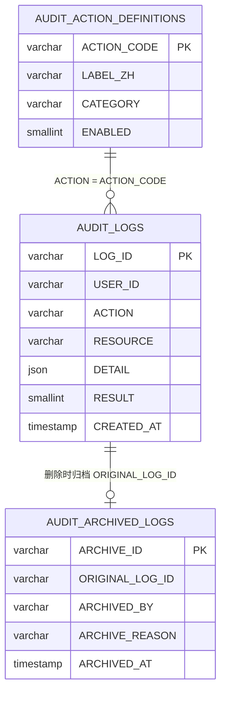

# 审计服务金仓数据库设计说明

| 项目 | 说明 |
|------|------|
| 文档版本 | v1.0 |
| 编写日期 | 2026-07-03 |
| 关联服务 | `audit-service`（审计日志读写与统计） |
| 关联数据库 | 金仓 KingbaseES，逻辑库 `DIABETES_AUDIT` |
| 初始化脚本 | [`db/kingbase_audit_init.sql`](../db/kingbase_audit_init.sql) |
| 管理端页面 | `admin-frontend/src/views/AuditLogs/` |
| 文档依据 | [`backend/audit-service/`](../backend/audit-service/)、[`系统架构与数据库设计文档.md`](./系统架构与数据库设计文档.md) |

---

## 1. 背景与定位

### 1.1 为什么使用金仓数据库

本系统业务数据主要存储在 **MySQL** 中，按微服务分库（`DIABETES_USER`、`DIABETES_ARTICLE` 等）。管理员端审计日志单独部署在 **金仓 KingbaseES** 逻辑库 `DIABETES_AUDIT` 中，与业务库物理隔离，便于：

- **合规留存**：审计数据独立存储，降低与业务表混写带来的误删、误改风险；
- **运维隔离**：审计库可独立备份、扩容与访问控制；
- **国产化适配**：满足部署环境对国产数据库的要求。

`audit-service` 通过 JDBC（`jdbc:kingbase8://...`）连接金仓，使用 MyBatis 访问三张核心表。

### 1.2 模块职责

审计模块负责 **全站关键操作的留痕与查询**，具体包括：

| 能力 | 说明 |
|------|------|
| 日志写入 | 各微服务通过内部 HTTP 接口异步上报操作记录 |
| 管理端查询 | 支持多条件筛选、分页、详情查看 |
| 统计概览 | 今日成功/失败量、操作分布、登录失败趋势、活跃用户 Top N |
| CSV 导出 | 按当前筛选条件导出，单次最多 10,000 条 |
| 删除与归档 | 删除前先写入归档表，并记录「审计日志删除」操作本身 |

写入采用 **fire-and-forget** 模式：调用方（`AuditServiceClient`）失败仅打 WARN 日志，不影响主业务流程。

---

## 2. 部署与连接配置

### 2.1 容器拓扑

```
┌─────────────────┐     HTTP      ┌──────────────────┐     JDBC      ┌─────────────────┐
│ user-service    │──────────────▶│  audit-service   │──────────────▶│  KingbaseES     │
│ article-service │  内部写入 API  │  (port 8088)     │  DIABETES_AUDIT│  (port 54321)   │
│ home-service    │               └────────▲─────────┘               └─────────────────┘
└─────────────────┘                        │
                                           │ HTTP（JWT 管理员）
                                  ┌────────┴─────────┐
                                  │  gateway         │
                                  │  admin-frontend  │
                                  └──────────────────┘
```

- Docker Compose 服务名：`kingbase`（数据库）、`audit-service`（应用）
- 金仓初始化：`db/kingbase_audit_init.sql` 挂载至容器 `docker-entrypoint-initdb.d/`
- API 网关路由：`/api/v1/admin/audit/**`、`/api/v1/internal/audit/**`（v2 路径同理）

### 2.2 连接参数

| 配置项 | 环境变量 | 默认值 |
|--------|----------|--------|
| 主机 | `KINGBASE_HOST` | `localhost` / Docker 内 `kingbase` |
| 端口 | `KINGBASE_PORT` | `54321` |
| 库名 | — | `DIABETES_AUDIT` |
| 用户 | `KINGBASE_USER` | `system` |
| 密码 | `KINGBASE_PASSWORD` | `12345678ab` |

数据源配置见 `backend/audit-service/src/main/resources/application.yml`。

---

## 3. 数据库表设计

逻辑库 `DIABETES_AUDIT` 共 **3 张表**，无跨库外键，表间通过业务字段（如 `ACTION` ↔ `ACTION_CODE`）逻辑关联。

### 3.1 表清单

| 表名 | 用途 | 主键 |
|------|------|------|
| `AUDIT_LOGS` | 在线审计日志（查询、统计、导出的主表） | `LOG_ID` |
| `AUDIT_ACTION_DEFINITIONS` | 操作类型字典（中文标签、分类、排序） | `ACTION_CODE` |
| `AUDIT_ARCHIVED_LOGS` | 被删除日志的归档副本（合规留存） | `ARCHIVE_ID` |

> 说明：MySQL 版 `db/init.sql` 中仅包含 `AUDIT_LOGS` 单表设计；金仓版在原有基础上扩展了操作定义表与归档表，见 `kingbase_audit_init.sql`。

### 3.2 AUDIT_LOGS（审计日志表）

记录每一次被审计的操作事件，是管理端列表、统计与导出的数据源。

| 字段 | 类型 | 约束 | 说明 |
|------|------|------|------|
| `LOG_ID` | VARCHAR(32) | PK | 日志 ID，格式 `aud_{uuid}` |
| `USER_ID` | VARCHAR(32) | NOT NULL | 操作用户 ID；普通用户前缀 `u_`，管理员前缀 `adm_` |
| `ACTION` | VARCHAR(100) | NOT NULL | 操作类型码，如 `user.login`、`article.create` |
| `RESOURCE` | VARCHAR(200) | NOT NULL | 操作对象标识，如用户名、资讯 ID、任务 ID |
| `DETAIL` | JSON | NULL | 操作详情（结构化 JSON，如失败原因、标题、审核动作） |
| `IP_ADDRESS` | VARCHAR(50) | NULL | 客户端 IP（支持 `X-Forwarded-For` / `X-Real-IP`） |
| `USER_AGENT` | VARCHAR(500) | NULL | 浏览器或客户端 User-Agent |
| `RESULT` | SMALLINT | NOT NULL | 操作结果：`1` 成功，`0` 失败 |
| `CREATED_AT` | TIMESTAMP | DEFAULT CURRENT_TIMESTAMP | 操作发生时间 |

**索引：**

| 索引名 | 字段 | 用途 |
|--------|------|------|
| `IDX_USER_TIME` | `(USER_ID, CREATED_AT DESC)` | 按用户查历史、Top 用户统计 |
| `IDX_ACTION` | `(ACTION)` | 按操作类型筛选 |

**ID 生成规则：** 服务层使用 `IdGenerator.nextId("aud_")` 生成主键。

### 3.3 AUDIT_ACTION_DEFINITIONS（操作类型定义表）

将操作码与中文展示名、业务分类持久化，供管理端下拉筛选、CSV 导出中文列及统计图表标签使用。

| 字段 | 类型 | 约束 | 说明 |
|------|------|------|------|
| `ACTION_CODE` | VARCHAR(100) | PK | 操作码，与 `AUDIT_LOGS.ACTION` 对应 |
| `LABEL_ZH` | VARCHAR(100) | NOT NULL | 中文标签，如「用户登录」 |
| `CATEGORY` | VARCHAR(50) | NOT NULL | 分类：`user` / `admin` / `article` / `video` / `audit` / `data` |
| `IS_SYSTEM` | SMALLINT | NOT NULL, DEFAULT 1 | 是否系统内置：`1` 是，`0` 否 |
| `ENABLED` | SMALLINT | NOT NULL, DEFAULT 1 | 是否启用：`1` 是，`0` 否 |
| `SORT_ORDER` | INTEGER | NOT NULL, DEFAULT 0 | 下拉列表排序权重 |
| `CREATED_AT` | TIMESTAMP | DEFAULT CURRENT_TIMESTAMP | 创建时间 |

**索引：** `IDX_ACTION_DEF_CATEGORY (CATEGORY, SORT_ORDER)`

初始化脚本预置 22 种系统操作类型（见 [§4.2](#42-预置操作类型)）。服务层优先读取 `ENABLED = 1` 的定义；若库中无记录则回退到代码内置字典。

### 3.4 AUDIT_ARCHIVED_LOGS（审计日志归档表）

管理员删除审计记录时，**先完整复制原记录再物理删除**，满足「可清理在线表、仍保留删除痕迹」的合规要求。

| 字段 | 类型 | 约束 | 说明 |
|------|------|------|------|
| `ARCHIVE_ID` | VARCHAR(32) | PK | 归档记录 ID，格式 `arc_{uuid}` |
| `ORIGINAL_LOG_ID` | VARCHAR(32) | NOT NULL | 原 `AUDIT_LOGS.LOG_ID` |
| `USER_ID` ~ `CREATED_AT` | — | — | 与原日志字段一一对应（快照） |
| `ARCHIVED_AT` | TIMESTAMP | DEFAULT CURRENT_TIMESTAMP | 归档时间 |
| `ARCHIVED_BY` | VARCHAR(32) | NOT NULL | 执行删除的管理员 ID |
| `ARCHIVE_REASON` | VARCHAR(200) | NULL | 归档原因：`admin_delete` / `admin_batch_delete` |

**索引：**

| 索引名 | 字段 | 用途 |
|--------|------|------|
| `IDX_ARCHIVE_ORIGINAL` | `(ORIGINAL_LOG_ID)` | 按原日志 ID 追溯 |
| `IDX_ARCHIVE_TIME` | `(ARCHIVED_AT DESC)` | 按归档时间查询 |
| `IDX_ARCHIVE_BY` | `(ARCHIVED_BY, ARCHIVED_AT DESC)` | 按操作管理员追溯 |

> 当前版本管理端 API **不提供归档表查询**，归档数据仅供 DBA / 合规审计直接查库使用。

### 3.5 表关系示意



---

## 4. 业务功能说明

### 4.1 数据写入流程

各业务微服务注入公共组件 `AuditServiceClient`，在关键操作完成后调用：

```
POST /api/v1/internal/audit/logs
Header: X-Dify-Key: {DIFY_INTERNAL_KEY}
Body: { userId, action, resource, detail?, ipAddress?, userAgent?, result }
```

| 步骤 | 行为 |
|------|------|
| 1 | 业务 Controller 完成主逻辑后调用 `auditServiceClient.log(...)` |
| 2 | 客户端 POST 至 `audit-service` 内部接口 |
| 3 | 服务校验 `X-Dify-Key`（可配置为空则跳过） |
| 4 | 补全缺失的 IP / User-Agent |
| 5 | 生成 `LOG_ID`，写入 `AUDIT_LOGS` |

**当前已接入写入的服务：**

| 服务 | 审计场景 |
|------|----------|
| `user-service` | 用户/管理员登录（成功与失败）、注册、重置密码、修改密码、个人数据导出 |
| `article-service` | 资讯创建、编辑、删除、封面上传、提交审核、审核通过/驳回 |
| `home-service` | 科普视频创建、编辑、删除、封面/文件上传 |

### 4.2 预置操作类型

| 分类 | 操作码 | 中文标签 |
|------|--------|----------|
| user | `user.login` | 用户登录 |
| user | `user.logout` | 用户登出 |
| user | `user.register` | 用户注册 |
| user | `user.password.change` | 用户修改密码 |
| user | `user.password.reset` | 用户重置密码 |
| admin | `admin.login` | 管理员登录 |
| admin | `admin.logout` | 管理员登出 |
| admin | `admin.password.change` | 管理员修改密码 |
| data | `data.export` | 数据导出 |
| article | `article.create` | 资讯创建 |
| article | `article.update` | 资讯编辑 |
| article | `article.delete` | 资讯删除 |
| article | `article.cover.upload` | 资讯封面上传 |
| article | `article.publish` | 资讯发布 |
| article | `article.review` | 资讯审核 |
| video | `video.create` | 视频创建 |
| video | `video.update` | 视频编辑 |
| video | `video.delete` | 视频删除 |
| video | `video.cover.upload` | 视频封面上传 |
| video | `video.file.upload` | 视频文件上传 |
| audit | `audit.delete` | 审计日志删除 |
| audit | `audit.export` | 审计日志导出 |

扩展新操作类型时：在业务侧使用新的 `action` 字符串写入即可；可选地在 `AUDIT_ACTION_DEFINITIONS` 中 INSERT 新行以提供中文标签与分类。

### 4.3 管理端查询与筛选

**接口前缀：** `/api/v1/admin/audit/logs`（需管理员 JWT，`role = admin`）

| 接口 | 方法 | 功能 |
|------|------|------|
| `/` | GET | 分页列表 |
| `/{logId}` | GET | 单条详情 |
| `/actions` | GET | 操作类型列表（定义表 + 日志中去重 + 代码默认） |
| `/overview?days=7` | GET | 统计概览（7–30 天） |
| `/export` | GET | 导出 CSV（UTF-8 BOM，最多 10,000 条） |
| `/{logId}` | DELETE | 单条删除（先归档） |
| `/` | DELETE | 批量删除（Body: `{ logIds: [...] }`） |

**列表筛选参数：**

| 参数 | 说明 |
|------|------|
| `userId` | 精确匹配操作用户 |
| `action` | 单个操作类型 |
| `actions` | 多个操作类型，逗号分隔 |
| `keyword` | 模糊匹配 ACTION / RESOURCE / USER_ID |
| `result` | `0` 失败 / `1` 成功 |
| `startTime` / `endTime` | 时间范围，格式 `yyyy-MM-dd` 或 `yyyy-MM-dd HH:mm:ss` |
| `page` / `size` | 分页，默认 1 / 20，单页最大 100 |

**排序：** 按 `CREATED_AT DESC, LOG_ID DESC`。

### 4.4 统计概览（overview）

`GET /admin/audit/logs/overview?days=N` 返回 JSON，供管理端「审计概览」卡片使用：

| 字段 | 含义 |
|------|------|
| `today.total` / `today.success` / `today.failed` | 当日日志总量与成功/失败数 |
| `trend_days` | 统计窗口天数（7–30，默认 7） |
| `action_distribution` | 窗口内按 ACTION 分组 Top 10（含中文 label） |
| `login_failure_trend` | 窗口内每日 `user.login` + `admin.login` 失败次数（缺日补 0） |
| `top_users` | 窗口内 `USER_ID` 以 `u_` 开头 Top 5 |
| `top_admins` | 窗口内 `USER_ID` 以 `adm_` 开头 Top 5 |

### 4.5 删除与自审计

删除流程（单条与批量一致）：

1. 从 `AUDIT_LOGS` 读取待删记录；
2. 写入 `AUDIT_ARCHIVED_LOGS`（记录 `ARCHIVED_BY`、`ARCHIVE_REASON`）；
3. 新增一条 `audit.delete` 日志（`detail` 含被删 ID 列表）；
4. 物理删除 `AUDIT_LOGS` 原记录。

导出 CSV 成功后，同样追加一条 `audit.export` 日志（`detail: { format: "csv" }`），形成 **对审计操作本身的审计**。

### 4.6 管理端前端

管理端（`admin-frontend`）通过网关访问上述 API，主要页面：

| 路径 | 组件 | 功能 |
|------|------|------|
| `/audit-logs` | `AuditLogs/index.vue` | 列表、筛选预设、详情弹窗、导出、批量删除 |
| — | `AuditLogs/AuditOverview.vue` | 概览统计卡片 |

前端操作类型中文映射见 `admin-frontend/src/utils/auditActions.js`，与数据库预置数据保持一致。

---

## 5. 安全与访问控制

| 层级 | 机制 |
|------|------|
| 内部写入 | `X-Dify-Key` 请求头校验（配置项 `dify-internal.key`） |
| 管理端读写的 | JWT Bearer Token，`AdminAuthInterceptor` 校验 `role = admin` |
| 网络 | 内部接口仅通过 gateway 转发，不暴露给 C 端用户 |
| 删除合规 | 删除前强制归档，删除行为本身留痕 |

---

## 6. 与 MySQL 版设计的差异

| 项目 | MySQL（`db/init.sql`） | 金仓（`kingbase_audit_init.sql`） |
|------|------------------------|-----------------------------------|
| 表数量 | 1（`AUDIT_LOGS`） | 3 |
| 操作字典 | 无独立表，依赖代码 | `AUDIT_ACTION_DEFINITIONS` |
| 删除归档 | 无 | `AUDIT_ARCHIVED_LOGS` |
| 结果字段类型 | `TINYINT` | `SMALLINT` |
| 服务状态 | 文档曾标注「预留」 | `audit-service` 已上线运行 |

---

## 7. 运维参考

### 7.1 常用 SQL

```sql
-- 查看今日日志量
SELECT COUNT(*) FROM AUDIT_LOGS
WHERE CREATED_AT >= CURRENT_DATE;

-- 查看最近登录失败
SELECT LOG_ID, USER_ID, ACTION, DETAIL, IP_ADDRESS, CREATED_AT
FROM AUDIT_LOGS
WHERE ACTION IN ('user.login', 'admin.login') AND RESULT = 0
ORDER BY CREATED_AT DESC
LIMIT 20;

-- 按原日志 ID 查归档
SELECT * FROM AUDIT_ARCHIVED_LOGS
WHERE ORIGINAL_LOG_ID = 'aud_xxxxxxxx';
```

### 7.2 容量建议

- 列表查询依赖 `CREATED_AT` 范围条件，建议定期清理或迁移历史数据至归档表/冷存储；
- CSV 导出硬限制 10,000 条，避免大结果集拖慢服务；
- `DETAIL` 为 JSON 类型，写入时由服务层序列化，避免存储超大 payload。

---

## 8. 相关文件索引

| 类型 | 路径 |
|------|------|
| DDL 初始化 | `db/kingbase_audit_init.sql` |
| 实体类 | `backend/audit-service/src/main/java/com/diabetes/audit/entity/` |
| MyBatis Mapper | `backend/audit-service/src/main/resources/mapper/` |
| 业务服务 | `backend/audit-service/src/main/java/com/diabetes/audit/service/AuditLogService.java` |
| 管理端 API | `backend/audit-service/.../controller/AdminAuditController.java` |
| 内部写入 API | `backend/audit-service/.../controller/InternalAuditController.java` |
| 写入客户端 | `backend/common/src/main/java/com/diabetes/common/client/AuditServiceClient.java` |
| 网关路由 | `backend/gateway/src/main/resources/application.yml` |
| 管理端页面 | `admin-frontend/src/views/AuditLogs/` |
