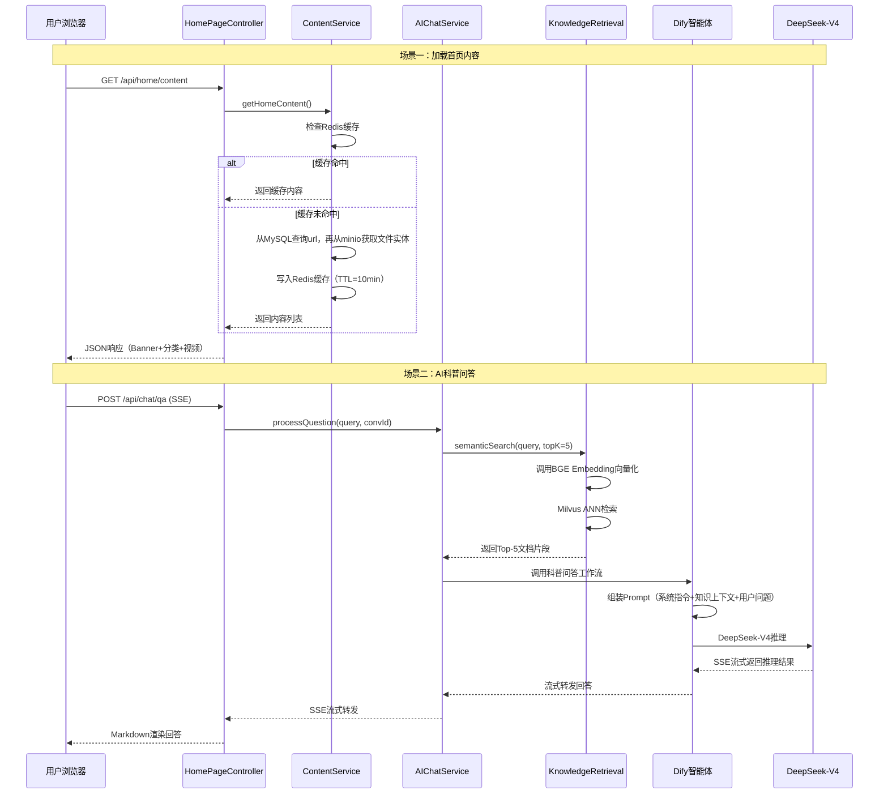
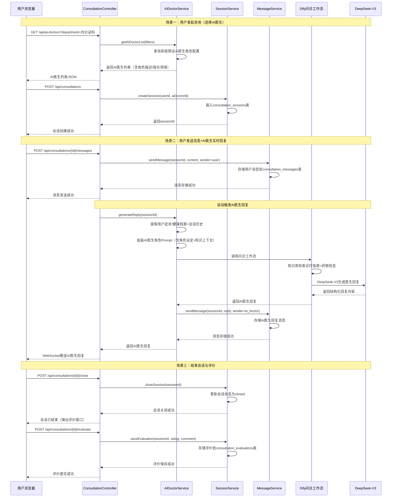
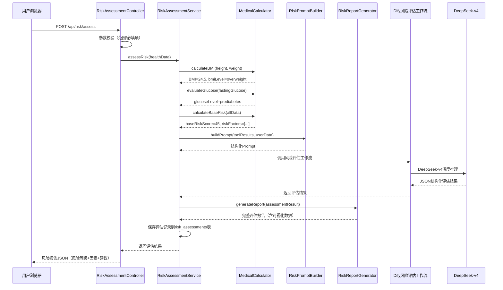
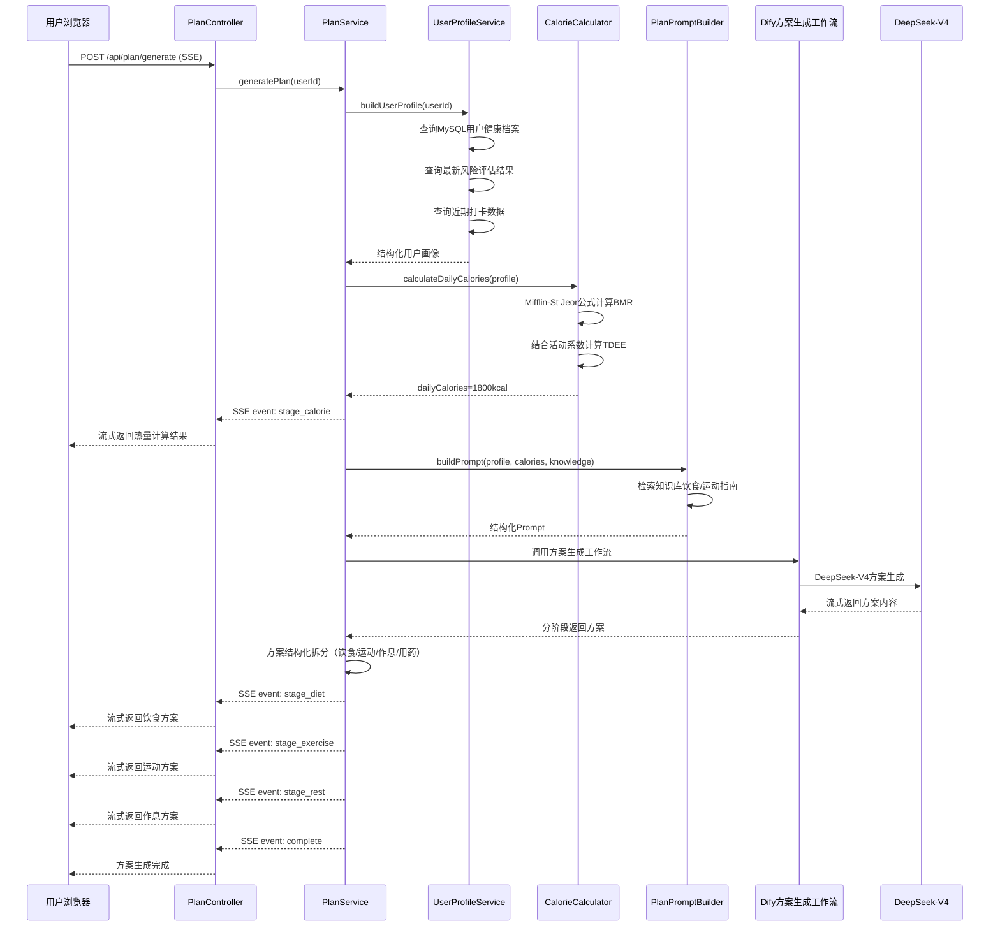
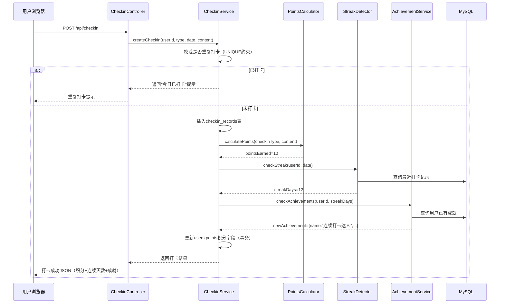
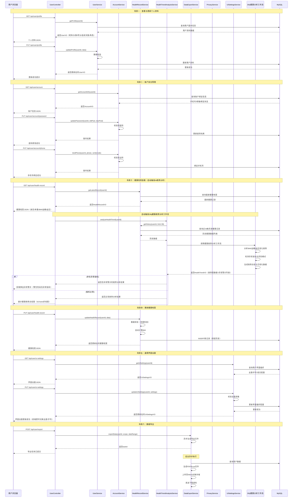
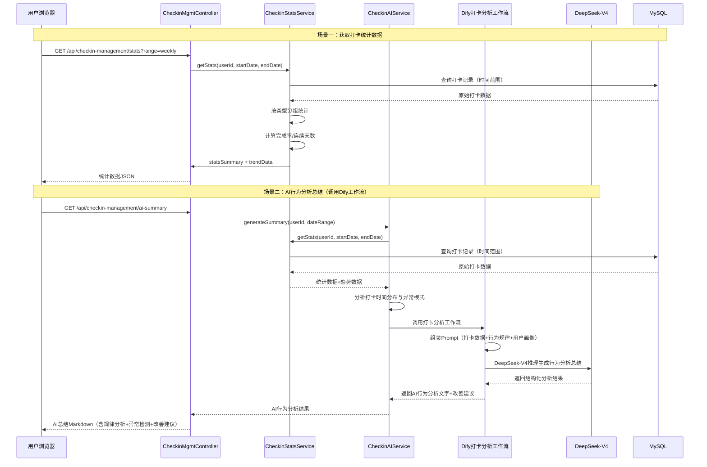
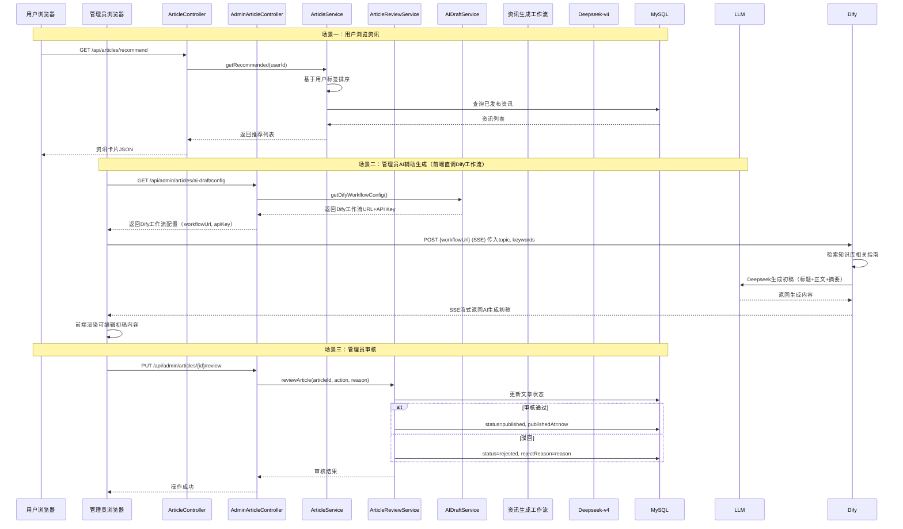

# 模块设计与交互原型设计

## 2. 模块设计

### 2.1 模块内设计类的交互模型

#### 2.1.1 科普展示首页模块设计类交互模型 （问题：milvus向量数据库）

**模块职责（对外接口）：**
- 提供科普内容展示（Banner、分类卡片、视频列表）-->文件实体存在minio中
- 提供AI科普问答服务（SSE流式回答）
- 提供个性化推荐内容

**识别设计类：**

| 设计类名称 | 类型 | 职责描述 |
|-----------|------|----------|
| HomePageController | 控制类 | 接收前端请求，调度科普内容展示与问答流程 |
| ContentService | 服务类 | 管理科普内容的加载、缓存与推荐逻辑 |
| AIChatService | 服务类 | 管理AI科普问答的对话流程，调用Dify工作流 |
| KnowledgeRetrieval | 服务类 | 封装知识库向量检索逻辑 |
| HomeContentVO | 实体类 | 首页内容展示值对象（Banner、分类、视频） |
| ChatMessageVO | 实体类 | AI问答消息值对象（流式返回） |
| UserPreference | 实体类 | 用户偏好标签实体 |

**设计类交互模型（顺序图）：**



**API 接口设计：**

| 接口名称 | 请求方式 | 接口路径 | 请求入参 | 正常响应数据 | 错误返回码 |
|---------|---------|---------|---------|-------------|-----------|
| 获取首页内容 | GET | /api/home/content | 无（或 Header: Authorization） | `{ "code": 200, "data": { "banners": [...], "categories": [...], "videos": [...] } }` | 401-未登录, 500-服务器错误 |
| AI科普问答 | POST | /api/chat/qa | **请求体(JSON):** `{ "query": "string(用户问题)", "conversationId": "string(会话ID,可选)" }` | SSE流式响应: `data: { "type": "text", "content": "markdown片段", "conversationId": "conv_xxx" }` | 400-参数错误, 401-未登录, 500-Dify调用失败 |
| 获取对话历史 | GET | /api/chat/history/{conversationId} | **路径参数:** conversationId | `{ "code": 200, "data": { "messages": [{"role":"user/assistant","content":"...","timestamp":"..."}] } }` | 404-会话不存在, 500-服务器错误 |
| 获取推荐内容 | GET | /api/home/recommend | **查询参数:** page(默认1), size(默认10) | `{ "code": 200, "data": { "articles": [...], "total": 100 } }` | 500-服务器错误 |

**Dify 工作流调用说明：**

**1. 调用 Dify 时传入的参数：**

| 参数名 | 类型 | 数据来源 | 字段含义 |
|-------|------|---------|---------|
| query | string | 用户输入 | 用户提出的科普问题原文 |
| conversation_id | string | 系统生成/前端传入 | 对话会话ID，用于维持多轮对话上下文 |
| user | string | JWT Token | 当前用户唯一标识（userId） |
| inputs.knowledge_context | string | Milvus向量检索结果 | 知识库检索到的Top-5相关文档片段拼接文本 |
| inputs.system_prompt | string | 系统预设 | 科普问答助手的角色设定指令（如："你是一名糖尿病科普专家..."） |
| response_mode | string | 系统固定值 | 固定为 "streaming"（SSE流式模式） |

**2. Dify 工作流回调返回的完整数据结构：**

```json
{
  "event": "message",
  "message_id": "msg_xxxxxxxxxxxx",
  "conversation_id": "conv_xxxxxxxxxxxx",
  "answer": "这是DeepSeek-V4生成的Markdown格式科普回答内容...",
  "created_at": 1718000000,
  "metadata": {
    "usage": {
      "prompt_tokens": 1250,
      "completion_tokens": 380,
      "total_tokens": 1630
    },
    "retriever_resources": [
      {
        "position": 1,
        "dataset_id": "ds_xxx",
        "dataset_name": "糖尿病科普知识库",
        "document_id": "doc_xxx",
        "document_name": "糖尿病饮食指南.pdf",
        "segment_id": "seg_xxx",
        "score": 0.956,
        "content": "糖尿病患者应控制碳水化合物摄入..."
      }
    ]
  }
}
```

| 字段 | 类型 | 说明 |
|------|------|------|
| event | string | 事件类型：message / message_end / error |
| message_id | string | 消息唯一ID |
| conversation_id | string | 会话ID |
| answer | string | AI生成的Markdown文本内容（流式逐块返回） |
| created_at | int | 消息创建时间戳 |
| metadata.usage.prompt_tokens | int | 提示词消耗token数 |
| metadata.usage.completion_tokens | int | 生成内容消耗token数 |
| metadata.usage.total_tokens | int | 总消耗token数 |
| metadata.retriever_resources[].position | int | 检索结果排序位置 |
| metadata.retriever_resources[].score | float | 向量检索相似度分数(0~1) |
| metadata.retriever_resources[].content | string | 检索到的文档片段原文 |

---

#### 2.1.2 医生在线咨询模块设计类交互模型（AI医生模拟）

**模块职责（对外接口）：**
- 提供AI医生列表查询与筛选（AI医生角色由系统预设）
- 创建与管理咨询会话
- 发送/接收问诊消息（AI医生直接回复）
- 结束会话与评价

**识别设计类：**

| 设计类名称 | 类型 | 职责描述 |
|-----------|------|----------|
| ConsultationController | 控制类 | 接收问诊相关请求，调度会话与消息流程 |
| AIDoctorService | 服务类 | 管理AI医生信息、角色设定、调用Dify问诊工作流生成回复 |
| SessionService | 服务类 | 管理咨询会话生命周期（创建、关闭） |
| MessageService | 服务类 | 管理消息收发、存储与推送 |
| DoctorVO | 实体类 | AI医生信息展示值对象（含角色设定描述） |
| SessionVO | 实体类 | 会话信息值对象 |
| MessageVO | 实体类 | 消息内容值对象 |

**设计类交互模型（顺序图）：**



**API 接口设计：**

| 接口名称 | 请求方式 | 接口路径 | 请求入参 | 正常响应数据 | 错误返回码 |
|---------|---------|---------|---------|-------------|-----------|
| 获取AI医生列表 | GET | /api/ai-doctors | **查询参数:** department(科室筛选,可选), keyword(搜索关键字,可选) | `{ "code": 200, "data": [{"doctorId":"","name":"","title":"","department":"","hospital":"","rating":5.0,"status":"online","consultationCount":100}] }` | 500-服务器错误 |
| 创建咨询会话 | POST | /api/consultations | **请求体(JSON):** `{ "aiDoctorId": "string(AI医生ID)" }` | `{ "code": 200, "data": { "sessionId": "sess_xxx", "status": "active", "startedAt": "2024-06-10T10:00:00" } }` | 400-参数错误, 404-AI医生不存在, 500-服务器错误 |
| 发送消息 | POST | /api/consultations/{sessionId}/messages | **路径参数:** sessionId<br>**请求体(JSON):** `{ "content": "string(消息内容)", "imageUrl": "string(图片URL,可选)" }` | `{ "code": 200, "data": { "messageId": "msg_xxx", "senderType": "user", "content": "...", "sentAt": "..." } }` | 400-参数错误, 404-会话不存在, 500-服务器错误 |
| 获取会话消息列表 | GET | /api/consultations/{sessionId}/messages | **路径参数:** sessionId<br>**查询参数:** page(默认1), size(默认50) | `{ "code": 200, "data": { "messages": [...], "total": 30 } }` | 404-会话不存在, 500-服务器错误 |
| 获取用户会话列表 | GET | /api/consultations | **查询参数:** status(active/closed,可选), page(默认1), size(默认10) | `{ "code": 200, "data": { "sessions": [...], "total": 5 } }` | 500-服务器错误 |
| 结束会话 | POST | /api/consultations/{sessionId}/close | **路径参数:** sessionId | `{ "code": 200, "message": "会话已结束" }` | 404-会话不存在, 409-会话已关闭, 500-服务器错误 |
| 提交评价 | POST | /api/consultations/{sessionId}/evaluate | **路径参数:** sessionId<br>**请求体(JSON):** `{ "rating": "int(1-5)", "comment": "string(评价内容,可选)" }` | `{ "code": 200, "message": "评价提交成功" }` | 400-评分范围错误, 404-会话不存在, 409-已评价, 500-服务器错误 |
| 获取AI辅助建议 | GET | /api/consultations/{sessionId}/ai-suggestion | **路径参数:** sessionId | `{ "code": 200, "data": { "possibleDiagnoses": [...], "suggestedQuestions": [...], "recommendedExams": [...], "treatmentStrategy": "..." } }` | 404-会话不存在, 500-Dify调用失败 |

**Dify 工作流调用说明：**

**1. 调用 Dify 时传入的参数：**

| 参数名 | 类型 | 数据来源 | 字段含义 |
|-------|------|---------|---------|
| query | string | 用户最新消息 | 用户当前发送的问诊消息内容 |
| conversation_id | string | 系统生成 | 咨询会话ID（sessionId），用于维持多轮问诊上下文 |
| user | string | JWT Token | 当前用户唯一标识（userId） |
| inputs.doctor_role | string | 系统预设AI医生配置 | AI医生的角色设定描述（如："你是一名资深内分泌科主任医师，擅长糖尿病诊疗..."） |
| inputs.patient_profile | string | 用户健康档案表 | 用户的基本健康信息（年龄、性别、身高、体重、病史等） |
| inputs.conversation_history | string | consultation_messages表 | 当前会话的历史消息列表（最近20条），拼接为对话上下文文本 |
| inputs.knowledge_context | string | 知识库检索结果 | 检索到的糖尿病诊疗指南、药物信息等相关文档片段 |
| response_mode | string | 系统固定值 | 固定为 "blocking"（阻塞模式，等待完整回复） |

**2. Dify 工作流回调返回的完整数据结构：**

```json
{
  "id": "wf_run_xxxxxxxxxxxx",
  "workflow_id": "wf_consultation_001",
  "status": "succeeded",
  "outputs": {
    "doctor_reply": {
      "content": "根据您描述的餐后血糖偏高和体重下降的情况，建议您：\n1. 完善糖耐量试验（OGTT）明确诊断\n2. 监测空腹及三餐后2小时血糖\n3. 内分泌科门诊进一步评估",
      "suggestion": {
        "possible_diagnoses": [
          {"name": "2型糖尿病", "probability": "high"},
          {"name": "糖耐量异常", "probability": "medium"}
        ],
        "suggested_questions": [
          "您是否有多饮、多尿的症状？",
          "家族中是否有糖尿病患者？"
        ],
        "recommended_exams": ["空腹血糖", "OGTT", "糖化血红蛋白"],
        "treatment_strategy": "生活方式干预为基础，必要时启动口服降糖药物治疗"
      }
    }
  },
  "error": null,
  "elapsed_time": 3.25,
  "total_tokens": 2150,
  "created_at": 1718000000,
  "finished_at": 1718000003
}
```

| 字段 | 类型 | 说明 |
|------|------|------|
| id | string | 工作流运行实例ID |
| workflow_id | string | 工作流定义ID |
| status | string | 运行状态：succeeded / failed / running |
| outputs.doctor_reply.content | string | AI医生生成的回复文本（Markdown格式） |
| outputs.doctor_reply.suggestion.possible_diagnoses[].name | string | 可能的诊断名称 |
| outputs.doctor_reply.suggestion.possible_diagnoses[].probability | string | 可能性等级：high / medium / low |
| outputs.doctor_reply.suggestion.suggested_questions[] | string | 建议医生追问的问题列表 |
| outputs.doctor_reply.suggestion.recommended_exams[] | string | 建议的检查项目列表 |
| outputs.doctor_reply.suggestion.treatment_strategy | string | 治疗策略建议 |
| elapsed_time | float | 工作流执行耗时（秒） |
| total_tokens | int | 总消耗token数 |

---

#### 2.1.3 糖尿病风险预测模块设计类交互模型

**模块职责（对外接口）：**
- 接收用户健康指标数据
- 调用医学指标计算器进行基础计算
- 调用DeepSeek-R1进行深度风险推理
- 生成结构化风险评估报告

**识别设计类：**

| 设计类名称 | 类型 | 职责描述 |
|-----------|------|----------|
| RiskAssessmentController | 控制类 | 接收评估请求，调度评估流程 |
| RiskAssessmentService | 服务类 | 管理风险评估核心业务逻辑 |
| MedicalCalculator | 工具类 | 封装BMI计算、血糖等级判定、基础风险评分 |
| RiskPromptBuilder | 服务类 | 组装风险评估Prompt |
| RiskReportGenerator | 服务类 | 生成结构化评估报告与可视化数据 |
| RiskAssessmentVO | 实体类 | 风险评估结果值对象 |
| HealthIndicatorVO | 实体类 | 健康指标输入值对象 |

**设计类交互模型（顺序图）：**



**API 接口设计：**

| 接口名称 | 请求方式 | 接口路径 | 请求入参 | 正常响应数据 | 错误返回码 |
|---------|---------|---------|---------|-------------|-----------|
| 提交风险评估 | POST | /api/risk/assess | **请求体(JSON):** `{ "height": "float(cm)", "weight": "float(kg)", "fastingGlucose": "float(mmol/L)", "systolicBp": "int(mmHg)", "diastolicBp": "int(mmHg)", "age": "int(岁)", "gender": "string(male/female)", "familyHistory": "boolean(家族史)", "smoking": "boolean(是否吸烟)", "exerciseFrequency": "string(never/occasional/regular/daily)", "dietHabit": "string(balanced/high-sugar/high-fat/vegetarian)" }` | `{ "code": 200, "data": { "assessmentId": "asmt_xxx", "riskLevel": "medium", "riskScore": 45, "bmi": 24.5, "glucoseLevel": "prediabetes", "factors": [{"name":"BMI超标","weight":30,"description":"..."}], "suggestions": ["控制饮食","增加运动"], "confidence": "high" } }` | 400-参数校验失败, 500-Dify调用失败 |
| 获取评估历史 | GET | /api/risk/history | **查询参数:** page(默认1), size(默认10) | `{ "code": 200, "data": { "records": [{"assessmentId":"","riskLevel":"","riskScore":45,"createdAt":"..."}], "total": 20 } }` | 500-服务器错误 |
| 获取评估详情 | GET | /api/risk/{assessmentId} | **路径参数:** assessmentId | `{ "code": 200, "data": { "assessmentId": "", "riskLevel": "", "riskScore": 0, "bmi": 0, "glucoseLevel": "", "factors": [], "suggestions": [], "confidence": "", "chartData": { "radar": {...}, "gauge": {...} }, "createdAt": "" } }` | 404-评估记录不存在, 500-服务器错误 |

**Dify 工作流调用说明：**

**1. 调用 Dify 时传入的参数：**

| 参数名 | 类型 | 数据来源 | 字段含义 |
|-------|------|---------|---------|
| query | string | 系统组装 | 固定为 "请根据以下健康指标进行糖尿病风险评估" |
| user | string | JWT Token | 当前用户唯一标识（userId） |
| inputs.health_indicators | string | 用户提交的表单数据 | 用户填写的健康指标JSON字符串，包含身高、体重、血糖、血压、年龄、性别等 |
| inputs.medical_calc_results | string | MedicalCalculator计算结果 | 医学计算器输出的BMI值、血糖等级、基础风险评分等结构化数据 |
| inputs.risk_factors | string | MedicalCalculator计算结果 | 基础风险因素列表（如：超重、血糖偏高、家族史等） |
| inputs.system_prompt | string | 系统预设 | 风险评估专家角色设定指令（如："你是一名糖尿病风险评估专家，请基于提供的医学指标进行深度分析..."） |
| response_mode | string | 系统固定值 | 固定为 "blocking"（阻塞模式） |

**2. Dify 工作流回调返回的完整数据结构：**

```json
{
  "id": "wf_run_xxxxxxxxxxxx",
  "workflow_id": "wf_risk_assessment_001",
  "status": "succeeded",
  "outputs": {
    "risk_assessment": {
      "risk_level": "medium",
      "risk_score": 45,
      "confidence": "high",
      "analysis": "综合评估结果显示，用户目前处于糖尿病中度风险状态。主要风险因素包括：BMI超标(24.5)、空腹血糖处于糖尿病前期范围(6.3mmol/L)、有家族糖尿病史。建议立即进行生活方式干预。",
      "risk_factors": [
        {"name": "BMI超标", "weight": 30, "category": "physique", "description": "BMI=24.5，属于超重范围，增加胰岛素抵抗风险", "suggestion": "建议将BMI控制在24以下"},
        {"name": "血糖偏高", "weight": 35, "category": "biochemical", "description": "空腹血糖6.3mmol/L，处于糖尿病前期", "suggestion": "建议进行OGTT确诊检查"},
        {"name": "家族遗传史", "weight": 20, "category": "genetic", "description": "直系亲属有糖尿病史", "suggestion": "定期筛查，每半年检测一次血糖"},
        {"name": "缺乏运动", "weight": 15, "category": "lifestyle", "description": "运动频率为偶尔", "suggestion": "建议每周至少150分钟中等强度运动"}
      ],
      "suggestions": [
        "控制饮食，减少高糖高脂食物摄入",
        "每周至少运动5次，每次30分钟以上",
        "定期监测空腹及餐后血糖",
        "保持健康体重，目标BMI<24"
      ],
      "chart_data": {
        "radar": {
          "indicators": [
            {"name": "体重指数", "max": 100},
            {"name": "血糖水平", "max": 100},
            {"name": "血压水平", "max": 100},
            {"name": "生活习惯", "max": 100},
            {"name": "遗传因素", "max": 100}
          ],
          "value": [70, 75, 40, 55, 60]
        },
        "gauge": {
          "min": 0,
          "max": 100,
          "value": 45,
          "thresholds": [
            {"level": "low", "max": 30, "color": "#43A047"},
            {"level": "medium", "max": 60, "color": "#F57C00"},
            {"level": "high", "max": 100, "color": "#E53935"}
          ]
        }
      }
    }
  },
  "error": null,
  "elapsed_time": 5.12,
  "total_tokens": 3200,
  "created_at": 1718000000,
  "finished_at": 1718000005
}
```

| 字段 | 类型 | 说明 |
|------|------|------|
| outputs.risk_assessment.risk_level | string | 风险等级：low / medium / high |
| outputs.risk_assessment.risk_score | int | 风险评分（0-100） |
| outputs.risk_assessment.confidence | string | 置信度：low / medium / high |
| outputs.risk_assessment.analysis | string | AI深度分析文本 |
| outputs.risk_assessment.risk_factors[].name | string | 风险因素名称 |
| outputs.risk_assessment.risk_factors[].weight | int | 风险权重（0-100） |
| outputs.risk_assessment.risk_factors[].category | string | 因素分类：physique/biochemical/genetic/lifestyle |
| outputs.risk_assessment.risk_factors[].description | string | 因素详细描述 |
| outputs.risk_assessment.risk_factors[].suggestion | string | 针对性改善建议 |
| outputs.risk_assessment.suggestions[] | string | 综合改善建议列表 |
| outputs.risk_assessment.chart_data.radar | object | 雷达图可视化数据 |
| outputs.risk_assessment.chart_data.gauge | object | 仪表盘可视化数据 |

---

#### 2.1.4 健康方案生成模块设计类交互模型

**模块职责（对外接口）：**
- 基于用户健康档案生成个性化方案
- 支持手动触发和自动触发
- 分阶段流式返回四大维度方案

**识别设计类：**

| 设计类名称 | 类型 | 职责描述 |
|-----------|------|----------|
| PlanController | 控制类 | 接收方案生成请求，调度生成流程 |
| PlanService | 服务类 | 管理方案生成核心业务逻辑 |
| UserProfileService | 服务类 | 构建用户健康画像 |
| CalorieCalculator | 工具类 | 基于Mifflin-St Jeor公式计算每日热量需求 |
| PlanPromptBuilder | 服务类 | 组装方案生成Prompt |
| PlanVO | 实体类 | 健康方案值对象（饮食/运动/作息/用药） |

**设计类交互模型（顺序图）：**



**API 接口设计：**

| 接口名称 | 请求方式 | 接口路径 | 请求入参 | 正常响应数据 | 错误返回码 |
|---------|---------|---------|---------|-------------|-----------|
| 生成健康方案 | POST | /api/plan/generate | 无（基于当前登录用户） | SSE流式响应:<br>`event: stage_calorie\ndata: {"stage":"calorie","dailyCalories":1800}`<br>`event: stage_diet\ndata: {"stage":"diet","content":{...}}`<br>`event: stage_exercise\ndata: {"stage":"exercise","content":{...}}`<br>`event: stage_rest\ndata: {"stage":"rest","content":{...}}`<br>`event: complete\ndata: {"planId":"plan_xxx","version":1}` | 401-未登录, 500-生成失败 |
| 获取最新方案 | GET | /api/plan/latest | 无（基于当前登录用户） | `{ "code": 200, "data": { "planId": "plan_xxx", "dietPlan": {...}, "exercisePlan": {...}, "restPlan": {...}, "medicationNote": "...", "dailyCalories": 1800, "version": 1, "generatedAt": "..." } }` | 404-无方案记录, 500-服务器错误 |
| 获取方案历史 | GET | /api/plan/history | **查询参数:** page(默认1), size(默认10) | `{ "code": 200, "data": { "plans": [{"planId":"","version":1,"generatedAt":"..."}], "total": 5 } }` | 500-服务器错误 |
| 收藏方案 | POST | /api/plan/{planId}/favorite | **路径参数:** planId | `{ "code": 200, "message": "收藏成功" }` | 404-方案不存在, 500-服务器错误 |
| 获取方案详情 | GET | /api/plan/{planId} | **路径参数:** planId | `{ "code": 200, "data": { "planId": "", "dietPlan": {...}, "exercisePlan": {...}, "restPlan": {...}, "medicationNote": "", "dailyCalories": 0, "version": 1, "generatedAt": "" } }` | 404-方案不存在, 500-服务器错误 |

**Dify 工作流调用说明：**

**1. 调用 Dify 时传入的参数：**

| 参数名 | 类型 | 数据来源 | 字段含义 |
|-------|------|---------|---------|
| query | string | 系统组装 | 固定为 "请根据用户健康画像生成个性化健康管理方案" |
| user | string | JWT Token | 当前用户唯一标识（userId） |
| inputs.user_profile | string | UserProfileService构建 | 用户健康画像JSON字符串，包含基本信息、健康指标、风险评估结果、近期打卡数据等 |
| inputs.daily_calories | int | CalorieCalculator计算结果 | 基于Mifflin-St Jeor公式计算的每日推荐热量摄入（kcal） |
| inputs.diet_knowledge | string | 知识库检索结果 | 检索到的糖尿病饮食指南知识片段 |
| inputs.exercise_knowledge | string | 知识库检索结果 | 检索到的糖尿病运动指南知识片段 |
| inputs.system_prompt | string | 系统预设 | 健康管理专家角色设定指令 |
| response_mode | string | 系统固定值 | 固定为 "streaming"（SSE流式模式，分阶段返回） |

**2. Dify 工作流回调返回的完整数据结构：**

```json
{
  "event": "text_chunk",
  "data": {
    "stage": "diet",
    "content": {
      "meal_plan": {
        "breakfast": {
          "time": "07:00-08:00",
          "foods": [
            {"name": "全麦面包", "amount": "2片", "calories": 160, "gi_level": "low"},
            {"name": "水煮蛋", "amount": "1个", "calories": 70, "gi_level": "low"},
            {"name": "无糖豆浆", "amount": "250ml", "calories": 80, "gi_level": "low"}
          ],
          "total_calories": 310
        },
        "lunch": {
          "time": "12:00-13:00",
          "foods": [
            {"name": "糙米饭", "amount": "1碗(150g)", "calories": 210, "gi_level": "medium"},
            {"name": "清蒸鱼", "amount": "100g", "calories": 120, "gi_level": "low"},
            {"name": "炒青菜", "amount": "200g", "calories": 60, "gi_level": "low"}
          ],
          "total_calories": 390
        },
        "dinner": {
          "time": "18:00-19:00",
          "foods": [
            {"name": "杂粮饭", "amount": "1小碗(100g)", "calories": 140, "gi_level": "medium"},
            {"name": "鸡胸肉", "amount": "80g", "calories": 100, "gi_level": "low"},
            {"name": "凉拌黄瓜", "amount": "150g", "calories": 30, "gi_level": "low"}
          ],
          "total_calories": 270
        },
        "snack": {
          "time": "15:00-16:00",
          "foods": [
            {"name": "坚果", "amount": "20g", "calories": 100, "gi_level": "low"},
            {"name": "无糖酸奶", "amount": "100g", "calories": 60, "gi_level": "low"}
          ],
          "total_calories": 160
        }
      },
      "diet_principles": [
        "控制总热量摄入，每日约1800kcal",
        "选择低GI食物，避免精制糖和高升糖指数食物",
        "三餐定时定量，可适当加餐",
        "保证优质蛋白摄入，减少饱和脂肪"
      ],
      "foods_to_avoid": ["含糖饮料", "糕点甜点", "油炸食品", "白米饭/白面包"],
      "foods_to_recommend": ["全谷物", "绿叶蔬菜", "优质蛋白(鱼/鸡/豆)", "低糖水果"]
    }
  }
}
```

| 字段 | 类型 | 说明 |
|------|------|------|
| event | string | SSE事件类型：text_chunk / stage_complete / error |
| data.stage | string | 方案阶段标识：diet / exercise / rest / medication / complete |
| data.content.meal_plan | object | 三餐+加餐的详细饮食计划 |
| data.content.meal_plan.breakfast/lunch/dinner/snack.time | string | 用餐时间段 |
| data.content.meal_plan.breakfast/lunch/dinner/snack.foods[].name | string | 食物名称 |
| data.content.meal_plan.breakfast/lunch/dinner/snack.foods[].amount | string | 食物份量 |
| data.content.meal_plan.breakfast/lunch/dinner/snack.foods[].calories | int | 食物热量（kcal） |
| data.content.meal_plan.breakfast/lunch/dinner/snack.foods[].gi_level | string | 血糖生成指数等级：low / medium / high |
| data.content.diet_principles[] | string | 饮食原则列表 |
| data.content.foods_to_avoid[] | string | 应避免的食物列表 |
| data.content.foods_to_recommend[] | string | 推荐食物列表 |

---

#### 2.1.5 生活打卡功能模块设计类交互模型

**模块职责（对外接口）：**

- 提供四种类型打卡（饮食/运动/用药/血糖）
- 积分计算与连续打卡检测（积分计算规则设计）
- 成就徽章发放（徽章设计）

**识别设计类：**

| 设计类名称 | 类型 | 职责描述 |
|-----------|------|----------|
| CheckinController | 控制类 | 接收打卡请求，调度打卡流程 |
| CheckinService | 服务类 | 管理打卡核心业务逻辑 |
| PointsCalculator | 工具类 | 计算打卡积分 |
| StreakDetector | 服务类 | 检测连续打卡天数 |
| AchievementService | 服务类 | 管理成就徽章发放逻辑 |
| CheckinVO | 实体类 | 打卡记录值对象 |
| AchievementVO | 实体类 | 成就徽章值对象 |

**设计类交互模型（顺序图）：**



**API 接口设计：**

| 接口名称 | 请求方式 | 接口路径 | 请求入参 | 正常响应数据 | 错误返回码 |
|---------|---------|---------|---------|-------------|-----------|
| 创建打卡记录 | POST | /api/checkin | **请求体(JSON):** `{ "checkinType": "string(diet/exercise/medication/glucose)", "checkinDate": "string(yyyy-MM-dd)", "content": { "饮食打卡": {"description":"string","mealType":"string"},"运动打卡": {"exerciseType":"string","duration":"int(min)"},"用药打卡": {"medicationName":"string","dosage":"string"},"血糖打卡": {"glucoseValue":"float(mmol/L)","measurementType":"string(fasting/postprandial)"} } }` | `{ "code": 200, "data": { "checkinId": "chk_xxx", "checkinType": "diet", "checkinDate": "2024-06-10", "pointsEarned": 10, "totalPoints": 350, "streakDays": 12, "achievement": {"name":"连续打卡达人","badgeUrl":"...","unlocked":true} } }` | 400-参数错误, 409-重复打卡, 500-服务器错误 |
| 获取今日打卡状态 | GET | /api/checkin/today | 无（基于当前登录用户） | `{ "code": 200, "data": { "todayCheckins": [{"checkinType":"diet","completed":true},...], "todayPoints": 30, "streakDays": 12 } }` | 500-服务器错误 |
| 获取打卡统计 | GET | /api/checkin/stats | **查询参数:** range(weekly/monthly,默认monthly) | `{ "code": 200, "data": { "totalCheckins": 120, "completionRate": 0.85, "totalPoints": 350, "streakDays": 12, "calendarData": {...} } }` | 500-服务器错误 |
| 获取成就列表 | GET | /api/checkin/achievements | 无（基于当前登录用户） | `{ "code": 200, "data": { "achievements": [{"name":"首次打卡","badgeUrl":"...","unlocked":true},{"name":"连续打卡达人","badgeUrl":"...","unlocked":true},{"name":"打卡王者","badgeUrl":"...","unlocked":false}] } }` | 500-服务器错误 |

---

#### 2.1.6 个人中心管理模块设计类交互模型

**模块职责（对外接口）：**
- 用户个人信息CRUD（含账户安全）
- 健康档案管理（含AI健康趋势分析）
- 就诊记录查询
- 数据导出
- 隐私设置
- 通用界面设置（主题/字号/语言）

**识别设计类：**

| 设计类名称 | 类型 | 职责描述 |
|-----------|------|----------|
| UserController | 控制类 | 接收用户管理请求 |
| UserService | 服务类 | 管理用户信息业务逻辑 |
| AccountService | 服务类 | 管理账户安全（密码/手机号/邮箱绑定） |
| HealthRecordService | 服务类 | 管理健康档案业务逻辑 |
| HealthTrendAnalysisService | 服务类 | 调用Dify工作流进行健康趋势AI分析 |
| DataExportService | 服务类 | 处理数据导出（PDF/Excel） |
| PrivacyService | 服务类 | 管理隐私设置 |
| UISettingsService | 服务类 | 管理通用界面设置（主题/字号/语言） |
| UserVO | 实体类 | 用户信息值对象 |
| AccountVO | 实体类 | 账户信息值对象（手机号/邮箱/绑定状态） |
| HealthRecordVO | 实体类 | 健康档案值对象 |
| HealthTrendVO | 实体类 | 健康趋势分析值对象（趋势图数据+异常警示） |
| UISettingsVO | 实体类 | 界面设置值对象（主题/字号/语言） |

**设计类交互模型（顺序图）：**



**API 接口设计：**

| 接口名称 | 请求方式 | 接口路径 | 请求入参 | 正常响应数据 | 错误返回码 |
|---------|---------|---------|---------|-------------|-----------|
| 获取个人资料 | GET | /api/user/profile | 无（基于当前登录用户） | `{ "code": 200, "data": { "userId": "", "nickname": "", "avatarUrl": "", "points": 350, "streakDays": 12, "role": "user" } }` | 401-未登录, 500-服务器错误 |
| 更新个人资料 | PUT | /api/user/profile | **请求体(JSON):** `{ "nickname": "string(昵称)", "avatarUrl": "string(头像URL,可选)" }` | `{ "code": 200, "data": { "userId": "", "nickname": "新昵称", ... } }` | 400-参数错误, 500-服务器错误 |
| 获取账户信息 | GET | /api/user/account | 无（基于当前登录用户） | `{ "code": 200, "data": { "phone": "138****0000", "email": "u***@example.com", "phoneBound": true, "emailBound": true, "lastLoginAt": "..." } }` | 500-服务器错误 |
| 修改密码 | PUT | /api/user/account/password | **请求体(JSON):** `{ "oldPassword": "string(旧密码)", "newPassword": "string(新密码)" }` | `{ "code": 200, "message": "密码修改成功" }` | 400-密码格式错误, 401-旧密码错误, 500-服务器错误 |
| 绑定手机号 | PUT | /api/user/account/phone | **请求体(JSON):** `{ "phone": "string(手机号)", "verifyCode": "string(验证码)" }` | `{ "code": 200, "message": "手机号绑定成功" }` | 400-验证码错误, 409-手机号已绑定, 500-服务器错误 |
| 绑定邮箱 | PUT | /api/user/account/email | **请求体(JSON):** `{ "email": "string(邮箱)", "verifyCode": "string(验证码)" }` | `{ "code": 200, "message": "邮箱绑定成功" }` | 400-验证码错误, 409-邮箱已绑定, 500-服务器错误 |
| 获取健康档案 | GET | /api/user/health-record | 无（基于当前登录用户） | `{ "code": 200, "data": { "recordId": "", "height": 170, "weight": 70, "bmi": 24.2, "fastingGlucose": 5.6, "systolicBp": 120, "diastolicBp": 80, "recordedAt": "..." } }` | 500-服务器错误 |
| 更新健康档案 | PUT | /api/user/health-record | **请求体(JSON):** `{ "height": "float(cm)", "weight": "float(kg)", "fastingGlucose": "float(mmol/L)", "systolicBp": "int(mmHg)", "diastolicBp": "int(mmHg)" }` | `{ "code": 200, "data": { "recordId": "", "height": 170, "weight": 68, "bmi": 23.5, ... } }` | 400-参数校验失败, 500-服务器错误 |
| 获取健康趋势分析 | GET | /api/user/health-trend | **查询参数:** limit(历史记录条数,默认30) | `{ "code": 200, "data": { "bmiTrend": [{"date":"2024-06-01","value":24.5},...], "glucoseTrend": [...], "bpTrend": [...], "anomalies": [{"type":"glucose","date":"2024-06-05","value":7.2,"alert":"血糖异常偏高"}], "summary": "近30天血糖呈上升趋势...", "riskLevel": "attention" } }` | 500-服务器错误 |
| 获取界面设置 | GET | /api/user/ui-settings | 无（基于当前登录用户） | `{ "code": 200, "data": { "theme": "light", "fontSize": "normal", "language": "zh-CN", "enableNotification": true } }` | 500-服务器错误 |
| 更新界面设置 | PUT | /api/user/ui-settings | **请求体(JSON):** `{ "theme": "string(light/dark)", "fontSize": "string(normal/large)", "language": "string(zh-CN/en)", "enableNotification": "boolean" }` | `{ "code": 200, "data": { "theme": "dark", ... } }` | 400-参数错误, 500-服务器错误 |
| 提交数据导出 | POST | /api/user/export | **请求体(JSON):** `{ "scope": "string(health/consultation/plan/all)", "dateRange": { "start": "string(开始日期)", "end": "string(结束日期)" } }` | `{ "code": 200, "data": { "taskId": "task_xxx", "status": "processing" } }` | 400-参数错误, 500-服务器错误 |
| 查询导出任务状态 | GET | /api/user/export/{taskId} | **路径参数:** taskId | `{ "code": 200, "data": { "taskId": "task_xxx", "status": "completed", "downloadUrl": "https://minio.xxx.com/export/xxx.pdf", "expiresAt": "..." } }` | 404-任务不存在, 500-服务器错误 |
| 获取隐私设置 | GET | /api/user/privacy | 无（基于当前登录用户） | `{ "code": 200, "data": { "profileVisibility": "public/friends/private", "dataShareEnabled": false, "notificationEnabled": true } }` | 500-服务器错误 |
| 更新隐私设置 | PUT | /api/user/privacy | **请求体(JSON):** `{ "profileVisibility": "string(public/friends/private)", "dataShareEnabled": "boolean", "notificationEnabled": "boolean" }` | `{ "code": 200, "message": "隐私设置更新成功" }` | 400-参数错误, 500-服务器错误 |

**Dify 工作流调用说明：**

**1. 调用 Dify 时传入的参数：**

| 参数名 | 类型 | 数据来源 | 字段含义 |
|-------|------|---------|---------|
| query | string | 系统组装 | 固定为 "请分析用户近期的健康指标变化趋势" |
| user | string | JWT Token | 当前用户唯一标识（userId） |
| inputs.health_history | string | health_records表 | 用户近N条（默认30条）健康记录JSON数组，包含日期、身高、体重、BMI、血糖、血压等 |
| inputs.user_baseline | string | 用户最新健康档案 | 用户当前最新的健康指标基线数据 |
| inputs.system_prompt | string | 系统预设 | 健康趋势分析专家角色设定指令 |
| response_mode | string | 系统固定值 | 固定为 "blocking"（阻塞模式） |

**2. Dify 工作流回调返回的完整数据结构：**

```json
{
  "id": "wf_run_xxxxxxxxxxxx",
  "workflow_id": "wf_health_trend_001",
  "status": "succeeded",
  "outputs": {
    "trend_analysis": {
      "summary": "近30天健康趋势分析：血糖水平呈上升趋势（从5.2mmol/L升至6.8mmol/L），BMI稳定在24左右，血压正常。建议关注血糖变化，必要时就医。",
      "risk_level": "attention",
      "bmi_trend": {
        "direction": "stable",
        "avg_value": 24.2,
        "change_rate": 0.5,
        "data_points": [
          {"date": "2024-05-11", "value": 24.1},
          {"date": "2024-05-21", "value": 24.3},
          {"date": "2024-06-01", "value": 24.2},
          {"date": "2024-06-10", "value": 24.2}
        ]
      },
      "glucose_trend": {
        "direction": "rising",
        "avg_value": 6.1,
        "change_rate": 15.4,
        "data_points": [
          {"date": "2024-05-11", "value": 5.2},
          {"date": "2024-05-21", "value": 5.8},
          {"date": "2024-06-01", "value": 6.3},
          {"date": "2024-06-10", "value": 6.8}
        ]
      },
      "bp_trend": {
        "direction": "stable",
        "avg_systolic": 118,
        "avg_diastolic": 78,
        "data_points": [
          {"date": "2024-05-11", "systolic": 120, "diastolic": 80},
          {"date": "2024-06-10", "systolic": 116, "diastolic": 76}
        ]
      },
      "anomalies": [
        {
          "type": "glucose",
          "date": "2024-06-10",
          "value": 6.8,
          "severity": "warning",
          "description": "空腹血糖6.8mmol/L，超过正常上限(6.1mmol/L)",
          "suggestion": "建议复查空腹血糖，如持续偏高请内分泌科就诊"
        }
      ]
    }
  },
  "error": null,
  "elapsed_time": 4.58,
  "total_tokens": 2800,
  "created_at": 1718000000,
  "finished_at": 1718000005
}
```

| 字段 | 类型 | 说明 |
|------|------|------|
| outputs.trend_analysis.summary | string | 健康趋势总结文本 |
| outputs.trend_analysis.risk_level | string | 风险等级：normal / attention / warning / critical |
| outputs.trend_analysis.bmi_trend.direction | string | 趋势方向：rising / falling / stable / fluctuating |
| outputs.trend_analysis.bmi_trend.avg_value | float | BMI平均值 |
| outputs.trend_analysis.bmi_trend.change_rate | float | 变化率（百分比） |
| outputs.trend_analysis.bmi_trend.data_points[] | array | 趋势数据点（日期+数值） |
| outputs.trend_analysis.glucose_trend | object | 血糖趋势（结构与bmi_trend相同） |
| outputs.trend_analysis.bp_trend | object | 血压趋势（含收缩压/舒张压） |
| outputs.trend_analysis.anomalies[].type | string | 异常类型：glucose / bmi / bp |
| outputs.trend_analysis.anomalies[].severity | string | 严重程度：info / warning / critical |
| outputs.trend_analysis.anomalies[].description | string | 异常描述 |
| outputs.trend_analysis.anomalies[].suggestion | string | 处理建议 |

---

#### 2.1.7 打卡信息管理模块设计类交互模型

**模块职责（对外接口）：**
- 提供打卡统计数据（周/月/自定义）
- 生成趋势图表数据
- AI行为分析总结（调用Dify工作流）
- 导出统计报告

**识别设计类：**

| 设计类名称 | 类型 | 职责描述 |
|-----------|------|----------|
| CheckinMgmtController | 控制类 | 接收打卡统计请求 |
| CheckinStatsService | 服务类 | 统计打卡数据，生成趋势 |
| CheckinAIService | 服务类 | 调用Dify工作流进行AI行为分析 |
| CheckinExportService | 服务类 | 导出统计报告 |
| CheckinStatsVO | 实体类 | 统计数据值对象 |
| TrendDataVO | 实体类 | 趋势数据值对象 |

**设计类交互模型（顺序图）：**



**API 接口设计：**

| 接口名称 | 请求方式 | 接口路径 | 请求入参 | 正常响应数据 | 错误返回码 |
|---------|---------|---------|---------|-------------|-----------|
| 获取打卡统计 | GET | /api/checkin-management/stats | **查询参数:** startDate(string,必填), endDate(string,必填) | `{ "code": 200, "data": { "totalCheckins": 85, "completionRate": 0.81, "totalPoints": 850, "streakDays": 12, "calendarData": {"2024-06-01":{"diet":true,"exercise":false,...},...} } }` | 400-日期参数错误, 500-服务器错误 |
| 获取趋势数据 | GET | /api/checkin-management/trends | **查询参数:** startDate(string,必填), endDate(string,必填) | `{ "code": 200, "data": { "dietTrend": [{"date":"2024-06-01","count":1},...], "exerciseTrend": [...], "medicationTrend": [...], "glucoseTrend": [...] } }` | 400-日期参数错误, 500-服务器错误 |
| 获取AI行为分析 | GET | /api/checkin-management/ai-summary | **查询参数:** startDate(string,可选), endDate(string,可选) | `{ "code": 200, "data": { "summary": "本月打卡规律分析...", "behaviorPatterns": [{"type":"diet","pattern":"规律","description":"..."}], "anomalies": [{"date":"2024-06-05","type":"missed","description":"漏打卡"}], "improvements": ["建议固定打卡时间","增加运动多样性"] } }` | 500-Dify调用失败 |
| 导出统计报告 | POST | /api/checkin-management/export | **请求体(JSON):** `{ "startDate": "string", "endDate": "string", "format": "string(pdf/excel)" }` | `{ "code": 200, "data": { "taskId": "task_xxx", "status": "processing" } }` | 400-参数错误, 500-服务器错误 |

**Dify 工作流调用说明：**

**1. 调用 Dify 时传入的参数：**

| 参数名 | 类型 | 数据来源 | 字段含义 |
|-------|------|---------|---------|
| query | string | 系统组装 | 固定为 "请分析用户的打卡行为数据，生成行为分析总结和改善建议" |
| user | string | JWT Token | 当前用户唯一标识（userId） |
| inputs.checkin_stats | string | CheckinStatsService统计结果 | 打卡统计数据JSON，包含各类型打卡次数、完成率、连续天数等 |
| inputs.trend_data | string | CheckinStatsService趋势数据 | 打卡趋势数据JSON，包含每日各类型打卡情况 |
| inputs.user_profile | string | 用户健康档案 | 用户基本健康信息，用于关联分析 |
| inputs.system_prompt | string | 系统预设 | 行为分析专家角色设定指令 |
| response_mode | string | 系统固定值 | 固定为 "blocking"（阻塞模式） |

**2. Dify 工作流回调返回的完整数据结构：**

```json
{
  "id": "wf_run_xxxxxxxxxxxx",
  "workflow_id": "wf_checkin_analysis_001",
  "status": "succeeded",
  "outputs": {
    "behavior_analysis": {
      "summary": "本月您共完成85次打卡，完成率81%。饮食打卡最规律（完成率95%），运动打卡有待加强（完成率65%）。建议固定每日打卡时间，形成习惯。",
      "behavior_patterns": [
        {"type": "diet", "pattern": "规律", "completion_rate": 0.95, "description": "饮食打卡完成率最高，三餐记录完整", "suggestion": "继续保持"},
        {"type": "exercise", "pattern": "不稳定", "completion_rate": 0.65, "description": "运动打卡集中在周末，工作日运动不足", "suggestion": "建议工作日安排30分钟快走"},
        {"type": "medication", "pattern": "规律", "completion_rate": 0.90, "description": "用药打卡基本按时", "suggestion": "继续保持"},
        {"type": "glucose", "pattern": "需加强", "completion_rate": 0.75, "description": "血糖监测频率不足，尤其餐后血糖记录较少", "suggestion": "建议增加餐后2小时血糖监测"}
      ],
      "anomalies": [
        {"date": "2024-06-05", "type": "missed_all", "description": "当日全部打卡缺失", "possible_reason": "可能外出或身体不适"},
        {"date": "2024-06-12", "type": "glucose_abnormal", "value": 8.2, "description": "餐后血糖异常偏高", "possible_reason": "可能饮食控制不佳"}
      ],
      "improvements": [
        "建议固定每日打卡时间，形成习惯",
        "增加工作日运动安排",
        "加强餐后血糖监测频率",
        "开启打卡提醒，养成固定打卡习惯"
      ]
    }
  },
  "error": null,
  "elapsed_time": 4.85,
  "total_tokens": 2600,
  "created_at": 1718000000,
  "finished_at": 1718000005
}
```

| 字段 | 类型 | 说明 |
|------|------|------|
| outputs.behavior_analysis.summary | string | 行为分析总结文本 |
| outputs.behavior_analysis.behavior_patterns[].type | string | 打卡类型：diet / exercise / medication / glucose |
| outputs.behavior_analysis.behavior_patterns[].pattern | string | 行为模式：规律 / 不稳定 / 需加强 |
| outputs.behavior_analysis.behavior_patterns[].completion_rate | float | 完成率（0~1） |
| outputs.behavior_analysis.behavior_patterns[].description | string | 模式描述 |
| outputs.behavior_analysis.behavior_patterns[].suggestion | string | 改善建议 |
| outputs.behavior_analysis.anomalies[].date | string | 异常日期 |
| outputs.behavior_analysis.anomalies[].type | string | 异常类型：missed_all / glucose_abnormal / medication_missed |
| outputs.behavior_analysis.anomalies[].description | string | 异常描述 |
| outputs.behavior_analysis.anomalies[].possible_reason | string | 可能原因分析 |
| outputs.behavior_analysis.improvements[] | string | 综合改善建议列表 |

---

#### 2.1.8 健康资讯管理模块设计类交互模型

**模块职责（对外接口）：**
- 用户端：推荐资讯流、分类筛选、搜索、收藏
- 管理端：创建/编辑/审核资讯、AI辅助生成初稿（前端直接调用Dify工作流URL）

**识别设计类：**

| 设计类名称 | 类型 | 职责描述 |
|-----------|------|----------|
| ArticleController | 控制类 | 用户端资讯请求处理 |
| AdminArticleController | 控制类 | 管理端资讯操作处理 |
| ArticleService | 服务类 | 资讯CRUD与推荐逻辑 |
| ArticleReviewService | 服务类 | 资讯审核流程管理 |
| AIDraftService | 服务类 | 提供Dify工作流URL配置，供前端直接调用 |
| ArticleVO | 实体类 | 资讯展示值对象 |
| ArticleDraftVO | 实体类 | AI生成初稿值对象 |

**设计类交互模型（顺序图）：**



**API 接口设计：**

| 接口名称 | 请求方式 | 接口路径 | 请求入参 | 正常响应数据 | 错误返回码 |
|---------|---------|---------|---------|-------------|-----------|
| 获取推荐资讯 | GET | /api/articles/recommend | **查询参数:** page(默认1), size(默认10) | `{ "code": 200, "data": { "articles": [{"articleId":"","title":"","summary":"","coverImage":"","category":"","tags":[],"viewCount":100,"publishedAt":"..."}], "total": 50 } }` | 500-服务器错误 |
| 获取资讯列表 | GET | /api/articles | **查询参数:** category(分类筛选,可选), page(默认1), size(默认10) | `{ "code": 200, "data": { "articles": [...], "total": 50 } }` | 500-服务器错误 |
| 获取资讯详情 | GET | /api/articles/{articleId} | **路径参数:** articleId | `{ "code": 200, "data": { "articleId": "", "title": "", "content": "markdown正文", "summary": "", "coverImage": "", "category": "", "tags": [], "status": "published", "viewCount": 100, "publishedAt": "" } }` | 404-资讯不存在, 500-服务器错误 |
| 搜索资讯 | GET | /api/articles/search | **查询参数:** keyword(string,必填), page(默认1), size(默认10) | `{ "code": 200, "data": { "articles": [...], "total": 10 } }` | 400-关键字为空, 500-服务器错误 |
| 收藏/取消收藏资讯 | POST | /api/articles/{articleId}/favorite | **路径参数:** articleId | `{ "code": 200, "data": { "favorited": true } }` | 404-资讯不存在, 500-服务器错误 |
| 获取收藏列表 | GET | /api/articles/favorites | **查询参数:** page(默认1), size(默认10) | `{ "code": 200, "data": { "articles": [...], "total": 5 } }` | 500-服务器错误 |
| 创建资讯（管理端） | POST | /api/admin/articles | **请求体(JSON):** `{ "title": "string(标题)", "content": "string(Markdown正文)", "summary": "string(摘要)", "coverImage": "string(封面图URL)", "category": "string(分类)", "tags": ["string(标签)"] }` | `{ "code": 200, "data": { "articleId": "art_xxx", "status": "draft" } }` | 400-参数校验失败, 500-服务器错误 |
| 更新资讯（管理端） | PUT | /api/admin/articles/{articleId} | **路径参数:** articleId<br>**请求体(JSON):** `{ "title": "string(可选)", "content": "string(可选)", ... }` | `{ "code": 200, "data": { "articleId": "", "status": "draft" } }` | 404-资讯不存在, 500-服务器错误 |
| 删除资讯（管理端） | DELETE | /api/admin/articles/{articleId} | **路径参数:** articleId | `{ "code": 200, "message": "删除成功" }` | 404-资讯不存在, 500-服务器错误 |
| 审核资讯 | PUT | /api/admin/articles/{articleId}/review | **路径参数:** articleId<br>**请求体(JSON):** `{ "action": "string(approve/reject)", "reason": "string(驳回原因,驳回时必填)" }` | `{ "code": 200, "data": { "articleId": "", "status": "published/rejected" } }` | 400-参数错误, 404-资讯不存在, 500-服务器错误 |
| 获取待审核列表 | GET | /api/admin/articles/pending-review | **查询参数:** page(默认1), size(默认10) | `{ "code": 200, "data": { "articles": [...], "total": 3 } }` | 500-服务器错误 |
| 获取AI辅助生成配置 | GET | /api/admin/articles/ai-draft/config | 无 | `{ "code": 200, "data": { "workflowUrl": "https://dify.xxx.com/v1/workflows/run", "apiKey": "app-xxxxxxxxxxxx", "inputs": { "topic": "string(主题)", "keywords": "string(关键词)" } } }` | 500-服务器错误 |

**Dify 工作流调用说明：**

**1. 调用 Dify 时传入的参数：**

| 参数名 | 类型 | 数据来源 | 字段含义 |
|-------|------|---------|---------|
| inputs.topic | string | 管理员输入 | 资讯主题（如："糖尿病饮食管理"） |
| inputs.keywords | string | 管理员输入 | 关键词列表（如："糖尿病,饮食,GI值,血糖控制"） |
| inputs.knowledge_context | string | 知识库检索结果 | 检索到的相关医学指南和科普资料片段 |
| inputs.system_prompt | string | 系统预设 | 科普文章写作专家角色设定指令 |
| response_mode | string | 系统固定值 | 固定为 "streaming"（SSE流式模式） |

> **注意：** 本模块的AI辅助生成功能由前端直接调用Dify工作流URL，后端仅提供工作流配置信息（URL + API Key）。后端通过 `GET /api/admin/articles/ai-draft/config` 接口返回Dify工作流的调用地址和认证信息。

**2. Dify 工作流回调返回的完整数据结构：**

```json
{
  "event": "text_chunk",
  "data": {
    "title": "糖尿病患者的科学饮食指南",
    "summary": "本文详细介绍了糖尿病患者如何通过科学饮食控制血糖...",
    "content": "# 糖尿病患者的科学饮食指南\n\n## 一、饮食原则\n糖尿病患者饮食控制的核心是...\n\n## 二、推荐食物\n### 2.1 低GI食物\n...\n\n## 三、应避免的食物\n...",
    "tags": ["糖尿病", "饮食", "血糖控制", "营养"],
    "suggested_cover": "https://minio.xxx.com/ai-covers/diet-guide.jpg"
  }
}
```

| 字段 | 类型 | 说明 |
|------|------|------|
| event | string | SSE事件类型：text_chunk / complete / error |
| data.title | string | AI生成的资讯标题 |
| data.summary | string | AI生成的资讯摘要 |
| data.content | string | AI生成的Markdown格式正文（流式逐段返回） |
| data.tags[] | string | AI推荐的文章标签列表 |
| data.suggested_cover | string | AI推荐的封面图片URL |

---

### 2.2 设计类说明

基于2.1节各模块设计类的交互模型，汇总系统全部设计类，构建模块设计类图。

#### 2.2.1 系统整体设计类图

```mermaid
classDiagram
    %% ===== 控制层 =====
    class HomePageController {
        -contentService: ContentService
        -aiChatService: AIChatService
        +getHomeContent(): ResponseEntity
        +processQuestion(query, convId): SseEmitter
    }
    
    class ConsultationController {
        -aiDoctorService: AIDoctorService
        -sessionService: SessionService
        -messageService: MessageService
        +getAIDoctorList(filters): ResponseEntity
        +createSession(userId, aiDoctorId): ResponseEntity
        +sendMessage(sessionId, content): ResponseEntity
        +generateReply(sessionId): ResponseEntity
        +closeSession(sessionId): ResponseEntity
        +saveEvaluation(sessionId, rating, comment): ResponseEntity
    }
    
    class RiskAssessmentController {
        -riskAssessmentService: RiskAssessmentService
        +assessRisk(healthData): ResponseEntity
        +getHistory(userId, page): ResponseEntity
        +getDetail(assessmentId): ResponseEntity
    }
    
    class PlanController {
        -planService: PlanService
        +generatePlan(userId): SseEmitter
        +getLatestPlan(userId): ResponseEntity
        +getPlanHistory(userId, page): ResponseEntity
        +favoritePlan(planId): ResponseEntity
    }
    
    class CheckinController {
        -checkinService: CheckinService
        +createCheckin(checkinData): ResponseEntity
        +getTodayStatus(userId): ResponseEntity
        +getStats(userId, range): ResponseEntity
        +getAchievements(userId): ResponseEntity
    }
    
    class UserController {
        -userService: UserService
        -accountService: AccountService
        -healthRecordService: HealthRecordService
        -healthTrendAnalysisService: HealthTrendAnalysisService
        -dataExportService: DataExportService
        -privacyService: PrivacyService
        -uiSettingsService: UISettingsService
        +getProfile(userId): ResponseEntity
        +updateProfile(userId, data): ResponseEntity
        +getAccountInfo(userId): ResponseEntity
        +updatePassword(userId, oldPwd, newPwd): ResponseEntity
        +bindPhone(userId, phone, verifyCode): ResponseEntity
        +getHealthRecord(userId): ResponseEntity
        +updateHealthRecord(userId, data): ResponseEntity
        +getUISettings(userId): ResponseEntity
        +updateUISettings(userId, settings): ResponseEntity
        +exportData(userId, scope): ResponseEntity
        +updatePrivacy(userId, settings): ResponseEntity
    }

    
    class CheckinMgmtController {
        -checkinStatsService: CheckinStatsService
        -checkinAIService: CheckinAIService
        -checkinExportService: CheckinExportService
        +getStats(userId, dateRange): ResponseEntity
        +getTrends(userId, dateRange): ResponseEntity
        +getAISummary(userId, dateRange): ResponseEntity
        +exportReport(userId, dateRange): ResponseEntity
    }
    
    class ArticleController {
        -articleService: ArticleService
        +getRecommended(userId): ResponseEntity
        +getArticles(category, page): ResponseEntity
        +getArticleDetail(articleId): ResponseEntity
        +searchArticles(keyword): ResponseEntity
        +favoriteArticle(articleId): ResponseEntity
    }
    
    class AdminArticleController {
        -articleService: ArticleService
        -articleReviewService: ArticleReviewService
        -aiDraftService: AIDraftService
        +createArticle(articleData): ResponseEntity
        +updateArticle(articleId, data): ResponseEntity
        +deleteArticle(articleId): ResponseEntity
        +reviewArticle(articleId, action): ResponseEntity
        +generateAIDraft(topic): ResponseEntity
    }

    %% ===== 服务层 =====
    class ContentService {
        -redisTemplate: RedisTemplate
        -articleMapper: ArticleMapper
        +getHomeContent(): HomeContentVO
        +getRecommended(userId): List~ArticleVO~
    }
    
    class AIChatService {
        -difyClient: DifyClient
        -knowledgeRetrieval: KnowledgeRetrieval
        +processQuestion(query, convId): SseEmitter
        +getConversationHistory(convId): List~ChatMessageVO~
    }
    
    class KnowledgeRetrieval {
        -embeddingClient: EmbeddingClient
        -milvusClient: MilvusClient
        +semanticSearch(query, topK): List~DocumentChunk~
        +rerankResults(chunks): List~DocumentChunk~
    }
    
    class AIDoctorService {
        -difyClient: DifyClient
        +getAIDoctorList(filters): List~DoctorVO~
        +generateReply(sessionId): MessageVO
    }
    
    class SessionService {
        -sessionMapper: SessionMapper
        +createSession(userId, aiDoctorId): SessionVO
        +closeSession(sessionId): void
        +saveEvaluation(sessionId, rating, comment): void
        +getUserSessions(userId): List~SessionVO~
    }
    
    class MessageService {
        -messageMapper: MessageMapper
        -webSocketHandler: WebSocketHandler
        +sendMessage(sessionId, sender, content): MessageVO
        +getMessages(sessionId): List~MessageVO~
        +pushToClient(userId, message): void
    }
    
    class RiskAssessmentService {
        -medicalCalculator: MedicalCalculator
        -riskPromptBuilder: RiskPromptBuilder
        -riskReportGenerator: RiskReportGenerator
        -difyClient: DifyClient
        +assessRisk(healthData): RiskAssessmentVO
        +getHistory(userId): List~RiskAssessmentVO~
    }
    
    class MedicalCalculator {
        +calculateBMI(height, weight): float
        +evaluateGlucose(fastingGlucose): GlucoseLevel
        +evaluateBloodPressure(systolic, diastolic): BPLevel
        +calculateBaseRisk(allData): int
    }
    
    class RiskPromptBuilder {
        +buildPrompt(toolResults, userData): String
    }
    
    class RiskReportGenerator {
        +generateReport(assessmentResult): RiskAssessmentVO
        +generateChartData(factors): ChartDataVO
    }
    
    class PlanService {
        -userProfileService: UserProfileService
        -calorieCalculator: CalorieCalculator
        -planPromptBuilder: PlanPromptBuilder
        -difyClient: DifyClient
        +generatePlan(userId): SseEmitter
        +getLatestPlan(userId): PlanVO
        +getPlanHistory(userId): List~PlanVO~
    }
    
    class UserProfileService {
        -userMapper: UserMapper
        -healthRecordMapper: HealthRecordMapper
        -riskAssessmentMapper: RiskAssessmentMapper
        -checkinRecordMapper: CheckinRecordMapper
        +buildUserProfile(userId): UserProfileVO
    }
    
    class CalorieCalculator {
        +calculateBMR(weight, height, age, gender): float
        +calculateTDEE(bmr, activityLevel): int
    }
    
    class PlanPromptBuilder {
        +buildPrompt(profile, calories, knowledge): String
    }
    
    class CheckinService {
        -pointsCalculator: PointsCalculator
        -streakDetector: StreakDetector
        -achievementService: AchievementService
        +createCheckin(userId, type, date, content): CheckinVO
        +getTodayStatus(userId): List~CheckinVO~
    }
    
    class PointsCalculator {
        +calculatePoints(checkinType, content): int
    }
    
    class StreakDetector {
        +checkStreak(userId, date): int
    }
    
    class AchievementService {
        +checkAchievements(userId, streakDays): AchievementVO
        +getAchievements(userId): List~AchievementVO~
    }
    
    class UserService {
        -userMapper: UserMapper
        +getProfile(userId): UserVO
        +updateProfile(userId, data): UserVO
    }
    
    class AccountService {
        -userMapper: UserMapper
        +getAccountInfo(userId): AccountVO
        +updatePassword(userId, oldPwd, newPwd): boolean
        +bindPhone(userId, phone, verifyCode): boolean
        +bindEmail(userId, email, verifyCode): boolean
    }
    
    class HealthRecordService {
        -healthRecordMapper: HealthRecordMapper
        +updateHealthRecord(userId, data): HealthRecordVO
        +getLatestRecord(userId): HealthRecordVO
        +getHistory(userId, limit): List~HealthRecordVO~
    }
    
    class HealthTrendAnalysisService {
        -difyClient: DifyClient
        +analyzeHealthTrend(userId): HealthTrendVO
    }
    
    class DataExportService {
        -minioClient: MinioClient
        +exportData(userId, scope, dateRange): String
        +generatePDF(data): File
        +generateExcel(data): File
    }
    
    class PrivacyService {
        +updatePrivacy(userId, settings): void
        +getPrivacySettings(userId): PrivacyVO
    }
    
    class UISettingsService {
        +getUISettings(userId): UISettingsVO
        +updateUISettings(userId, settings): UISettingsVO
    }

    
    class CheckinStatsService {
        -checkinRecordMapper: CheckinRecordMapper
        +getStats(userId, startDate, endDate): CheckinStatsVO
        +getTrends(userId, startDate, endDate): TrendDataVO
    }
    
    class CheckinAIService {
        -difyClient: DifyClient
        +generateSummary(userId, dateRange): String
        +detectAnomaly(checkinData): AnomalyVO
    }
    
    class CheckinExportService {
        +exportReport(userId, dateRange): String
    }
    
    class ArticleService {
        -articleMapper: ArticleMapper
        +getRecommended(userId): List~ArticleVO~
        +getArticles(category, page): Page~ArticleVO~
        +getArticleDetail(articleId): ArticleVO
        +searchArticles(keyword): List~ArticleVO~
        +favoriteArticle(userId, articleId): void
    }
    
    class ArticleReviewService {
        -articleMapper: ArticleMapper
        +reviewArticle(articleId, action, reason): void
        +getPendingReviewList(): List~ArticleVO~
    }
    
    class AIDraftService {
        +getDifyWorkflowConfig(): DifyWorkflowConfigVO
    }

    %% ===== 实体/值对象层 =====
    class HomeContentVO {
        +List~BannerVO~ banners
        +List~CategoryCardVO~ categories
        +List~VideoVO~ videos
    }
    
    class ChatMessageVO {
        +String conversationId
        +String content
        +String contentType
        +List~SourceVO~ sources
    }
    
    class DoctorVO {
        +String doctorId
        +String name
        +String title
        +String department
        +String hospital
        +float rating
        +String status
        +int consultationCount
    }
    
    class SessionVO {
        +String sessionId
        +String userId
        +String doctorId
        +String status
        +DateTime startedAt
        +DateTime endedAt
    }
    
    class MessageVO {
        +String messageId
        +String sessionId
        +String senderType
        +String content
        +String imageUrl
        +boolean isAISuggestion
        +DateTime sentAt
    }
    
    class AISuggestionVO {
        +List~DiagnosisVO~ possibleDiagnoses
        +List~String~ suggestedQuestions
        +List~String~ recommendedExams
        +String treatmentStrategy
    }
    
    class RiskAssessmentVO {
        +String assessmentId
        +String riskLevel
        +int riskScore
        +float bmi
        +String glucoseLevel
        +List~RiskFactorVO~ factors
        +List~String~ suggestions
        +String confidence
    }
    
    class PlanVO {
        +String planId
        +DietPlanVO dietPlan
        +ExercisePlanVO exercisePlan
        +RestPlanVO restPlan
        +String medicationNote
        +int dailyCalories
        +int version
        +DateTime generatedAt
    }
    
    class CheckinVO {
        +String checkinId
        +String checkinType
        +String checkinDate
        +int pointsEarned
        +int totalPoints
        +int streakDays
        +AchievementVO achievement
    }
    
    class AchievementVO {
        +String name
        +String badgeUrl
        +boolean unlocked
    }
    
    class UserVO {
        +String userId
        +String nickname
        +String avatarUrl
        +int points
        +int streakDays
        +String role
    }
    
    class AccountVO {
        +String phone
        +String email
        +boolean phoneBound
        +boolean emailBound
        +DateTime lastLoginAt
    }
    
    class HealthRecordVO {
        +String recordId
        +float height
        +float weight
        +float bmi
        +float fastingGlucose
        +int systolicBp
        +int diastolicBp
        +DateTime recordedAt
    }
    
    class HealthTrendVO {
        +List~TrendPointVO~ bmiTrend
        +List~TrendPointVO~ glucoseTrend
        +List~TrendPointVO~ bpTrend
        +List~AnomalyAlertVO~ anomalies
        +String summary
        +String riskLevel
    }
    
    class UISettingsVO {
        +String theme
        +String fontSize
        +String language
        +boolean enableNotification
    }
    
    class CheckinStatsVO {

        +int totalCheckins
        +float completionRate
        +int totalPoints
        +int streakDays
        +CalendarDataVO calendarData
    }
    
    class TrendDataVO {
        +List~DailyTrendVO~ dietTrend
        +List~DailyTrendVO~ exerciseTrend
        +List~DailyTrendVO~ medicationTrend
        +List~DailyTrendVO~ glucoseTrend
    }
    
    class ArticleVO {
        +String articleId
        +String title
        +String summary
        +String coverImage
        +String category
        +List~String~ tags
        +String status
        +int viewCount
        +DateTime publishedAt
    }
    
    class ArticleDraftVO {
        +String title
        +String content
        +String summary
        +List~String~ tags
    }

    %% ===== 关系定义 =====
    %% 控制层依赖服务层
    HomePageController --> ContentService
    HomePageController --> AIChatService
    ConsultationController --> AIDoctorService
    ConsultationController --> SessionService
    ConsultationController --> MessageService
    RiskAssessmentController --> RiskAssessmentService
    PlanController --> PlanService
    CheckinController --> CheckinService
    UserController --> UserService
    UserController --> AccountService
    UserController --> HealthRecordService
    UserController --> HealthTrendAnalysisService
    UserController --> DataExportService
    UserController --> PrivacyService
    UserController --> UISettingsService

    CheckinMgmtController --> CheckinStatsService
    CheckinMgmtController --> CheckinAIService
    CheckinMgmtController --> CheckinExportService
    ArticleController --> ArticleService
    AdminArticleController --> ArticleService
    AdminArticleController --> ArticleReviewService
    AdminArticleController --> AIDraftService

    %% 服务层内部依赖
    AIChatService --> KnowledgeRetrieval
    RiskAssessmentService --> MedicalCalculator
    RiskAssessmentService --> RiskPromptBuilder
    RiskAssessmentService --> RiskReportGenerator
    PlanService --> UserProfileService
    PlanService --> CalorieCalculator
    PlanService --> PlanPromptBuilder
    CheckinService --> PointsCalculator
    CheckinService --> StreakDetector
    CheckinService --> AchievementService
    AIDraftService --> KnowledgeRetrieval

```




#### 2.2.2 设计类详细说明

以下表格基于2.2.1节系统整体设计类图，对每个设计类（含接口）进行详细说明。

**表2-1：设计类/接口总览**

| 类名 | 所属包 | 继承 | 实现 | 属性字段 |
|------|--------|------|------|----------|
| HomePageController | controller.home | — | — | contentService, aiChatService |
| ConsultationController | controller.consultation | — | — | aiDoctorService, sessionService, messageService |
| RiskAssessmentController | controller.risk | — | — | riskAssessmentService |
| PlanController | controller.plan | — | — | planService |
| CheckinController | controller.checkin | — | — | checkinService |
| UserController | controller.user | — | — | userService, accountService, healthRecordService, healthTrendAnalysisService, dataExportService, privacyService, uiSettingsService |
| CheckinMgmtController | controller.checkin | — | — | checkinStatsService, checkinAIService, checkinExportService |
| ArticleController | controller.article | — | — | articleService |
| AdminArticleController | controller.admin | — | — | articleService, articleReviewService, aiDraftService |
| ContentService | service.home | — | — | redisTemplate, articleMapper |
| AIChatService | service.chat | — | — | difyClient, knowledgeRetrieval |
| KnowledgeRetrieval | service.knowledge | — | — | embeddingClient, milvusClient |
| AIDoctorService | service.consultation | — | — | difyClient |
| SessionService | service.consultation | — | — | sessionMapper |
| MessageService | service.consultation | — | — | messageMapper, webSocketHandler |
| RiskAssessmentService | service.risk | — | — | medicalCalculator, riskPromptBuilder, riskReportGenerator, difyClient |
| MedicalCalculator | util.calculator | — | — | — |
| RiskPromptBuilder | service.risk | — | — | — |
| RiskReportGenerator | service.risk | — | — | — |
| PlanService | service.plan | — | — | userProfileService, calorieCalculator, planPromptBuilder, difyClient |
| UserProfileService | service.plan | — | — | userMapper, healthRecordMapper, riskAssessmentMapper, checkinRecordMapper |
| CalorieCalculator | util.calculator | — | — | — |
| PlanPromptBuilder | service.plan | — | — | — |
| CheckinService | service.checkin | — | — | pointsCalculator, streakDetector, achievementService |
| PointsCalculator | util.calculator | — | — | — |
| StreakDetector | service.checkin | — | — | — |
| AchievementService | service.checkin | — | — | — |
| UserService | service.user | — | — | userMapper |
| AccountService | service.user | — | — | userMapper |
| HealthRecordService | service.user | — | — | healthRecordMapper |
| HealthTrendAnalysisService | service.user | — | — | difyClient |
| DataExportService | service.user | — | — | minioClient |
| PrivacyService | service.user | — | — | — |
| UISettingsService | service.user | — | — | — |
| CheckinStatsService | service.checkin | — | — | checkinRecordMapper |
| CheckinAIService | service.checkin | — | — | difyClient |
| CheckinExportService | service.checkin | — | — | — |
| ArticleService | service.article | — | — | articleMapper |
| ArticleReviewService | service.article | — | — | articleMapper |
| AIDraftService | service.article | — | — | — |
| HomeContentVO | vo.home | — | — | banners, categories, videos |
| ChatMessageVO | vo.chat | — | — | conversationId, content, contentType, sources |
| DoctorVO | vo.consultation | — | — | doctorId, name, title, department, hospital, rating, status, consultationCount |
| SessionVO | vo.consultation | — | — | sessionId, userId, doctorId, status, startedAt, endedAt |
| MessageVO | vo.consultation | — | — | messageId, sessionId, senderType, content, imageUrl, isAISuggestion, sentAt |
| AISuggestionVO | vo.consultation | — | — | possibleDiagnoses, suggestedQuestions, recommendedExams, treatmentStrategy |
| RiskAssessmentVO | vo.risk | — | — | assessmentId, riskLevel, riskScore, bmi, glucoseLevel, factors, suggestions, confidence |
| PlanVO | vo.plan | — | — | planId, dietPlan, exercisePlan, restPlan, medicationNote, dailyCalories, version, generatedAt |
| CheckinVO | vo.checkin | — | — | checkinId, checkinType, checkinDate, pointsEarned, totalPoints, streakDays, achievement |
| AchievementVO | vo.checkin | — | — | name, badgeUrl, unlocked |
| UserVO | vo.user | — | — | userId, nickname, avatarUrl, points, streakDays, role |
| AccountVO | vo.user | — | — | phone, email, phoneBound, emailBound, lastLoginAt |
| HealthRecordVO | vo.user | — | — | recordId, height, weight, bmi, fastingGlucose, systolicBp, diastolicBp, recordedAt |
| HealthTrendVO | vo.user | — | — | bmiTrend, glucoseTrend, bpTrend, anomalies, summary, riskLevel |
| UISettingsVO | vo.user | — | — | theme, fontSize, language, enableNotification |
| CheckinStatsVO | vo.checkin | — | — | totalCheckins, completionRate, totalPoints, streakDays, calendarData |
| TrendDataVO | vo.checkin | — | — | dietTrend, exerciseTrend, medicationTrend, glucoseTrend |
| ArticleVO | vo.article | — | — | articleId, title, summary, coverImage, category, tags, status, viewCount, publishedAt |
| ArticleDraftVO | vo.article | — | — | title, content, summary, tags |

**表2-2：属性详情子表**

| 名称 | 类型 | 默认值 | 访问权限 |
|------|------|--------|----------|
| **HomePageController** | | | |
| contentService | ContentService | null | Prv |
| aiChatService | AIChatService | null | Prv |
| **ConsultationController** | | | |
| aiDoctorService | AIDoctorService | null | Prv |
| sessionService | SessionService | null | Prv |
| messageService | MessageService | null | Prv |
| **RiskAssessmentController** | | | |
| riskAssessmentService | RiskAssessmentService | null | Prv |
| **PlanController** | | | |
| planService | PlanService | null | Prv |
| **CheckinController** | | | |
| checkinService | CheckinService | null | Prv |
| **UserController** | | | |
| userService | UserService | null | Prv |
| accountService | AccountService | null | Prv |
| healthRecordService | HealthRecordService | null | Prv |
| healthTrendAnalysisService | HealthTrendAnalysisService | null | Prv |
| dataExportService | DataExportService | null | Prv |
| privacyService | PrivacyService | null | Prv |
| uiSettingsService | UISettingsService | null | Prv |
| **CheckinMgmtController** | | | |
| checkinStatsService | CheckinStatsService | null | Prv |
| checkinAIService | CheckinAIService | null | Prv |
| checkinExportService | CheckinExportService | null | Prv |


