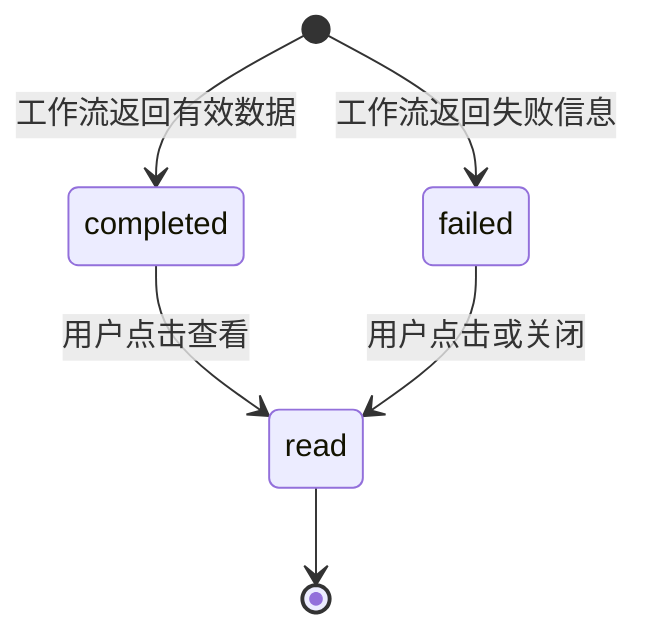
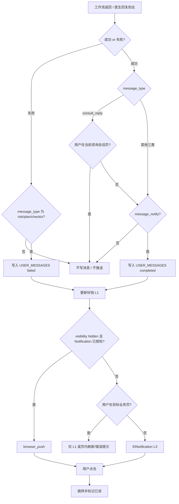
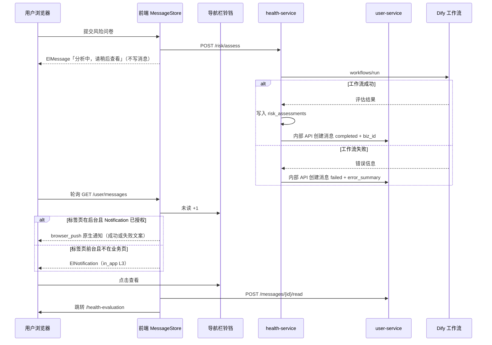

# 消息中心模块产品设计说明书

| 项目 | 说明 |
|------|------|
| 文档版本 | v1.4 |
| 编写日期 | 2026-07-01 |
| 关联服务 | `user-service`（消息持久化与 API）、`health-service`、`plan-service`、`consultation-service`、`checkin-service`（业务侧写入消息） |
| 关联库 | `DIABETES_USER`（`USER_MESSAGES`） |
| 关联页面 | `frontend/src/components/layout/SiteHeader.vue`（导航栏入口）、`frontend/src/views/MessageCenter/`（待建，可选） |
| 文档依据 | [打卡提醒模块产品设计说明书.md](./打卡提醒模块产品设计说明书.md)、[Dify工作流数据契约.md](./Dify工作流数据契约.md)、[问诊工作流数据契约.md](./问诊工作流数据契约.md)、[健康趋势分析工作流数据契约.md](./健康趋势分析工作流数据契约.md) |

---

## 1. 背景与定位

### 1.1 问题描述

系统内多项能力依赖 **Dify 工作流** 或 **长耗时后端任务**，用户提交后需等待数秒至两分钟不等。当前各模块各自为政：

| 模块 | 现有提示方式 | 问题 |
|------|--------------|------|
| 糖尿病风险预测 | 页内 `ElMessage` + 历史 Tab 红点 + `localStorage` 未读 | 离开页面后无统一入口；与其他模块体验不一致 |
| 健康方案生成 | 页内进度条 + `ElMessage.success` | 用户跳转他页后无法感知完成 |
| 医生咨询回复 | 会话页内等待 / 消息列表刷新 | 无全局「医生已回复」提醒 |
| AI 打卡行为分析 | 页内「分析生成中」徽章 | 离开分析页后无完成通知 |

用户需要在 **导航栏** 看到统一的消息入口，并在 **工作流返回结果（成功或失败）后** 收到通知。任务提交阶段的「请稍后查看」由 **各业务页即时提示**（`ElMessage`），**不写入消息中心**。

### 1.2 模块定位

**消息中心**（Message Center）是面向登录用户的 **任务结果通知** 模块，负责：

- 聚合四类 AI / 工作流 **成功态与失败态** 消息；
- 在导航栏展示未读数量与消息列表；
- 通过 **站内通知**（铃铛 / ElNotification）与 **浏览器 Notification API** 两通道触达用户；
- 引导用户跳转至对应业务页查看结果。

> **边界说明**：
> - **提交 / 处理中**：风险问卷、健康方案、打卡分析仅在业务页弹出 `ElMessage`「分析中，请稍后查看」，**不写入** `USER_MESSAGES`，不出现在铃铛列表。
> - **工作流失败**：同样 **写入** `failed` 消息并通知用户（铃铛 / ElNotification / Notification API），与成功路径触达规则一致。
> - **咨询发消息**：用户发送问诊消息时 **无任何提示**，也不写入消息。
> - **打卡提醒**（到点提醒）仍由 [打卡提醒模块产品设计说明书.md](./打卡提醒模块产品设计说明书.md) 独立处理。

### 1.3 设计目标

| 目标 | 说明 |
|------|------|
| 统一入口 | 导航栏消息图标 + 未读角标（统计 **成功与失败** 的未读消息） |
| 提交与通知分离 | 提交时页内 `ElMessage`；**仅在工作流返回结果（成功或失败）后** 写入消息并通知 |
| 可跳转 | 每条消息携带 `link_path`，点击直达报告/方案/会话/分析页 |
| 低打扰 | 同业务单任务完成后合并为一条消息，避免堆叠 |
| 双通道触达 | **站内通知**（铃铛 / ElNotification）+ **浏览器 Notification API**（标签页在后台时） |
| 咨询特例 | 发消息不提示；**仅**在用户不在咨询页且收到医生回复时通知 |
| 统一开关 | 四类消息共用 **一个** 通知开关 `message_notify`，不按类型拆分 |

---

## 2. 消息类型与业务映射

### 2.1 消息类型枚举

| 类型代号 | 名称 | 触发业务 | 关联服务 | 默认跳转 |
|----------|------|----------|----------|----------|
| `risk_assess` | 糖尿病风险预测 | 用户提交风险问卷 | `health-service` | `/health-evaluation`（打开对应报告） |
| `plan_generate` | 健康方案生成 | 用户点击「生成健康方案」 | `plan-service` | `/living-plans` |
| `consult_reply` | 医生咨询回复 | 用户发送问诊消息后 AI 医生生成回复 | `consultation-service` | `/consultation/chat?session_id={id}` |
| `checkin_analysis` | AI 打卡行为分析 | 用户触发分析刷新（换周期/自定义日期） | `checkin-service` | `/checkin-analysis` |

### 2.2 触达策略总览（核心规则）

| message_type | 用户触发时 | 是否写入消息中心 | 工作流返回后 |
|--------------|------------|------------------|--------------|
| `risk_assess` | 业务页 `ElMessage`：「分析中，请稍后查看」 | ❌ 不写入 | ✅ 成功：`completed` + 通知；失败：`failed` + 通知 |
| `plan_generate` | 业务页 `ElMessage`：「分析中，请稍后查看」 | ❌ 不写入 | ✅ 成功：`completed` + 通知；失败：`failed` + 通知 |
| `checkin_analysis` | 业务页 `ElMessage`：「分析中，请稍后查看」 | ❌ 不写入 | ✅ 成功（`source=dify`）：`completed` + 通知；失败：`failed` + 通知 |
| `consult_reply` | **无任何提示** | ❌ 不写入 | ✅ **仅当**用户不在咨询页 **且** 收到医生回复时写入并通知 |

> **原则**：消息中心 **只记录「结果已就绪」或「明确失败」**，不记录「处理中」。**成功与失败均须写入消息并触达**（铃铛 / ElNotification / Notification API），处理中状态由业务页 UI（进度条、徽章、按钮 loading）表达。

### 2.3 消息生命周期（消息中心视角）



| 状态 | 代号 | 写入时机 | 用户可见文案（示例） |
|------|------|----------|----------------------|
| 已完成 | `completed` | 工作流落库 / 返回有效数据 | 「您的风险评估报告已生成，点击查看」 |
| 失败 | `failed` | 工作流返回失败信息（超时、异常、无可用结果） | 「方案生成失败，请稍后重试」 |
| 已读 | `read` | 用户点击消息后 | 列表降权，角标不计 |

**不存在** `pending` / `processing` 状态的持久化消息。

**合并规则**：同一用户 + 同一 `message_type` + 同一 `biz_id` 在短时段内多次完成，可 upsert 更新摘要，避免重复未读。

### 2.4 各业务触发与完成条件

#### 2.4.1 糖尿病风险预测（`risk_assess`）

| 阶段 | 行为 | 消息中心 |
|------|------|----------|
| 用户提交问卷 | `ElMessage`：「分析中，请稍后查看」；页内 loading / pending 态（可选） | **不写入** |
| 工作流返回并落库 | 创建 `completed` 消息，`biz_id=assessment_id` | **写入 + 通知** |
| 工作流返回失败 | 页内 `ElMessage.error`（若用户仍在页内）；创建 `failed` 消息 | **写入 + 通知** |

**页内未完成提示**：沿用 `HealthEvaluation` 的 `assessPending` / 页内状态即可，**不再**在 pending 时写 `USER_MESSAGES` 或增铃铛角标。

#### 2.4.2 健康方案生成（`plan_generate`）

| 阶段 | 行为 | 消息中心 |
|------|------|----------|
| 用户点击生成 | `ElMessage`：「分析中，请稍后查看」；页内进度条 | **不写入** |
| 方案生成完成 | 创建 `completed` 消息，`biz_id=plan_id` | **写入 + 通知** |
| 工作流返回失败 | 页内错误提示（若用户仍在页内）；创建 `failed` 消息 | **写入 + 通知** |

#### 2.4.3 医生咨询回复（`consult_reply`）— 特例

| 阶段 | 行为 | 消息中心 |
|------|------|----------|
| 用户发送消息 | **无任何 Toast / 消息**；会话页内展示发送中气泡即可 | **不写入** |
| 医生（AI）回复到达 | 见下方条件 | 条件满足时 **写入 + 通知** |

**回复到达时的通知条件**（须 **同时满足**）：

1. `privacy_settings.message_notify !== false`（四类消息 **统一开关**，见 §10）
2. 用户 **当前不在** 医生咨询页（路由不匹配 `/consultation` 或当前 `session_id` 与会话不一致）
3. 新消息为医生侧回复（`sender_type=doctor`）

**不通知的情况**：

- 用户正在该会话聊天页内 → 消息流实时更新即可，**不**写消息中心、**不**弹 ElNotification / 原生通知
- 用户刚发送消息等待回复 → 仍 **不**提示「分析中」（与普通三类不同）

#### 2.4.4 AI 打卡行为分析（`checkin_analysis`）

| 阶段 | 行为 | 消息中心 |
|------|------|----------|
| 用户切换周期 / 触达分析 | `ElMessage`：「分析中，请稍后查看」；页内「分析生成中」徽章 | **不写入** |
| Dify 返回有效 summary | 创建 `completed` 消息 | **写入 + 通知** |
| Dify 返回失败 | 页内错误提示（若用户仍在页内）；创建 `failed` 消息 | **写入 + 通知** |
| 降级为 local 总结 | 页内 fallback 提示即可 | **不写入**（无新 AI 结果，不打扰） |

**参数维度**：`biz_id` 建议为 `{period}_{start}_{end}` 哈希，避免不同时间范围分析互相覆盖。

---

## 3. 通知方式（重点）

本模块**仅采用以下两种触达方式**，不依赖短信、微信、邮件等站外通道（后续 P3 可另评估）。

系统采用 **分层触达**：优先站内通知；仅在用户授权且标签页处于后台时使用浏览器系统通知，避免与站内弹窗重复打扰。

### 3.1 方式总览

| 优先级 | 方式 | 代号 | 适用场景 | 依赖 |
|--------|------|------|----------|------|
| P0 | **站内通知** | `in_app` | 用户正在浏览本站（含前台/后台标签页） | 消息 API 轮询 + 导航栏 MessageStore |
| P1 | **浏览器系统通知** | `browser_push` | 用户已授权 Notification 且标签页在后台 | [Notification API](https://developer.mozilla.org/zh-CN/docs/Web/API/Notification) + 用户授权 |

> **原则**：**仅**在 `USER_MESSAGES` 写入 `completed` / `failed` 后更新铃铛与触达；`message_notify = false` 时四类消息均 **不创建、不推送**；未授权浏览器通知时降级为仅站内通知。

### 3.2 P0 — 站内通知（`in_app`）

站内通知包含 **两个层级**（消息中心管辖范围）：

| 层级 | 形态 | 触发时机 |
|------|------|----------|
| L1 持久入口 | 导航栏 **消息铃铛** + 未读角标 + 下拉列表 | **仅** `completed` / `failed` 消息写入后 |
| L3 完成弹窗 | Element Plus `ElNotification`（右上角，8s，可关闭，带「立即查看」） | 新消息写入且用户 **不在** 对应业务页（咨询类见 §2.4.3） |

**不属于消息中心的即时提示**（业务页自行处理，**不写入库**）：

| 场景 | 形态 | 文案 |
|------|------|------|
| 风险 / 方案 / 打卡分析 **提交** | `ElMessage` | 「分析中，请稍后查看」 |
| 咨询 **用户发消息** | 无 | — |

**`ElNotification` 文案示例**（完成态 / 失败态）：

| message_type | status | 标题 | 正文 |
|--------------|--------|------|------|
| `risk_assess` | `completed` | 风险评估已完成 | 您的报告已生成，点击查看 |
| `risk_assess` | `failed` | 风险评估失败 | {error_summary}，请稍后重试 |
| `plan_generate` | `completed` | 健康方案已就绪 | 个性化方案已生成，点击查看 |
| `plan_generate` | `failed` | 方案生成失败 | {error_summary}，请稍后重试 |
| `consult_reply` | `completed` | 医生已回复 | {doctor_name} 回复了您的咨询，点击进入会话 |
| `checkin_analysis` | `completed` | 打卡分析已更新 | AI 行为分析报告已生成，点击查看 |
| `checkin_analysis` | `failed` | 打卡分析失败 | {error_summary}，请稍后重试 |

> `error_summary` 取自工作流返回的失败信息（截断至 80 字）；若无具体文案则使用 §6.2 默认模板。

**交互**：

- 主按钮「立即查看」→ `router.push(link_path, link_query)`，并 `POST .../messages/{id}/read`（`failed` 时按钮文案可为「查看详情」或「返回重试」）
- 关闭弹窗 → 不标记已读（仅关闭本次展示）；消息仍在铃铛列表中

**业务页内策略**：

- 用户已在目标页且正在查看本次结果（如同一会话、同一 `assessment_id`）→ **不弹出** L3，可不写消息或写入但立即标已读（推荐咨询页内 **不写消息**）
- 用户在该模块其他子状态（如问卷页、历史 Tab）→ 可弹出 L3 或页内「新报告」横幅

**技术要点**：

- 登录后 `useMessageCenter` 每 **30 秒** 轮询 `GET /api/v1/user/messages/unread-count`
- 业务页可在任务进行中本地轮询完成态（如风险 `loadHistory`），**完成后**由后端写消息或前端调用「创建完成消息」接口
- 同一 `message_id` 的 L3 弹窗会话内仅展示一次（`shownMessageIds` 去重）
- 实现文件：`frontend/src/composables/useMessageCenter.js`

### 3.3 P1 — 浏览器系统通知（`browser_push`）

**前置条件**（全部满足才发送原生通知）：

1. 用户已登录，且 `message_notify !== false`（四类统一开关，见 §10）
2. 用户曾点击「开启浏览器通知」且 `Notification.permission === 'granted'`
3. `document.visibilityState === 'hidden'`（标签页在后台或最小化）

**形态**：原生 `new Notification(title, { body, icon, tag, data })`

| 字段 | 值 |
|------|-----|
| `title` | 与 L3 `ElNotification` 标题一致 |
| `body` | 消息 `summary` 或默认文案 |
| `tag` | `msg-center-{message_type}-{message_id}` | 同 tag 覆盖，避免堆叠 |
| `icon` | 站点 favicon `/favicon.ico` |
| `data.url` | 完整跳转路径（含 query） |
| 点击 | `window.focus()` + 跳转目标页 + 标记已读 |

**权限与兼容性**：

- 封装复用 `frontend/src/utils/notification.js`（`isNotificationSupported`、`requestNotificationPermission`、`sendNotification`）
- 调用前须判断 `typeof Notification !== 'undefined'`，微信内置浏览器等不支持环境 **静默降级** 为仅站内通知
- 权限引导入口：个人中心「隐私与通知」→ **消息通知** 区块内「开启浏览器通知」链接（可与打卡提醒共用授权，无需重复弹窗）

**与站内通知关系**：

- 标签页 **前台可见** → 仅 `in_app`（L1 + 必要时 L3）
- 标签页 **后台** 且已授权 → **仅** `browser_push`（不再弹 L3，避免双通道重复）
- 标签页后台但未授权 → 仅 L1 角标（用户切回站点后可见）

### 3.4 触达阶段与通道映射

| 阶段 | 业务页 ElMessage | 写入 USER_MESSAGES | 铃铛 L1 | ElNotification L3 | browser_push |
|------|------------------|--------------------|---------|-------------------|--------------|
| 风险/方案/打卡 **提交** | ✅「分析中，请稍后查看」 | ❌ | ❌ | ❌ | ❌ |
| 咨询 **用户发消息** | ❌ | ❌ | ❌ | ❌ | ❌ |
| **工作流返回成功** | ❌（页内自行刷新） | ✅ `completed` | ✅ 未读 +1 | ✅（不在业务页） | ✅（后台且已授权） |
| **工作流返回失败** | ✅ error（页内，若用户仍在页） | ✅ `failed` | ✅ 未读 +1 | ✅（不在业务页） | ✅（后台且已授权） |

### 3.5 触达方式决策流程



---

## 4. 导航栏交互设计

> 导航栏铃铛属于站内通知 **L1 层**（见 §3.2），是消息中心的固定入口。

### 4.1 入口位置

在 `SiteHeader` 右侧导航区（「我的」左侧）增加 **消息铃铛**：

```
[ Logo 糖尿病智能助手 ]  [ 首页 ] [ 资讯 ] [ AI助手 ]     [ 🔔 3 ] [ 我的 ]
```

| 元素 | 说明 |
|------|------|
| 图标 | Element Plus `Bell` 或自定义 SVG |
| 角标 | 未读 `completed` + 未读 `failed` 数量（**不含**处理中任务） |
| 登录态 | 未登录不展示；登录后 `onMounted` 拉取消息 |

### 4.2 下拉面板（Popover / Dropdown）

点击铃铛展开消息面板（宽 360px，最高 480px 可滚动）：

```
┌─────────────────────────────────────┐
│ 消息通知              [ 全部已读 ]   │
├─────────────────────────────────────┤
│ ● 风险评估报告已生成                  │
│   2 分钟前 · 中风险 62 分            │
│   [ 查看 ]                           │
├─────────────────────────────────────┤
│ ● 健康方案已就绪                      │
│   5 分钟前                           │
│   [ 查看 ]                           │
├─────────────────────────────────────┤
│ ● 打卡分析失败                        │
│   8 分钟前 · 服务超时，请稍后重试      │
│   [ 返回重试 ]                       │
├─────────────────────────────────────┤
│ ● 张医生回复了您的咨询                │
│   10 分钟前                          │
│   [ 进入会话 ]                       │
├─────────────────────────────────────┤
│        查看全部消息 →                │
└─────────────────────────────────────┘
```

> 列表中 **不出现**「正在生成中」类条目；处理中状态仅通过业务页 `ElMessage` 表达。

| 交互 | 行为 |
|------|------|
| 点击「查看 / 进入会话」 | 标记已读 → 路由跳转 `link_path` + `link_query` |
| 点击「全部已读」 | `POST .../messages/read-all` |
| 点击面板外 | 关闭面板 |
| 空状态 | 「暂无消息」 |

### 4.3 与弹窗通道的关系

- 业务页提交时的 `ElMessage`（「分析中，请稍后查看」）**不属于**消息中心，见 §2.2、§3.2。
- **completed / failed** 时的 `ElNotification` 与 **browser_push** 规则见 **§3.2 ~ §3.5**（失败消息使用 `type: warning` 或红色样式区分）。

### 4.4 可选：消息中心全页

路由 `/messages`（P1）：分页列表 + 筛选（全部 / 未读 / 按类型），用于历史消息归档查询。

---

## 5. 触达流程

### 5.1 端到端时序（以风险预测为例）



### 5.2 决策流程

与 **§3.5 触达方式决策流程** 一致，此处不再重复图。

---

## 6. 数据模型

库：`DIABETES_USER`

### 6.1 用户消息表 `USER_MESSAGES`

```sql
CREATE TABLE USER_MESSAGES (
    MESSAGE_ID     VARCHAR(32)   NOT NULL PRIMARY KEY COMMENT '消息ID',
    USER_ID        VARCHAR(32)   NOT NULL COMMENT '用户ID',
    MESSAGE_TYPE   VARCHAR(32)   NOT NULL COMMENT 'risk_assess/plan_generate/consult_reply/checkin_analysis',
    STATUS         VARCHAR(16)   NOT NULL DEFAULT 'completed' COMMENT 'completed/failed（不写 pending）',
    TITLE          VARCHAR(100)  NOT NULL COMMENT '标题',
    SUMMARY        VARCHAR(500)  DEFAULT NULL COMMENT '摘要/副文案',
    BIZ_ID         VARCHAR(64)   DEFAULT NULL COMMENT '业务主键 assessment_id/plan_id/session_id 等',
    LINK_PATH      VARCHAR(200)  NOT NULL COMMENT '前端路由路径',
    LINK_QUERY     JSON          DEFAULT NULL COMMENT '路由 query 参数 JSON',
    EXTRA          JSON          DEFAULT NULL COMMENT '扩展字段 如 risk_level/score',
    IS_READ        TINYINT(1)    NOT NULL DEFAULT 0 COMMENT '是否已读',
    READ_AT        DATETIME      DEFAULT NULL COMMENT '已读时间',
    EXPIRE_AT      DATETIME      DEFAULT NULL COMMENT '可选过期时间',
    CREATED_AT     DATETIME      NOT NULL DEFAULT CURRENT_TIMESTAMP,
    UPDATED_AT     DATETIME      NOT NULL DEFAULT CURRENT_TIMESTAMP ON UPDATE CURRENT_TIMESTAMP,
    FOREIGN KEY (USER_ID) REFERENCES USERS(USER_ID) ON DELETE CASCADE,
    INDEX IDX_USER_STATUS (USER_ID, IS_READ, STATUS, CREATED_AT DESC),
    INDEX IDX_USER_TYPE_BIZ (USER_ID, MESSAGE_TYPE, BIZ_ID)
) ENGINE=InnoDB DEFAULT CHARSET=utf8mb4 COLLATE=utf8mb4_unicode_ci COMMENT='用户消息中心';
```

### 6.2 消息文案模板

| message_type | status=completed | status=failed |
|--------------|------------------|---------------|
| `risk_assess` | 您的风险评估报告已生成（{level} {score}分） | 风险评估失败：{error_summary} |
| `plan_generate` | 您的个性化健康方案已就绪 | 方案生成失败：{error_summary} |
| `consult_reply` | {doctor_name} 回复了您的咨询 | （一般不写入 failed） |
| `checkin_analysis` | 打卡行为分析报告已更新 | 分析失败：{error_summary} |

> 提交阶段的「分析中，请稍后查看」**不在**上表中，由业务页 `ElMessage` 临时展示，不入库。`failed` 消息的 `extra.error_summary` 存工作流原始失败信息摘要。

---

## 7. API 设计

**服务**：`user-service`  
**前缀**：`/api/v1/user/messages`  
**鉴权**：JWT（用户仅能操作自己的消息）

| 方法 | 路径 | 说明 |
|------|------|------|
| GET | `/` | 分页列表，`?unreadOnly=true&limit=20` |
| GET | `/unread-count` | 未读数量（导航栏角标） |
| POST | `/{messageId}/read` | 单条标记已读 |
| POST | `/read-all` | 全部标记已读 |
| DELETE | `/{messageId}` | 删除单条（可选 P1） |

**内部 API**（各业务服务调用，`Header: X-Internal-Key`）：

| 方法 | 路径 | 说明 |
|------|------|------|
| POST | `/api/v1/internal/messages` | **仅**在工作流完成或失败时创建消息（`completed` / `failed`） |
| PUT | `/api/v1/internal/messages/{messageId}` | 更新 summary / extra（一般不需要 pending→completed 更新） |
| PUT | `/api/v1/internal/messages/by-biz` | 按 `userId+type+bizId` upsert 完成态消息 |

### 7.1 列表响应示例

```json
{
  "code": 200,
  "data": {
    "total": 5,
    "unread_count": 2,
    "list": [
      {
        "message_id": "msg_abc123",
        "message_type": "risk_assess",
        "status": "completed",
        "title": "风险评估报告已生成",
        "summary": "中风险 · 62 分",
        "biz_id": "ra_xyz789",
        "link_path": "/health-evaluation",
        "link_query": { "assessment_id": "ra_xyz789" },
        "extra": { "risk_level": "medium", "risk_score": 62 },
        "is_read": false,
        "created_at": "2026-07-01T10:00:00",
        "updated_at": "2026-07-01T10:01:30"
      }
    ]
  }
}
```

### 7.2 内部创建请求示例

**成功（completed）**：

```json
{
  "user_id": "u_test001",
  "message_type": "risk_assess",
  "status": "completed",
  "title": "风险评估报告已生成",
  "summary": "中风险 · 62 分",
  "biz_id": "ra_xyz789",
  "link_path": "/health-evaluation",
  "link_query": { "assessment_id": "ra_xyz789" },
  "extra": { "risk_level": "medium", "risk_score": 62 }
}
```

**失败（failed）**：

```json
{
  "user_id": "u_test001",
  "message_type": "risk_assess",
  "status": "failed",
  "title": "风险评估失败",
  "summary": "工作流超时，请稍后重试",
  "biz_id": "ra_pending_xyz",
  "link_path": "/health-evaluation",
  "link_query": {},
  "extra": { "error_summary": "Dify workflow timeout after 120s" }
}
```

---

## 8. 前端实现要点

| 文件 | 改动 |
|------|------|
| `frontend/src/components/layout/SiteHeader.vue` | 增加消息铃铛 + Popover |
| **新建** `frontend/src/components/MessageCenter/MessagePopover.vue` | 消息列表 UI |
| **新建** `frontend/src/api/message.js` | 消息 CRUD API |
| **新建** `frontend/src/composables/useMessageCenter.js` | 轮询 **completed/failed** 消息、in_app（ElNotification + 铃铛）、browser_push 分发、已读同步 |
| **复用** `frontend/src/utils/notification.js` | Notification API 封装（与打卡提醒共用） |
| **新建** `frontend/src/stores/message.js`（可选 Pinia） | 跨页面共享 unreadCount |
| `frontend/src/App.vue` | 登录后 `useMessageCenter().start()` |
| `frontend/src/views/UserCenter/index.vue` | 「问诊消息通知」合并为「消息通知」单开关 `message_notify`；保留「开启浏览器通知」链接 |
| `frontend/src/views/HealthEvaluation/index.vue` | 提交：`ElMessage`「分析中…」；成功/失败：由后端写消息或轮询后刷新 |
| `frontend/src/views/LivingPlans/index.vue` | 提交：`ElMessage`；成功/失败：写消息 |
| `frontend/src/views/Consultation/index.vue` | 发消息：**无 Toast**；回复：仅离开咨询页时写消息 |
| `frontend/src/views/CheckinAnalysis/index.vue` | 触发分析：`ElMessage`；Dify 成功/失败：写消息 |

### 8.1 轮询策略

| 场景 | 策略 |
|------|------|
| 默认 | 登录后每 **30 秒** `GET /unread-count` + 打开面板时拉完整列表 |
| 页面 `visibilitychange` 变为 visible | 立即刷新一次 |

业务页可在任务进行中自行轮询业务 API 判断完成；**不在**消息中心维护 pending 列表。

### 8.2 与现有「风险预测未读」的关系

| 现状 | 迁移建议 |
|------|----------|
| `localStorage he_risk_*_unread` | 迁移为消息中心 `risk_assess` **completed/failed** 未读消息 |
| 历史 Tab 红点 / 「新」横幅 | 可与消息中心并存，或统一读取 `USER_MESSAGES` |

---

## 9. 后端实现要点

| 组件 | 服务 | 说明 |
|------|------|------|
| `UserMessage` 实体 + Mapper | user-service | 消息 CRUD |
| `UserMessageService` | user-service | 列表、已读、内部 upsert；写消息前校验 `message_notify` |
| `UserMessageController` | user-service | 用户侧 REST |
| `InternalMessageController` | user-service | 内部写入 |
| `RiskAssessmentService` | health-service | **仅** assess 完成/失败时写消息 |
| `PlanGenerateService` | plan-service | **仅**生成完成/失败时写消息 |
| `ConsultationService` | consultation-service | **仅**医生回复且用户不在会话页时写消息 |
| `CheckinMgmtService` | checkin-service | **仅** AI summary（dify）成功或失败时写消息 |
| `UserServiceClient` 扩展 | common | 各服务调用 internal message API |

**Gateway 路由**（`gateway/application.yml` 追加）：

```yaml
- Path=/api/v1/user/messages,/api/v1/user/messages/**,/api/v1/internal/messages/**
  → user-service
```

---

## 10. 隐私与通知开关

### 10.1 统一开关（四类消息共用）

四类消息类型 **共用一个** 用户侧开关，**不按类型拆分**：

| 项目 | 说明 |
|------|------|
| 字段 | `privacy_settings.message_notify` |
| 默认值 | `true` |
| 控制范围 | `risk_assess`、`plan_generate`、`consult_reply`、`checkin_analysis` **全部** |
| 关闭时 | 不写入 `USER_MESSAGES`；不更新铃铛角标；不弹 `ElNotification` / `browser_push` |
| 开启时 | 按 §2 ~ §3 各类型规则正常触达 |

**个人中心 UI**（`UserCenter` → 隐私与通知）：

```
┌─────────────────────────────────────────────────────┐
│ 消息通知                              [ 开关 ON ]    │
│ 风险评估、健康方案、医生回复、打卡分析               │
│ 完成或失败时通知您                                   │
│ [ 开启浏览器通知 ]  ← 与打卡提醒共用 Notification 授权 │
└─────────────────────────────────────────────────────┘
```

| 层级 | 控件 | 字段 | 说明 |
|------|------|------|------|
| 业务总开关 | `el-switch` ×1 | `message_notify` | 控制上述 **四类** 消息是否写入并触达 |
| 浏览器通道 | 文字链接 ×1 | `Notification.permission` | 全局授权，与打卡提醒共用；**不**按消息类型拆分 |

> **不采用** 四类各一个开关（如 `risk_notify`、`plan_notify` 等），避免设置项过多、与「消息中心」统一入口定位冲突。

### 10.2 与其他开关的关系

| 开关 | 字段 | 模块 | 与消息中心关系 |
|------|------|------|----------------|
| **消息通知** | `message_notify` | 消息中心（四类 AI 结果） | 本模块主开关 |
| 打卡提醒 | `checkin_notify` | [打卡提醒模块](./打卡提醒模块产品设计说明书.md) | **独立**，控制到点提醒，不控制消息中心 |
| 健康资讯推送 | `marketing_notify` | 资讯模块 | **独立** |
| 浏览器系统通知 | `Notification.permission` | 全站 | 第二道门：仅影响标签页在后台时的 `browser_push` |

### 10.3 兼容与迁移

| 现状 | 处理 |
|------|------|
| 已有 `consult_notify` | 读取时：`message_notify ?? consult_notify ?? true`；保存统一开关时写入 `message_notify` |
| 个人中心「问诊消息通知」 | **合并** 为「消息通知」一项，不再单独展示 `consult_notify` 开关 |
| 后端各服务 | 写消息前统一读 `message_notify`（user-service 内部 API 可代查，避免各服务重复解析 JSON） |

**判定伪代码**：

```javascript
function isMessageNotifyEnabled(privacySettings) {
  const ps = privacySettings || {}
  if (ps.message_notify !== undefined) return ps.message_notify !== false
  if (ps.consult_notify !== undefined) return ps.consult_notify !== false
  return true
}
```

---

## 11. 分期交付

| 阶段 | 范围 | 通知方式 |
|------|------|----------|
| **P0** | 导航栏铃铛 + MessageStore + 四类业务 **成功/失败** 消息 | `in_app`（L1 + L3） |
| **P1** | `USER_MESSAGES` 表 + user-service API + 四类服务写消息 | + `browser_push`（Notification API） |
| **P2** | WebSocket 实时刷新、全页消息中心、失败重试 | 仍仅 in_app + browser_push |

### P0 前端本地任务模型（过渡）

```javascript
// localStorage key: msg_center_{userId}
{
  "tasks": [
    {
      "id": "local_risk_001",
      "type": "risk_assess",
      "status": "completed",
      "title": "...",
      "link_path": "/health-evaluation",
      "biz_id": "ra_xxx",
      "read": false,
      "created_at": 1719800000000
    }
  ]
}
```

各业务页在 **工作流返回后** 由后端写入消息（或前端检测完成后触发）；提交时仅 `ElMessage`，调用 `messageCenter.refresh()` 拉取新消息。

---

## 12. 验收清单

- [ ] 登录后导航栏展示消息铃铛；未登录不展示
- [ ] 风险/方案/打卡分析：**提交时**仅 `ElMessage`「分析中，请稍后查看」，铃铛 **无** 新条目、角标 **不变**
- [ ] 咨询：**用户发消息** 无任何 Toast / 消息写入
- [ ] 工作流返回数据后：写入消息、未读角标 +1；前台 `ElNotification` 或后台 `browser_push`，不重复
- [ ] 咨询：用户在 **当前会话页** 收到医生回复 → **不**写消息、**不**弹通知
- [ ] 咨询：用户 **不在** 咨询页收到医生回复 → 写消息并通知（`message_notify` 开启时）
- [ ] `message_notify` 关闭后，四类消息均不写入、不触达
- [ ] 点击消息 / 通知跳转正确页面并标记已读
- [ ] 未授权 Notification 或不支持环境下降级为仅站内通知

---

## 13. 与相关模块差异

| 维度 | 打卡提醒模块 | 消息中心模块 |
|------|--------------|--------------|
| 触发 | 用户设定时刻 / 规则 | 工作流 **返回结果**（成功 / 失败，及咨询离页回复） |
| 内容 | 提醒去打卡 | 结果就绪或失败通知 |
| 提交阶段 | 打卡页内 / ElMessage | 业务页 `ElMessage`「分析中…」（**不入消息中心**） |
| 通道 | `in_app`（ElNotification）+ `browser_push`（Notification API） | **同左** |
| 数据 | `CHECKIN_REMINDER_*` | `USER_MESSAGES` |
| 开关 | `checkin_notify`（独立） | `message_notify`（四类统一）+ 浏览器通知授权 |

---

## 14. 附录：四类业务当前代码锚点

| 类型 | 前端入口 | 后端 / 工作流 |
|------|----------|---------------|
| 风险预测 | `frontend/src/views/HealthEvaluation/index.vue` → `submitAssess` | `POST /api/v1/risk/assess`，[Dify工作流数据契约.md](./Dify工作流数据契约.md) |
| 健康方案 | `frontend/src/views/LivingPlans/index.vue` → `handleGenerate` | `plan-service` + Dify |
| 问诊回复 | `frontend/src/views/Consultation/index.vue` | [问诊工作流数据契约.md](./问诊工作流数据契约.md) |
| 打卡分析 | `frontend/src/views/CheckinAnalysis/index.vue` → `loadAiSummary` | `checkin-management/ai-summary`，[健康趋势分析工作流数据契约.md](./健康趋势分析工作流数据契约.md) |

---

*文档结束*
