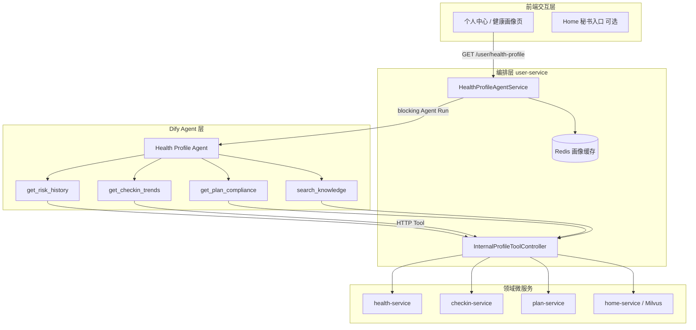
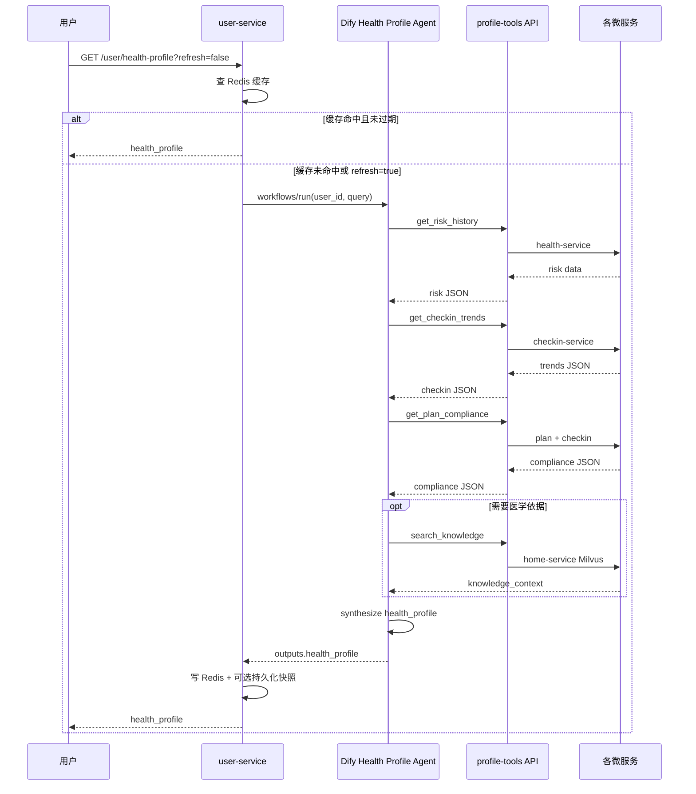

# 用户健康画像 Agent 设计方案

| 项目 | 说明 |
|------|------|
| 文档版本 | v1.0 |
| 编写日期 | 2026-07-02 |
| 创新定位 | 跨模块「用户健康数字孪生体」— 从分散 AI 功能点升级为统一可解释画像 Agent |
| 关联服务 | `user-service`（编排入口）、`health-service`、`checkin-service`、`plan-service`、`home-service`、`article-service`（消费画像） |
| 关联平台 | Dify Agent（多工具 HTTP 调用）、Milvus `diabetes_knowledge`（RAG 溯源） |
| 文档依据 | [Dify工作流数据契约.md](./Dify工作流数据契约.md)、[Milvus医学知识库落地指南.md](./Milvus医学知识库落地指南.md)、[消息中心模块产品设计说明书.md](./消息中心模块产品设计说明书.md)、[健康趋势分析工作流数据契约.md](./健康趋势分析工作流数据契约.md) |

---

## 1. 背景与问题

### 1.1 现状：AI 能力分散、数据割裂

本项目已具备较完整的糖尿病预治管理链路，但各模块 **独立调用 Dify**，用户侧感知为多个互不关联的「AI 功能点」：

| 模块 | 服务 | AI/数据能力 | 使用的用户数据 |
|------|------|-------------|----------------|
| 糖尿病风险预测 | `health-service` | Dify 风险评估 + `MedicalCalculator` | 健康档案、历史评估 |
| 健康方案生成 | `plan-service` | Dify 方案 + `CalorieCalculator` | 健康档案、风险摘要 |
| 打卡 AI 行为分析 | `checkin-service` | Dify 行为分析 | 打卡 stats/trends、健康档案 |
| 资讯个性化推荐 | `article-service` | 混合召回 + Dify 重排 | 健康档案、风险、阅读行为 |
| AI 医生咨询 | `consultation-service` | Dify 问诊 + Milvus RAG | 健康档案、知识检索 |
| 健康趋势分析 | 规划中 | Dify 趋势工作流 | 健康档案历史 |

**问题归纳：**

1. **无统一用户视图**：风险上升、打卡依从性下降、方案未执行等信号分散在各表与各缓存中，LLM 无法在一次推理中看到完整上下文。
2. **重复拉数**：`ArticleRecommendService`、`CheckinMgmtService`、`ConsultationService` 均各自调用 `HealthServiceClient.getLatestHealthProfile()`，缺少聚合层。
3. **行动链断裂**：画像结论无法自然驱动「推荐低 GI 资讯」「微调方案」「发送提醒消息」等下游动作。
4. **可解释性不足**：用户看到的是各模块独立报告，缺少跨模块因果解释（例：「近 7 天碳水偏高 + 风险分上升 → 建议…」）。

### 1.2 创新目标

构建 **Health Profile Agent（用户健康画像 Agent）**，实现：

| 目标 | 说明 |
|------|------|
| **统一数字孪生体** | 聚合风险、打卡、方案、知识四类数据，生成持续更新的可解释画像 |
| **Agent 多工具编排** | Dify Agent 按需调用 `get_risk_history`、`get_checkin_trends`、`get_plan_compliance`、`search_knowledge` |
| **可解释输出** | 每条结论附带 `evidence`（数据来源 + 指标快照）与 `actions`（可执行建议） |
| **驱动下游模块** | 画像结果可被资讯推荐、方案微调、消息中心复用 |
| **合规降级** | Dify 不可用时，后端规则引擎输出结构化画像（非空响应） |

### 1.3 设计边界

| 范围内 | 范围外 |
|--------|--------|
| 登录用户个人画像生成与查询 | 群体流行病学分析（属 admin 统计） |
| 只读聚合 + AI 解读 + 建议输出 | 自动修改用户方案/自动发药（需人工确认） |
| 工具调用现有 internal API 或轻量扩展 | 新建独立微服务（首期不新增进程） |
| 画像快照缓存与版本号 | 实时流式 CGM 设备接入 |

---

## 2. 总体架构

### 2.1 逻辑分层



### 2.2 与现有架构的关系

- **不替换**现有各业务 Dify 工作流（风险评估、方案生成、打卡分析等），而是在其之上增加 **横向聚合层**。
- **复用**已有 internal 通道：`X-Dify-Key` 鉴权、`HealthServiceClient` 等客户端模式。
- **扩展**少量 internal 接口（打卡 trends 聚合、方案依从性计算），避免 Agent 多次往返拼装。
- **编排宿主**选定 `user-service`：已有 `InternalUserController`、个人中心域归属清晰，网关 JWT 路由现成。

### 2.3 两种实现模式（分阶段）

| 阶段 | 模式 | 说明 |
|------|------|------|
| **Phase 1（MVP）** | 后端预聚合 + Dify Workflow | `HealthProfileAgentService` 并行拉取四域数据，一次性传入 Dify Workflow 合成画像；工具 API 先实现供调试 |
| **Phase 2（完整 Agent）** | Dify Agent + HTTP Tools | Agent 根据 `query` 意图选择性调用工具，支持「只查风险趋势」等轻量请求 |

本文档以 **Phase 2 为目标架构**，Phase 1 作为可快速落地的子集（见 §10）。

---

## 3. Agent 工具设计

Dify Agent 注册 4 个 **OpenAPI / HTTP Request 工具**，统一回调 `user-service` 工具网关（再由网关转发至各微服务）。

### 3.1 工具一览

| 工具名 | 职责 | 下游依赖 | 现有基础 |
|--------|------|----------|----------|
| `get_risk_history` | 风险评分历史与最新评估因子 | `health-service` | ✅ `GET /internal/health/user/{id}/risk-history`、`latest-assessment` |
| `get_checkin_trends` | 近 N 天打卡统计与趋势 | `checkin-service` | ⚠️ 仅有 `recent` 原始记录，需扩展 `trends` 聚合接口 |
| `get_plan_compliance` | 最新方案目标 vs 实际打卡依从性 | `plan-service` + `checkin-service` | ⚠️ 需新增依从性计算 |
| `search_knowledge` | 医学知识 RAG 检索 | `home-service` | ✅ `GET /internal/home/knowledge/search` |

### 3.2 工具网关（user-service）

新增 `InternalProfileToolController`，路径前缀 **`/api/v1/internal/profile-tools`**，供 Dify HTTP Tool 调用。

**统一请求头：**

| Header | 说明 |
|--------|------|
| `X-Dify-Key` | 与 `${dify-internal.key}` 一致，否则 401 |
| `X-User-Id` | 当前被分析用户 ID（Agent 从会话上下文注入） |

**统一响应：** `ApiResponse<T>`，`code=200` 时 `data` 为工具 JSON。

---

### 3.3 工具：`get_risk_history`

**Dify 工具描述（供 Agent 选择）：**  
> 获取用户糖尿病风险评估历史与最新一次评估详情，包括 risk_score、risk_level、risk_factors、suggestions、assessedAt。用于判断风险是否上升、识别主要风险因子。

**HTTP：**

```
GET /api/v1/internal/profile-tools/risk-history?days=90&limit=10
Header: X-Dify-Key, X-User-Id
```

**参数：**

| 参数 | 类型 | 默认 | 说明 |
|------|------|------|------|
| `days` | int | 90 | 时间窗口（过滤 assessedAt） |
| `limit` | int | 10 | 最多返回条数 |

**实现逻辑：**

1. 调用 `HealthServiceClient.getRiskHistory(userId, key, 1, limit)`。
2. 调用 `HealthServiceClient.getLatestRiskAssessment(userId, key)`。
3. 本地计算 `trend_delta`：最新分 − 窗口内最早分；`trend_direction`：`up` / `down` / `stable`（|delta| < 3 为 stable）。

**响应示例：**

```json
{
  "latest": {
    "riskScore": 62,
    "riskLevel": "medium",
    "glucoseLevel": "prediabetes",
    "factors": [{"name": "BMI超标", "weight": 20}],
    "assessedAt": "2026-06-28T10:00:00"
  },
  "history": [
    {"riskScore": 58, "riskLevel": "medium", "assessedAt": "2026-06-01T09:00:00"}
  ],
  "trend": {
    "delta": 4,
    "direction": "up",
    "windowDays": 90
  }
}
```

---

### 3.4 工具：`get_checkin_trends`

**Dify 工具描述：**  
> 获取用户近 N 天生活打卡完成率、连续天数、饮食/运动/用药/血糖四类趋势。用于发现行为恶化（如用药打卡下降、饮食打卡缺失）。

**HTTP：**

```
GET /api/v1/internal/profile-tools/checkin-trends?days=7
Header: X-Dify-Key, X-User-Id
```

**依赖扩展（checkin-service）：**

新增 internal 接口（供 user-service 转发或直接调用）：

```
GET /api/v1/internal/checkin/user/{userId}/summary?days=7
```

响应体 = 现有 `CheckinService.buildStats()` + `buildTrends()` 合并（与打卡 AI 分析工作流入参对齐，见 `DifyCheckinAnalysisWorkflowContract`）。

**响应示例：**

```json
{
  "period": {"start": "2026-06-26", "end": "2026-07-02", "days": 7},
  "stats": {
    "totalCheckins": 18,
    "completionRate": 0.64,
    "streakDays": 5
  },
  "trends": {
    "dietTrend": [{"date": "2026-07-01", "count": 2}],
    "medicationTrend": [{"date": "2026-07-02", "count": 0}]
  },
  "alerts": [
    {"code": "medication_miss", "severity": "warning", "message": "近3天用药打卡不足"}
  ]
}
```

`alerts` 由 **规则引擎**在 checkin-service 预计算（非 LLM），保证可测试、可复现。

---

### 3.5 工具：`get_plan_compliance`

**Dify 工具描述：**  
> 对比用户最新健康方案目标与近期打卡行为，输出饮食/运动/作息维度的依从率与偏差说明。

**HTTP：**

```
GET /api/v1/internal/profile-tools/plan-compliance?days=7
Header: X-Dify-Key, X-User-Id
```

**依赖扩展（plan-service 或 user-service 编排）：**

1. `PlanServiceClient.getLatestPlan(userId, key)` 获取 `dailyCalories`、`dietPlan`、`exercisePlan`。
2. `CheckinServiceClient` 获取同期打卡 summary。
3. 计算依从性（规则示例）：

| 维度 | 规则 | 依从率公式 |
|------|------|------------|
| 饮食 | 近 N 天应有 `3×N` 餐次打卡（早/午/晚） | 实际饮食打卡 / 期望 |
| 运动 | 方案 `exercisePlan.weekly_frequency` 折算日期望 | 实际运动打卡 / 期望 |
| 用药 | 方案含用药提醒时，日期内应打卡 | 实际用药打卡 / 期望 |
| 热量 | 若有打卡食物热量明细，对比 `dailyCalories` | 可选 Phase 2 |

**响应示例：**

```json
{
  "planId": "plan_abc",
  "planGeneratedAt": "2026-06-20T08:00:00",
  "dailyCaloriesTarget": 1800,
  "compliance": {
    "overall": 0.58,
    "diet": 0.72,
    "exercise": 0.43,
    "medication": 0.60
  },
  "gaps": [
    {"dimension": "exercise", "message": "本周运动打卡仅为方案目标的43%"}
  ]
}
```

---

### 3.6 工具：`search_knowledge`

**Dify 工具描述：**  
> 根据关键词检索糖尿病医学知识库（Milvus），返回权威指南片段，用于为画像结论提供医学依据与溯源。

**HTTP：**

```
GET /api/v1/internal/profile-tools/knowledge-search?query=低GI饮食&topK=3
Header: X-Dify-Key
```

**实现：** 转发至 `HomeServiceClient.searchKnowledgeContext()`，并返回 `sources` 数组（已有 `KnowledgeRetrieval.extractSources`）。

**响应示例：**

```json
{
  "knowledgeContext": "【指南】低 GI 食物有助于平稳餐后血糖…",
  "sources": [
    {"title": "中国2型糖尿病防治指南2024", "section": "营养治疗", "score": 0.89}
  ],
  "count": 3
}
```

---

## 4. Dify Agent 工作流设计

### 4.1 Agent 类型与调用

| 项目 | 说明 |
|------|------|
| Dify 应用类型 | **Agent Chatbot** 或 **Workflow + Agent 节点**（推荐 Workflow 便于结构化输出） |
| 调用方 | `user-service` → `POST {DIFY_BASE_URL}/v1/workflows/run` |
| 环境变量 | `DIFY_HEALTH_PROFILE_API_KEY` |
| 响应模式 | `blocking`（画像生成 ≤ 30s；超时降级） |
| 输出变量 | `health_profile`（JSON Object） |

### 4.2 Agent 系统提示词（要点）

```
你是糖尿病健康管理画像分析专家。你必须：
1. 通过工具获取真实数据，禁止编造指标。
2. 综合 risk、checkin、plan_compliance、knowledge 四类信息生成画像。
3. 每条 insight 必须引用 evidence（工具名 + 关键字段）。
4. 每条 action 必须可执行（跳转模块：risk/plan/checkin/article/consultation）。
5. 输出 JSON 符合 health_profile schema。
6. 文末固定附加免责声明：「以上内容仅供参考，不构成诊疗建议。」
```

### 4.3 Agent 推理流程（Phase 2）



### 4.4 Phase 1 简化流程（MVP）

后端 **并行调用** 四个工具网关方法（不经过 Agent 多轮），将结果打包为单个 Workflow 入参 `aggregated_context`（JSON 字符串），Workflow 内 **仅 1 次 LLM 节点** 合成画像。  
优点：实现快、延迟可控、便于压测；缺点：无法按意图省掉工具调用。

---

## 5. 画像输出数据契约

### 5.1 顶层结构 `health_profile`

| 字段 | 类型 | 说明 |
|------|------|------|
| `profileId` | string | 快照 ID，`hp_{timestamp}` |
| `userId` | string | 用户 ID |
| `generatedAt` | string | ISO8601 |
| `source` | string | `dify` / `local_fallback` |
| `summary` | string | 100–300 字自然语言总览 |
| `riskSnapshot` | object | 最新风险摘要 |
| `behaviorSnapshot` | object | 打卡行为摘要 |
| `planSnapshot` | object | 方案依从摘要 |
| `insights` | array | 可解释洞察列表 |
| `actions` | array | 推荐行动 |
| `disclaimer` | string | 固定免责声明 |

### 5.2 `insights[]` 元素

```json
{
  "id": "ins_1",
  "category": "risk_behavior_link",
  "severity": "warning",
  "title": "风险分上升与饮食打卡下降相关",
  "content": "近7天风险分上升4分，同时饮食打卡完成率降至64%…",
  "evidence": [
    {"tool": "get_risk_history", "field": "trend.delta", "value": 4},
    {"tool": "get_checkin_trends", "field": "stats.completionRate", "value": 0.64}
  ]
}
```

`severity` 枚举：`info` | `warning` | `critical`（仅行为/指标异常，非医学诊断）。

### 5.3 `actions[]` 元素

```json
{
  "id": "act_1",
  "type": "read_article",
  "priority": 1,
  "title": "阅读低 GI 饮食科普",
  "reason": "碳水摄入模式与当前风险因子匹配",
  "linkPath": "/health-info?tag=低GI",
  "payload": {"articleTags": ["低GI", "饮食控制"]}
}
```

**action.type 枚举（首期）：**

| type | 说明 | 跳转 |
|------|------|------|
| `risk_reassess` | 建议重新评估 | `/health-evaluation` |
| `adjust_plan` | 建议微调方案 | `/living-plans` |
| `checkin_focus` | 强化某类打卡 | `/checkin-records` |
| `read_article` | 推荐阅读 | `/health-info` |
| `consult_doctor` | 建议咨询 | `/consultation` |

### 5.4 JSON Schema 文件（规划）

```
backend/user-service/src/main/resources/dify/health-profile-output.schema.json
backend/user-service/src/main/java/.../dify/DifyHealthProfileWorkflowContract.java
```

契约查询 API：

```
GET /api/v1/user/health-profile/dify-workflow-spec
```

---

## 6. 对外 API 设计

### 6.1 用户接口（需 JWT）

| 方法 | 路径 | 说明 |
|------|------|------|
| GET | `/api/v1/user/health-profile` | 获取最新画像（优先缓存） |
| POST | `/api/v1/user/health-profile/refresh` | 强制刷新（异步可选） |
| GET | `/api/v1/user/health-profile/history` | 历史快照列表（若持久化） |
| GET | `/api/v1/user/health-profile/dify-workflow-spec` | 契约与示例 |

**Query 参数（GET）：**

| 参数 | 默认 | 说明 |
|------|------|------|
| `refresh` | false | true 时跳过缓存 |
| `days` | 7 | 行为/依从性窗口 |

**响应：** `ApiResponse<HealthProfileVO>`，与 §5 结构一致。

### 6.2 网关路由（gateway 追加）

```yaml
# user-service 路由已覆盖 /api/v1/user/**，无需新路由
# internal 工具 API 不对公网暴露，仅 Docker 内网 + Dify 回调
```

### 6.3 内部工具 API 清单

| 方法 | 路径 | 供谁调用 |
|------|------|----------|
| GET | `/api/v1/internal/profile-tools/risk-history` | Dify Agent |
| GET | `/api/v1/internal/profile-tools/checkin-trends` | Dify Agent |
| GET | `/api/v1/internal/profile-tools/plan-compliance` | Dify Agent |
| GET | `/api/v1/internal/profile-tools/knowledge-search` | Dify Agent |

`WebMvcConfig`：该前缀 **排除 JWT**，仅校验 `X-Dify-Key`（与 health/checkin internal 一致）。

---

## 7. 后端模块设计（user-service）

### 7.1 新增类

| 类 | 职责 |
|----|------|
| `HealthProfileAgentService` | 缓存、调用 Dify、解析 `health_profile`、降级 |
| `HealthProfileToolService` | 四工具聚合逻辑（供 Controller 与 MVP 预聚合复用） |
| `PlanComplianceCalculator` | 方案 vs 打卡依从性规则 |
| `HealthProfileFallbackBuilder` | 无 Dify 时本地规则画像 |
| `InternalProfileToolController` | Dify HTTP Tool 入口 |
| `HealthProfileController` | 用户 JWT API |
| `DifyHealthProfileWorkflowContract` | 入参/出参契约 |

### 7.2 依赖客户端（common 模块扩展）

| 客户端 | 新增方法 |
|--------|----------|
| `CheckinServiceClient` | `getCheckinSummary(userId, key, days)` → 调用新 internal summary |
| `PlanServiceClient` | 已有 `getLatestPlan`，无需改 |
| `HealthServiceClient` | 已有 |
| `HomeServiceClient` | 已有 |

### 7.3 缓存策略

| Key | TTL | 说明 |
|-----|-----|------|
| `diabetes:health_profile:{userId}` | 6h | 完整 `health_profile` JSON |
| `diabetes:health_profile:lock:{userId}` | 60s | 防 refresh 击穿 |

**失效触发（可选）：**

- 用户完成新的 risk assess → 删除缓存
- 用户生成新 plan → 删除缓存
- 用户打卡写入 → 延迟失效（15min 合并，避免频繁 regenerate）

### 7.4 降级策略

| 条件 | 行为 |
|------|------|
| 未配置 `DIFY_HEALTH_PROFILE_API_KEY` | `HealthProfileFallbackBuilder` 纯规则输出 |
| Dify 超时 / 解析失败 | 同上 + `source=local_fallback` |
| 某工具返回空 | insight 中标注 `data_gap`，不阻断整体 |
| 用户无方案 | `planSnapshot.empty=true`，跳过 compliance |

本地降级示例逻辑：

```
IF risk.trend.direction == up AND checkin.stats.completionRate < 0.6
  THEN insight = "风险上升且打卡依从性偏低"
  action = checkin_focus + read_article(低GI)
```

---

## 8. 下游模块联动

### 8.1 资讯推荐（article-service）

`ArticleRecommendService.buildContext()` 可增加可选步骤：

```
GET user-service internal: /api/v1/internal/user/{userId}/health-profile-lite
```

`health-profile-lite` 仅返回 `insights[].payload.articleTags` 与 `riskSnapshot`，用于 **加权标签**（`W_PROFILE` 增强），无需每次跑完整 Agent。

### 8.2 消息中心（user-service）

新增消息类型（可选 Phase 2）：

| type | 触发 |
|------|------|
| `health_profile` | 画像刷新完成且存在 `severity=warning` 的 insight |

跳转 `/user-center/health-profile`。

### 8.3 健康方案微调（plan-service）

画像 `actions[type=adjust_plan]` **仅生成建议**，用户点击后在 plan 页预填「微调原因」文本，仍由用户确认触发 `POST /plan/generate`（避免自动改方案的医疗合规风险）。

---

## 9. 前端设计

### 9.1 页面入口

| 入口 | 路径 | 说明 |
|------|------|------|
| 个人中心卡片 | `/user-center` | 「我的健康画像」摘要 + 刷新按钮 |
| 画像详情页 | `/user-center/health-profile` | 新页面 |

### 9.2 页面结构

```
┌─────────────────────────────────────────┐
│ 健康画像总览（summary）                    │
│ 生成时间 | 刷新 | source 标签             │
├─────────────────────────────────────────┤
│ 三维快照卡片                              │
│ [风险] [打卡] [方案依从]                   │
├─────────────────────────────────────────┤
│ 洞察列表 insights                         │
│ ⚠ 标题 + content + 展开 evidence        │
├─────────────────────────────────────────┤
│ 建议行动 actions                          │
│ 按钮 → linkPath                           │
├─────────────────────────────────────────┤
│ 免责声明                                  │
└─────────────────────────────────────────┘
```

### 9.3 交互要点

- 首次进入：骨架屏 + `ElMessage`「正在生成您的健康画像…」
- `refresh=true`：按钮 loading，完成后 `ElNotification`
- `evidence` 默认折叠，展开显示工具名与指标（答辩演示可解释性）
- 无数据：空状态引导「去完成风险评估 / 首次打卡」

---

## 10. 数据持久化（可选）

### 10.1 表 `USER_HEALTH_PROFILE_SNAPSHOTS`（DIABETES_USER）

| 字段 | 类型 | 说明 |
|------|------|------|
| `SNAPSHOT_ID` | VARCHAR(32) PK | |
| `USER_ID` | VARCHAR(32) | |
| `PROFILE_JSON` | JSON | 完整 health_profile |
| `SOURCE` | VARCHAR(16) | dify / local_fallback |
| `CREATED_AT` | DATETIME | |

仅 **refresh 成功** 时 INSERT；GET 默认读 Redis，history 读 DB。  
MVP 可只做 Redis，不落库。

---

## 11. 安全与合规

| 项 | 措施 |
|----|------|
| 鉴权 | 用户 API JWT；工具 API `X-Dify-Key`；禁止前端直连 internal |
| 最小必要 | 工具只返回统计聚合，不返回其他用户数据 |
| 审计 | 记录 Agent 调用日志：userId、工具调用列表、耗时、source |
| 免责声明 | 所有 AI 输出含固定文案；`critical` 不表示医学急症诊断 |
| 隐私 | 画像快照随账号删除；导出数据接口可包含 `health_profile` 历史 |

---

## 12. 非功能需求

| 指标 | 目标 |
|------|------|
| 缓存命中响应 | P95 ≤ 500ms |
| 全量刷新（Agent 4 工具 + LLM） | P95 ≤ 25s |
| 并发 | 50 用户同时 refresh，Redis 锁 + 队列可选 |
| 可用性 | Dify 故障时 100% 返回 fallback，不 5xx |

---

## 13. 实施计划

### Phase 1 — MVP（约 1 周）

- [ ] checkin-service：`/internal/checkin/user/{id}/summary`
- [ ] user-service：`PlanComplianceCalculator` + 四工具 REST
- [ ] user-service：MVP Workflow（`aggregated_context` 单次 LLM）
- [ ] Redis 缓存 + fallback
- [ ] 前端个人中心摘要卡片

### Phase 2 — 完整 Agent（约 1 周）

- [ ] Dify Agent 注册 4 HTTP Tools
- [ ] 多轮工具调用 + 结构化 `health_profile` 输出
- [ ] `dify-workflow-spec` + Schema 文件
- [ ] 画像详情页 + evidence 展开

### Phase 3 — 联动（约 3 天）

- [ ] article-service 读取 `health-profile-lite`
- [ ] 消息中心 `health_profile` 类型（可选）
- [ ] 快照持久化 + history API

---

## 14. 测试要点

| 类型 | 用例 |
|------|------|
| 工具单元测试 | 各工具空数据、部分缺失、鉴权失败 |
| 依从性规则 | 无方案、仅饮食打卡、运动为 0 |
| Agent 契约 | Mock Dify 返回，断言 `insights[].evidence` 非空 |
| 降级 | 无 API Key、Dify 500、超时 |
| 缓存 | 命中、失效、并发 refresh 仅一次 Dify 调用 |
| 压测脚本 | 扩展 `docs/scripts/全站综合压测.py` 增加 health-profile 场景 |

---

## 15. 答辩展示建议

1. **架构图**：§2.1 Agent 工具调用图（强调从「功能点」到「数字孪生体」）。
2. **可解释性 Demo**：展开某条 insight 的 `evidence`，现场对应数据库/接口数据。
3. **闭环故事**：画像 → action `read_article` → 资讯推荐权重变化（before/after）。
4. **鲁棒性**：关闭 Dify 仍返回 `local_fallback` 结构化画像。

---

## 16. 附录：环境变量

| 变量 | 说明 |
|------|------|
| `DIFY_HEALTH_PROFILE_API_KEY` | 健康画像 Agent / Workflow API Key |
| `DIFY_BASE_URL` | 已有 |
| `DIFY_INTERNAL_KEY` | 已有，工具 API 鉴权 |
| `DIFY_HEALTH_PROFILE_RESPONSE_MODE` | 默认 `blocking` |
| `HEALTH_PROFILE_CACHE_TTL_HOURS` | 默认 `6` |

`application.yml` 规划段：

```yaml
dify:
  workflows:
    health-profile:
      api-key: ${DIFY_HEALTH_PROFILE_API_KEY:}
      response-mode: ${DIFY_HEALTH_PROFILE_RESPONSE_MODE:blocking}

health-profile:
  cache-ttl: ${HEALTH_PROFILE_CACHE_TTL_HOURS:6}
  default-days: 7
```

---

## 17. 附录：与现有创新点的关系

| 已有创新底座 | 本方案如何升级 |
|--------------|----------------|
| Dify + 本地规则双轨 | 画像层统一调度各域双轨结果 |
| Milvus 双 Collection | `search_knowledge` 为洞察提供 RAG 溯源 |
| 混合推荐 + LLM 重排 | 画像 `actions` 与 tag 权重形成推荐闭环 |
| 打卡—分析—提醒—消息 | 画像将分析结论上升为跨周期总览 |
| SSE 分阶段方案生成 | 画像识别方案依从缺口，引导用户微调 |

本方案的核心创新表述建议：

> **构建基于 Dify 多工具编排的跨域用户健康画像 Agent，将分散在风险、打卡、方案、知识库四类微服务中的数据聚合为可解释、可行动、可缓存的数字健康孪生体，并驱动资讯推荐与自我管理闭环。**
