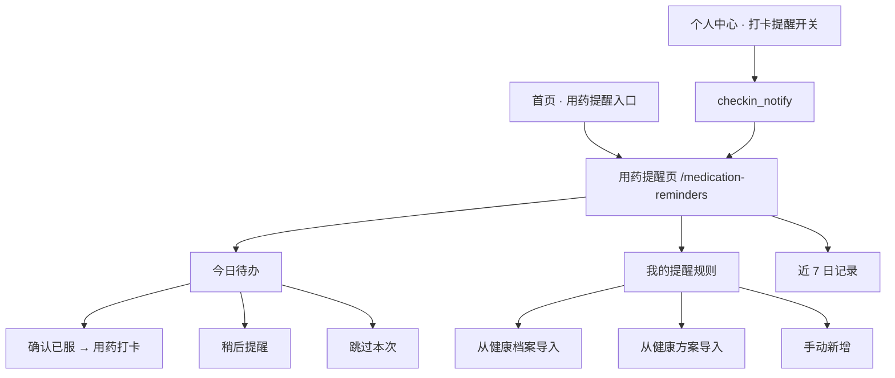
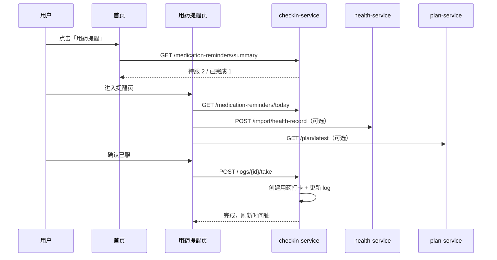

# 用药提醒模块产品设计说明书

| 项目 | 说明 |
|------|------|
| 文档版本 | v1.0 |
| 编写日期 | 2026-06-30 |
| 关联服务 | `checkin-service`（主）、`health-service`（档案导入）、`plan-service`（方案导入）、`user-service`（通知开关） |
| 关联库 | `DIABETES_CHECKIN`（提醒规则与日志）、`DIABETES_HEALTH`（用药档案）、`DIABETES_PLAN`（方案用药说明） |
| 关联页面 | `frontend/src/views/Home/index.vue`、`frontend/src/views/MedicationReminders/`（待建）、`frontend/src/views/CheckinRecords/index.vue` |
| 文档依据 | [可行性研究的前提.md](./可行性研究的前提.md)、[系统详细设计说明书.md](./系统详细设计说明书.md)、[健康打卡模块产品设计说明书.md](./健康打卡模块产品设计说明书.md) |

---

## 1. 背景与问题

### 1.1 业务背景

可行性研究与系统详细设计中均将「用药提醒」「智能提醒推送」列为核心能力：结合用户健康数据生成个性化方案时包含用药说明，并在未打卡时段推送提醒，降低漏服风险。

### 1.2 当前实现

首页「快捷服务」中存在「用药提醒」入口，但与生活打卡共用同一路由 `/checkin-records`：

```javascript
// frontend/src/views/Home/index.vue
{
  path: '/checkin-records',
  label: '用药提醒',
  desc: '定时提醒，不再漏服药物',
  action: '设置提醒',
  requireAuth: true,
}
```

用户点击后进入生活打卡页，仅可使用**用药打卡**（选药、填剂量、标记已服），缺少以下能力：

- 定时提醒规则（几点、哪几种药、重复周期）
- 今日待办 / 已完成 / 漏服状态视图
- 到点通知与一键确认已服闭环
- 与健康档案、健康方案的联动导入

### 1.3 设计目标

| 目标 | 说明 |
|------|------|
| 按时提醒 | 在设定时间点提醒用户服药 |
| 一键闭环 | 提醒 → 确认已服 → 自动写入用药打卡记录 |
| 数据打通 | 从健康档案、健康方案导入，减少重复录入 |
| 依从性可视 | 展示今日完成率、近 7 日漏服情况 |

---

## 2. 与现有系统的关系

### 2.1 可复用能力

| 模块 | 已有能力 | 与本模块关系 |
|------|----------|--------------|
| **健康档案** | `HEALTH_RECORD_MEDICATIONS`（药名、剂量、频次、状态） | 提醒规则的数据来源，支持批量导入 |
| **健康方案** | `HEALTH_PLANS.MEDICATION_NOTE` 文本说明 | 可引导用户手动/半自动创建提醒 |
| **用药打卡** | `POST /api/v1/checkin/medication`、`MEDICATION_PRESETS` | 「确认已服」时复用打卡 API |
| **个人中心** | `privacy_settings.checkin_notify` | 全局打卡/用药提醒通知开关 |
| **打卡分析** | AI 输出「设置用药提醒，避免漏服」 | 可跳转至本模块并引导配置 |

### 2.2 与健康打卡模块的边界

[健康打卡模块产品设计说明书.md](./健康打卡模块产品设计说明书.md) §1.2 曾将「打卡提醒、个人中心联动」列为该文档**不包含**的范围。本文档专门承接该能力，并与用药打卡 Tab 通过「确认已服 → 写入打卡流水」衔接，不重复实现打卡录入 UI。

| 能力 | 用药提醒模块 | 用药打卡（CheckinRecords） |
|------|--------------|----------------------------|
| 定时规则 | ✅ 管理提醒时间与周期 | ❌ |
| 到点提醒 | ✅ | ❌ |
| 事后补录用药 | 通过「确认已服」间接完成 | ✅ 直接选药打卡 |
| 预设药品库 | 引用 `drug_id` | ✅ 选用预设 |
| 积分/成就 | 不写入 | 沿用现有逻辑 |

---

## 3. 信息架构



---

## 4. 功能设计

### 4.1 首页入口改造

| 项 | 设计 |
|----|------|
| 路由 | `/medication-reminders`（独立页面，不再跳转 `/checkin-records`） |
| 卡片展示（已登录） | 展示「今日待服 N / 已完成 M」；无规则时展示「去设置」 |
| 角标 | 有待服项时显示数字角标或红点 |
| 未登录 | 跳转登录，登录后回跳提醒页 |

### 4.2 用药提醒页（核心页面）

路由：`/medication-reminders`  
布局：单页三段（Tab 或纵向分区）

#### 4.2.1 今日时间轴（默认视图）

按 `SCHEDULE_TIME` 升序展示当日所有提醒实例：

```text
08:00  二甲双胍 0.5g     [待服]  [确认已服]  [稍后 10 分钟]
12:30  阿卡波糖 50mg     [已完成 ✓ 08:02 打卡]
20:00  二甲双胍 0.5g     [待服]
```

| 操作 | 行为 |
|------|------|
| **确认已服** | 调用 `POST /logs/{logId}/take`：内部创建用药打卡记录，更新 log 为「已服」，刷新时间轴 |
| **稍后提醒** | log 状态改为 `snoozed`，前端/服务端在 10 或 30 分钟后再次触发通知（P1） |
| **跳过本次** | log 状态改为 `skipped`，不计入完成，保留记录 |

**状态枚举：**

| 状态码 | 名称 | 说明 |
|--------|------|------|
| 0 | pending | 待服 |
| 1 | done | 已服（已关联打卡 ID） |
| 2 | skipped | 用户主动跳过 |
| 3 | missed | 超时未操作（超过提醒时间 + 30 分钟） |
| 4 | snoozed | 稍后提醒中 |

#### 4.2.2 提醒规则管理

每条规则字段：

| 字段 | 类型 | 必填 | 说明 | 示例 |
|------|------|------|------|------|
| drug_name | string | 是 | 药品名称 | 二甲双胍 |
| drug_id | string | 否 | 关联 `MEDICATION_PRESETS` | med_metformin |
| dosage | string | 是 | 剂量 | 0.5g |
| reminder_times | string[] | 是 | 每日提醒时间点 | `["08:00","20:00"]` |
| weekdays | int[] | 是 | 重复周期，周一=1 … 周日=7 | `[1,2,3,4,5,6,7]` |
| enabled | boolean | 是 | 是否启用 | true |
| source_type | int | 是 | 1 手动 / 2 健康档案 / 3 健康方案 | 2 |
| source_ref_id | string | 否 | 来源记录 ID | 档案 medication_id |

**导入流程：**

1. **从健康档案导入**
   - 调用 `health-service` 获取 `STATUS=1`（在用）的用药明细
   - 按 `FREQUENCY_DESC` 尝试解析默认提醒时间；解析失败则进入编辑页由用户手动选择时间
   - 去重：同一用户同一 `drug_name + dosage` 已存在启用规则时提示合并或跳过

2. **从健康方案导入（P1.5）**
   - 读取 `plan.medication_note` 文本
   - MVP 阶段展示文本，用户点击「复制为提醒」后手动编辑时间与剂量
   - 后续可接入 NLP/规则解析自动拆分多条规则

3. **手动新增**
   - 支持从 `MEDICATION_PRESETS` 选择或完全自定义

#### 4.2.3 依从性概览

- 今日完成率：`已完成 / 应服次数`
- 近 7 日漏服天数
- 入口：「查看打卡记录」→ `/checkin-records?tab=medication`

---

## 5. 数据模型

建议在 `DIABETES_CHECKIN` 库（`checkin-service`）新增以下表，并写入 `db/init.sql`。

### 5.1 提醒规则表 `MEDICATION_REMINDERS`

```sql
CREATE TABLE MEDICATION_REMINDERS (
    REMINDER_ID      VARCHAR(32)  PRIMARY KEY COMMENT '提醒规则ID',
    USER_ID          VARCHAR(32)  NOT NULL COMMENT '用户ID',
    DRUG_NAME        VARCHAR(100) NOT NULL COMMENT '药品名称',
    DRUG_ID          VARCHAR(32)  DEFAULT NULL COMMENT '关联预设药品ID',
    DOSAGE           VARCHAR(50)  NOT NULL COMMENT '剂量',
    REMINDER_TIMES   JSON         NOT NULL COMMENT '提醒时间点，如 ["08:00","20:00"]',
    WEEKDAYS         JSON         NOT NULL COMMENT '重复周几，周一=1，如 [1,2,3,4,5,6,7]',
    ENABLED          TINYINT      DEFAULT 1 COMMENT '1启用 0停用',
    SOURCE_TYPE      TINYINT      DEFAULT 1 COMMENT '1手动 2健康档案 3健康方案',
    SOURCE_REF_ID    VARCHAR(32)  DEFAULT NULL COMMENT '来源记录ID',
    IS_DELETED       TINYINT      DEFAULT 0 COMMENT '逻辑删除',
    CREATED_AT       DATETIME     DEFAULT CURRENT_TIMESTAMP,
    UPDATED_AT       DATETIME     DEFAULT CURRENT_TIMESTAMP ON UPDATE CURRENT_TIMESTAMP,
    INDEX IDX_USER (USER_ID, IS_DELETED, ENABLED)
) ENGINE=InnoDB DEFAULT CHARSET=utf8mb4 COLLATE=utf8mb4_unicode_ci COMMENT='用药提醒规则';
```

### 5.2 提醒实例日志表 `MEDICATION_REMINDER_LOGS`

```sql
CREATE TABLE MEDICATION_REMINDER_LOGS (
    LOG_ID           VARCHAR(32)  PRIMARY KEY COMMENT '日志ID',
    REMINDER_ID      VARCHAR(32)  NOT NULL COMMENT '规则ID',
    USER_ID          VARCHAR(32)  NOT NULL COMMENT '用户ID',
    SCHEDULE_DATE    DATE         NOT NULL COMMENT '计划日期',
    SCHEDULE_TIME    TIME         NOT NULL COMMENT '计划时间',
    STATUS           TINYINT      DEFAULT 0 COMMENT '0待服 1已服 2跳过 3漏服 4稍后',
    CHECKIN_ID       VARCHAR(32)  DEFAULT NULL COMMENT '关联用药打卡ID',
    COMPLETED_AT     DATETIME     DEFAULT NULL COMMENT '完成时间',
    CREATED_AT       DATETIME     DEFAULT CURRENT_TIMESTAMP,
    UPDATED_AT       DATETIME     DEFAULT CURRENT_TIMESTAMP ON UPDATE CURRENT_TIMESTAMP,
    UNIQUE KEY UK_SCHEDULE (REMINDER_ID, SCHEDULE_DATE, SCHEDULE_TIME),
    INDEX IDX_USER_DATE (USER_ID, SCHEDULE_DATE, STATUS),
    FOREIGN KEY (REMINDER_ID) REFERENCES MEDICATION_REMINDERS(REMINDER_ID) ON DELETE CASCADE
) ENGINE=InnoDB DEFAULT CHARSET=utf8mb4 COLLATE=utf8mb4_unicode_ci COMMENT='用药提醒每日实例';
```

### 5.3 日切与懒加载

- **定时任务（推荐）**：每日 00:05 根据 `ENABLED=1` 且 `IS_DELETED=0` 的规则，为每个 `reminder_times × weekdays` 组合生成当日 `MEDICATION_REMINDER_LOGS`
- **懒加载（兜底）**：用户首次打开提醒页或调用 `GET /today` 时，若当日 log 未生成则同步生成

---

## 6. API 设计

**服务**：`checkin-service`  
**前缀**：`/api/v1/checkin/medication-reminders`  
**鉴权**：JWT（与现有打卡 API 一致）

| 方法 | 路径 | 说明 |
|------|------|------|
| GET | `/summary` | 首页卡片摘要：`{ pending, done, total, has_rules }` |
| GET | `/today` | 今日待办列表 + 统计 |
| GET | `/` | 提醒规则列表 |
| POST | `/` | 新增规则 |
| PUT | `/{reminderId}` | 更新规则 |
| DELETE | `/{reminderId}` | 删除规则（逻辑删除） |
| POST | `/{reminderId}/toggle` | 启用/停用 |
| POST | `/import/health-record` | 从健康档案批量导入 |
| POST | `/import/plan` | 从最新健康方案引导导入（P1.5） |
| POST | `/logs/{logId}/take` | 确认已服（内部调用药打卡 + 更新 log） |
| POST | `/logs/{logId}/snooze` | 稍后提醒 |
| POST | `/logs/{logId}/skip` | 跳过本次 |
| GET | `/stats?days=7` | 近 N 日依从性统计 |

### 6.1 `GET /today` 响应示例

```json
{
  "code": 200,
  "data": {
    "date": "2026-06-30",
    "total": 3,
    "pending": 1,
    "done": 1,
    "missed": 1,
    "items": [
      {
        "log_id": "mrl_001",
        "reminder_id": "mr_001",
        "schedule_time": "08:00",
        "drug_name": "二甲双胍",
        "dosage": "0.5g",
        "status": "done",
        "checkin_id": "chk_xxx",
        "completed_at": "2026-06-30T08:02:00"
      }
    ]
  }
}
```

### 6.2 `POST /logs/{logId}/take` 行为

1. 校验 log 归属当前用户且状态为 `pending` 或 `snoozed`
2. 调用现有 `MedicationCheckinService.createCheckin`（`taken=true`）
3. 更新 log：`status=1`，写入 `checkin_id`、`completed_at`
4. 返回更新后的 log 与打卡摘要

---

## 7. 提醒触发机制

### 7.1 Phase 1 — MVP（推荐优先实现）

| 能力 | 实现方式 |
|------|----------|
| 页面内提醒 | 用户停留在站内时，到点弹出 `ElNotification` |
| 浏览器通知 | 使用 `Notification API`，首次进入引导授权 |
| 漏服标记 | 超过计划时间 30 分钟未操作 → 状态更新为 `missed`（前端轮询或服务端定时） |
| 通知开关 | 读取 `privacy_settings.checkin_notify`；关闭时不弹通知，仍可在时间轴手动操作 |

### 7.2 Phase 2 — 服务端推送

| 能力 | 实现方式 |
|------|----------|
| 定时扫描 | `checkin-service` 内 `@Scheduled` 每分钟扫描待提醒 log |
| 推送通道 | WebSocket → App Push → 短信/微信（按基础设施情况拓展） |
| 智能提醒 | 结合打卡分析 AI 结果，对漏服高频用户加强提醒频次或文案 |

---

## 8. 模块联动时序



---

## 9. 前端改造清单

| 文件/模块 | 改动 |
|-----------|------|
| `frontend/src/views/Home/index.vue` | 入口改路由为 `/medication-reminders`；登录后拉 `summary` 显示角标 |
| **新建** `frontend/src/views/MedicationReminders/index.vue` | 提醒主页（时间轴 + 规则 + 统计） |
| **新建** `frontend/src/api/medicationReminder.js` | 封装 §6 API |
| `frontend/src/router/modules/` | 新增路由模块，需登录 |
| `frontend/src/views/CheckinRecords/index.vue` | 用药 Tab 增加「管理提醒」入口（可选） |
| `frontend/src/views/LivingPlans/index.vue` | 用药区块增加「设为提醒」按钮（P1.5） |
| `frontend/src/views/UserCenter/index.vue` | 「打卡提醒」说明文案补充「含用药提醒」 |

---

## 10. 后端改造清单

| 文件/模块 | 改动 |
|-----------|------|
| `db/init.sql` | 新增 §5 两张表 |
| `checkin-service` | 新增 Entity、Mapper、Service、Controller |
| `checkin-service` | 日切定时任务或懒加载生成 log |
| `common` | 可选：`HealthServiceClient` 增加获取用药明细方法（若导入走内部 API） |
| `gateway` | 确认 `/api/v1/checkin/**` 路由已覆盖新路径（通常无需改动） |

---

## 11. 实施分期

| 阶段 | 范围 | 预估工作量 |
|------|------|------------|
| **P0** | 提醒规则 CRUD + 今日时间轴 + 确认已服联动打卡 + 首页独立入口 | 3~4 人日 |
| **P1** | 健康档案导入 + 浏览器通知 + 漏服检测 + 7 日统计 | 2~3 人日 |
| **P2** | 方案导入 + 稍后提醒 + 与 `checkin_notify` 深度联动 | 2 人日 |
| **P3** | 服务端定时推送 / 短信 / 微信（视基础设施） | 另行评估 |

---

## 12. 设计原则

1. **提醒与打卡分离**：提醒页管「什么时候该吃」；打卡页管「吃了什么」——通过「确认已服」桥接，避免重复录入。
2. **不重复造药库**：药品名称与剂量优先复用健康档案与 `MEDICATION_PRESETS`。
3. **MVP 可独立交付**：即使不做站外推送，「今日时间轴 + 手动确认已服」也显著优于当前「跳转打卡页」的体验。
4. **与项目文档对齐**：对应可行性研究中的「用药提醒」「智能提醒推送」；P0/P1 先完成 Web 内闭环，P3 再拓展外部推送通道。

---

## 13. 验收标准（P0）

- [ ] 首页「用药提醒」进入独立页面，不再跳转 `/checkin-records`
- [ ] 用户可新增/编辑/删除/启停提醒规则
- [ ] 今日时间轴正确展示待服/已服/漏服状态
- [ ] 「确认已服」可在 `CHECKIN_MEDICATION_DETAILS` 中产生对应记录
- [ ] 关闭 `checkin_notify` 后不再弹出浏览器/页面内通知（规则与时间轴仍可用）
- [ ] 无提醒规则时展示引导空状态，支持手动新增或从健康档案导入

---

## 14. 修订记录

| 版本 | 日期 | 说明 |
|------|------|------|
| v1.0 | 2026-06-30 | 初稿：现状分析、功能设计、数据模型、API、分期计划 |
