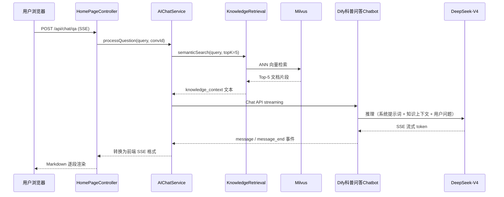

# 科普问答工作流数据契约

本文档定义**科普展示首页 AI 科普问答**所调用的 Dify 应用数据契约，依据 [`模块设计与交互原型设计.md`](./模块设计与交互原型设计.md) **§2.1.1 科普展示首页模块设计类交互模型** 编写。

> 本应用类型为 Dify **Chatbot**（对话型应用，非 Workflow），使用 **Chat API** + `response_mode: streaming`。  
> 由 `home-service` 的 `AIChatService` 代理调用：后端先用 `KnowledgeRetrieval` 从 Milvus 检索 Top-5 片段，再连同用户问题一并传入 Dify。  
> 当前 `home-service` 与前端 `dify.js` 均为占位（501 / Mock），本文档为落地实现与 Dify 编排的契约基准。

---

## 1. 业务场景

| 项目 | 说明 |
|------|------|
| 触发角色 | 用户（登录或未登录均可，见系统详细设计） |
| 调用方 | `AIChatService`（`home-service` 后端） |
| 对外接口 | `POST /api/v1/chat/qa`（SSE 流式） |
| 应用职责 | 基于 Milvus 检索到的权威知识片段，生成 Markdown 科普回答，附带引用来源 |
| 响应模式 | **streaming**（SSE 流式） |
| 对话记忆 | 支持多轮；`conversation_id` 由 Dify 生成或前端/后端传入 |

### 1.1 交互时序（摘自 §2.1.1）



---

## 2. 调用方式

| 项目 | 说明 |
|------|------|
| Dify 接口 | `POST {DIFY_BASE_URL}/v1/chat-messages` |
| 认证 | `Authorization: Bearer {DIFY_QA_API_KEY}` |
| Content-Type | `application/json` |
| Accept | `text/event-stream` |
| 响应模式 | `response_mode: "streaming"`（固定） |
| 应用类型 | Chatbot（开启对话记忆，建议保留最近 10 轮） |

### 2.1 环境变量（规划）

| 变量 | 说明 |
|------|------|
| `DIFY_QA_API_KEY` | 科普问答 Chatbot 应用 API Key |
| `DIFY_BASE_URL` | Dify 服务根地址 |
| `MILVUS_ENABLED` / `MILVUS_HOST` 等 | Milvus 知识库检索（`KnowledgeRetrieval`） |

> 落地时在 `home-service` 的 `application.yml` 增加 `dify.chatbots.qa` 配置，并新增 `DifyQaChatContract.java`（或等价契约类）。

### 2.2 与 Workflow API 的区别

| 项目 | 科普问答（本文档） | 打卡分析 / 风险评估等 |
|------|-------------------|----------------------|
| Dify 产品形态 | **Chatbot** | **Workflow** |
| HTTP 路径 | `/v1/chat-messages` | `/v1/workflows/run` |
| 多轮对话 | `conversation_id` 原生支持 | 一般单次调用 |
| 流式事件 | `message` / `message_end` | `text_chunk` / `workflow_finished` |

---

## 3. 传入数据

### 3.1 Chatbot 入参变量

| 字段 | 位置 | 类型 | 数据来源 | 说明 |
|------|------|------|----------|------|
| `query` | 请求体顶层 | string | **用户输入** | 科普问题原文，≤ 500 字符 |
| `conversation_id` | 请求体顶层 | string | 系统/前端 | 多轮会话 ID；首轮可省略，由 Dify 返回新 ID |
| `user` | 请求体顶层 | string | JWT / 匿名标识 | 用户唯一标识，如 `usr_001` 或 `guest_xxx` |
| `response_mode` | 请求体顶层 | string | 固定 | `"streaming"` |
| `inputs.knowledge_context` | `inputs` 对象 | string | **Milvus 检索** | Top-5 文档片段拼接文本；由 `KnowledgeRetrieval` 写入，**不在 Dify 内二次检索** |

> **不传 `system_prompt`：** 小糖助手角色、免责声明、拒答规则等写在 **Chatbot 系统提示词**（或 LLM 节点系统提示词）中，不作为 `inputs` 变量。

### 3.2 `inputs.knowledge_context` 格式

后端将 Milvus 检索结果拼接为可读文本，建议格式：

```text
【片段1 | 来源: 糖尿病饮食指南.pdf | 相似度: 0.956】
糖尿病患者应控制碳水化合物摄入，优先选择低 GI 食物...

【片段2 | 来源: 中国2型糖尿病防治指南 | 相似度: 0.912】
每日膳食纤维摄入建议 25~30g...
```

也可采用 JSON 字符串（Dify 提示词内解析），但模块设计约定为**拼接文本 string**。

### 3.3 传入数据 JSON Schema（Chatbot `inputs`）

Chatbot 自定义变量 `knowledge_context` 的 Schema（粘贴至 Dify 应用「变量」配置）：

```json
{
  "type": "object",
  "properties": {
    "knowledge_context": {
      "type": "string"
    }
  },
  "required": [],
  "additionalProperties": true
}
```

### 3.4 HTTP 请求体示例（调用 Dify Chat API）

**首轮对话：**

```json
{
  "query": "糖尿病患者可以吃水果吗？哪些水果比较适合？",
  "user": "usr_001",
  "response_mode": "streaming",
  "inputs": {
    "knowledge_context": "【片段1 | 来源: 糖尿病饮食指南.pdf | 相似度: 0.956】\n糖尿病患者可以适量吃水果，但需注意种类、份量与进食时机。推荐低 GI 水果如苹果、梨、柚子...\n\n【片段2 | 来源: 中国2型糖尿病防治指南 | 相似度: 0.912】\n水果应放在两餐之间食用，避免餐后立即大量进食..."
  }
}
```

**多轮对话（携带 conversation_id）：**

```json
{
  "query": "那一顿可以吃多少苹果？",
  "user": "usr_001",
  "conversation_id": "conv_a1b2c3d4",
  "response_mode": "streaming",
  "inputs": {
    "knowledge_context": "【片段1 | 来源: 糖尿病饮食指南.pdf | 相似度: 0.891】\n中等大小苹果（约 150g）可作为一次加餐，建议监测餐后血糖..."
  }
}
```

**curl 示例：**

```bash
curl -N -X POST "https://dify.example.com/v1/chat-messages" \
  -H "Authorization: Bearer app-xxxxxxxxxxxx" \
  -H "Content-Type: application/json" \
  -H "Accept: text/event-stream" \
  -d '{
    "query": "糖尿病患者可以吃水果吗？",
    "user": "usr_001",
    "response_mode": "streaming",
    "inputs": {
      "knowledge_context": "【片段1 | 来源: 糖尿病饮食指南.pdf | 相似度: 0.956】\n糖尿病患者可以适量吃水果..."
    }
  }'
```

### 3.5 对外 API 请求（用户 → 后端）

用户仅提交问题与会话 ID，**不传** `knowledge_context`：

```json
POST /api/v1/chat/qa
Content-Type: application/json

{
  "query": "糖尿病患者可以吃水果吗？",
  "conversationId": "conv_a1b2c3d4"
}
```

| 字段 | 类型 | 必填 | 说明 |
|------|------|------|------|
| `query` | string | 是 | 用户科普问题 |
| `conversationId` | string | 否 | 多轮会话 ID；省略则新建会话 |

---

## 4. Dify 需返回的数据

### 4.1 流式 SSE 事件（Dify Chat API 原生）

**`message` 事件（可多次，逐块返回 `answer`）：**

```json
{
  "event": "message",
  "message_id": "msg_xxxxxxxxxxxx",
  "conversation_id": "conv_a1b2c3d4",
  "answer": "糖尿病患者",
  "created_at": 1718000000
}
```

**`message_end` 事件（本轮结束，含用量与引用）：**

```json
{
  "event": "message_end",
  "message_id": "msg_xxxxxxxxxxxx",
  "conversation_id": "conv_a1b2c3d4",
  "answer": "",
  "created_at": 1718000003,
  "metadata": {
    "usage": {
      "prompt_tokens": 1250,
      "completion_tokens": 380,
      "total_tokens": 1630
    },
    "retriever_resources": [
      {
        "position": 1,
        "dataset_id": "ds_xxx",
        "dataset_name": "糖尿病科普知识库",
        "document_id": "doc_xxx",
        "document_name": "糖尿病饮食指南.pdf",
        "segment_id": "seg_xxx",
        "score": 0.956,
        "content": "糖尿病患者应控制碳水化合物摄入..."
      }
    ]
  }
}
```

**`error` 事件：**

```json
{
  "event": "error",
  "message": "Rate limit exceeded",
  "code": "rate_limit"
}
```

### 4.2 返回字段说明（Dify 原生）

| 字段 | 类型 | 说明 |
|------|------|------|
| `event` | string | `message` / `message_end` / `error` |
| `message_id` | string | 消息唯一 ID |
| `conversation_id` | string | 会话 ID（首轮由 Dify 生成） |
| `answer` | string | Markdown 回答片段；`message` 事件中逐块追加 |
| `created_at` | int | Unix 时间戳 |
| `metadata.usage.prompt_tokens` | int | 提示词 token 数 |
| `metadata.usage.completion_tokens` | int | 生成 token 数 |
| `metadata.usage.total_tokens` | int | 总 token 数 |
| `metadata.retriever_resources[]` | array | 引用来源（若 Chatbot 启用 Dify 知识库时由 Dify 填充；本项目主要由后端 Milvus 检索，此数组可为空或作补充） |
| `metadata.retriever_resources[].position` | int | 引用排序 |
| `metadata.retriever_resources[].score` | float | 相似度 0~1 |
| `metadata.retriever_resources[].content` | string | 引用片段原文 |
| `metadata.retriever_resources[].document_name` | string | 来源文档名 |

### 4.3 后端转发给前端的 SSE 格式

`AIChatService` 将 Dify 事件转换为对外统一格式（§2.1.1 API 设计）：

**文本片段：**

```
event: message
data: {"type":"text","content":"糖尿病患者","conversationId":"conv_a1b2c3d4"}
```

**结束：**

```
event: message_end
data: {"type":"end","conversationId":"conv_a1b2c3d4","metadata":{"sources":["糖尿病饮食指南.pdf","中国2型糖尿病防治指南"],"usage":{"total_tokens":1630}}}
```

| 对外字段 | 来源 |
|----------|------|
| `type: "text"` | Dify `message` 事件的 `answer` 块 |
| `content` | 同上 |
| `conversationId` | Dify `conversation_id` |
| `type: "end"` | Dify `message_end` |
| `metadata.sources[]` | 后端 Milvus 检索结果的文档名列表，或 `retriever_resources[].document_name` |

### 4.4 完整回答示例（拼接后 Markdown）

```markdown
## 糖尿病患者可以吃水果吗？

可以适量食用，但需要**控制种类、份量与时机**：

1. **推荐低 GI 水果**：苹果、梨、柚子、樱桃等
2. **每次份量**：中等大小苹果约 150g，作为两餐间加餐
3. **避免**：果汁、果干、高糖热带水果（如榴莲、荔枝）大量食用

⚠️ 以上内容仅供参考，不能替代专业医生的诊断和治疗建议。如有健康问题，请及时就医。
```

---

## 5. 与业务对象映射

### 5.1 ChatMessageVO

| Dify / 后端字段 | ChatMessageVO | 说明 |
|-----------------|---------------|------|
| `conversation_id` | 会话标识 | 持久化关联 |
| `answer`（完整拼接） | `content`（role=assistant） | 助手消息 |
| 用户 `query` | `content`（role=user） | 用户消息 |
| `created_at` | `timestamp` | 消息时间 |

### 5.2 对话历史 API

`GET /api/v1/chat/history/{conversationId}` 返回：

```json
{
  "code": 200,
  "data": {
    "messages": [
      {
        "role": "user",
        "content": "糖尿病患者可以吃水果吗？",
        "timestamp": "2024-06-10T10:00:00+08:00"
      },
      {
        "role": "assistant",
        "content": "可以适量食用，但需要控制种类...",
        "timestamp": "2024-06-10T10:00:03+08:00"
      }
    ]
  }
}
```

---

## 6. Dify Chatbot 编排建议

1. **应用类型**：Chatbot，模型 DeepSeek-V4（或 DeepSeek-V3）。
2. **系统提示词**：配置「小糖助手」角色（见 `系统详细设计说明书` §4.2.1），包含免责声明与拒答规则。
3. **自定义变量**：仅 `knowledge_context`（String，必填由后端传入）。
4. **对话记忆**：开启，保留最近 10 轮；`conversation_id` 由 Dify 管理。
5. **知识库**：本项目检索在**后端 Milvus** 完成；Dify 内可不挂载知识库，或作兜底二次检索。
6. **安全过滤**：回答后置免责声明；超出科普范围（开处方、确诊）引导「在线咨询」。

### 6.1 系统提示词要点（摘自详细设计）

- 回答须优先基于 `{{knowledge_context}}`；无相关内容时标注「基于通用医学知识」
- 回答 Markdown 排版，控制在约 500 字以内
- 末尾固定免责声明
- 拒答诊断/处方类请求，引导在线问诊

---

## 7. 降级策略（规划）

| 条件 | 行为 |
|------|------|
| 未配置 `DIFY_QA_API_KEY` | 返回预置静态 FAQ 或提示「服务暂不可用」 |
| Milvus 检索无结果 | 仍调用 Dify，`knowledge_context` 传空字符串；回答须标注通用知识来源 |
| Dify 调用失败 | SSE 推送 `type: "error"`，不泄露内部堆栈 |
| `query` 超长或为空 | 400，不调用 Dify |

---

## 8. 相关文档与代码

| 资源 | 路径 |
|------|------|
| 模块设计 §2.1.1 | `docs/模块设计与交互原型设计.md` |
| Prompt 工程 | `docs/系统详细设计说明书.md` §4.2.1 |
| 对外 Chat API | `docs/系统详细设计说明书.md` §6.1.2 |
| 后端占位 | `backend/home-service/.../ChatController.java` |
| 前端 Mock | `frontend/src/api/dify.js` → `difyQaChat()` |
| 后端代理类 Workflow 汇总 | `docs/Dify工作流数据契约.md` §9 |

---

## 9. 变更记录

| 日期 | 说明 |
|------|------|
| 2026-06-28 | 初版，依据 §2.1.1 撰写；明确 Chatbot + Milvus 预检索架构 |
