# 糖尿病智能助手 — 系统架构与数据库设计文档

| 文档版本 | 修订日期   | 说明                         |
| -------- | ---------- | ---------------------------- |
| V1.0     | 2026-07-02 | 基于当前代码库整理的架构文档 |

---

## 目录

- [1. 引言](#1-引言)
- [2. 系统架构](#2-系统架构)
- [3. 功能模块分解](#3-功能模块分解)
- [4. 数据库设计](#4-数据库设计)
- [5. 整体 ER 图](#5-整体-er-图)
- [6. 各模块类图](#6-各模块类图)
- [7. 附录](#7-附录)

---

## 1. 引言

### 1.1 文档目的

本文档基于项目当前实现状态，从架构、数据、模块三个维度对**糖尿病智能助手**系统进行结构化描述，供开发、测试、运维及项目评审使用。

### 1.2 系统定位

本系统是基于 **Spring Cloud 微服务 + Vue 3 前端 + Dify 智能体 + Milvus 向量检索** 的糖尿病预治一体化管理平台，覆盖：

- 健康科普与 AI 问答
- 糖尿病风险预测
- AI 医生在线咨询
- 个性化健康方案生成
- 生活打卡与行为分析
- 健康资讯推荐
- 个人中心与后台管理

### 1.3 技术栈概览

| 层次       | 技术选型                                              |
| ---------- | ----------------------------------------------------- |
| 用户前端   | Vue 3、Vite 6、Element Plus、Pinia、Vue Router、Axios |
| 管理前端   | Vue 3、Vite 6、Element Plus、Markdown-it、ECharts     |
| API 网关   | Spring Cloud Gateway 2023.0.3                         |
| 微服务     | Spring Boot 3.3.5、MyBatis 3.0.3、Java 17             |
| 关系数据库 | MySQL 8.0（分库分表，9 个逻辑库）                     |
| 缓存       | Redis 7.2（打卡统计、资讯推荐缓存）                   |
| 对象存储   | MinIO 8.5（头像、打卡图片、资讯封面、视频等）         |
| 向量数据库 | Milvus 2.4（医学知识库 RAG、资讯语义检索）          |
| AI 编排    | Dify（工作流 + DeepSeek 大模型）                      |
| 部署       | Docker Compose、Nginx 反向代理                        |

---

## 2. 系统架构

### 2.1 总体分层架构

系统采用**四层架构**：表现层 → 业务服务层 → AI 能力层 → 数据存储层。

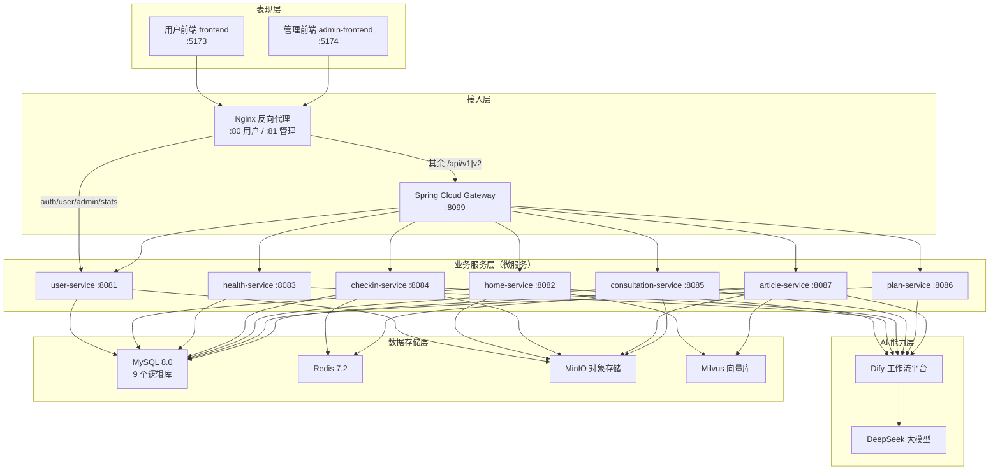

### 2.2 微服务模块与端口

| 模块               | 端口 | 数据库              | 职责概要                                   |
| ------------------ | ---- | ------------------- | ------------------------------------------ |
| `gateway`          | 8099 | —                   | 统一路由、CORS、API 版本分流               |
| `user-service`     | 8081 | DIABETES_USER       | 认证、个人中心、消息中心、管理员统计       |
| `home-service`     | 8082 | DIABETES_RESOURCES  | 首页内容、科普问答 SSE、视频管理           |
| `health-service`   | 8083 | DIABETES_HEALTH     | 健康档案、糖尿病风险预测                   |
| `checkin-service`  | 8084 | DIABETES_CHECKIN    | 生活打卡、打卡分析、打卡提醒               |
| `consultation-service` | 8085 | DIABETES_CONSULTATION | AI 医生问诊、会话与消息管理            |
| `plan-service`     | 8086 | DIABETES_PLAN       | 健康方案生成（SSE）、方案持久化            |
| `article-service`  | 8087 | DIABETES_ARTICLE    | 资讯 CRUD、推荐、向量同步                  |
| `common`           | —    | —                   | 公共库（JWT、Dify 客户端、MinIO、服务间调用） |

### 2.3 请求路由架构

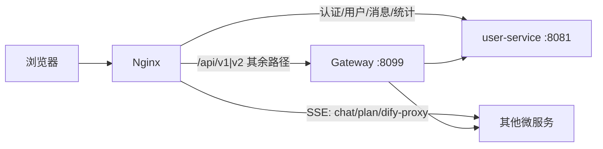

**路由策略说明：**

- 认证相关接口（`/api/v1/auth/**`、`/api/v1/user/**`）经 Nginx 直连 `user-service`，避免网关对 HTTP 特性的兼容问题。
- SSE 长连接接口（科普问答、方案生成）配置长超时、关闭缓冲。
- 同时支持 `/api/v1` 与 `/api/v2` 两套路由，新功能优先使用 v2。

### 2.4 服务间调用关系

各业务服务通过 `common` 模块中的 HTTP Client 进行内部调用，内部接口统一前缀 `/api/v1/internal/**`，使用 `X-Dify-Key` 鉴权。

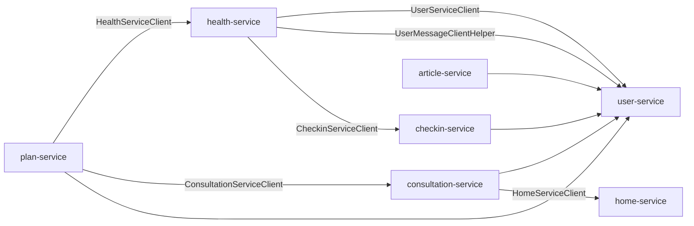

### 2.5 AI 工作流集成架构

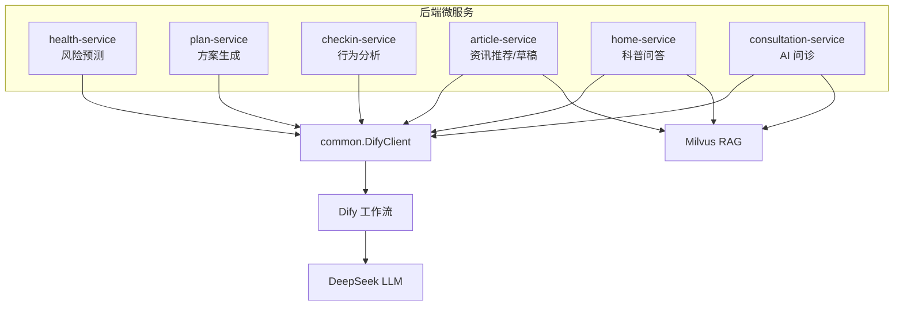

| 业务场景     | 工作流服务           | 是否 RAG |
| ------------ | -------------------- | -------- |
| 糖尿病风险预测 | health-service     | 否       |
| 健康方案生成   | plan-service       | 否       |
| 打卡 AI 分析   | checkin-service    | 否       |
| 资讯个性化推荐 | article-service    | 是（Milvus） |
| 科普 AI 问答   | home-service       | 是（Milvus） |
| AI 医生咨询    | consultation-service | 是（Milvus） |

### 2.6 部署架构

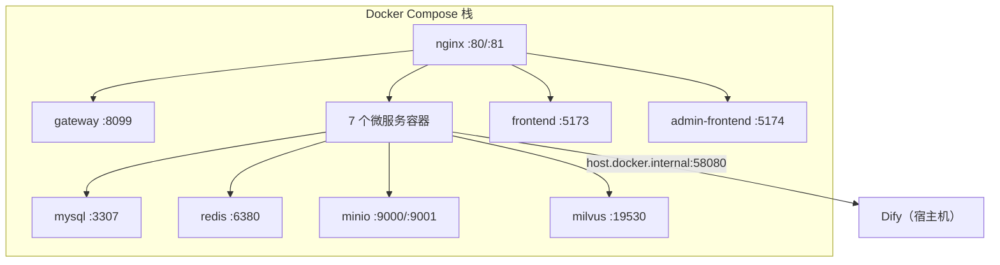

初始化脚本 `db/init.sql` 在 MySQL 首次启动时自动执行，创建 9 个逻辑库及 39 张表。

---

## 3. 功能模块分解

### 3.1 系统功能总览

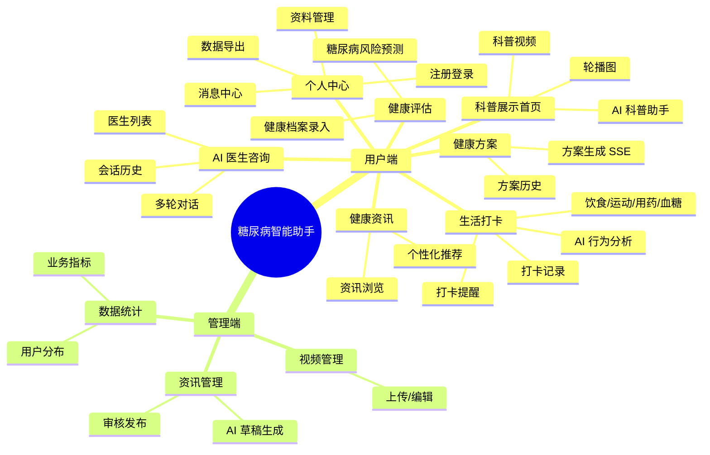

### 3.2 用户端功能模块分解

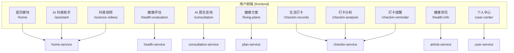

| 前端模块     | 路由前缀                  | 后端服务              | 核心 API 前缀                        |
| ------------ | ------------------------- | --------------------- | ------------------------------------ |
| 首页         | `/home`                   | home-service          | `/api/v2/home/content`               |
| AI 科普助手  | `/assistant`              | home-service          | `/api/v1/chat/qa` (SSE)              |
| 健康评估     | `/health-evaluation`      | health-service        | `/api/v1/risk/**`、`/health-records/**` |
| AI 医生咨询  | `/consultation`           | consultation-service  | `/api/v1/consultations/**`           |
| 健康方案     | `/living-plans`           | plan-service          | `/api/v1/plan/**` (SSE generate)     |
| 生活打卡     | `/checkin-records`        | checkin-service       | `/api/v1/checkin/**`                 |
| 打卡分析     | `/checkin-analysis`       | checkin-service       | `/api/v1/checkin-management/**`      |
| 打卡提醒     | `/checkin-reminder`       | checkin-service       | `/api/v1/checkin/reminder/**`        |
| 健康资讯     | `/health-info`            | article-service       | `/api/v1/articles/**`                |
| 科普视频     | `/science-videos`         | home-service          | `/api/v1/home/media/**`              |
| 个人中心     | `/user-center`            | user-service          | `/api/v1/user/**`、`/user/messages/**` |

### 3.3 管理端功能模块分解

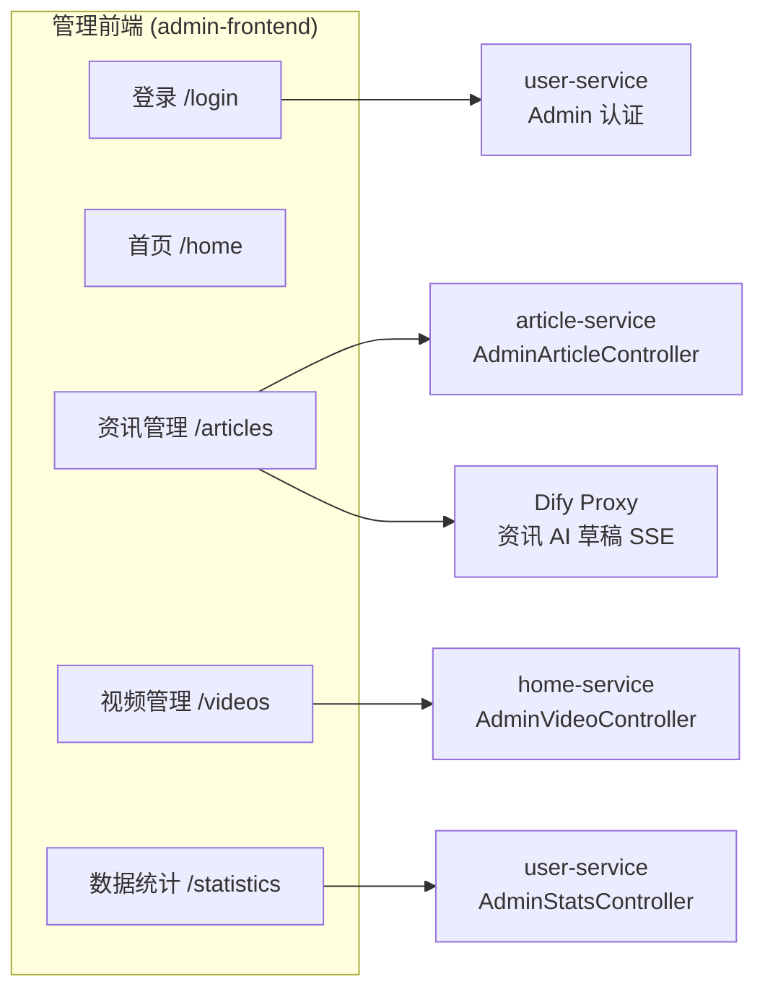

### 3.4 业务闭环流程

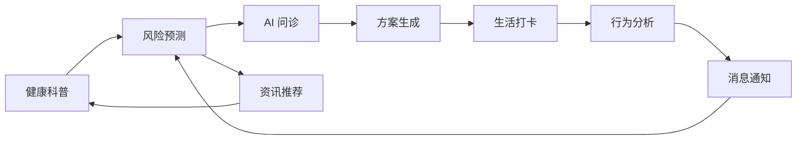

---

## 4. 数据库设计

### 4.1 分库策略

采用**按业务域分库**（Database per Service）策略，共 9 个 MySQL 逻辑库，39 张表。跨库外键使用完全限定名（如 `DIABETES_USER.USERS`）。

| 逻辑库                | 表数量 | 归属服务              | 说明                     |
| --------------------- | ------ | --------------------- | ------------------------ |
| DIABETES_RESOURCES    | 2      | home-service          | 轮播图、科普视频         |
| DIABETES_USER         | 3      | user-service          | 用户、管理员、消息中心   |
| DIABETES_DOCTOR       | 1      | consultation-service  | AI 医生档案              |
| DIABETES_HEALTH       | 7      | health-service        | 健康档案、风险评估       |
| DIABETES_CHECKIN      | 13     | checkin-service       | 打卡、预设、提醒         |
| DIABETES_CONSULTATION | 3      | consultation-service  | 问诊会话与消息           |
| DIABETES_PLAN         | 4      | plan-service          | 健康方案及明细           |
| DIABETES_ARTICLE      | 8      | article-service       | 资讯、推荐、阅读记录     |
| DIABETES_AUDIT        | 1      | （预留，服务已移除）  | 审计日志                 |

> 权威 DDL 来源：`db/init.sql`

### 4.2 核心表设计

#### 4.2.1 DIABETES_USER

| 表名           | 主键        | 说明                                       |
| -------------- | ----------- | ------------------------------------------ |
| USERS          | USER_ID     | 用户账号，含积分、隐私设置、软删除         |
| ADMINS         | ADMIN_ID    | 后台管理员                                 |
| USER_MESSAGES  | MESSAGE_ID  | 消息中心（风险/方案/问诊/打卡分析等通知） |

#### 4.2.2 DIABETES_HEALTH

| 表名                            | 关系                         | 说明               |
| ------------------------------- | ---------------------------- | ------------------ |
| HEALTH_RECORDS                  | USER_ID → USERS              | 健康档案主表       |
| HEALTH_RECORD_MEDICAL_HISTORIES | RECORD_ID → HEALTH_RECORDS   | 既往病史           |
| HEALTH_RECORD_MEDICATIONS       | RECORD_ID → HEALTH_RECORDS   | 用药明细           |
| HEALTH_RECORD_FAMILY_HISTORIES  | RECORD_ID → HEALTH_RECORDS   | 家族病史           |
| RISK_ASSESSMENTS                | HEALTH_RECORD_ID → RECORDS   | 风险评估结果       |
| RISK_ASSESSMENT_FACTORS         | ASSESSMENT_ID → ASSESSMENTS  | 风险因素明细       |
| RISK_ASSESSMENT_SUGGESTIONS     | ASSESSMENT_ID → ASSESSMENTS  | 改善建议明细       |

#### 4.2.3 DIABETES_CHECKIN

| 表名                      | 关系                              | 说明                          |
| ------------------------- | --------------------------------- | ----------------------------- |
| CHECKIN_RECORDS           | USER_ID → USERS                   | 打卡主表（7 种类型）          |
| CHECKIN_DIET_DETAILS      | CHECKIN_ID → RECORDS（1:1）       | 饮食明细                      |
| CHECKIN_EXERCISE_DETAILS  | CHECKIN_ID → RECORDS（1:1）       | 运动明细                      |
| CHECKIN_MEDICATION_DETAILS| CHECKIN_ID → RECORDS（1:1）       | 用药明细                      |
| CHECKIN_GLUCOSE_DETAILS   | CHECKIN_ID → RECORDS（1:1）       | 血糖明细                      |
| CHECKIN_BP_DETAILS        | CHECKIN_ID → RECORDS（1:1）       | 血压明细（Schema 预留）       |
| CHECKIN_WEIGHT_DETAILS    | CHECKIN_ID → RECORDS（1:1）       | 体重明细（Schema 预留）       |
| FOOD_CATEGORIES           | —                                 | 食物分类预设                  |
| FOOD_PRESETS              | CATEGORY_ID → CATEGORIES          | 食物预设                      |
| MEDICATION_PRESETS        | —                                 | 药品预设                      |
| EXERCISE_PRESETS          | —                                 | 运动预设                      |
| CHECKIN_REMINDER_RULES    | USER_ID → USERS                   | 打卡提醒规则                  |
| CHECKIN_REMINDER_LOGS     | RULE_ID → RULES                   | 提醒触达日志                  |

**打卡类型枚举（CHECKIN_TYPE）：** 1=饮食，2=运动，3=用药，4=血糖，5=血压，6=体重，7=复诊

#### 4.2.4 DIABETES_CONSULTATION

| 表名                            | 关系                              | 说明           |
| ------------------------------- | --------------------------------- | -------------- |
| CONSULTATION_SESSIONS           | USER_ID → USERS, DOCTOR_ID → DOCTORS | 问诊会话   |
| CONSULTATION_MESSAGES           | SESSION_ID → SESSIONS             | 会话消息       |
| CONSULTATION_MESSAGE_ATTACHMENTS| MESSAGE_ID → MESSAGES             | 消息附件（预留）|

#### 4.2.5 DIABETES_PLAN

| 表名                      | 关系                                              | 说明         |
| ------------------------- | ------------------------------------------------- | ------------ |
| HEALTH_PLANS              | 关联 USERS、HEALTH_RECORDS、RISK_ASSESSMENTS、SESSIONS | 方案主表 |
| HEALTH_PLAN_DIET_ITEMS    | PLAN_ID → PLANS                                   | 饮食方案明细 |
| HEALTH_PLAN_EXERCISE_ITEMS| PLAN_ID → PLANS                                   | 运动方案明细 |
| HEALTH_PLAN_REST_ITEMS    | PLAN_ID → PLANS                                   | 作息方案明细 |

#### 4.2.6 DIABETES_ARTICLE

| 表名                   | 关系                    | 说明                     |
| ---------------------- | ----------------------- | ------------------------ |
| ARTICLES               | —                       | 资讯主表                 |
| ARTICLE_TAGS           | ARTICLE_ID → ARTICLES   | 标签                     |
| ARTICLE_TARGET_TAGS    | ARTICLE_ID → ARTICLES   | 目标受众标签             |
| ARTICLE_REVIEW_LOGS    | ARTICLE_ID → ARTICLES   | 审核记录                 |
| ARTICLE_USER_READS     | USER_ID + ARTICLE_ID    | 阅读记录                 |
| ARTICLE_EMBEDDINGS     | ARTICLE_ID → ARTICLES   | 向量指纹 / Milvus ID     |
| ARTICLE_RECOMMENDATIONS| USER_ID + ARTICLE_ID    | 个性化推荐缓存           |
| ARTICLE_FAVORITES      | USER_ID + ARTICLE_ID    | 收藏                     |

### 4.3 向量数据库设计（Milvus）

| Collection          | 服务            | 维度 | 主要字段                                              | 用途               |
| ------------------- | --------------- | ---- | ----------------------------------------------------- | ------------------ |
| `diabetes_knowledge`| home-service    | 1024 | id, vector, content, doc_title, doc_source, doc_type  | 医学知识 RAG 问答  |
| `article_knowledge` | article-service | 384  | article_id, category, embedding                       | 资讯语义相似检索   |

MySQL `ARTICLE_EMBEDDINGS` 表作为 Milvus 的元数据桥接，存储 `MILVUS_VECTOR_ID` 与 `TEXT_FINGERPRINT`。

### 4.4 Redis 缓存设计

| Key 模式                                      | 服务            | 用途               |
| --------------------------------------------- | --------------- | ------------------ |
| `diabetes:checkin:today:{userId}:{date}`      | checkin-service | 今日打卡状态       |
| `diabetes:checkin:stats:{userId}:{range}`     | checkin-service | 周/月统计          |
| `diabetes:article:rec:popular:{page}:{size}`  | article-service | 热门推荐           |
| `diabetes:article:rec:user:{userId}:...`      | article-service | 个性化推荐         |
| `diabetes:article:list:{category}:{page}:...` | article-service | 资讯列表           |

### 4.5 MinIO 存储桶

| Bucket       | 用途                         | 示例 Object Key          |
| ------------ | ---------------------------- | ------------------------ |
| profile      | 用户头像                     | `{userId}.jpg`           |
| checkin      | 打卡食物/药品图片            | `food/{foodId}.jpg`      |
| article      | 资讯封面                     | `{articleId}.jpg`        |
| banner       | 轮播图                       | `{bannerId}.jpg`         |
| video / video-cover | 科普视频及封面        | `{videoId}.mp4`          |
| avatar       | AI 医生头像                  | `{doctorId}.jpg`         |
| export       | 用户数据导出文件             | `{taskId}.zip`           |

---

## 5. 整体 ER 图

下图展示跨库核心实体及其关系（虚线表示跨库逻辑外键）。

```mermaid
erDiagram
    USERS ||--o{ USER_MESSAGES : "拥有"
    USERS ||--o{ HEALTH_RECORDS : "拥有"
    USERS ||--o{ CHECKIN_RECORDS : "打卡"
    USERS ||--o{ CONSULTATION_SESSIONS : "发起"
    USERS ||--o{ HEALTH_PLANS : "接收"
    USERS ||--o{ ARTICLE_USER_READS : "阅读"
    USERS ||--o{ ARTICLE_FAVORITES : "收藏"
    USERS ||--o{ ARTICLE_RECOMMENDATIONS : "被推荐"
    USERS ||--o{ CHECKIN_REMINDER_RULES : "配置"

    HEALTH_RECORDS ||--o{ HEALTH_RECORD_MEDICAL_HISTORIES : "包含"
    HEALTH_RECORDS ||--o{ HEALTH_RECORD_MEDICATIONS : "包含"
    HEALTH_RECORDS ||--o{ HEALTH_RECORD_FAMILY_HISTORIES : "包含"
    HEALTH_RECORDS ||--o{ RISK_ASSESSMENTS : "评估"

    RISK_ASSESSMENTS ||--o{ RISK_ASSESSMENT_FACTORS : "因素"
    RISK_ASSESSMENTS ||--o{ RISK_ASSESSMENT_SUGGESTIONS : "建议"

    CHECKIN_RECORDS ||--o| CHECKIN_DIET_DETAILS : "饮食"
    CHECKIN_RECORDS ||--o| CHECKIN_EXERCISE_DETAILS : "运动"
    CHECKIN_RECORDS ||--o| CHECKIN_MEDICATION_DETAILS : "用药"
    CHECKIN_RECORDS ||--o| CHECKIN_GLUCOSE_DETAILS : "血糖"

    FOOD_CATEGORIES ||--o{ FOOD_PRESETS : "分类"
    FOOD_PRESETS ||--o{ CHECKIN_DIET_DETAILS : "引用"

    DOCTORS ||--o{ CONSULTATION_SESSIONS : "接诊"
    CONSULTATION_SESSIONS ||--o{ CONSULTATION_MESSAGES : "消息"
    CONSULTATION_MESSAGES ||--o{ CONSULTATION_MESSAGE_ATTACHMENTS : "附件"

    HEALTH_PLANS ||--o{ HEALTH_PLAN_DIET_ITEMS : "饮食项"
    HEALTH_PLANS ||--o{ HEALTH_PLAN_EXERCISE_ITEMS : "运动项"
    HEALTH_PLANS ||--o{ HEALTH_PLAN_REST_ITEMS : "作息项"

    ARTICLES ||--o{ ARTICLE_TAGS : "标签"
    ARTICLES ||--o| ARTICLE_EMBEDDINGS : "向量"
    ARTICLES ||--o{ ARTICLE_USER_READS : "被阅读"
    ARTICLES ||--o{ ARTICLE_FAVORITES : "被收藏"
    ARTICLES ||--o{ ARTICLE_RECOMMENDATIONS : "被推荐"
    ARTICLES ||--o{ ARTICLE_REVIEW_LOGS : "审核"

    CHECKIN_REMINDER_RULES ||--o{ CHECKIN_REMINDER_LOGS : "触发"

    HEALTH_PLANS }o--|| HEALTH_RECORDS : "关联档案"
    HEALTH_PLANS }o--|| RISK_ASSESSMENTS : "关联评估"
    HEALTH_PLANS }o--|| CONSULTATION_SESSIONS : "关联问诊"

    USERS {
        varchar USER_ID PK
        varchar USERNAME UK
        varchar PASSWORD_HASH
        varchar PHONE
        varchar EMAIL
        int POINTS
        json PRIVACY_SETTINGS
    }

    HEALTH_RECORDS {
        varchar RECORD_ID PK
        varchar USER_ID FK
        decimal BMI
        decimal FASTING_GLUCOSE
        tinyint DIABETES_TYPE
    }

    RISK_ASSESSMENTS {
        varchar ASSESSMENT_ID PK
        varchar USER_ID FK
        varchar HEALTH_RECORD_ID FK
        tinyint RISK_LEVEL
        int RISK_SCORE
    }

    CHECKIN_RECORDS {
        varchar CHECKIN_ID PK
        varchar USER_ID FK
        tinyint CHECKIN_TYPE
        date CHECKIN_DATE
    }

    CONSULTATION_SESSIONS {
        varchar SESSION_ID PK
        varchar USER_ID FK
        varchar DOCTOR_ID FK
        varchar DIFY_CONVERSATION_ID
        tinyint STATUS
    }

    HEALTH_PLANS {
        varchar PLAN_ID PK
        varchar USER_ID FK
        varchar HEALTH_RECORD_ID FK
        varchar RISK_ASSESSMENT_ID FK
        int DAILY_CALORIES
    }

    ARTICLES {
        varchar ARTICLE_ID PK
        varchar TITLE
        mediumtext CONTENT
        tinyint CATEGORY
        tinyint STATUS
    }

    DOCTORS {
        varchar DOCTOR_ID PK
        varchar NAME
        varchar DEPARTMENT
        json SPECIALTIES
    }
```

### 5.1 分库 ER 视图

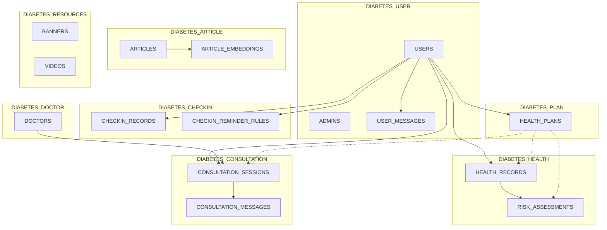

---

## 6. 各模块类图

以下类图基于当前 `src/main/java` 源码，采用经典三层架构：**Controller → Service → Mapper/Entity**，并标注与 `common` 模块及外部系统的依赖。

### 6.1 common 公共模块

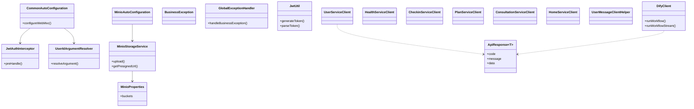

### 6.2 gateway 网关模块

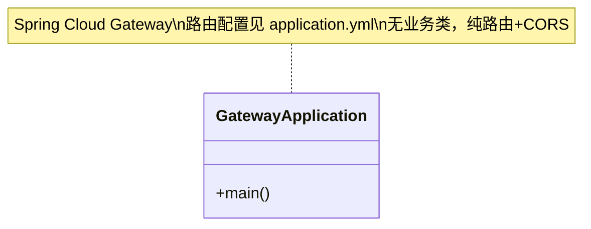

### 6.3 user-service 用户服务

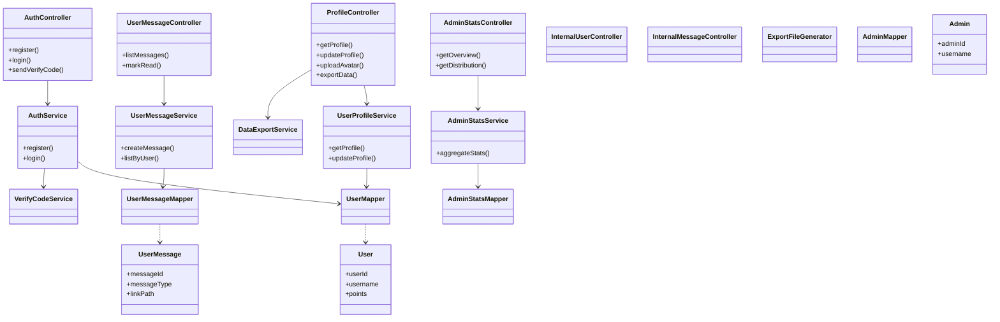

### 6.4 home-service 首页服务

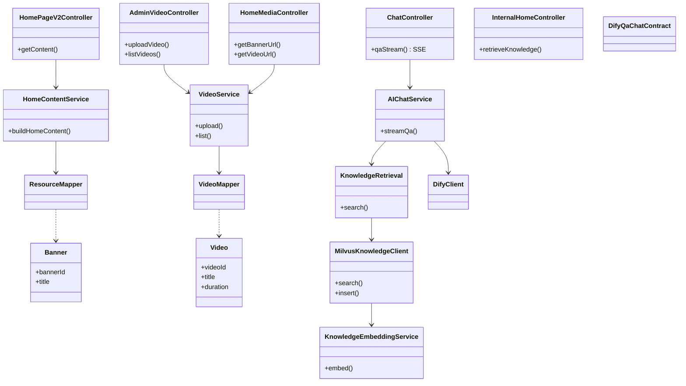

### 6.5 health-service 健康服务

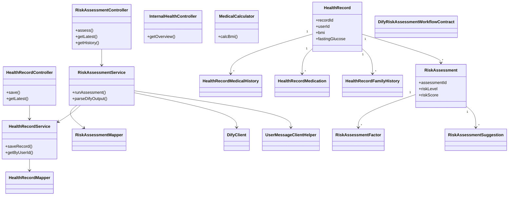

### 6.6 checkin-service 打卡服务

```mermaid
classDiagram
    direction TB

    %% Controller 控制层
    class CheckinController {
        +getTodayStatus()
        +getStats()
    }
    class CheckinModuleController {
        +checkinFood()
        +checkinExercise()
        +checkinMedication()
        +checkinGlucose()
    }
    class CheckinMgmtController {
        +analyze()
        +getAnalysisHistory()
    }
    class CheckinReminderController {
        +getRules()
        +saveRules()
        +snooze()
    }
    class InternalCheckinController {
        +getRecentRecords()
    }

    %% Service 业务层
    class CheckinService {
        +getTodayStatus()
        +getStats()
    }
    class FoodCheckinService
    class ExerciseCheckinService
    class MedicationCheckinService
    class GlucoseCheckinService
    class CheckinMgmtService {
        +analyzeBehavior()
    }
    class CheckinReminderService
    class CheckinPresetService
    class CheckinImageService
    class CheckinRecordWriter

    %% Mapper 数据层
    class CheckinRecordMapper
    class CheckinDietDetailMapper
    class CheckinExerciseDetailMapper
    class CheckinMedicationDetailMapper
    class CheckinGlucoseDetailMapper
    class PresetMapper
    class CheckinReminderRuleMapper
    class CheckinReminderLogMapper

    %% 数据库实体
    class CheckinRecord {
        +checkinId
        +checkinType
        +checkinDate
    }
    class CheckinDietDetail
    class CheckinExerciseDetail
    class CheckinMedicationDetail
    class CheckinGlucoseDetail
    class FoodCategory
    class FoodPreset
    class MedicationPreset
    class ExercisePreset
    class CheckinReminderRule
    class CheckinReminderLog

    %% 外部合约与客户端
    class DifyCheckinAnalysisWorkflowContract
    class DifyClient

    %% Controller 依赖 Service
    CheckinModuleController --> FoodCheckinService
    CheckinModuleController --> ExerciseCheckinService
    CheckinModuleController --> MedicationCheckinService
    CheckinModuleController --> GlucoseCheckinService
    CheckinMgmtController --> CheckinMgmtService
    CheckinReminderController --> CheckinReminderService

    %% Service 内部依赖
    FoodCheckinService --> CheckinRecordWriter
    CheckinRecordWriter --> CheckinRecordMapper
    CheckinMgmtService --> DifyClient
    CheckinService --> CheckinRecordMapper

    %% 主表与明细表 一对一关联（移除全部继承<|--，彻底规避语法错误）
    CheckinRecord "1" -- "1" CheckinDietDetail
    CheckinRecord "1" -- "1" CheckinExerciseDetail
    CheckinRecord "1" -- "1" CheckinMedicationDetail
    CheckinRecord "1" -- "1" CheckinGlucoseDetail

    %% 分类与预设一对多
    FoodCategory "1" -- "*" FoodPreset
```

### 6.7 consultation-service 问诊服务

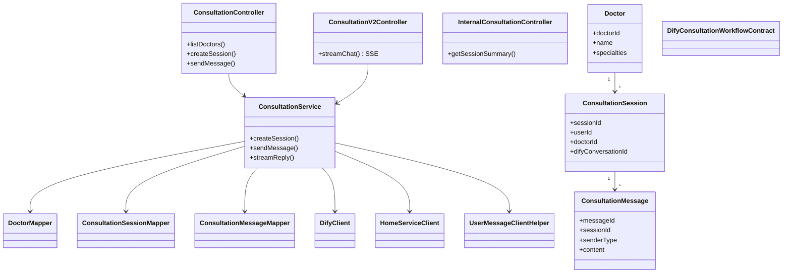

### 6.8 plan-service 方案服务

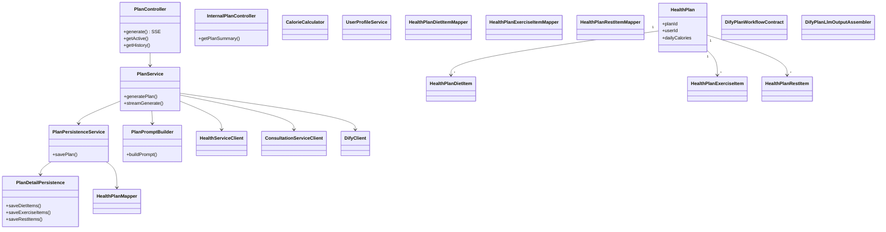

### 6.9 article-service 资讯服务

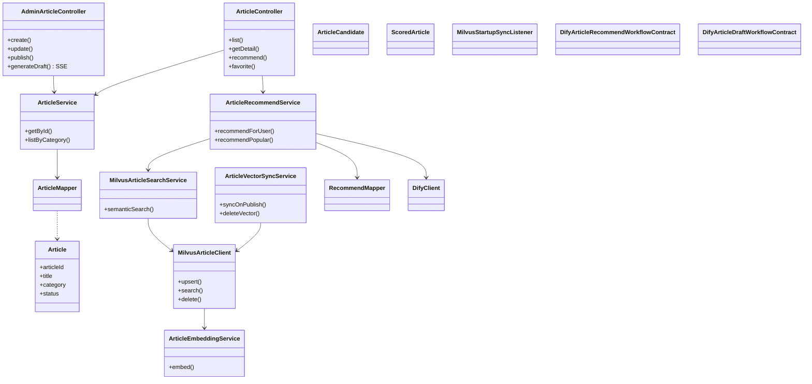

### 6.10 前端模块结构（用户端）

```mermaid
classDiagram
    direction LR

    namespace frontend {
        class Router {
            +beforeEach()
        }
        class AuthStore {
            +token
            +login()
        }
        class ApiClient {
            +request()
        }
    }

    namespace views {
        class HomeView
        class AssistantView
        class HealthEvaluationView
        class ConsultationView
        class LivingPlansView
        class CheckinRecordsView
        class CheckinAnalysisView
        class CheckinReminderView
        class HealthInfoView
        class ScienceVideosView
        class UserCenterView
    }

    namespace api {
        class authApi
        class healthApi
        class checkinApi
        class consultationApi
        class planApi
        class articleApi
        class homeApi
    }

    Router --> views
    views --> api
    api --> ApiClient
    ApiClient --> AuthStore
```

### 6.11 前端模块结构（管理端）

```mermaid
classDiagram
    direction LR

    namespace admin_frontend {
        class AdminRouter
        class AdminAuthStore
        class AdminApiClient
    }

    namespace admin_views {
        class LoginView
        class HomeView
        class ArticlesView
        class VideosView
        class StatisticsView
    }

    namespace admin_api {
        class authApi
        class articleApi
        class videoApi
        class statsApi
    }

    AdminRouter --> admin_views
    admin_views --> admin_api
    admin_api --> AdminApiClient
```

---

## 7. 附录

### 7.1 相关文档索引

| 文档                               | 说明                     |
| ---------------------------------- | ------------------------ |
| `docs/系统详细设计说明书.md`       | 完整 11 章详细设计       |
| `docs/前后端联调调用流程.md`       | 各模块 API 调用链        |
| `docs/大模型技术使用说明.md`       | Dify / Milvus 集成说明   |
| `docs/模块设计与交互原型设计.md`   | 模块设计与原型           |
| `backend/README.md`                | 后端构建与运行指南       |
| `db/init.sql`                      | 数据库初始化脚本（权威） |

### 7.2 Schema 与代码差异说明

以下表已在 `init.sql` 中定义，但当前 Java 代码尚未完整实现对应 Entity/Mapper：

| 表名                            | 状态                         |
| ------------------------------- | ---------------------------- |
| CHECKIN_BP_DETAILS              | Schema 预留，打卡类型 5 未实现 |
| CHECKIN_WEIGHT_DETAILS          | Schema 预留，打卡类型 6 未实现 |
| CONSULTATION_MESSAGE_ATTACHMENTS| Schema 预留                  |
| ARTICLE_TARGET_TAGS             | Schema 预留                  |
| ARTICLE_REVIEW_LOGS             | Schema 预留                  |
| AUDIT_LOGS                      | audit-service 已移除，表保留 |

### 7.3 本地启动参考

```bash
# 基础设施
docker compose up -d mysql redis minio milvus

# 后端微服务
docker compose up -d --build gateway user-service home-service health-service \
  checkin-service consultation-service plan-service article-service

# 完整栈（含前端 + Nginx）
docker compose up -d
```

---

*本文档随代码演进更新，以 `db/init.sql` 与各服务 `src/main/java` 源码为准。*
