# 系统详细设计说明书

## 糖尿病智能助手

---

| 文档版本 | 修订日期   | 修订内容概述         | 修订人 |
| -------- | ---------- | -------------------- | ------ |
| V1.0     | 2026-06-22 | 初稿，完成全部11章节 | AI编写 |

---

## 目录

- [1. 引言](#1-引言)
  - [1.1 编写目的](#11-编写目的)
  - [1.2 项目背景与系统定位](#12-项目背景与系统定位)
  - [1.3 文档适用范围与阅读对象](#13-文档适用范围与阅读对象)
  - [1.4 术语与缩略语定义](#14-术语与缩略语定义)
  - [1.5 参考资料](#15-参考资料)
- [2. 总体设计](#2-总体设计)
  - [2.1 设计原则](#21-设计原则)
  - [2.2 系统整体四层分层架构详细说明](#22-系统整体四层分层架构详细说明)
  - [2.3 全局技术栈选型详解](#23-全局技术栈选型详解)
  - [2.4 系统整体业务流程图](#24-系统整体业务流程图)
  - [2.5 系统运行软硬件环境要求](#25-系统运行软硬件环境要求)
- [3. 功能模块详细设计](#3-功能模块详细设计)
  - [3.1 科普展示首页](#31-科普展示首页)
  - [3.2 医生在线咨询](#32-医生在线咨询)
  - [3.3 糖尿病风险预测（拓展模块）](#33-糖尿病风险预测拓展模块)
  - [3.4 健康方案生成](#34-健康方案生成)
  - [3.5 生活打卡功能](#35-生活打卡功能)
  - [3.6 个人中心管理](#36-个人中心管理)
  - [3.7 打卡信息管理](#37-打卡信息管理)
  - [3.8 健康资讯管理](#38-健康资讯管理)
- [4. AI智能体专项设计](#4-ai智能体专项设计)
  - [4.1 Dify智能体工作流整体设计](#41-dify智能体工作流整体设计)
  - [4.2 各业务场景Prompt工程设计](#42-各业务场景prompt工程设计)
  - [4.3 工具调用机制](#43-工具调用机制)
  - [4.4 DeepSeek大模型调用逻辑与参数配置](#44-deepseek大模型调用逻辑与参数配置)
  - [4.5 医学知识库向量检索对接流程](#45-医学知识库向量检索对接流程)
- [5. 数据设计](#5-数据设计)
  - [5.1 整体E-R图](#51-整体e-r图)
  - [5.2 核心数据库表详细设计](#52-核心数据库表详细设计)
  - [5.3 向量知识库存储结构设计](#53-向量知识库存储结构设计)
  - [5.4 数据字典与数据流转规则](#54-数据字典与数据流转规则)
- [6. 接口详细设计](#6-接口详细设计)
  - [6.1 前端与Dify智能体交互API](#61-前端与dify智能体交互api)
  - [6.2 Dify对接DeepSeek大模型API](#62-dify对接deepseek大模型api)
  - [6.3 知识库检索内部接口](#63-知识库检索内部接口)
  - [6.4 后台管理接口](#64-后台管理接口)
- [7. 安全设计](#7-安全设计)
  - [7.1 用户隐私数据加密存储](#71-用户隐私数据加密存储)
  - [7.2 身份认证与权限分级](#72-身份认证与权限分级)
  - [7.3 AI内容安全校验](#73-ai内容安全校验)
  - [7.4 接口防刷与数据操作留痕](#74-接口防刷与数据操作留痕)
- [8. 性能与扩展性设计](#8-性能与扩展性设计)
  - [8.1 系统响应性能指标](#81-系统响应性能指标)
  - [8.2 并发处理与缓存优化方案](#82-并发处理与缓存优化方案)
  - [8.3 功能扩展机制](#83-功能扩展机制)
- [9. 部署方案设计](#9-部署方案设计)
  - [9.1 私有化部署架构](#91-私有化部署架构)
  - [9.2 分模块部署流程](#92-分模块部署流程)
  - [9.3 环境配置与依赖清单](#93-环境配置与依赖清单)
- [10. 异常与容错设计](#10-异常与容错设计)
  - [10.1 大模型调用失败重试机制](#101-大模型调用失败重试机制)
  - [10.2 知识库检索无结果兜底逻辑](#102-知识库检索无结果兜底逻辑)
  - [10.3 用户数据缺失与输入非法容错处理](#103-用户数据缺失与输入非法容错处理)
- [11. 系统测试要点](#11-系统测试要点)

---

## 1. 引言

### 1.1 编写目的

本文档旨在为**糖尿病智能助手**系统提供完整、规范的详细设计说明，具体目标如下：

1. **指导开发实施**：为前端、后端、AI 工程团队提供明确的技术实现依据，确保各模块按照统一标准高效开发。
2. **保障质量评审**：为测试团队提供功能点、接口、性能、安全等维度的测试参照基准。
3. **支撑项目决策**：为产品经理、项目经理提供系统全貌的技术视图，支撑迭代规划与风险识别。
4. **促进团队协作**：为跨角色（开发、测试、产品、运维）沟通建立统一的术语和技术语言。
5. **满足合规要求**：作为医疗健康类软件的设计档案，满足软件工程文档规范化要求。

### 1.2 项目背景与系统定位

#### 1.2.1 项目背景

糖尿病已成为全球性公共卫生挑战。世界卫生组织数据显示，全球糖尿病患者数量已达数亿并持续攀升。糖尿病引发的并发症（心血管疾病、肾病、失明等）严重威胁患者健康，同时给社会和家庭带来沉重经济负担。在此背景下，如何借助人工智能技术实现糖尿病的早期预警、科学预防和个性化管理，成为医疗健康领域的重要课题。

本项目依托国家推进"健康中国"建设、加强慢性病管理的政策导向，创新性地融合 Dify 智能体编排平台与 DeepSeek 大模型，构建一套面向糖尿病患者的全方位预防与治疗智能管理系统。

#### 1.2.2 系统定位

本系统定位为**基于大模型和智能体技术的糖尿病预治一体化管理平台**，核心价值主张：

- **智能驱动**：以 DeepSeek 大模型为核心推理引擎，实现风险预测、方案生成、智能问诊等复杂 AI 能力。
- **知识加持**：以权威医学知识库为数据底座，确保 AI 输出的专业性与合规性。
- **全链路覆盖**：从健康科普→风险筛查→在线咨询→方案制定→行为打卡→效果追踪，形成患者自我管理的完整闭环。
- **私有化部署**：支持本地/私有云部署，保障医疗数据安全与隐私合规。

### 1.3 文档适用范围与阅读对象

| 阅读对象       | 使用目的                                       | 重点关注章节                         |
| -------------- | ---------------------------------------------- | ------------------------------------ |
| 前端开发工程师 | 理解页面交互逻辑、API 对接方式                  | 第3章、第6章、第2章                  |
| 后端开发工程师 | 理解数据库设计、接口规范、安全方案               | 第5章、第6章、第7章                  |
| AI 工程师      | 理解 Dify 工作流、Prompt 工程、RAG 链路          | 第4章、第10章                        |
| 测试工程师     | 编写测试用例、制定测试策略                      | 第3章、第6章、第10章、第11章         |
| 产品经理       | 理解系统功能边界与技术可行性                     | 第1章、第2章、第3章                  |
| DevOps 工程师  | 部署实施与运维                                  | 第9章、第7章                         |
| 项目评审人员   | 技术方案审查                                    | 全文                                 |

### 1.4 术语与缩略语定义

| 术语/缩略语 | 英文全称                                  | 定义                                                                                     |
| ----------- | ----------------------------------------- | ---------------------------------------------------------------------------------------- |
| Dify        | —                                         | 开源 LLM 应用开发平台，提供可视化工作流编排、智能体构建、知识库管理和插件生态            |
| DeepSeek    | —                                         | 深度求索公司开发的大语言模型，提供 DeepSeek-V3（通用）和 DeepSeek-R1（推理增强）两款模型 |
| LLM         | Large Language Model                      | 大语言模型，基于海量文本训练的 AI 模型                                                   |
| RAG         | Retrieval-Augmented Generation            | 检索增强生成技术，通过检索外部知识库增强大模型回答的准确性与专业性                        |
| Agent       | Intelligent Agent                         | 智能体，具有自主感知、决策和执行能力，可调用工具完成复杂任务                             |
| Prompt      | —                                         | 提示词，用于引导大模型生成特定输出的输入文本                                              |
| 向量数据库  | Vector Database                           | 存储和检索高维向量数据的数据库，用于语义相似度搜索，本项目采用 Milvus                     |
| Embedding   | —                                         | 嵌入向量，将文本映射为高维数值向量的技术                                                  |
| FD          | Frontend Development                      | 前端开发                                                                                 |
| JWT         | JSON Web Token                            | 基于 JSON 的开放标准令牌，用于身份认证                                                   |
| RBAC        | Role-Based Access Control                 | 基于角色的访问控制                                                                       |
| AES         | Advanced Encryption Standard              | 高级加密标准，用于数据加密                                                                |
| SLA         | Service Level Agreement                   | 服务等级协议，定义系统性能指标                                                            |
| API         | Application Programming Interface         | 应用程序编程接口                                                                         |
| CRUD        | Create, Read, Update, Delete              | 数据库基本操作：创建、读取、更新、删除                                                    |
| DevOps      | Development and Operations                | 开发运维一体化方法论                                                                     |

### 1.5 参考资料

| 序号 | 资料名称                                | 版本/日期    | 来源                         |
| ---- | --------------------------------------- | ------------ | ---------------------------- |
| 1    | 《设计概述.txt》                         | 2026-06      | 项目内部需求文档             |
| 2    | 《项目背景.txt》                         | 2026-06      | 项目内部背景文档             |
| 3    | Dify 官方文档                           | v0.15+       | https://docs.dify.ai         |
| 4    | DeepSeek API 文档                       | 2026         | https://platform.deepseek.com |
| 5    | Milvus 向量数据库文档                    | v2.4+        | https://milvus.io/docs       |
| 6    | Vue.js 官方文档                          | v3.x         | https://vuejs.org            |
| 7    | 《健康中国 2030 规划纲要》               | 2016         | 国务院                       |
| 8    | 《中国 2 型糖尿病防治指南》              | 2024 版      | 中华医学会糖尿病学分会       |
| 9    | 《个人信息保护法》                       | 2021         | 全国人大常委会               |
| 10   | 《数据安全法》                           | 2021         | 全国人大常委会               |

---

## 2. 总体设计

### 2.1 设计原则

| 原则编号 | 原则名称     | 说明                                                                                                                              |
| -------- | ------------ | --------------------------------------------------------------------------------------------------------------------------------- |
| P1       | 医疗合规优先 | 所有 AI 生成内容必须附带"仅供参考，不构成诊疗建议"免责声明；严格遵循《中国2型糖尿病防治指南》等权威规范                          |
| P2       | 数据安全至上 | 用户健康数据、问诊记录全链路加密存储（AES-256）与加密传输（HTTPS/TLS 1.3）；遵循《个人信息保护法》最小必要原则                    |
| P3       | 高可扩展性   | 模块化设计，支持新增慢病评估类型、资讯类型、AI 工具；Dify 工作流支持热更新，无需停机                                       |
| P4       | 低耦合协作   | 前端、Dify 智能体层、DeepSeek 模型层、知识库层各层独立部署，通过标准化 API 通信，任一层可独立升级替换                            |
| P5       | 易用性       | 面向非技术用户（中老年糖尿病患者），UI 设计简洁直观，字号/对比度适配，操作路径 ≤ 3 步完成核心功能                               |

### 2.2 系统整体四层分层架构详细说明

#### 2.2.1 架构总览

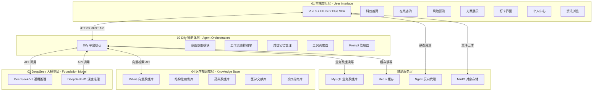

#### 2.2.2 各层职责详述

**第一层：前端交互层（User Interface）**

| 维度         | 说明                                                                                     |
| ------------ | ---------------------------------------------------------------------------------------- |
| 核心职责     | 用户与系统的直接交互界面，提供可视化操作入口，渲染 AI 回答，保障交互流畅性                |
| 技术实现     | Vue 3 + Element Plus + Axios + Pinia 状态管理                                             |
| 关键能力     | 响应式布局（适配 PC/平板/手机）、SSE 流式接收 AI 回答、ECharts 图表渲染、表单校验         |
| 输入         | 用户健康数据、问诊问题、打卡记录、个人信息                                                |
| 输出         | AI 结构化回答、风险报告图表、健康方案卡片、打卡趋势图、资讯流                              |

**第二层：Dify 智能体层（Agent Orchestration）**

| 维度         | 说明                                                                                     |
| ------------ | ---------------------------------------------------------------------------------------- |
| 核心职责     | 系统的"中枢大脑"，承接前端请求，解析用户意图，编排工作流，管理多轮对话记忆，调度外部工具  |
| 关键能力     | 意图识别（问诊 / 风险评估 / 方案生成 / 科普问答）、工具调用（医学计算器、知识库检索）、上下文窗口管理 |
| 工作流类型   | 问诊工作流、风险评估工作流、方案生成工作流、科普问答工作流                                  |
| 对话管理     | Dify Conversation API，维护 session_id 级别对话历史，支持上下文窗口滑动                   |
| 工具注册     | 医学指标计算器（BMI、血糖转换、胰岛素剂量）、知识库检索工具（Milvus 语义检索）               |

**第三层：DeepSeek 大模型层（Foundation Model）**

| 维度       | 说明                                                                                     |
| ---------- | ---------------------------------------------------------------------------------------- |
| 核心职责   | 核心 AI 推理与内容生成，接收 Dify 传递的结构化 Prompt，结合知识库进行深度语义分析            |
| 模型分工   | DeepSeek-V3：常规问诊回答、方案文案生成、资讯摘要；DeepSeek-R1：糖尿病风险推理、复杂病例分析 |
| 关键能力   | 128K 上下文窗口、语义理解、逻辑推理、文本生成、知识关联、自我校正                           |
| 调用方式   | 通过 Dify 模型供应商配置 DeepSeek API Key，由工作流自动路由到对应模型                       |
| 参数配置   | temperature（V3=0.7 / R1=0.3）、max_tokens（动态 512~4096）、top_p（0.9）                   |

**第四层：医学知识库层（Knowledge Base）**

| 维度       | 说明                                                                                     |
| ---------- | ---------------------------------------------------------------------------------------- |
| 核心职责   | 系统的"数据底座"，提供权威、实时医学数据支持，确保 AI 输出专业合规                          |
| 数据构成   | 结构化病例、药典数据（药品说明书/相互作用）、医学文献（PubMed/知网）、诊疗指南（中华医学会） |
| 向量化     | 文档→分段（Chunking，每段 500 token）→BAAI/bge-large-zh-v1.5 Embedding→Milvus Collection |
| 检索方式   | 用户问题向量化→Milvus ANN 搜索→Top-K（K=5）相关文档片段→注入 LLM Context                   |

#### 2.2.3 层间数据流走向

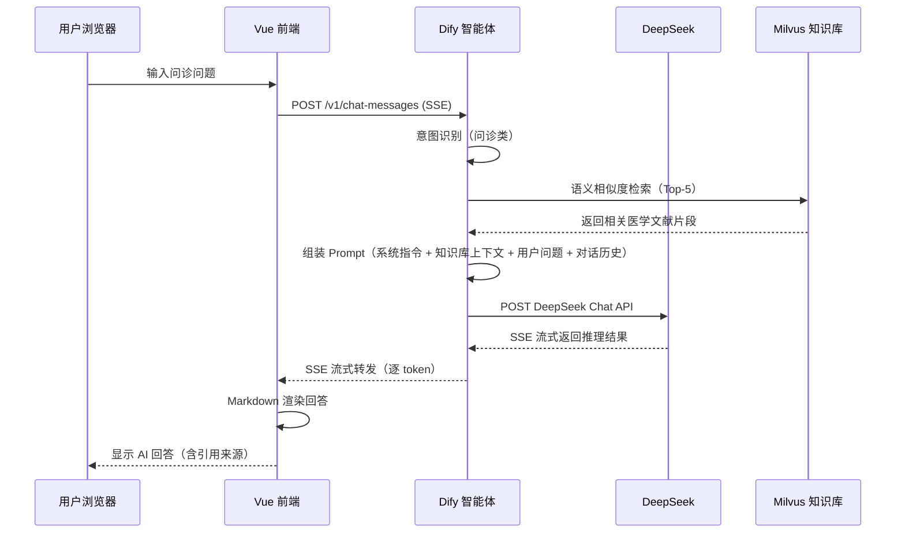

### 2.3 全局技术栈选型详解

| 层次       | 技术组件               | 版本       | 选型理由                                                         |
| ---------- | ---------------------- | ---------- | ---------------------------------------------------------------- |
| 前端       | Vue 3                  | 3.5+       | 渐进式框架，组合式 API，教学友好，生态成熟                        |
|            | Element Plus           | 2.9+       | 成熟的 Vue 3 组件库，医疗项目表单/表格场景丰富                    |
|            | Axios                  | 1.7+       | HTTP 客户端，拦截器机制利于统一鉴权和错误处理                     |
|            | Pinia                  | 2.2+       | Vue 3 官方状态管理，支持模块化                                    |
|            | ECharts                | 5.5+       | 数据可视化，支持风险报告图表和打卡趋势图                          |
|            | Vite                   | 5.4+       | 极速构建工具，HMR 热更新                                         |
| 智能体     | Dify                   | 1.0+       | 可视化工作流编排，知识库集成，插件市场，私有化部署                 |
| 大模型     | DeepSeek-V3            | 2026       | 通用对话推理，128K 上下文，免费商用，API 稳定                     |
|            | DeepSeek-R1            | 2026       | 深度推理增强，医疗风险评估对逻辑一致性要求高                       |
| 向量数据库 | Milvus                 | 2.4+       | 高性能向量检索，支持多种索引类型，社区活跃，与 Dify 原生集成      |
| Embedding  | BAAI/bge-large-zh-v1.5 | —          | 中文语义向量化 SOTA，1024 维度，检索精度高                        |
| 业务数据库 | MySQL                  | 8.0+       | 关系型数据库，ACID 事务保障，生态成熟，运维简便                   |
| 缓存       | Redis                  | 7.2+       | 高性能内存缓存，支持会话管理和热点数据缓存                        |
| 反向代理   | Nginx                  | 1.26+      | 静态资源服务，HTTPS 终结，负载均衡                                |
| 对象存储   | MinIO                  | latest     | S3 兼容，存储用户头像/咨询图片等文件                              |
| 容器化     | Docker + Docker Compose | latest   | 标准化环境，一键部署                                              |
| 开发工具   | VS Code + Cline        | 1.92+      | AI 辅助编程，DeepSeek 集成代码生成                                |
| 运维       | 华为云 CodeArts        | —          | DevOps 全流程管理（可选）                                         |

### 2.4 系统整体业务流程图

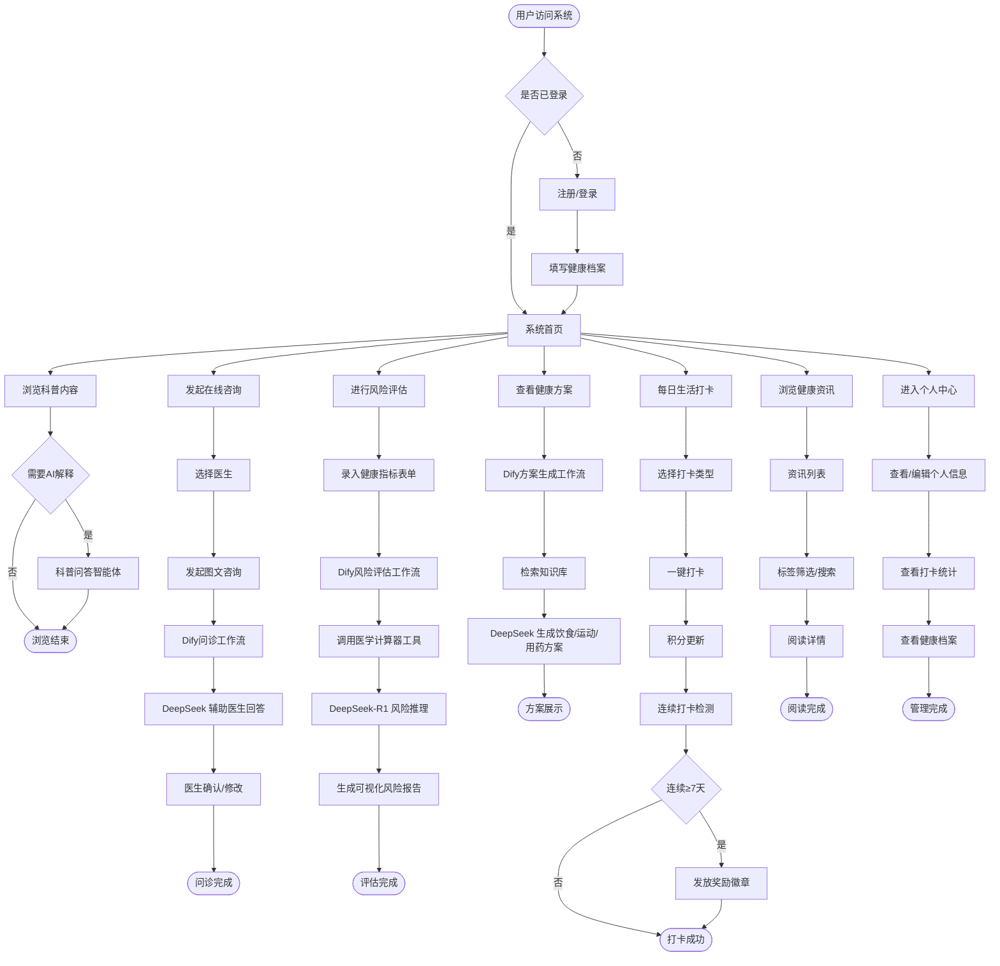

### 2.5 系统运行软硬件环境要求

#### 2.5.1 客户端环境要求

| 项目     | 最低配置                       | 推荐配置                       |
| -------- | ------------------------------ | ------------------------------ |
| 浏览器   | Chrome 90+ / Edge 90+ / Safari 15+ | Chrome 120+                    |
| 操作系统 | Windows 10 / macOS 11 / Android 10 / iOS 15 | Windows 11 / macOS 14         |
| 屏幕分辨率 | 1366×768                      | 1920×1080                      |
| 网络     | 4Mbps 下行                     | 10Mbps 下行                    |

#### 2.5.2 服务端环境要求

| 组件           | CPU                | 内存   | 存储      | GPU（推荐）            | 操作系统       |
| -------------- | ------------------ | ------ | --------- | ---------------------- | -------------- |
| Nginx          | 2 Core             | 2 GB   | 20 GB     | —                      | Ubuntu 22.04   |
| Dify           | 4 Core             | 8 GB   | 50 GB     | —                      | Ubuntu 22.04   |
| Dify Sandbox   | 2 Core             | 4 GB   | 20 GB     | —                      | Ubuntu 22.04   |
| MySQL 8.0      | 4 Core             | 8 GB   | 100 GB    | —                      | Ubuntu 22.04   |
| Redis 7.2      | 2 Core             | 4 GB   | 20 GB     | —                      | Ubuntu 22.04   |
| Milvus 2.4     | 8 Core             | 16 GB  | 200 GB    | NVIDIA A10 × 1（可选） | Ubuntu 22.04   |
| MinIO          | 2 Core             | 4 GB   | 100 GB    | —                      | Ubuntu 22.04   |
| DeepSeek API   | —                  | —      | —         | —（云服务）            | —              |
| **总计（最小）** | 24 Core            | 46 GB  | 510 GB    | —                      | —              |

> **说明**：DeepSeek 模型使用云端 API 调用方式，无需本地 GPU 资源。Milvus 的 GPU 为可选配置，CPU 模式亦可运行，GPU 主要用于加速向量索引构建。

---

## 3. 功能模块详细设计

### 3.1 科普展示首页

#### 3.1.1 模块概述

科普展示首页是用户进入系统后的第一个页面，承载健康科普门户角色。整合权威糖尿病知识、健康百科与疾病常识，以图文、视频等多元形式呈现，为用户提供系统化的健康认知入口。首页同时嵌入智能科普问答入口，支持用户通过自然语言提问获取 AI 即时解答。

#### 3.1.2 业务流程

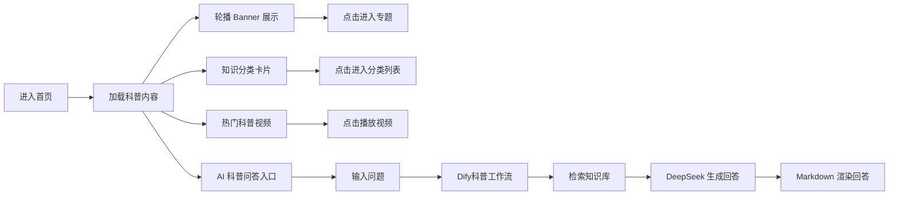

#### 3.1.3 页面交互设计

| 区域         | 组件               | 交互说明                                     |
| ------------ | ------------------ | -------------------------------------------- |
| 顶部导航     | NavBar             | 固定顶部，含 Logo、导航菜单、登录/用户头像入口 |
| Banner 区    | ElCarousel         | 3~5 张科普轮播图，3 秒自动切换               |
| 知识分类区   | ElCard 网格布局    | 糖尿病基础/饮食/运动/用药/并发症 5 大分类     |
| 视频科普区   | Video Player       | 嵌入科普视频，封面点击播放                    |
| AI 问答浮窗  | Floating Button    | 右下角悬浮"AI科普助手"按钮，点击展开对话窗口   |
| AI 对话窗口 | Dialog + Markdown  | 输入框 + 流式渲染 Markdown 回答，显示引用来源  |
| 底部         | Footer             | 版权信息、免责声明、联系方式                   |

#### 3.1.4 输入输出

**输入：**
| 输入项         | 类型   | 说明                       |
| -------------- | ------ | -------------------------- |
| 用户科普问题   | String | 自然语言提问，最大 500 字符 |
| 页面浏览行为   | Event  | 点击、滚动行为数据          |

**输出：**
| 输出项         | 类型         | 说明                               |
| -------------- | ------------ | ---------------------------------- |
| 科普内容列表   | JSON Array   | Banner、分类卡片、视频列表数据      |
| AI 回答        | Markdown     | 包含结构化解释 + 引用来源           |
| 推荐内容       | JSON Array   | 基于用户标签的个性化推荐            |

#### 3.1.5 核心 AI 逻辑

- **意图分类**：Dify 工作流第一步判断问题类型为"科普问答"
- **知识检索**：将用户问题向量化，在 Milvus 知识库中检索 Top-5 相关文档片段
- **回答生成**：DeepSeek-V3 基于检索到的知识上下文生成科普回答，要求引用具体来源
- **安全过滤**：回答后置"仅供参考，不构成医疗建议"声明，过滤超出科普范围的问题（如要求开具处方），引导用户转在线问诊

#### 3.1.6 内部接口

| 接口名称         | 方式 | 路径                                  | 说明                 |
| ---------------- | ---- | ------------------------------------- | -------------------- |
| 获取首页内容     | GET  | /api/home/content                     | 返回 Banner/分类/视频 |
| AI 科普问答      | POST | /api/chat/qa                          | SSE 流式返回回答      |
| 获取推荐内容     | GET  | /api/home/recommend?user_id={id}      | 个性化推荐            |

#### 3.1.7 异常处理

| 异常场景             | 处理策略                                       |
| -------------------- | ---------------------------------------------- |
| 知识库检索无结果     | 基于 DeepSeek 通用知识生成回答，标注"通用知识"  |
| 大模型调用超时       | 前端显示"正在思考中…"，最多等待 30 秒后提示重试 |
| 网络中断             | 自动重连，恢复后重试失败请求                    |
| 用户输入含敏感词     | 返回预设安全提示"请咨询专业医生"                 |

#### 3.1.8 关联其他模块

- **医生在线咨询**：AI 科普问答中检测到需要专业诊断时，推荐跳转在线咨询
- **健康资讯管理**：科普内容来源于资讯管理模块发布的内容库
- **个人中心管理**：用户的科普问答历史记录关联到个人中心

---

### 3.2 医生在线咨询

#### 3.2.1 模块概述

连接专业内分泌科医生资源，提供实时一对一在线问诊服务。支持图文、语音沟通，快速解答用户疑虑，建立高效医患沟通桥梁。AI 智能辅助医生，在医生回复前提供参考建议，提升问诊效率与质量。

#### 3.2.2 业务流程

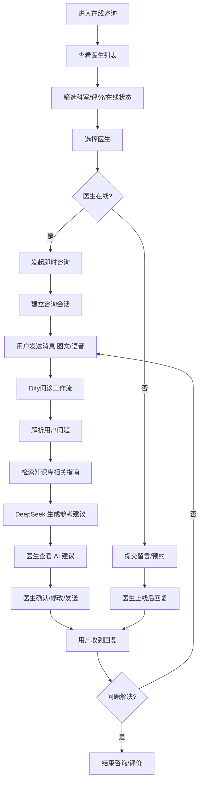

#### 3.2.3 页面交互设计

| 区域           | 组件                   | 交互说明                                     |
| -------------- | ---------------------- | -------------------------------------------- |
| 医生列表页     | ElTable / ElCard 列表  | 头像、姓名、科室、职称、评分、在线状态、咨询次数 |
| 筛选栏         | ElSelect / ElInput     | 按科室筛选、按姓名搜索                        |
| 咨询会话窗口   | ChatPanel（仿微信）    | 消息气泡（左医生/右用户）、时间戳、已读状态    |
| 消息输入区     | Input + Upload         | 文本输入、图片上传（支持病历/检查单拍照）      |
| AI 辅助面板     | Collapse Panel（医生端）| 显示 AI 参考建议，可一键采纳或忽略             |
| 结束咨询       | ElButton + ElRate      | 结束会话按钮 + 五星评分 + 文字评价             |

#### 3.2.4 输入输出

**输入：**
| 输入项         | 类型     | 说明                                 |
| -------------- | -------- | ------------------------------------ |
| 咨询问题文本   | String   | 自然语言描述症状/问题，最大 2000 字符 |
| 上传图片       | File     | jpg/png，最大 10MB，用于上传检查报告   |
| 历史健康档案   | JSON     | 系统自动附带用户基本健康信息           |

**输出：**
| 输出项         | 类型       | 说明                                   |
| -------------- | ---------- | -------------------------------------- |
| 医生回复       | JSON       | 文本 + 图片 URL                        |
| AI 参考建议     | JSON       | 仅医生端可见，含推理依据               |
| 会话状态       | Enum       | active / closed                        |
| 评价结果       | JSON       | 评分 + 文字评价                        |

#### 3.2.5 核心 AI 逻辑

- **症状解析**：Dify 工作流接收用户问题，提取关键症状、持续时间、用药史等结构化信息
- **知识增强**：在医学知识库中检索相关诊疗指南和药物信息
- **建议生成**：DeepSeek-V3 生成面向医生的参考建议，包括：
  - 可能的诊断方向（标注置信度）
  - 建议追问的问题
  - 相关检查推荐
  - 参考治疗策略
- **人工校验**：**AI 建议仅作为医生参考**，最终回复必须经医生确认或修改后才能发送给用户

#### 3.2.6 内部接口

| 接口名称         | 方式   | 路径                            | 说明                   |
| ---------------- | ------ | ------------------------------- | ---------------------- |
| 获取医生列表     | GET    | /api/doctors                    | 支持筛选参数           |
| 创建咨询会话     | POST   | /api/consultations              | 创建新的问诊会话       |
| 发送消息         | POST   | /api/consultations/{id}/messages| 用户/医生发送消息       |
| 获取 AI 建议     | POST   | /api/consultations/{id}/ai-suggest | SSE 流式返回 AI 建议 |
| 获取会话消息列表 | GET    | /api/consultations/{id}/messages| 历史消息列表           |
| 结束会话         | PUT    | /api/consultations/{id}/close   | 结束并评价             |

#### 3.2.7 异常处理

| 异常场景             | 处理策略                                             |
| -------------------- | ---------------------------------------------------- |
| 医生离线             | 提示"医生当前不在线，可留言，医生上线后将回复"       |
| 上传图片过大         | 前端压缩（≤10MB），后端校验，超限提示重新上传          |
| AI 建议生成失败       | 不阻塞医生回复流程，医生可直接回复，后台重试生成建议   |
| 消息发送失败         | 本地缓存草稿，自动重试 3 次，失败后提示用户手动重发    |
| 网络断连             | WebSocket 断线重连机制，恢复后同步离线消息             |

#### 3.2.8 关联其他模块

- **科普展示首页**：科普问答不能解决的问题，推荐跳转在线咨询
- **健康方案生成**：咨询后医生可一键为用户触发生成健康方案
- **个人中心管理**：咨询记录关联到用户个人中心的就诊记录
- **糖尿病风险预测**：咨询中如需风险评估，可跳转风险预测模块

---

### 3.3 糖尿病风险预测（拓展模块）

> **模块标注**：本模块为拓展功能模块，在项目初期作为可选项实现，后续版本中逐步完善。

#### 3.3.1 模块概述

基于大数据与深度学习构建糖尿病风险评估模型，通过用户录入身体指标（血糖、BMI、血压等）与生活习惯（饮食、运动、吸烟饮酒等），智能计算患病概率，生成可视化风险报告，实现疾病的早期预警与干预。

#### 3.3.2 业务流程

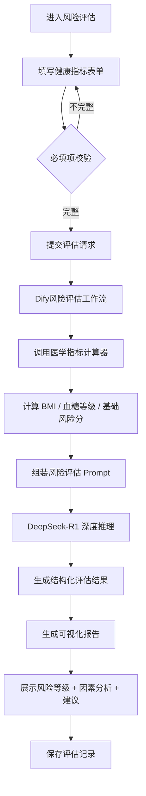

#### 3.3.3 页面交互设计

| 区域         | 组件                     | 交互说明                               |
| ------------ | ------------------------ | -------------------------------------- |
| 指标录入表单 | ElForm + ElInputNumber   | 血糖、身高、体重、血压、年龄等输入项    |
| 生活习惯     | ElRadio / ElCheckbox     | 吸烟、饮酒、运动频率、饮食偏好          |
| 家族病史     | ElSelect                 | 是否有糖尿病家族史                     |
| 提交按钮     | ElButton                 | 提交后显示 Loading 动画                |
| 风险报告     | ECharts 仪表盘 + 雷达图  | 风险等级（低/中/高）+ 各维度因素分析     |
| 建议列表     | ElTimeline               | 按优先级排列的改善建议                  |
| 历史记录     | ElTable                  | 历史评估记录列表，可查看详细报告         |

#### 3.3.4 输入输出

**输入：**
| 字段名         | 类型    | 必填 | 说明                     | 范围/约束         |
| -------------- | ------- | ---- | ------------------------ | ----------------- |
| fasting_glucose| Float   | 是   | 空腹血糖（mmol/L）       | 2.0 ~ 30.0        |
| height         | Float   | 是   | 身高（cm）               | 100 ~ 250         |
| weight         | Float   | 是   | 体重（kg）               | 30 ~ 300          |
| systolic_bp    | Integer | 是   | 收缩压（mmHg）           | 60 ~ 250          |
| diastolic_bp   | Integer | 是   | 舒张压（mmHg）           | 30 ~ 150          |
| age            | Integer | 是   | 年龄                     | 1 ~ 120           |
| gender         | Enum    | 是   | 性别                     | male / female     |
| family_history | Boolean | 是   | 糖尿病家族史             | true / false      |
| smoking        | Enum    | 否   | 吸烟状况                 | never/former/current|
| exercise_freq  | Enum    | 否   | 运动频率                 | none/low/medium/high|
| diet_type      | Enum    | 否   | 饮食偏好                 | balanced/high_fat/high_sugar|

**输出：**
| 字段名         | 类型    | 说明                               |
| -------------- | ------- | ---------------------------------- |
| risk_level     | Enum    | low / medium / high                |
| risk_score     | Integer | 0~100 风险分值                     |
| factors        | Array   | 风险因素列表（含权重）              |
| suggestions    | Array   | 改善建议                           |
| bmi            | Float   | 计算得出的 BMI 值                  |
| glucose_level  | Enum    | normal / prediabetes / diabetes    |
| report_url     | String  | 可视化报告截图 URL                 |

#### 3.3.5 核心 AI 逻辑

- **工具调用**：Dify 工作流首先调用「医学指标计算器」工具，完成 BMI 计算、血糖等级判定、基础风险评分（基于 ADA 糖尿病风险评分表）
- **深度推理**：将工具计算结果与用户全部输入组装 Prompt，调用 DeepSeek-R1（推理增强模型）进行深度分析
- **输出结构化**：要求 R1 输出严格 JSON 格式的结构化评估结果
- **置信度标注**：评估结果标注置信度，对于数据不足的情况提示用户进一步检查

#### 3.3.6 内部接口

| 接口名称         | 方式 | 路径                    | 说明               |
| ---------------- | ---- | ----------------------- | ------------------ |
| 提交风险评估     | POST | /api/risk/assess        | SSE 流式返回结果   |
| 获取评估历史     | GET  | /api/risk/history       | 分页返回评估记录   |
| 获取单次评估详情 | GET  | /api/risk/{id}          | 返回完整评估报告   |

#### 3.3.7 异常处理

| 异常场景           | 处理策略                                           |
| ------------------ | -------------------------------------------------- |
| 输入指标超出范围   | 前端+后端双重校验，超限提示并给出合理范围            |
| 必填项缺失         | 前端表单校验阻止提交，标注未填项                    |
| DeepSeek-R1 超时   | 降级使用 DeepSeek-V3 快速推理，标注"快速评估"        |
| 评估结果置信度低   | 提示"建议到医院进行专业检查以准确评估"               |

#### 3.3.8 关联其他模块

- **健康方案生成**：评估完成后一键跳转生成个性化健康方案
- **个人中心管理**：评估记录存入用户健康档案
- **医生在线咨询**：高风险用户推荐立即咨询医生

---

### 3.4 健康方案生成

#### 3.4.1 模块概述

结合用户健康数据（基础信息、风险评估结果、打卡记录等），智能生成个性化饮食、运动、作息方案。方案内容动态调整，随用户健康数据变化迭代更新，助力用户科学管理日常健康生活。

#### 3.4.2 业务流程

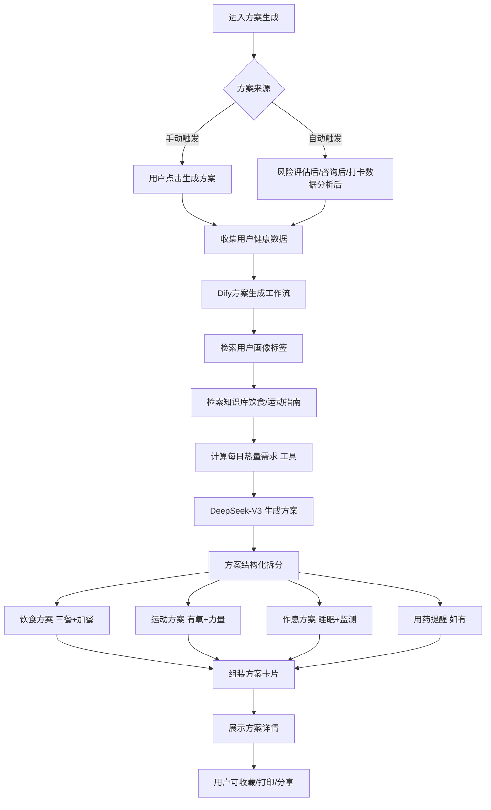

#### 3.4.3 页面交互设计

| 区域         | 组件                   | 交互说明                                   |
| ------------ | ---------------------- | ------------------------------------------ |
| 方案概览卡片 | ElCard + 进度环        | 四大维度（饮食/运动/作息/用药）完成度环形图  |
| 饮食方案     | Timeline + 食物卡片    | 早中晚三餐 + 加餐建议，附热量标注           |
| 运动方案     | ElTable + 图标         | 运动类型、时长、频率、消耗热量              |
| 作息方案     | ElDescriptions         | 起床/就寝时间、午休建议、血糖监测时间        |
| 方案历史     | ElTimeline             | 历史方案版本列表，可对比查看                |
| 操作按钮     | ElButton Group         | 重新生成、收藏、打印、分享                  |

#### 3.4.4 输入输出

**输入：**
| 输入项         | 类型   | 必填 | 说明                               |
| -------------- | ------ | ---- | ---------------------------------- |
| user_id        | String | 是   | 用户唯一标识                       |
| health_profile | JSON   | 是   | 用户健康档案（身高/体重/血糖/血压等）|
| risk_data      | JSON   | 否   | 最新风险评估结果（如有）            |
| checkin_data   | JSON   | 否   | 近期打卡数据（用于动态调整）         |

**输出：**
| 输出项         | 类型   | 说明                               |
| -------------- | ------ | ---------------------------------- |
| diet_plan      | JSON   | 饮食方案（三餐+加餐）               |
| exercise_plan  | JSON   | 运动方案（类型+时长+频率）          |
| rest_plan      | JSON   | 作息方案（睡眠+监测建议）           |
| medication_note| String | 用药提醒（如有）                    |
| daily_calories | Integer| 每日推荐摄入热量                   |
| generated_at   | ISO8601| 生成时间戳                         |
| version        | Integer| 方案版本号                          |

#### 3.4.5 核心 AI 逻辑

- **用户画像构建**：工作流首先从数据库拉取用户健康档案，构建结构化用户画像（年龄、BMI、血糖等级、运动习惯、饮食偏好等）
- **知识检索**：在 Milvus 知识库中检索与用户画像匹配的饮食指南、运动指南、糖尿病管理规范
- **工具计算**：调用「每日热量计算器」工具，基于 Mifflin-St Jeor 公式计算 BMR，结合活动系数得出 TDEE
- **方案生成**：DeepSeek-V3 生成四大维度方案，要求：
  - 饮食方案：具体到食物种类和份量，标注 GI 值和热量
  - 运动方案：区分有氧和力量训练，标注强度和注意事项
  - 作息方案：符合糖尿病患者的血糖监测时间安排
  - 所有建议标注"请在医生指导下执行"

#### 3.4.6 内部接口

| 接口名称         | 方式 | 路径                    | 说明                   |
| ---------------- | ---- | ----------------------- | ---------------------- |
| 生成健康方案     | POST | /api/plan/generate      | SSE 流式返回           |
| 获取最新方案     | GET  | /api/plan/latest        | 返回用户最新方案       |
| 获取方案历史     | GET  | /api/plan/history       | 分页返回历史方案       |
| 收藏方案         | PUT  | /api/plan/{id}/favorite | 标记/取消收藏           |

#### 3.4.7 异常处理

| 异常场景           | 处理策略                                       |
| ------------------ | ---------------------------------------------- |
| 用户健康档案不完整 | 提示补充缺失数据，引导跳转个人中心               |
| 知识库检索无结果   | 使用 DeepSeek 通用营养/运动知识生成方案，标注"通用建议" |
| 方案生成超时       | 前端分阶段展示：先展示热量计算→再展示饮食→运动→作息 |
| 大模型输出格式异常 | 后端 JSON Schema 校验 + 重试（最多 2 次）        |

#### 3.4.8 关联其他模块

- **糖尿病风险预测**：风险评估结果作为方案生成的关键输入
- **生活打卡功能**：打卡数据反馈到方案，用于动态调整
- **个人中心管理**：方案数据存入用户健康档案
- **医生在线咨询**：医生可基于方案给出专业调整建议

---

### 3.5 生活打卡功能

#### 3.5.1 模块概述

设置饮食、运动、用药、血糖监测等打卡维度，支持一键记录每日健康行为。通过积分奖励与连续打卡激励机制，帮助用户建立良好的健康习惯。打卡数据同时作为健康方案动态调整的反馈信号。

#### 3.5.2 业务流程

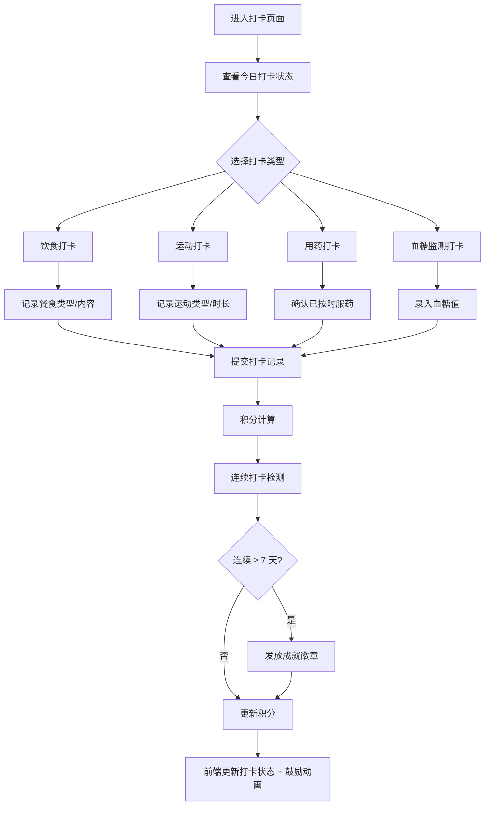

#### 3.5.3 页面交互设计

| 区域         | 组件                   | 交互说明                                 |
| ------------ | ---------------------- | ---------------------------------------- |
| 日期选择     | ElDatePicker / 左右箭头| 切换日期，默认今日                        |
| 打卡类型 Tab | ElTabs                 | 饮食 / 运动 / 用药 / 血糖 四个 Tab       |
| 打卡按钮     | ElButton（大号醒目）   | 点击弹出打卡详情输入框                    |
| 打卡详情弹窗 | ElDialog               | 根据类型不同展示不同表单                  |
| 积分展示     | 数字动画               | 顶部显示总积分，打卡成功后播放加分动画     |
| 成就墙       | ElCard 网格            | 展示已获得的徽章和未解锁徽章（灰色）       |
| 今日完成度   | ElProgress             | 环形进度条，显示今日已打卡项 / 总应打卡项  |

#### 3.5.4 输入输出

**输入：**
| 输入项         | 类型    | 必填 | 说明                               |
| -------------- | ------- | ---- | ---------------------------------- |
| checkin_type   | Enum    | 是   | diet / exercise / medication / glucose |
| checkin_date   | Date    | 是   | 打卡日期，默认当天                 |
| content        | JSON    | 否   | 打卡详细内容（如饮食描述、运动类型等）|
| glucose_value  | Float   | 否   | 血糖值（仅血糖监测打卡时必填）     |

**输出：**
| 输出项         | 类型    | 说明                               |
| -------------- | ------- | ---------------------------------- |
| checkin_id     | String  | 打卡记录唯一 ID                    |
| points_earned  | Integer | 本次获得积分                       |
| total_points   | Integer | 累计总分                           |
| streak_days    | Integer | 连续打卡天数                       |
| achievement    | Object  | 新获得的成就（如有）               |

#### 3.5.5 核心AI逻辑

- **打卡合规检测**：Dify 工作流分析打卡内容合理性（如血糖值是否在合理范围、运动时长是否可信），异常打卡自动标记并提示用户确认
- **智能提醒**：基于用户历史打卡规律，在未打卡时段推送微信/短信提醒（拓展功能）
- **趋势分析**：定期调用 DeepSeek-V3 分析用户打卡趋势，生成简短文字总结（如"您本周运动打卡比上周多2天，继续保持！"）

#### 3.5.6 内部接口

| 接口名称         | 方式   | 路径                    | 说明                 |
| ---------------- | ------ | ----------------------- | -------------------- |
| 创建打卡记录     | POST   | /api/checkin            | 提交打卡             |
| 获取今日打卡状态 | GET    | /api/checkin/today      | 今日已打卡列表       |
| 获取打卡统计     | GET    | /api/checkin/stats      | 周/月统计+积分       |
| 获取成就列表     | GET    | /api/checkin/achievements| 成就墙数据          |
| 打卡趋势分析     | GET    | /api/checkin/trend-analysis | AI 趋势总结      |

#### 3.5.7 异常处理

| 异常场景             | 处理策略                                     |
| -------------------- | -------------------------------------------- |
| 重复打卡             | 同类型同日期只允许一次打卡，提示"今日已打卡" |
| 血糖值异常           | 血糖值 > 20mmol/L 或 < 2mmol/L 时弹窗确认    |
| 网络异常             | 本地暂存打卡数据，网络恢复后同步             |
| 服务器繁忙           | 提示"打卡处理中"，后台异步处理                |

#### 3.5.8 关联其他模块

- **打卡信息管理**：本模块采集数据，打卡信息管理模块负责统计与展示
- **健康方案生成**：打卡数据反馈到方案生成，用于动态调整策略
- **个人中心管理**：积分和成就展示在个人中心主页

---

### 3.6 个人中心管理

#### 3.6.1 模块概述

一站式整合用户基础信息、健康档案、就诊记录与方案数据，支持账户信息修改、隐私设置与数据导出，保障用户数据安全与管理便捷性。

#### 3.6.2 业务流程

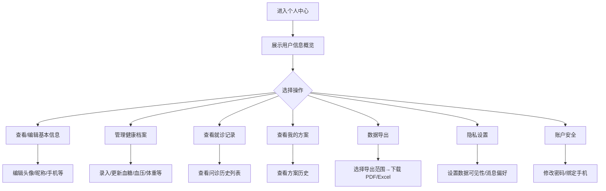

#### 3.6.3 页面交互设计

| 区域         | 组件                   | 交互说明                               |
| ------------ | ---------------------- | -------------------------------------- |
| 个人信息卡片 | ElCard + Avatar        | 头像、昵称、积分、连续打卡天数          |
| 健康档案     | ElDescriptions + Edit  | 身高/体重/BMI/血糖/血压/病史，支持编辑 |
| 功能入口列表 | ElMenu / Cell Group    | 我的方案、就诊记录、数据导出等入口       |
| 设置页面     | ElForm + Switch        | 隐私开关、消息通知开关                  |
| 数据导出     | ElDialog               | 选择导出范围（健康档案/问诊记录/方案）   |

#### 3.6.4 输入输出

**输入：**
| 输入项         | 类型   | 说明                               |
| -------------- | ------ | ---------------------------------- |
| 个人信息修改   | JSON   | 头像、昵称、性别、出生日期等       |
| 健康档案更新   | JSON   | 身高、体重、血糖、血压、病史等     |
| 隐私设置       | JSON   | 各项开关值                         |
| 导出请求       | JSON   | 导出数据类型 + 时间范围             |

**输出：**
| 输出项         | 类型   | 说明                               |
| -------------- | ------ | ---------------------------------- |
| 用户信息       | JSON   | 完整个人信息                       |
| 健康档案       | JSON   | 最新健康指标 + 历史趋势数据         |
| 导出文件       | File   | PDF 或 Excel 格式                  |

#### 3.6.5 核心 AI 逻辑

- **健康趋势总结**：DeepSeek-V3 基于用户历史健康档案数据生成月度健康趋势总结
- **异常指标提醒**：AI 检测到健康指标异常波动时（如血糖持续升高），在个人中心顶部生成预警提示

#### 3.6.6 内部接口

| 接口名称         | 方式 | 路径                    | 说明                 |
| ---------------- | ---- | ----------------------- | -------------------- |
| 获取个人信息     | GET  | /api/user/profile       | 当前用户完整信息     |
| 更新个人信息     | PUT  | /api/user/profile       | 修改基本信息         |
| 更新健康档案     | PUT  | /api/user/health-record | 更新健康指标         |
| 获取就诊记录     | GET  | /api/user/consultations | 分页返回             |
| 数据导出         | POST | /api/user/export        | 异步生成导出文件     |
| 更新隐私设置     | PUT  | /api/user/privacy       | 隐私和通知设置       |

#### 3.6.7 异常处理

| 异常场景           | 处理策略                               |
| ------------------ | -------------------------------------- |
| 头像上传失败       | 压缩重试，超限后提示更换图片            |
| 健康指标输入异常   | 前后端双重校验范围，异常值弹窗确认       |
| 数据导出超时       | 异步生成，完成后短信/消息通知下载        |
| 并发修改冲突       | 乐观锁（version 字段），冲突后提示刷新   |

#### 3.6.8 关联其他模块

- 与所有模块关联，作为用户数据和操作入口的统一枢纽

---

### 3.7 打卡信息管理

#### 3.7.1 模块概述

自动统计用户历史打卡数据，生成周/月度行为趋势图表，直观展示健康行为完成度。支持数据回溯与异常提醒，辅助用户分析行为规律，也可为医生提供患者的依从性参考。

#### 3.7.2 业务流程

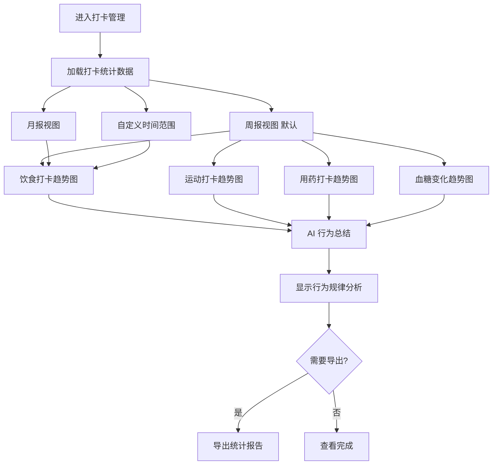

#### 3.7.3 页面交互设计

| 区域           | 组件               | 交互说明                               |
| -------------- | ------------------ | -------------------------------------- |
| 时间筛选       | ElDatePicker       | 支持周/月/自定义范围切换               |
| 趋势图表       | ECharts 折线/柱状图| 四种打卡类型独立趋势图                 |
| 完成率概览     | ElStatistic 统计卡 | 总打卡次数、完成率、连续天数、积分      |
| 打卡日历       | ElCalendar 自定义  | 日历热力图，颜色深浅反映打卡密度        |
| AI 总结面板    | ElAlert + Markdown | AI 生成的行为规律分析文字               |
| 导出按钮       | ElButton           | 导出 PDF/Excel 统计报告                 |

#### 3.7.4 输入输出

**输入：**
| 输入项         | 类型   | 说明                   |
| -------------- | ------ | ---------------------- |
| 时间范围       | Date   | 开始日期 ~ 结束日期    |
| 统计维度       | Enum   | weekly / monthly / custom |

**输出：**
| 输出项         | 类型    | 说明                               |
| -------------- | ------- | ---------------------------------- |
| trend_data     | JSON    | 各类型每天打卡次数/完成率           |
| stats_summary  | JSON    | 总计、完成率、积分、连续天数        |
| calendar_data  | JSON    | 日历热力图数据                     |
| ai_summary     | String  | AI 行为分析总结文字                 |
| export_url     | String  | 导出文件下载 URL                   |

#### 3.7.5 核心 AI 逻辑

- **行为模式识别**：DeepSeek-V3 分析打卡数据的时间分布特征，识别用户最佳打卡时段
- **异常检测**：统计模型检测打卡频率骤然下降的情况，触发提醒
- **建议生成**：基于打卡规律，生成改善建议（如"您通常在晚上运动，但空腹运动可能引起低血糖，建议改为饭后1小时"）

#### 3.7.6 内部接口

| 接口名称         | 方式 | 路径                        | 说明               |
| ---------------- | ---- | --------------------------- | ------------------ |
| 获取打卡统计     | GET  | /api/checkin-management/stats | 时间段统计数据    |
| 获取趋势数据     | GET  | /api/checkin-management/trends | 各类型趋势        |
| 获取 AI 总结     | GET  | /api/checkin-management/ai-summary | AI 行为分析   |
| 导出统计报告     | POST | /api/checkin-management/export | 异步导出           |

#### 3.7.7 异常处理

| 异常场景           | 处理策略                               |
| ------------------ | -------------------------------------- |
| 无打卡数据         | 显示空状态引导"去打卡"，不显示图表      |
| 数据量不足         | 提示"需要至少7天数据才能生成趋势分析"   |
| AI 总结生成失败    | 降级为简单统计文字，不阻塞页面          |

#### 3.7.8 关联其他模块

- **生活打卡功能**：数据来源
- **健康方案生成**：分析结果可用于方案动态调整
- **个人中心管理**：统计摘要展示在个人中心

---

### 3.8 健康资讯管理

#### 3.8.1 模块概述

构建专业内容审核与发布体系，智能推送精准、及时的健康资讯与疾病护理知识。支持按用户标签个性化分发，提升内容触达效率。资讯内容经后台审核后发布，也可由 AI 辅助生成初稿后人工审核。

#### 3.8.2 业务流程

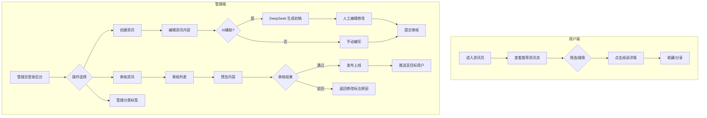

#### 3.8.3 页面交互设计

**用户端：**

| 区域         | 组件                 | 交互说明                         |
| ------------ | -------------------- | -------------------------------- |
| 资讯列表     | ElCard 瀑布流        | 封面图 + 标题 + 摘要 + 发布时间   |
| 分类标签     | ElTag / ElTabs       | 糖尿病基础/饮食/运动/用药/并发症 |
| 搜索栏       | ElInput + Search     | 关键词全文搜索                    |
| 资讯详情     | 文章排版 + 图片      | 支持字体大小调节、收藏、分享      |
| 相关推荐     | ElCard 横滑列表      | 基于当前资讯标签的相关推荐         |

**管理端：**

| 区域         | 组件                 | 交互说明                         |
| ------------ | -------------------- | -------------------------------- |
| 资讯列表     | ElTable              | 标题、作者、状态、发布时间、操作   |
| 资讯编辑器   | 富文本编辑器         | 支持 Markdown、图片上传、标签选择 |
| AI 辅助按钮  | ElButton             | 输入主题自动生成初稿              |
| 审核面板     | ElDialog             | 预览 + 通过/驳回 + 驳回原因       |

#### 3.8.4 输入输出

**输入（创建/编辑资讯）：**
| 字段名       | 类型   | 必填 | 说明             |
| ------------ | ------ | ---- | ---------------- |
| title        | String | 是   | 资讯标题         |
| content      | String | 是   | Markdown 格式内容 |
| cover_image  | String | 否   | 封面图 URL       |
| category     | Enum   | 是   | 分类标签         |
| tags         | Array  | 否   | 关键词标签       |
| target_tags  | Array  | 否   | 目标用户标签     |
| author       | String | 是   | 作者             |
| source       | String | 否   | 来源引用         |

**输出：**
| 字段名       | 类型   | 说明             |
| ------------ | ------ | ---------------- |
| article_id   | String | 资讯唯一 ID      |
| status       | Enum   | draft/review/published/rejected |
| published_at | Date   | 发布时间         |
| view_count   | Integer| 阅读量           |

#### 3.8.5 核心 AI 逻辑

- **AI 辅助生成**：管理员输入主题，DeepSeek-V3 基于知识库生成资讯初稿，包含标题、正文、摘要
- **内容安全审核**：AI 自动检测资讯内容中可能存在的医疗误导、敏感信息、不实陈述，标记风险段落
- **个性化推荐**：基于用户标签（年龄、糖尿病类型、阅读历史），智能排序推荐资讯
- **摘要生成**：自动为长文生成 200 字摘要

#### 3.8.6 内部接口

**用户端：**
| 接口名称         | 方式 | 路径                    | 说明               |
| ---------------- | ---- | ----------------------- | ------------------ |
| 获取推荐资讯     | GET  | /api/articles/recommend | 个性化推荐列表     |
| 获取资讯列表     | GET  | /api/articles           | 分页+分类筛选      |
| 获取资讯详情     | GET  | /api/articles/{id}      | 完整内容           |
| 搜索资讯         | GET  | /api/articles/search    | 关键词搜索         |
| 收藏资讯         | PUT  | /api/articles/{id}/fav  | 收藏/取消收藏      |

**管理端：**
| 接口名称         | 方式   | 路径                        | 说明               |
| ---------------- | ------ | --------------------------- | ------------------ |
| 创建资讯         | POST   | /api/admin/articles         | 新建资讯           |
| 更新资讯         | PUT    | /api/admin/articles/{id}    | 编辑资讯           |
| 删除资讯         | DELETE | /api/admin/articles/{id}    | 删除资讯           |
| 审核资讯         | PUT    | /api/admin/articles/{id}/review | 审核通过/驳回  |
| AI 生成初稿      | POST   | /api/admin/articles/ai-draft | DeepSeek 生成初稿  |

#### 3.8.7 异常处理

| 异常场景           | 处理策略                                   |
| ------------------ | ------------------------------------------ |
| AI 生成内容不合格  | 人工编辑后重新提交，标记 AI 生成部分         |
| 内容审核不通过     | 系统通知作者，附带驳回原因，支持修改后重新提交 |
| 资讯封面图上传失败 | 使用默认封面图，不阻塞发布                   |
| 推荐算法无结果     | 降级为按发布时间倒序展示                     |

#### 3.8.8 关联其他模块

- **科普展示首页**：科普内容来源
- **个人中心管理**：用户收藏夹关联个人中心

---

## 4. AI 智能体专项设计

### 4.1 Dify 智能体工作流整体设计

#### 4.1.1 工作流总览

```mermaid
flowchart TD
    Entry([前端请求]) --> Router{意图路由}
    
    Router -->|科普问答| WF1[科普问答工作流]
    Router -->|在线问诊| WF2[问诊辅助工作流]
    Router -->|风险评估| WF3[风险评估工作流]
    Router -->|方案生成| WF4[方案生成工作流]
    Router -->|通用对话| WF5[通用对话工作流]
    
    subgraph WF1[Workflow-1 科普问答]
        A1[问题预处理] --> A2[知识库检索]
        A2 --> A3{检索命中?}
        A3 -->|是| A4[注入知识上下文]
        A3 -->|否| A5[使用通用知识]
        A4 --> A6[DeepSeek-V3 回答]
        A5 --> A6
        A6 --> A7[添加免责声明]
        A7 --> A8[输出]
    end
    
    subgraph WF2[Workflow-2 问诊辅助]
        B1[症状结构化提取] --> B2[知识库检索 诊疗指南]
        B2 --> B3[检索药物信息]
        B3 --> B4[DeepSeek-V3 生成参考建议]
        B4 --> B5[格式化医生面板数据]
        B5 --> B6[输出建议]
    end
    
    subgraph WF3[Workflow-3 风险评估]
        C1[数据校验] --> C2[调用医学指标计算器 Tool]
        C2 --> C3[BMI/血糖等级/基础风险分]
        C3 --> C4[组装风险评估 Prompt]
        C4 --> C5[DeepSeek-R1 深度推理]
        C5 --> C6[JSON 结构化输出]
        C6 --> C7[生成可视化数据]
        C7 --> C8[输出]
    end
    
    subgraph WF4[Workflow-4 方案生成]
        D1[拉取用户画像] --> D2[检索饮食/运动指南]
        D2 --> D3[调用热量计算器 Tool]
        D3 --> D4[DeepSeek-V3 方案生成]
        D4 --> D5[方案结构化拆分]
        D5 --> D6[输出]
    end
```

#### 4.1.2 工作流详细配置

| 工作流         | Dify 应用类型 | 触发方式     | 关键节点数 | 对话记忆 | 工具调用 |
| -------------- | ------------- | ------------ | ---------- | -------- | -------- |
| 科普问答       | Chatbot       | API / Web    | 7          | 是（10轮）| 知识库检索 |
| 问诊辅助       | Agent         | API          | 6          | 是（会话级）| 知识库检索、药物查询 |
| 风险评估       | Workflow      | API          | 8          | 否       | 医学指标计算器 |
| 方案生成       | Workflow      | API          | 6          | 否       | 热量计算器、知识库检索 |
| 通用对话       | Chatbot       | API          | 4          | 是（5轮） | 知识库检索 |

#### 4.1.3 对话记忆管理策略

- **会话标识**：每个用户会话分配唯一 `conversation_id`（Dify 原生支持）
- **上下文窗口**：保留最近 10 轮对话历史（约 4000 token），超出部分按 FIFO 丢弃
- **关键信息持久化**：将用户关键信息（症状、年龄等）写入 Dify `conversation_variables`，跨轮次可用
- **医生端特殊性**：问诊工作流中，AI 建议仅对医生可见，不混入用户侧的对话记忆

### 4.2 各业务场景 Prompt 工程设计

#### 4.2.1 科普问答 Prompt

```yaml
系统角色设定:
  你是一位专业的糖尿病健康教育师，名叫"小糖助手"。你的任务是用通俗易懂的语言向用户科普糖尿病相关知识。

核心规则:
  1. 回答必须基于【参考知识】中的内容，如果知识库中没有相关内容，请基于你的医学知识回答，但明确标注"此回答基于通用医学知识"。
  2. 回答末尾必须添加："⚠️ 以上内容仅供参考，不能替代专业医生的诊断和治疗建议。如有健康问题，请及时就医。"
  3. 对于超出科普范围的问题（如要求开具处方、诊断具体病情），请婉拒并建议用户使用"在线咨询"功能联系医生。
  4. 回答语言通俗易懂，避免过多专业术语，必要时对术语进行解释。
  5. 使用 Markdown 格式排版，包括标题、列表、加粗重点等。
  6. 回答控制在 500 字以内，重点突出。

用户问题:
  {{user_query}}

参考知识:
  {{knowledge_context}}
```

#### 4.2.2 问诊辅助 Prompt（医生端）

```yaml
系统角色设定:
  你是一位资深内分泌科 AI 助理，你的任务是为医生提供问诊参考建议。你不是直接面对患者，而是辅助医生做出更准确的判断。

核心规则:
  1. 你需要从患者的描述中提取结构化信息：主要症状、持续时间、既往病史、用药情况、生活习惯。
  2. 基于【参考知识】中的诊疗指南和药物信息，给出：
     - 可能的诊断方向（请标注置信度：高/中/低）
     - 建议追问的关键问题（至少3个）
     - 相关检查推荐
     - 参考治疗策略和用药建议
  3. 你的建议仅供医生参考，最终诊断和治疗方案由医生决定。
  4. 如果患者描述的信息不足以做出判断，请在建议中明确指出需要补充的信息。
  5. 使用结构化格式输出，便于医生快速查阅。

患者描述:
  {{patient_description}}

患者健康档案:
  {{patient_health_record}}

对话历史:
  {{conversation_history}}

参考知识:
  {{knowledge_context}}
```

#### 4.2.3 风险评估 Prompt

```yaml
系统角色设定:
  你是一位糖尿病风险评估专家，基于美国糖尿病协会（ADA）和中国2型糖尿病防治指南的风险评估框架，对用户的健康数据进行综合分析。

核心规则:
  1. 你需要综合分析用户的所有指标数据，包括：
     - 空腹血糖值及其对应的血糖等级
     - BMI 值及其对应的体重等级
     - 血压状况
     - 年龄和性别
     - 家族病史
     - 生活习惯（吸烟、饮酒、运动、饮食）
  2. 输出严格的 JSON 格式，字段包括：
     {
       "risk_level": "low/medium/high",
       "risk_score": 0-100,
       "factors": [
         {"name": "因素名称", "level": "高危/中危/低危", "description": "说明", "weight": 0.0-1.0}
       ],
       "suggestions": ["建议1", "建议2", ...],
       "confidence": "high/medium/low"
     }
  3. 如果数据不足以做出高置信度判断，confidence 应为 medium 或 low，并在 suggestions 中建议进一步检查。
  4. 所有结论必须标注科学依据。

工具计算结果:
  {{tool_results}}

用户健康数据:
  {{user_health_data}}
```

#### 4.2.4 健康方案生成 Prompt

```yaml
系统角色设定:
  你是一位注册营养师兼运动康复师，专门为糖尿病患者设计个性化生活方式干预方案。

核心规则:
  1. 基于以下信息制定方案：
     - 用户基础信息：年龄、性别、身高、体重、BMI
     - 糖尿病相关指标：空腹血糖、血糖等级
     - 每日推荐热量：{{daily_calories}} 千卡
     - 运动习惯和偏好
     - 用药情况（如有）
  2. 输出结构化方案，包含四大维度：
     【饮食方案】每日三餐+加餐的具体建议，标注食物份量、GI值、热量
     【运动方案】有氧运动+力量训练的具体计划，标注强度、时长、频率、注意事项
     【作息方案】建议的起床/就寝时间、血糖监测时间点、午休建议
     【特别提醒】用药提醒、低血糖预防、定期复查建议
  3. 方案必须个性化、具体可执行，避免泛泛的建议。
  4. 末尾添加："📋 本方案为AI生成，请在医生或营养师指导下执行。"

用户画像:
  {{user_profile}}

参考指南:
  {{knowledge_context}}

风险评估结果:
  {{risk_assessment}}
```

### 4.3 工具调用机制

#### 4.3.1 工具注册与管理

Dify 平台支持通过「工具」功能注册自定义 API 工具。本项目注册以下工具：

| 工具名称             | 工具标识                | 用途                         | 调用方式 | 超时  |
| -------------------- | ----------------------- | ---------------------------- | -------- | ----- |
| 医学指标计算器       | medical_calculator      | 计算 BMI、血糖等级、基础风险分 | API      | 5s    |
| 热量需求计算器       | calorie_calculator      | 计算每日推荐热量摄入          | API      | 3s    |
| 知识库检索工具       | kb_search               | Milvus 向量语义检索           | 内置     | 3s    |
| 药物信息查询         | drug_query              | 查询药品说明书和相互作用       | API      | 5s    |

#### 4.3.2 医学指标计算器设计

```yaml
工具名称: medical_calculator
调用方式: POST /api/tools/medical-calculator
输入参数:
  height_cm: float       # 身高(cm)
  weight_kg: float       # 体重(kg)
  fasting_glucose: float # 空腹血糖(mmol/L)
  systolic_bp: int       # 收缩压
  diastolic_bp: int      # 舒张压
  age: int               # 年龄
  gender: string         # male/female
  family_history: bool   # 家族史

计算逻辑:
  bmi: weight_kg / ((height_cm / 100) ^ 2)
  bmi_level:
    - < 18.5: underweight
    - 18.5 ~ 23.9: normal
    - 24.0 ~ 27.9: overweight
    - >= 28.0: obese
  glucose_level:
    - < 6.1: normal
    - 6.1 ~ 7.0: prediabetes
    - >= 7.0: diabetes
  bp_level:
    - systolic < 120 AND diastolic < 80: normal
    - systolic 120~139 OR diastolic 80~89: elevated
    - systolic >= 140 OR diastolic >= 90: hypertension
  base_risk_score: 基于 ADA 风险评分表计算 0~100

输出格式:
  {
    "bmi": 24.5,
    "bmi_level": "overweight",
    "glucose_level": "prediabetes",
    "bp_level": "normal",
    "base_risk_score": 45,
    "risk_factors": ["overweight", "prediabetes"]
  }
```

#### 4.3.3 知识库检索工具

```yaml
工具名称: kb_search
集成方式: Dify 知识库原生集成
配置:
  知识库名称: diabetes_kb
  向量数据库: Milvus 2.4
  Embedding 模型: BAAI/bge-large-zh-v1.5
  检索参数:
    top_k: 5
    score_threshold: 0.7
    rerank: true（使用 BGE-Reranker 重排序）
分段策略:
  chunk_size: 500 tokens
  chunk_overlap: 50 tokens
  separator: "\n\n"
```

### 4.4 DeepSeek 大模型调用逻辑与参数配置

#### 4.4.1 模型选择策略

| 场景           | 使用模型      | 选型理由                                 |
| -------------- | ------------- | ---------------------------------------- |
| 科普问答       | DeepSeek-V3   | 通用对话流畅，知识覆盖面广               |
| 问诊辅助       | DeepSeek-V3   | 结构化信息提取和知识关联能力强           |
| 风险评估       | DeepSeek-R1   | 需要深度逻辑推理和多因素综合分析         |
| 方案生成       | DeepSeek-V3   | 长文本生成质量高，结构遵循性好           |
| AI 资讯草稿    | DeepSeek-V3   | 内容创作流畅，信息组织能力强             |
| 复杂病例讨论   | DeepSeek-R1   | 推理链透明，可追溯                       |

#### 4.4.2 参数配置表

| 参数           | DeepSeek-V3        | DeepSeek-R1         | 说明                               |
| -------------- | ------------------ | ------------------- | ---------------------------------- |
| temperature    | 0.7                | 0.3                 | 低温度保证推理一致性               |
| top_p          | 0.9                | 0.9                 | 核采样                             |
| max_tokens     | 2048（动态256~4096）| 4096（动态256~8192） | 根据场景调整                       |
| frequency_penalty | 0.0              | 0.0                 | 不施加频率惩罚                     |
| presence_penalty | 0.0               | 0.0                 | 不施加存在惩罚                     |
| stop_sequences | ["\n\n---", "---"]  | ["\n\n---", "---"]   | 终止序列（如需要）                 |
| stream         | true               | true                | 统一启用流式输出                   |
| timeout        | 30s                | 60s                 | R1 推理时间更长                    |

#### 4.4.3 上下文管理策略

```
上下文窗口分配（以 DeepSeek-V3 128K 为例）：
┌────────────────────────────────────────────────────────────┐
│ System Prompt (系统角色 + 规则)       │ ~800 tokens        │
├────────────────────────────────────────────────────────────┤
│ Knowledge Context (知识库检索结果)    │ ~2000 tokens       │
├────────────────────────────────────────────────────────────┤
│ Conversation History (对话历史)       │ ~4000 tokens       │
├────────────────────────────────────────────────────────────┤
│ User Input (当前用户输入)             │ ~500 tokens        │
├────────────────────────────────────────────────────────────┤
│ Reserved (留给生成输出)               │ ~4096 tokens       │
└────────────────────────────────────────────────────────────┘
总计使用：~11396 tokens，远低于 128K 上限，为复杂场景预留充足空间
```

#### 4.4.4 Dify 中模型配置

在 Dify 平台中通过「模型供应商」→「DeepSeek」配置 API Key，然后在各工作流节点的 LLM 模块中选择对应模型即可。Dify 自动处理上下文拼接和流式输出转发。

### 4.5 医学知识库向量检索对接流程

#### 4.5.1 知识库构建流程

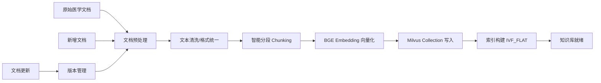

#### 4.5.2 检索流程

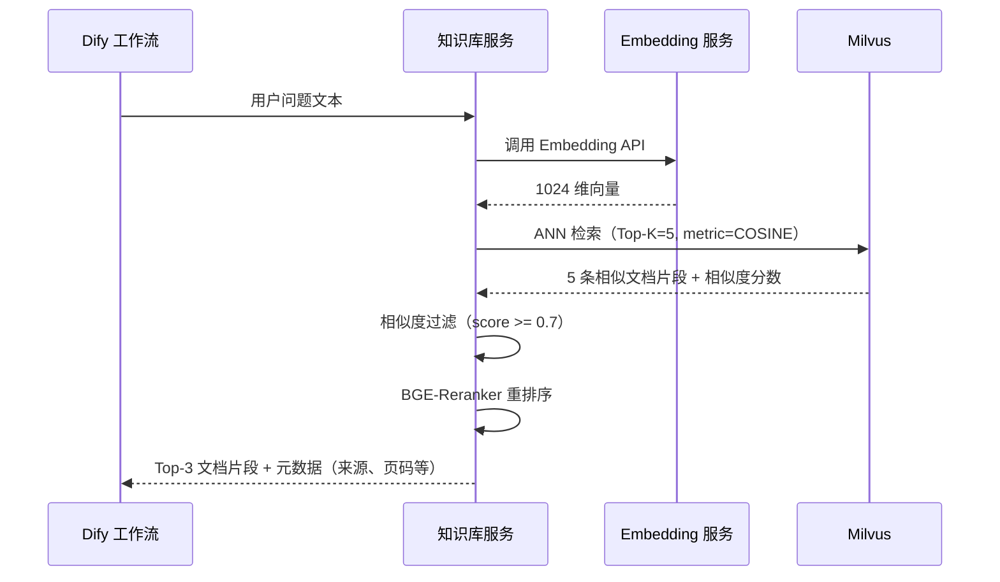

#### 4.5.3 知识库数据源

| 数据类别       | 来源                         | 预估文档数 | 总 Token 量  |
| -------------- | ---------------------------- | ---------- | ------------ |
| 诊疗指南       | 中华医学会糖尿病学分会       | 20+        | ~500K        |
| 药典数据       | 中国药典、药品说明书         | 500+       | ~2M          |
| 医学文献       | PubMed、知网精选论文摘要     | 1000+      | ~3M          |
| 科普内容       | 权威医学科普平台授权内容      | 200+       | ~1M          |
| 饮食运动指南   | 中国营养学会、运动医学指南   | 50+        | ~300K        |

---

## 5. 数据设计

### 5.1 整体 E-R 图

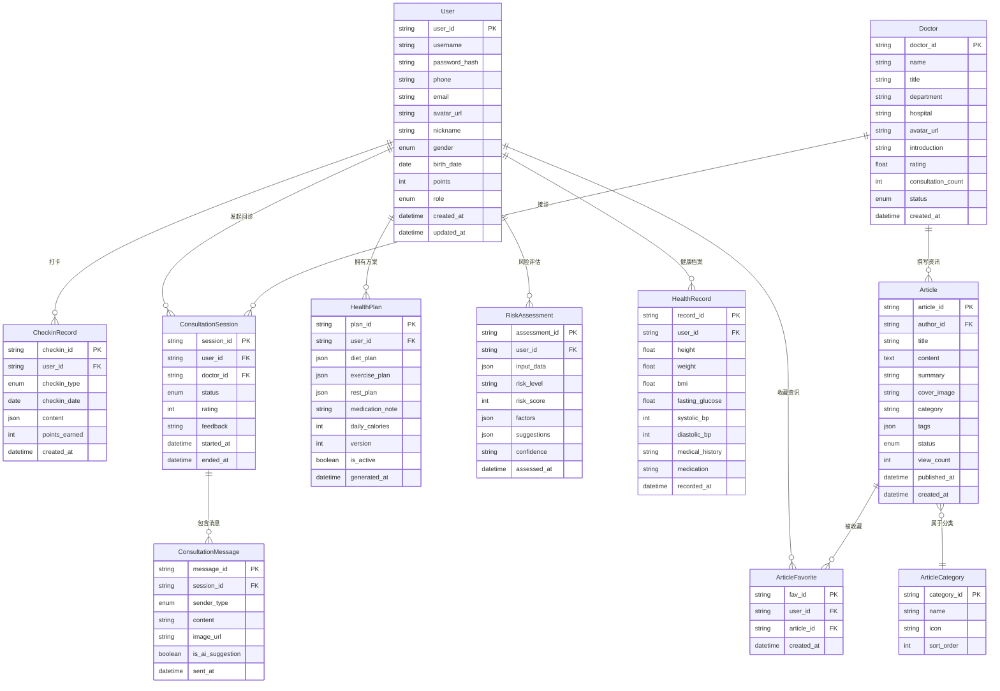

### 5.2 核心数据库表详细设计

#### 5.2.1 用户表（users）

```sql
CREATE TABLE users (
    user_id       VARCHAR(32)   PRIMARY KEY COMMENT '用户唯一ID，雪花算法生成',
    username      VARCHAR(50)   NOT NULL UNIQUE COMMENT '登录用户名',
    password_hash VARCHAR(255)  NOT NULL COMMENT 'bcrypt 加密密码',
    phone         VARCHAR(20)   DEFAULT NULL COMMENT '手机号（AES加密存储）',
    email         VARCHAR(100)  DEFAULT NULL COMMENT '邮箱（AES加密存储）',
    avatar_url    VARCHAR(500)  DEFAULT NULL COMMENT '头像URL',
    nickname      VARCHAR(50)   DEFAULT NULL COMMENT '昵称',
    gender        ENUM('male','female','unknown') DEFAULT 'unknown' COMMENT '性别',
    birth_date    DATE          DEFAULT NULL COMMENT '出生日期',
    points        INT           DEFAULT 0 COMMENT '积分',
    role          ENUM('user','doctor','admin') DEFAULT 'user' COMMENT '角色',
    privacy_settings JSON      DEFAULT NULL COMMENT '隐私设置JSON',
    created_at    DATETIME      DEFAULT CURRENT_TIMESTAMP COMMENT '创建时间',
    updated_at    DATETIME      DEFAULT CURRENT_TIMESTAMP ON UPDATE CURRENT_TIMESTAMP COMMENT '更新时间',
    INDEX idx_phone (phone),
    INDEX idx_role (role)
) ENGINE=InnoDB DEFAULT CHARSET=utf8mb4 COLLATE=utf8mb4_unicode_ci COMMENT='用户表';
```

#### 5.2.2 医生表（doctors）

```sql
CREATE TABLE doctors (
    doctor_id          VARCHAR(32)   PRIMARY KEY COMMENT '医生ID',
    user_id            VARCHAR(32)   NOT NULL COMMENT '关联用户账号ID',
    name               VARCHAR(50)   NOT NULL COMMENT '医生姓名',
    title              VARCHAR(50)   NOT NULL COMMENT '职称（主任医师/副主任医师等）',
    department         VARCHAR(50)   NOT NULL DEFAULT '内分泌科' COMMENT '科室',
    hospital           VARCHAR(100)  NOT NULL COMMENT '所属医院',
    avatar_url         VARCHAR(500)  DEFAULT NULL COMMENT '头像URL',
    introduction       TEXT          DEFAULT NULL COMMENT '个人简介',
    specialties        JSON          DEFAULT NULL COMMENT '擅长领域 JSON数组',
    rating             DECIMAL(2,1)  DEFAULT 5.0 COMMENT '评分（1.0~5.0）',
    consultation_count INT           DEFAULT 0 COMMENT '累计问诊次数',
    status             ENUM('online','offline','busy') DEFAULT 'offline' COMMENT '在线状态',
    created_at         DATETIME      DEFAULT CURRENT_TIMESTAMP COMMENT '创建时间',
    updated_at         DATETIME      DEFAULT CURRENT_TIMESTAMP ON UPDATE CURRENT_TIMESTAMP COMMENT '更新时间',
    FOREIGN KEY (user_id) REFERENCES users(user_id) ON DELETE CASCADE,
    INDEX idx_status (status),
    INDEX idx_department (department)
) ENGINE=InnoDB DEFAULT CHARSET=utf8mb4 COLLATE=utf8mb4_unicode_ci COMMENT='医生表';
```

#### 5.2.3 健康档案表（health_records）

```sql
CREATE TABLE health_records (
    record_id         VARCHAR(32)   PRIMARY KEY COMMENT '记录ID',
    user_id           VARCHAR(32)   NOT NULL COMMENT '用户ID',
    height            DECIMAL(5,1)  DEFAULT NULL COMMENT '身高(cm)',
    weight            DECIMAL(5,1)  DEFAULT NULL COMMENT '体重(kg)',
    bmi               DECIMAL(4,1)  DEFAULT NULL COMMENT 'BMI（自动计算）',
    fasting_glucose   DECIMAL(4,1)  DEFAULT NULL COMMENT '空腹血糖(mmol/L)',
    postprandial_glucose DECIMAL(4,1) DEFAULT NULL COMMENT '餐后2h血糖(mmol/L)',
    hba1c             DECIMAL(3,1)  DEFAULT NULL COMMENT '糖化血红蛋白(%)',
    systolic_bp       INT           DEFAULT NULL COMMENT '收缩压(mmHg)',
    diastolic_bp      INT           DEFAULT NULL COMMENT '舒张压(mmHg)',
    diabetes_type     ENUM('none','type1','type2','gestational','unknown') DEFAULT 'unknown' COMMENT '糖尿病类型',
    diagnosed_date    DATE          DEFAULT NULL COMMENT '确诊日期',
    medical_history   JSON          DEFAULT NULL COMMENT '既往病史JSON',
    medication        JSON          DEFAULT NULL COMMENT '当前用药JSON',
    family_history    JSON          DEFAULT NULL COMMENT '家族病史JSON',
    smoking           ENUM('never','former','current') DEFAULT NULL COMMENT '吸烟',
    alcohol           ENUM('never','occasional','regular') DEFAULT NULL COMMENT '饮酒',
    exercise_freq     ENUM('none','low','medium','high') DEFAULT NULL COMMENT '运动频率',
    diet_type         VARCHAR(50)   DEFAULT NULL COMMENT '饮食偏好',
    recorded_at       DATETIME      DEFAULT CURRENT_TIMESTAMP COMMENT '记录时间',
    FOREIGN KEY (user_id) REFERENCES users(user_id) ON DELETE CASCADE,
    INDEX idx_user_record (user_id, recorded_at DESC)
) ENGINE=InnoDB DEFAULT CHARSET=utf8mb4 COLLATE=utf8mb4_unicode_ci COMMENT='健康档案表';
```

#### 5.2.4 打卡记录表（checkin_records）

```sql
CREATE TABLE checkin_records (
    checkin_id    VARCHAR(32)   PRIMARY KEY COMMENT '打卡ID',
    user_id       VARCHAR(32)   NOT NULL COMMENT '用户ID',
    checkin_type  ENUM('diet','exercise','medication','glucose') NOT NULL COMMENT '打卡类型',
    checkin_date  DATE          NOT NULL COMMENT '打卡日期',
    content       JSON          DEFAULT NULL COMMENT '打卡内容（如饮食描述、运动类型、血糖值等）',
    points_earned INT           DEFAULT 0 COMMENT '获得积分',
    is_abnormal   TINYINT(1)    DEFAULT 0 COMMENT '是否异常打卡（AI标记）',
    created_at    DATETIME      DEFAULT CURRENT_TIMESTAMP COMMENT '打卡时间',
    FOREIGN KEY (user_id) REFERENCES users(user_id) ON DELETE CASCADE,
    UNIQUE KEY uk_user_type_date (user_id, checkin_type, checkin_date),
    INDEX idx_user_date (user_id, checkin_date DESC)
) ENGINE=InnoDB DEFAULT CHARSET=utf8mb4 COLLATE=utf8mb4_unicode_ci COMMENT='打卡记录表';
```

#### 5.2.5 问诊会话表（consultation_sessions）

```sql
CREATE TABLE consultation_sessions (
    session_id  VARCHAR(32)   PRIMARY KEY COMMENT '会话ID',
    user_id     VARCHAR(32)   NOT NULL COMMENT '用户ID',
    doctor_id   VARCHAR(32)   NOT NULL COMMENT '医生ID',
    status      ENUM('active','closed') DEFAULT 'active' COMMENT '会话状态',
    rating      TINYINT       DEFAULT NULL COMMENT '用户评分（1~5）',
    feedback    TEXT          DEFAULT NULL COMMENT '用户评价文字',
    started_at  DATETIME      DEFAULT CURRENT_TIMESTAMP COMMENT '开始时间',
    ended_at    DATETIME      DEFAULT NULL COMMENT '结束时间',
    FOREIGN KEY (user_id) REFERENCES users(user_id) ON DELETE CASCADE,
    FOREIGN KEY (doctor_id) REFERENCES doctors(doctor_id) ON DELETE CASCADE,
    INDEX idx_user_session (user_id, started_at DESC),
    INDEX idx_doctor_session (doctor_id, started_at DESC)
) ENGINE=InnoDB DEFAULT CHARSET=utf8mb4 COLLATE=utf8mb4_unicode_ci COMMENT='问诊会话表';

CREATE TABLE consultation_messages (
    message_id        VARCHAR(32)   PRIMARY KEY COMMENT '消息ID',
    session_id        VARCHAR(32)   NOT NULL COMMENT '会话ID',
    sender_type       ENUM('user','doctor','system') NOT NULL COMMENT '发送者类型',
    sender_id         VARCHAR(32)   NOT NULL COMMENT '发送者ID',
    content           TEXT          NOT NULL COMMENT '消息内容',
    image_url         VARCHAR(500)  DEFAULT NULL COMMENT '图片URL',
    is_ai_suggestion  TINYINT(1)    DEFAULT 0 COMMENT '是否为AI建议消息（仅医生可见）',
    sent_at           DATETIME      DEFAULT CURRENT_TIMESTAMP COMMENT '发送时间',
    FOREIGN KEY (session_id) REFERENCES consultation_sessions(session_id) ON DELETE CASCADE,
    INDEX idx_session_time (session_id, sent_at ASC)
) ENGINE=InnoDB DEFAULT CHARSET=utf8mb4 COLLATE=utf8mb4_unicode_ci COMMENT='问诊消息表';
```

#### 5.2.6 健康方案表（health_plans）

```sql
CREATE TABLE health_plans (
    plan_id          VARCHAR(32)   PRIMARY KEY COMMENT '方案ID',
    user_id          VARCHAR(32)   NOT NULL COMMENT '用户ID',
    diet_plan        JSON          NOT NULL COMMENT '饮食方案JSON',
    exercise_plan    JSON          NOT NULL COMMENT '运动方案JSON',
    rest_plan        JSON          NOT NULL COMMENT '作息方案JSON',
    medication_note  TEXT          DEFAULT NULL COMMENT '用药提醒',
    daily_calories   INT           NOT NULL COMMENT '每日推荐热量(kcal)',
    source           ENUM('manual','assessment','consultation','auto') DEFAULT 'manual' COMMENT '方案生成来源',
    version          INT           DEFAULT 1 COMMENT '版本号',
    is_active        TINYINT(1)    DEFAULT 1 COMMENT '是否当前生效方案',
    generated_at     DATETIME      DEFAULT CURRENT_TIMESTAMP COMMENT '生成时间',
    FOREIGN KEY (user_id) REFERENCES users(user_id) ON DELETE CASCADE,
    INDEX idx_user_active (user_id, is_active, generated_at DESC)
) ENGINE=InnoDB DEFAULT CHARSET=utf8mb4 COLLATE=utf8mb4_unicode_ci COMMENT='健康方案表';
```

#### 5.2.7 风险评估表（risk_assessments）

```sql
CREATE TABLE risk_assessments (
    assessment_id VARCHAR(32)   PRIMARY KEY COMMENT '评估ID',
    user_id       VARCHAR(32)   NOT NULL COMMENT '用户ID',
    input_data    JSON          NOT NULL COMMENT '用户输入的健康指标数据',
    risk_level    ENUM('low','medium','high') NOT NULL COMMENT '风险等级',
    risk_score    INT           NOT NULL COMMENT '风险分值（0~100）',
    factors       JSON          NOT NULL COMMENT '风险因素列表',
    suggestions   JSON          NOT NULL COMMENT '改善建议列表',
    confidence    ENUM('low','medium','high') NOT NULL COMMENT '置信度',
    assessed_at   DATETIME      DEFAULT CURRENT_TIMESTAMP COMMENT '评估时间',
    FOREIGN KEY (user_id) REFERENCES users(user_id) ON DELETE CASCADE,
    INDEX idx_user_assessment (user_id, assessed_at DESC)
) ENGINE=InnoDB DEFAULT CHARSET=utf8mb4 COLLATE=utf8mb4_unicode_ci COMMENT='风险评估表';
```

#### 5.2.8 资讯表（articles）

```sql
CREATE TABLE articles (
    article_id    VARCHAR(32)   PRIMARY KEY COMMENT '资讯ID',
    author_id     VARCHAR(32)   DEFAULT NULL COMMENT '作者ID（关联doctors或admins）',
    title         VARCHAR(200)  NOT NULL COMMENT '资讯标题',
    content       MEDIUMTEXT    NOT NULL COMMENT '资讯内容（Markdown格式）',
    summary       VARCHAR(500)  DEFAULT NULL COMMENT 'AI生成的摘要',
    cover_image   VARCHAR(500)  DEFAULT NULL COMMENT '封面图URL',
    category      VARCHAR(50)   NOT NULL COMMENT '分类（diabetes_basics/diet/exercise/medication/complications）',
    tags          JSON          DEFAULT NULL COMMENT '标签JSON数组',
    status        ENUM('draft','review','published','rejected') DEFAULT 'draft' COMMENT '状态',
    reject_reason VARCHAR(500)  DEFAULT NULL COMMENT '驳回原因',
    view_count    INT           DEFAULT 0 COMMENT '阅读量',
    is_ai_generated TINYINT(1)  DEFAULT 0 COMMENT '是否AI辅助生成',
    published_at  DATETIME      DEFAULT NULL COMMENT '发布时间',
    created_at    DATETIME      DEFAULT CURRENT_TIMESTAMP COMMENT '创建时间',
    updated_at    DATETIME      DEFAULT CURRENT_TIMESTAMP ON UPDATE CURRENT_TIMESTAMP COMMENT '更新时间',
    INDEX idx_status_pub (status, published_at DESC),
    INDEX idx_category (category),
    FULLTEXT idx_ft_title_content (title, content)
) ENGINE=InnoDB DEFAULT CHARSET=utf8mb4 COLLATE=utf8mb4_unicode_ci COMMENT='资讯表';

CREATE TABLE article_favorites (
    fav_id      VARCHAR(32) PRIMARY KEY COMMENT '收藏ID',
    user_id     VARCHAR(32) NOT NULL COMMENT '用户ID',
    article_id  VARCHAR(32) NOT NULL COMMENT '资讯ID',
    created_at  DATETIME    DEFAULT CURRENT_TIMESTAMP COMMENT '收藏时间',
    FOREIGN KEY (user_id) REFERENCES users(user_id) ON DELETE CASCADE,
    FOREIGN KEY (article_id) REFERENCES articles(article_id) ON DELETE CASCADE,
    UNIQUE KEY uk_user_article (user_id, article_id)
) ENGINE=InnoDB DEFAULT CHARSET=utf8mb4 COLLATE=utf8mb4_unicode_ci COMMENT='资讯收藏表';
```

### 5.3 向量知识库存储结构设计

#### 5.3.1 Milvus Collection 设计

```yaml
Collection 名称: diabetes_knowledge
向量维度: 1024（对应 BAAI/bge-large-zh-v1.5）
距离度量: COSINE（余弦相似度）
索引类型: IVF_FLAT（nlist=1024）

Schema 字段:
  - id: VARCHAR (主键, 最大长度 64)
  - vector: FLOAT_VECTOR (1024 维)
  - content: VARCHAR (最大长度 65535) — 文档片段文本
  - doc_title: VARCHAR (最大长度 256) — 源文档标题
  - doc_source: VARCHAR (最大长度 256) — 来源（如 "中国2型糖尿病防治指南2024版"）
  - doc_type: VARCHAR (最大长度 64) — 文档类型（guideline/pharmacology/literature/diet）
  - page_num: INT — 页码
  - chunk_index: INT — 分段序号
  - created_at: INT64 — Unix 时间戳

分区策略:
  - partition_guidelines: 诊疗指南
  - partition_pharmacology: 药典数据
  - partition_literature: 医学文献
  - partition_health_edu: 科普与健康教育

加载策略:
  - 全量加载到内存（需约 4~6 GB RAM）
  - 定期增量更新（每周拉取最新指南和文献）
```

### 5.4 数据字典与数据流转规则

#### 5.4.1 核心枚举值字典

| 枚举字段         | 可选值                                                       |
| ---------------- | ------------------------------------------------------------ |
| checkin_type     | diet \| exercise \| medication \| glucose                    |
| gender           | male \| female \| unknown                                    |
| risk_level       | low \| medium \| high                                        |
| article_status   | draft \| review \| published \| rejected                     |
| session_status   | active \| closed                                             |
| diabetes_type    | none \| type1 \| type2 \| gestational \| unknown             |
| doctor_status    | online \| offline \| busy                                    |
| role             | user \| doctor \| admin                                      |

#### 5.4.2 数据流转规则

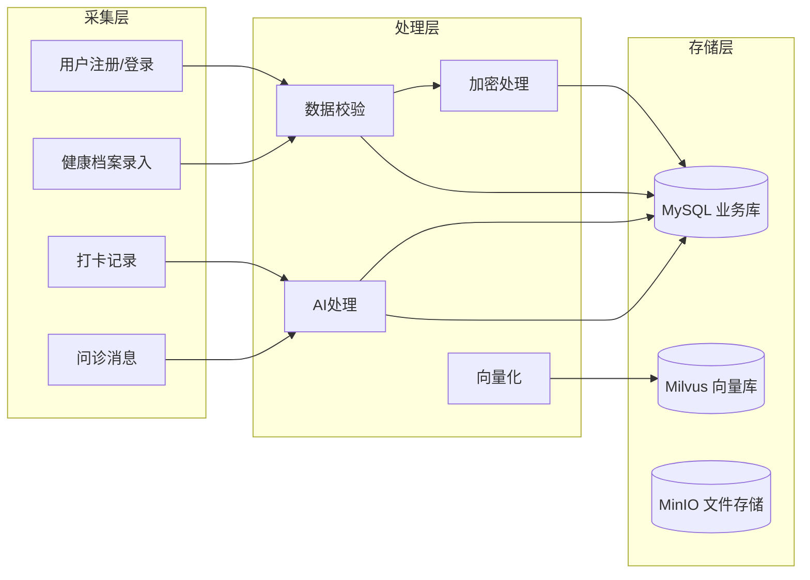

**关键流转规则：**

1. **用户隐私数据**（手机号、邮箱、姓名）：写入前 AES-256 加密，读取时解密
2. **健康档案更新**：每次更新生成新记录（保留历史），最新记录标记 `is_current=1`
3. **问诊消息**：AI 建议消息设置 `is_ai_suggestion=1`，前端根据角色决定是否显示
4. **打卡积分**：打卡成功后同步更新 `users.points` 字段，使用数据库事务保证一致性
5. **健康方案**：新方案生成后，旧方案 `is_active` 置为 0，新方案 `is_active=1`
6. **数据归档**：超过 1 年的问诊消息和打卡记录归档到历史表，保证主表查询性能

---

## 6. 接口详细设计

### 6.1 前端与 Dify 智能体交互 API

#### 6.1.1 通用约定

| 项目         | 说明                                                   |
| ------------ | ------------------------------------------------------ |
| 协议         | HTTPS                                                  |
| 请求格式     | JSON                                                   |
| 响应格式     | JSON / SSE（流式）                                     |
| 认证方式     | `Authorization: Bearer {JWT_TOKEN}`                    |
| 基础路径     | `/api/v1`                                              |
| 时区         | Asia/Shanghai（UTC+8）                                 |
| 字符编码     | UTF-8                                                  |
| 通用响应格式 | `{"code": 200, "message": "success", "data": {...}}`   |
| 通用错误格式 | `{"code": 4xx/5xx, "message": "错误描述", "data": null}` |

#### 6.1.2 科普问答接口

```yaml
接口名称: AI 科普问答
请求方式: POST
请求路径: /api/v1/chat/qa
认证要求: 可选（未登录也可使用）

请求参数:
  - query: string（必填）— 用户问题，最大 500 字符
  - conversation_id: string（选填）— 对话ID，用于多轮对话

请求示例:
  POST /api/v1/chat/qa
  Content-Type: application/json
  
  {
    "query": "糖尿病患者可以吃水果吗？",
    "conversation_id": "conv_abc123"
  }

响应方式: SSE 流式（text/event-stream）
  event: message
  data: {"type": "text", "content": "糖尿病患者", "conversation_id": "conv_abc123"}
  
  event: message
  data: {"type": "text", "content": "是可以吃水果的，", "conversation_id": "conv_abc123"}
  
  event: message_end
  data: {"type": "end", "conversation_id": "conv_abc123", "metadata": {"sources": ["中国2型糖尿病防治指南", "..."]}}
```

#### 6.1.3 问诊会话接口

```yaml
接口名称: 创建问诊会话
请求方式: POST
请求路径: /api/v1/consultations
认证要求: 是

请求参数:
  - doctor_id: string（必填）— 医生ID
  - initial_message: string（选填）— 初始咨询问题

请求示例:
  {
    "doctor_id": "doc_001",
    "initial_message": "最近空腹血糖一直在7.5左右，需要调整用药吗？"
  }

响应:
  {
    "code": 200,
    "data": {
      "session_id": "sess_xyz789",
      "doctor_name": "张医生",
      "doctor_avatar": "https://...",
      "status": "active",
      "started_at": "2026-06-22T10:30:00+08:00"
    }
  }

---
接口名称: 发送问诊消息
请求方式: POST
请求路径: /api/v1/consultations/{session_id}/messages
认证要求: 是

请求参数:
  - content: string（必填）— 消息文本
  - image: file（选填）— 上传图片

请求示例 (multipart/form-data):
  content: "这是我最近的检查报告，您帮忙看看"
  image: [binary file]
```

#### 6.1.4 风险评估接口

```yaml
接口名称: 糖尿病风险评估
请求方式: POST
请求路径: /api/v1/risk/assess
认证要求: 是

请求参数:
  - fasting_glucose: float（必填）— 空腹血糖(mmol/L)
  - height: float（必填）— 身高(cm)
  - weight: float（必填）— 体重(kg)
  - systolic_bp: int（必填）— 收缩压
  - diastolic_bp: int（必填）— 舒张压
  - age: int（必填）— 年龄
  - gender: string（必填）— male/female
  - family_history: bool（必填）— 家族史
  - smoking: string（选填）— never/former/current
  - exercise_freq: string（选填）— none/low/medium/high

请求示例:
  {
    "fasting_glucose": 6.8,
    "height": 170.0,
    "weight": 78.5,
    "systolic_bp": 135,
    "diastolic_bp": 85,
    "age": 45,
    "gender": "male",
    "family_history": true,
    "smoking": "former",
    "exercise_freq": "low"
  }

响应:
  {
    "code": 200,
    "data": {
      "assessment_id": "ra_001",
      "risk_level": "medium",
      "risk_score": 62,
      "bmi": 27.2,
      "bmi_level": "overweight",
      "glucose_level": "prediabetes",
      "factors": [
        {"name": "超重", "level": "中危", "description": "BMI 27.2 属于超重范围", "weight": 0.3},
        {"name": "空腹血糖异常", "level": "高危", "description": "空腹血糖6.8mmol/L属于糖尿病前期", "weight": 0.35},
        {"name": "家族史", "level": "中危", "description": "有糖尿病家族史", "weight": 0.2},
        {"name": "运动不足", "level": "低危", "description": "运动频率偏低", "weight": 0.15}
      ],
      "suggestions": [
        "建议进一步做OGTT检查确认糖耐量状态",
        "建议每周至少150分钟中等强度有氧运动",
        "建议咨询营养师制定个性化饮食方案"
      ],
      "confidence": "medium"
    }
  }
```

#### 6.1.5 方案生成接口

```yaml
接口名称: 生成健康方案
请求方式: POST
请求路径: /api/v1/plan/generate
认证要求: 是

请求参数: 无（服务端自动拉取用户健康档案）

响应方式: SSE 流式（分阶段返回）
  event: stage_calorie
  data: {"stage": "calorie", "daily_calories": 1800}
  
  event: stage_diet
  data: {"stage": "diet", "content": {...}}
  
  event: stage_exercise
  data: {"stage": "exercise", "content": {...}}
  
  event: stage_rest
  data: {"stage": "rest", "content": {...}}
  
  event: complete
  data: {"stage": "complete", "plan_id": "plan_001"}
```

#### 6.1.6 打卡接口

```yaml
接口名称: 提交打卡
请求方式: POST
请求路径: /api/v1/checkin
认证要求: 是

请求参数:
  - checkin_type: string（必填）— diet/exercise/medication/glucose
  - checkin_date: string（必填）— 日期 YYYY-MM-DD
  - content: object（选填）— 打卡详情

请求示例:
  {
    "checkin_type": "diet",
    "checkin_date": "2026-06-22",
    "content": {
      "breakfast": "全麦面包2片+鸡蛋1个+牛奶200ml",
      "lunch": "糙米饭100g+清蒸鱼150g+炒青菜200g",
      "dinner": "杂粮粥1碗+凉拌豆腐+炒西兰花"
    }
  }

响应:
  {
    "code": 200,
    "data": {
      "checkin_id": "chk_001",
      "points_earned": 10,
      "total_points": 520,
      "streak_days": 12,
      "achievement": {
        "unlocked": true,
        "name": "连续打卡达人",
        "badge_url": "https://..."
      }
    }
  }
```

### 6.2 Dify 对接 DeepSeek 大模型 API

Dify 平台内置了 DeepSeek 模型供应商的集成支持。开发者只需在 Dify 管理后台配置 DeepSeek API Key，工作流中的 LLM 节点即可直接调用 DeepSeek 模型。

```yaml
配置路径: Dify 管理后台 → 设置 → 模型供应商 → DeepSeek
配置项:
  - API Key: sk-xxxxxxxxxxxxxxxxxxxxxxxxxxxxxxxx
  - API Base URL: https://api.deepseek.com/v1（默认）
  
底层调用格式（Dify 自动处理，此处展示原理）:
  POST https://api.deepseek.com/v1/chat/completions
  Headers:
    Authorization: Bearer sk-xxx
    Content-Type: application/json
  
  Body:
    {
      "model": "deepseek-chat",         # 或 deepseek-reasoner (R1)
      "messages": [
        {"role": "system", "content": "系统Prompt..."},
        {"role": "user", "content": "用户问题+知识库上下文..."}
      ],
      "temperature": 0.7,
      "max_tokens": 2048,
      "top_p": 0.9,
      "stream": true
    }
```

> **说明**：前端的流式输出体验由 Dify 平台原生支持。前端只需对接 Dify 的 SSE 接口，无需直接调用 DeepSeek API。

### 6.3 知识库检索内部接口

```yaml
接口名称: 知识库语义检索
调用方: Dify 知识库检索工具节点
内部实现: Dify → Embedding 服务 → Milvus

检索流程:
  1. 接收查询文本
  2. 调用 BGE Embedding API 将查询文本向量化
  3. Milvus Collection 执行 ANN 检索
  4. 相似度过滤（score >= 0.7）
  5. BGE-Reranker 重排序
  6. 返回 Top-3 文档片段

Milvus 检索伪代码:
  search_params = {
      "metric_type": "COSINE",
      "params": {"nprobe": 16}
  }
  results = milvus.search(
      collection_name="diabetes_knowledge",
      data=[query_vector],
      anns_field="vector",
      param=search_params,
      limit=5,
      expr=None,
      output_fields=["content", "doc_title", "doc_source", "doc_type"]
  )
```

### 6.4 后台管理接口

#### 6.4.1 通用约定

| 项目     | 说明                                    |
| -------- | --------------------------------------- |
| 基础路径 | `/api/v1/admin`                         |
| 认证要求 | 所有接口需要 admin 角色 JWT Token       |
| 权限校验 | 中间件验证 `role == 'admin'`            |

#### 6.4.2 资讯管理接口

```yaml
接口名称: 创建资讯
请求方式: POST
请求路径: /api/v1/admin/articles

请求参数:
  - title: string（必填）
  - content: string（必填）— Markdown
  - cover_image: string（选填）
  - category: string（必填）
  - tags: array（选填）

---
接口名称: AI 辅助生成资讯初稿
请求方式: POST
请求路径: /api/v1/admin/articles/ai-draft

请求参数:
  - topic: string（必填）— 文章主题
  - keywords: array（选填）— 关键词

响应:
  {
    "code": 200,
    "data": {
      "title": "AI生成标题",
      "content": "AI生成的Markdown正文...",
      "summary": "AI生成的摘要...",
      "tags": ["糖尿病", "饮食", "血糖控制"]
    }
  }

---
接口名称: 审核资讯
请求方式: PUT
请求路径: /api/v1/admin/articles/{id}/review

请求参数:
  - action: string（必填）— approve/reject
  - reject_reason: string（当action=reject时必填）
```

#### 6.4.3 用户管理接口

```yaml
接口名称: 用户列表
请求方式: GET
请求路径: /api/v1/admin/users
请求参数:
  - page: int (默认1)
  - page_size: int (默认20)
  - keyword: string（选填，按用户名/手机号搜索）
  - role: string（选填，按角色筛选）

---
接口名称: 用户详情
请求方式: GET
请求路径: /api/v1/admin/users/{user_id}

---
接口名称: 禁用/启用用户
请求方式: PUT
请求路径: /api/v1/admin/users/{user_id}/status
```

---

## 7. 安全设计

### 7.1 用户隐私数据加密存储

#### 7.1.1 加密策略

| 数据类型           | 加密方式             | 密钥管理                             | 说明                                 |
| ------------------ | -------------------- | ------------------------------------ | ------------------------------------ |
| 手机号             | AES-256-CBC          | 密钥存储在环境变量，不进入代码仓库    | 登录和通知场景需解密                 |
| 邮箱               | AES-256-CBC          | 同上                                 | 同上                                 |
| 真实姓名           | AES-256-CBC          | 同上                                 | 仅医生端和管理端可见                 |
| 健康档案数据       | AES-256-CBC          | 同上                                 | 包括血糖、血压、病史等敏感指标       |
| 问诊消息内容       | AES-256-CBC          | 同上                                 | 用户-医生通信内容                    |
| 密码               | bcrypt（单向哈希）   | salt 随机生成                         | 不可逆，无法解密                     |

#### 7.1.2 传输加密

- 全站启用 HTTPS，使用 TLS 1.3
- Nginx 作为 SSL 终结点，后端内部通信走内网 HTTP
- 证书使用 Let's Encrypt（开发/测试）或企业 CA 签发证书（生产）

### 7.2 身份认证与权限分级

#### 7.2.1 认证流程

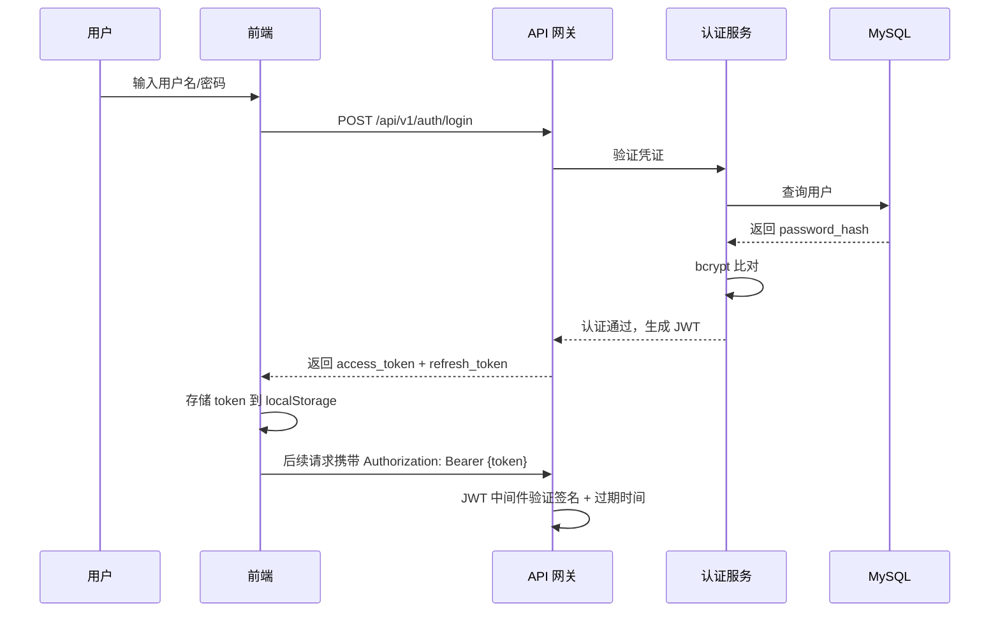

#### 7.2.2 JWT Token 设计

```yaml
access_token:
  有效期: 2 小时
  Payload:
    - sub: user_id
    - role: user/doctor/admin
    - iat: 签发时间
    - exp: 过期时间
  签名算法: HS256
  密钥: 环境变量 JWT_SECRET

refresh_token:
  有效期: 7 天
  用途: 在 access_token 过期后换取新的 access_token
  存储: 数据库 refresh_tokens 表，支持撤销
```

#### 7.2.3 RBAC 权限模型

| 角色         | 权限范围                                                                             |
| ------------ | ------------------------------------------------------------------------------------ |
| user（普通用户）| 科普浏览、发起问诊、风险评估、查看/生成方案、打卡、管理个人数据、浏览资讯              |
| doctor（医生）  | 普通用户全部权限 + 管理问诊会话、查看问诊用户的健康档案（需授权）、撰写资讯             |
| admin（管理员） | 全部权限 + 用户管理、医生管理、资讯审核与发布、系统配置、数据导出                       |

```yaml
权限中间件校验逻辑:
  - 未登录: 仅允许访问科普浏览和登录注册
  - user: 可访问 /api/v1/*（非 admin 路径）
  - doctor: 可访问 /api/v1/*（非 admin 路径） + /api/v1/doctor/*
  - admin: 可访问全部路径，包括 /api/v1/admin/*
```

### 7.3 AI 内容安全校验

#### 7.3.1 多层安全护栏

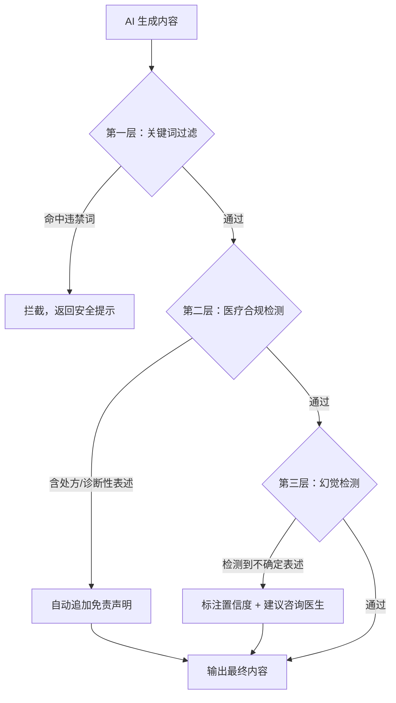

#### 7.3.2 安全过滤规则

| 层级       | 检测内容                                           | 处理方式                             |
| ---------- | -------------------------------------------------- | ------------------------------------ |
| 关键词过滤 | 违禁药品名、非法医疗行为、敏感政治词汇              | 直接拦截，返回预设安全提示           |
| 医疗合规   | 是否包含"处方"、"诊断结果是"、"保证治愈"等高风险表述 | 自动追加"以上内容仅供参考"免责声明    |
| 幻觉检测   | 药物剂量数值是否在合理范围、引用的指南版本是否存在   | 置信度低的表述标注"需核实"，不阻断输出 |
| 输出兜底   | 所有 AI 回答末尾                                    | 强制追加固定免责声明                  |

#### 7.3.3 固定免责声明模板

```
⚠️ 以上内容由AI生成，仅供参考，不能替代专业医生的诊断和治疗建议。
如有健康问题，请及时前往正规医疗机构就医。
若出现紧急情况，请立即拨打120急救电话。
```

### 7.4 接口防刷与数据操作留痕

#### 7.4.1 接口防刷策略

| 防护维度   | 实现方式                                           | 配置参数                       |
| ---------- | -------------------------------------------------- | ------------------------------ |
| 频率限制   | 基于 Redis 实现令牌桶算法，按用户+接口粒度限流       | 普通用户 10 req/s，AI 接口 2 req/s |
| IP 黑名单  | 单 IP 1 分钟内错误超过 100 次自动封禁 30 分钟        | Nginx rate limiting 模块       |
| 验证码     | 登录/注册/敏感操作触发图形验证码                     | 连续失败 3 次弹出验证码         |
| 请求签名   | 关键接口（数据导出、权限变更）要求 HMAC 签名         | API Key + Secret 签名方式       |

#### 7.4.2 操作审计日志

```sql
CREATE TABLE audit_logs (
    log_id       VARCHAR(32)   PRIMARY KEY COMMENT '日志ID',
    user_id      VARCHAR(32)   NOT NULL COMMENT '操作用户ID',
    action       VARCHAR(100)  NOT NULL COMMENT '操作类型（如 user.login, article.publish）',
    resource     VARCHAR(200)  NOT NULL COMMENT '操作资源（如 article_001）',
    detail       JSON          DEFAULT NULL COMMENT '操作详情JSON',
    ip_address   VARCHAR(50)   DEFAULT NULL COMMENT '操作IP',
    user_agent   VARCHAR(500)  DEFAULT NULL COMMENT 'User-Agent',
    result       ENUM('success','failure') NOT NULL COMMENT '操作结果',
    created_at   DATETIME      DEFAULT CURRENT_TIMESTAMP COMMENT '操作时间',
    INDEX idx_user_time (user_id, created_at DESC),
    INDEX idx_action (action)
) ENGINE=InnoDB DEFAULT CHARSET=utf8mb4 COLLATE=utf8mb4_unicode_ci COMMENT='审计日志表';
```

**审计日志覆盖范围：**
- 用户登录/登出
- 数据导出操作
- 权限变更
- 资讯发布/审核
- AI 接口调用（记录调用次数，非内容）
- 异常访问拦截

---

## 8. 性能与扩展性设计

### 8.1 系统响应性能指标

| 业务场景           | 响应时间指标（P95） | 说明                                         |
| ------------------ | ------------------- | -------------------------------------------- |
| 页面首次加载       | < 2s                | 首屏加载（含静态资源）                       |
| 科普问答生成       | < 3s（首 token）    | 从请求到收到第一个 token                     |
| 风险预测评估       | < 5s                | 完整评估报告生成（含工具调用 + R1 推理）     |
| 健康方案生成       | < 8s                | 四大维度完整方案（分阶段流式返回）           |
| 打卡提交           | < 500ms             | 数据库写入 + 积分更新                        |
| 资讯列表加载       | < 1s                | 含全文搜索                                  |
| 个人中心数据加载   | < 1s                | 聚合查询                                    |
| 知识库检索         | < 500ms             | Embedding + Milvus 检索                     |
| 后台管理 CRUD      | < 500ms             | 普通数据库操作                              |

### 8.2 并发处理与缓存优化方案

#### 8.2.1 并发处理

| 层级       | 并发策略                                           | 预期支持   |
| ---------- | -------------------------------------------------- | ---------- |
| Nginx      | Worker 进程数 = CPU 核数，每个进程 1024 并发连接    | 5000 QPS   |
| Dify       | 工作进程数 = CPU 核数 × 2，异步处理 AI 请求         | 200 QPS    |
| DeepSeek   | 云端 API，支持高并发，有速率限制                    | 60 RPM（企业版） |
| MySQL      | 连接池 50 连接，读写分离（主写从读）               | 1000 QPS   |
| Redis      | 单线程事件驱动，天然高并发                         | 10 万 QPS  |
| Milvus     | 多 Worker 并行检索                                 | 500 QPS    |

#### 8.2.2 缓存优化方案

| 缓存对象           | 缓存位置 | 过期策略       | 说明                           |
| ------------------ | -------- | -------------- | ------------------------------ |
| 用户 Session       | Redis    | 2 小时         | JWT Token 黑名单               |
| 科普首页内容       | Redis    | 10 分钟        | Banner、分类卡片数据           |
| 热门资讯列表       | Redis    | 5 分钟         | 首页推荐资讯                   |
| 医生列表           | Redis    | 30 分钟        | 在线状态实时更新               |
| 用户健康档案摘要   | Redis    | 5 分钟（写穿透）| 更新后主动失效                 |
| AI 常见问题回答     | Redis    | 1 小时         | 高频相同问题的缓存回答         |
| Milvus 检索结果    | Redis    | 30 分钟        | 相同查询的向量检索结果         |
| 静态资源（JS/CSS） | Nginx    | 1 年 + 版本号  | 强缓存                         |
| API 响应           | Nginx    | 视接口而定     | 反向代理层缓存 GET 请求         |

#### 8.2.3 缓存穿透/击穿/雪崩防护

| 问题       | 防护策略                                       |
| ---------- | ---------------------------------------------- |
| 缓存穿透   | 布隆过滤器过滤不存在的 Key，空值缓存（TTL 短）  |
| 缓存击穿   | 热点 Key 加互斥锁（Redis SETNX），仅一个线程回源 |
| 缓存雪崩   | 过期时间加随机偏移（±30%），多级缓存兜底        |

### 8.3 功能扩展机制

#### 8.3.1 新增慢病评估类型

系统架构支持快速扩展其他慢病评估（如高血压、高血脂）：

1. **数据库**：新增评估类型枚举，扩展 `health_records` 表字段
2. **Dify**：新建"高血压风险评估"工作流，注册对应的医学指标计算工具
3. **前端**：复用风险评估表单组件，通过配置驱动不同慢病的指标项

#### 8.3.2 新增资讯类型

- 在 `articles.category` 枚举中新增分类值
- 管理端分类选择器自动适配
- 用户端筛选 Tab 动态渲染

#### 8.3.3 新增 AI 工具

- 在 Dify「工具」菜单中注册新工具的 API 配置
- 工作流节点中可直接拖拽使用新工具
- 无需修改前端代码（工具调用在服务端完成）

---

## 9. 部署方案设计

### 9.1 私有化部署架构

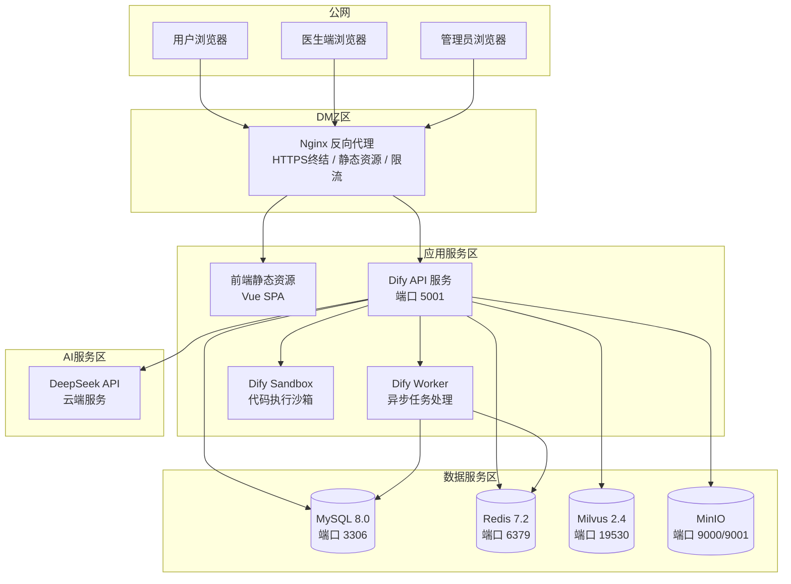

### 9.2 分模块部署流程

#### 9.2.1 Docker Compose 部署（推荐）

```yaml
# docker-compose.yml 核心服务编排
version: '3.8'
services:
  nginx:
    image: nginx:1.26-alpine
    ports:
      - "80:80"
      - "443:443"
    volumes:
      - ./nginx/nginx.conf:/etc/nginx/nginx.conf
      - ./nginx/ssl:/etc/nginx/ssl
      - ./frontend/dist:/usr/share/nginx/html
    depends_on:
      - dify-api
  
  dify-api:
    image: langgenius/dify-api:1.0.0
    ports:
      - "5001:5001"
    environment:
      - DB_HOST=mysql
      - REDIS_HOST=redis
      - MILVUS_HOST=milvus
      - DEEPSEEK_API_KEY=${DEEPSEEK_API_KEY}
    depends_on:
      - mysql
      - redis
      - milvus
  
  dify-worker:
    image: langgenius/dify-api:1.0.0
    command: /entrypoint-worker.sh
    environment:
      - DB_HOST=mysql
      - REDIS_HOST=redis
    depends_on:
      - mysql
      - redis
  
  dify-sandbox:
    image: langgenius/dify-sandbox:0.2.0
    ports:
      - "8194:8194"
  
  mysql:
    image: mysql:8.0
    ports:
      - "3306:3306"
    environment:
      - MYSQL_ROOT_PASSWORD=${MYSQL_ROOT_PASSWORD}
      - MYSQL_DATABASE=diabetes_assistant
    volumes:
      - mysql_data:/var/lib/mysql
      - ./db/init.sql:/docker-entrypoint-initdb.d/init.sql
  
  redis:
    image: redis:7.2-alpine
    ports:
      - "6379:6379"
    volumes:
      - redis_data:/data
  
  milvus:
    image: milvusdb/milvus:v2.4.0
    ports:
      - "19530:19530"
      - "9091:9091"
    environment:
      - ETCD_ENDPOINTS=etcd:2379
      - MINIO_ADDRESS=minio:9000
    volumes:
      - milvus_data:/var/lib/milvus
    depends_on:
      - etcd
      - minio
  
  etcd:
    image: quay.io/coreos/etcd:v3.5.5
    environment:
      - ETCD_AUTO_COMPACTION_MODE=revision
      - ETCD_AUTO_COMPACTION_RETENTION=1000
    volumes:
      - etcd_data:/etcd
  
  minio:
    image: minio/minio:latest
    ports:
      - "9000:9000"
      - "9001:9001"
    environment:
      - MINIO_ROOT_USER=${MINIO_USER}
      - MINIO_ROOT_PASSWORD=${MINIO_PASSWORD}
    command: server /data --console-address ":9001"
    volumes:
      - minio_data:/data

volumes:
  mysql_data:
  redis_data:
  milvus_data:
  etcd_data:
  minio_data:
```

#### 9.2.2 部署步骤

```bash
# 1. 克隆代码仓库
git clone <repository_url> diabetes-assistant
cd diabetes-assistant

# 2. 配置环境变量
cp .env.example .env
# 编辑 .env 文件，填入 DEEPSEEK_API_KEY、MYSQL_ROOT_PASSWORD 等

# 3. 构建前端
cd frontend
npm install
npm run build

# 4. 启动全部服务
cd ..
docker-compose up -d

# 5. 初始化数据库
docker-compose exec mysql mysql -u root -p diabetes_assistant < db/init.sql

# 6. 初始化 Milvus Collection
python scripts/init_milvus.py

# 7. 导入知识库数据
python scripts/import_knowledge_base.py --source ./knowledge_data/

# 8. 验证部署
curl http://localhost/api/v1/health
```

### 9.3 环境配置与依赖清单

#### 9.3.1 服务端依赖

| 软件           | 版本        | 用途                   |
| -------------- | ----------- | ---------------------- |
| Docker         | 24.0+       | 容器运行时             |
| Docker Compose | 2.20+       | 容器编排               |
| Nginx          | 1.26        | 反向代理 + 静态资源    |
| MySQL          | 8.0         | 业务数据库             |
| Redis          | 7.2         | 缓存 + 会话管理        |
| Milvus         | 2.4         | 向量数据库             |
| MinIO          | latest      | 对象存储               |
| Python         | 3.11+       | 数据导入脚本           |

#### 9.3.2 前端依赖

| 包名           | 版本   | 用途               |
| -------------- | ------ | ------------------ |
| vue            | ^3.5   | 前端框架           |
| vue-router     | ^4.4   | 路由管理           |
| pinia          | ^2.2   | 状态管理           |
| element-plus   | ^2.9   | UI 组件库          |
| axios          | ^1.7   | HTTP 客户端        |
| echarts        | ^5.5   | 数据可视化         |
| markdown-it    | ^14.1  | Markdown 渲染      |
| dayjs          | ^1.11  | 日期处理           |
| vite           | ^5.4   | 构建工具           |

#### 9.3.3 环境变量清单

```bash
# .env 文件
# DeepSeek API
DEEPSEEK_API_KEY=sk-xxxxxxxxxxxxxxxxxxxxxxxxxxxxxxxx

# MySQL
MYSQL_ROOT_PASSWORD=your_secure_password
MYSQL_DATABASE=diabetes_assistant

# JWT
JWT_SECRET=your_jwt_secret_key_at_least_32_chars

# AES 加密密钥
AES_ENCRYPTION_KEY=your_32_byte_aes_key_here_!

# MinIO
MINIO_USER=admin
MINIO_PASSWORD=your_minio_password

# Dify
DIFY_SECRET_KEY=your_dify_secret_key
DIFY_INIT_PASSWORD=your_admin_password
```

---

## 10. 异常与容错设计

### 10.1 大模型调用失败重试机制

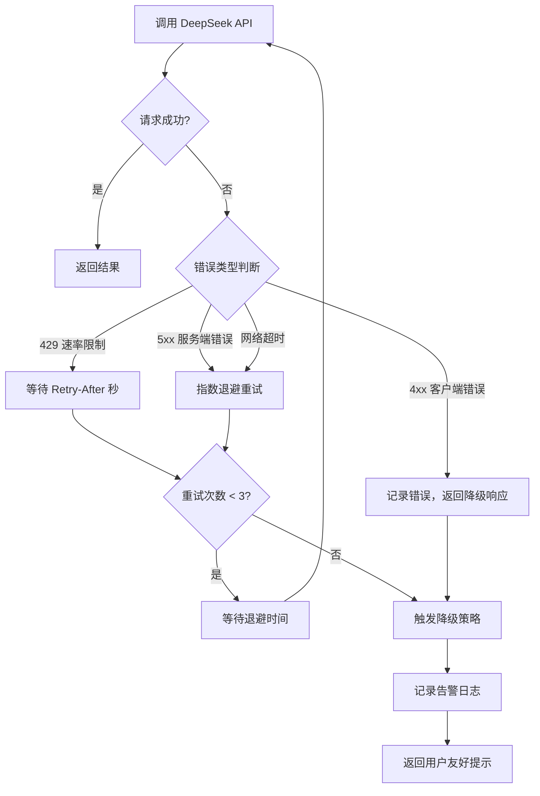

**重试参数配置：**

| 参数             | 值                  | 说明                         |
| ---------------- | ------------------- | ---------------------------- |
| 最大重试次数     | 3                   | 含首次请求共 4 次尝试        |
| 基础退避时间     | 1s                  | 指数退避：1s → 2s → 4s       |
| 最大退避时间     | 10s                 | 退避时间上限                 |
| 可重试错误码     | 429, 500, 502, 503  | 仅服务端和限流错误重试       |
| 超时时间         | 30s（V3）/ 60s（R1）| 超过此时间视为超时失败       |

**降级策略：**

| 场景               | 降级方式                                           |
| ------------------ | -------------------------------------------------- |
| 风险评估 R1 不可用 | 降级使用 DeepSeek-V3，标注"快速评估模式"           |
| 方案生成失败       | 使用规则引擎生成基础方案模板，标注"简化版方案"      |
| 科普问答失败       | 返回预置的静态 FAQ 内容                             |
| 多次重试均失败     | 提示"AI服务暂时繁忙，请稍后重试"，不阻塞用户操作    |

### 10.2 知识库检索无结果兜底逻辑

```mermaid
flowchart TD
    A[知识库检索请求] --> B{检索结果数量}
    B -->|≥1 且 最高分 ≥ 0.7| C[正常注入知识上下文]
    B -->|≥1 但 最高分 < 0.7| D[注入上下文 + 标注低相关性]
    B -->|0 条结果| E[触发兜底策略]
    
    D --> F[DeepSeek 生成回答]
    E --> G{场景判断}
    
    G -->|科普问答| H[使用 DeepSeek 通用知识回答<br/>标注"基于通用医学知识"]
    G -->|风险评估| I[基于纯规则引擎评估<br/>标注"未检索到相关指南参考"]
    G -->|方案生成| J[使用通用营养学知识生成方案<br/>标注"通用建议，请咨询营养师"]
    
    C --> F
    H --> K[输出回答]
    I --> K
    J --> K
```

### 10.3 用户数据缺失与输入非法容错处理

| 异常场景               | 前端处理                                   | 后端处理                                     |
| ---------------------- | ------------------------------------------ | -------------------------------------------- |
| 健康档案字段缺失       | 表单标注必填项，提示补充                    | 接口校验，缺失字段降级（如用默认值或跳过相关计算） |
| 血糖值输入非法         | 实时校验范围（2.0~30.0 mmol/L），错误提示   | 二次校验，非法值返回 422 错误 + 提示信息       |
| BMI 计算异常           | —                                          | 身高/体重为 0 或 null 时跳过 BMI 相关逻辑     |
| 年龄输入异常           | 校验范围（1~120），提示                     | 二次校验，异常时使用"未知年龄"标注             |
| 必填项缺失             | 提交按钮置灰 + 红色标注                    | 返回 422 + 缺失字段列表                        |
| 打卡内容异常           | —                                          | AI 检测合理性，异常标记 is_abnormal=1          |
| 问诊上传图片损坏       | 前端校验文件头和尺寸                       | 后端校验文件完整性，损坏文件返回错误           |
| 并发修改冲突           | —                                          | 乐观锁（version 字段），冲突返回 409           |

---

## 11. 系统测试要点

### 11.1 测试策略总览

| 测试类型   | 覆盖范围                             | 方法/工具                        | 优先级 |
| ---------- | ------------------------------------ | -------------------------------- | ------ |
| 功能测试   | 8 大模块全部功能点                    | 黑盒测试 + 手工探索测试           | P0     |
| 接口测试   | 全部 REST API                         | Postman / Playwright             | P0     |
| 安全测试   | 认证、加密、防刷、权限               | OWASP ZAP + 手工渗透测试          | P0     |
| 性能测试   | 并发、响应时间、资源占用             | JMeter / k6                      | P1     |
| AI 准确性  | AI 回答质量、风险评估准确率           | 人工评估 + 自动化指标检测         | P1     |
| 兼容性测试 | 浏览器、屏幕分辨率                   | BrowserStack / 手工测试           | P1     |
| 部署测试   | Docker Compose 一键部署验证           | 手工 + CI Pipeline                | P1     |

### 11.2 关键测试用例清单

#### 11.2.1 功能测试用例

| 用例ID | 模块         | 测试场景                     | 预期结果                                         |
| ------ | ------------ | ---------------------------- | ------------------------------------------------ |
| TC-001 | 科普首页     | 未登录用户浏览科普内容       | 正常展示 Banner、分类卡片，AI 问答可用           |
| TC-002 | 科普首页     | AI 科普问答提问              | SSE 流式返回回答，末尾含免责声明                  |
| TC-003 | 在线咨询     | 选择在线医生发起咨询         | 建立会话，发送消息成功，医生收到消息              |
| TC-004 | 在线咨询     | 医生查看 AI 建议并修改回复   | 医生端显示 AI 建议，可编辑后发送                  |
| TC-005 | 风险评估     | 填写完整健康指标提交评估     | 返回风险等级、分值、因素分析、建议报告            |
| TC-006 | 风险评估     | 必填项缺失提交               | 前端阻止提交，标注缺失字段                        |
| TC-007 | 健康方案     | 基于健康档案生成方案         | 流式返回饮食、运动、作息、用药四维方案             |
| TC-008 | 生活打卡     | 选择饮食类型打卡             | 打卡成功，积分增加，前端动画反馈                   |
| TC-009 | 生活打卡     | 同类型同日重复打卡           | 提示"今日已打卡"，不重复记录                      |
| TC-010 | 打卡管理     | 查看周统计趋势               | ECharts 图表正确渲染，AI 总结显示                  |
| TC-011 | 个人中心     | 更新健康档案                 | 数据更新成功，旧数据保留历史                       |
| TC-012 | 资讯管理     | 管理员审核通过资讯           | 资讯状态变为 published，用户端可见                 |

#### 11.2.2 安全测试用例

| 用例ID | 测试场景                     | 预期结果                                         |
| ------ | ---------------------------- | ------------------------------------------------ |
| TS-001 | 未登录访问需认证接口         | 返回 401 Unauthorized                            |
| TS-002 | 普通用户访问管理端接口       | 返回 403 Forbidden                               |
| TS-003 | SQL 注入测试                 | 参数化查询防护，注入无效                          |
| TS-004 | XSS 攻击测试                 | 输入特殊字符被正确转义                            |
| TS-005 | 接口高频调用测试             | 触发限流，返回 429 Too Many Requests             |
| TS-006 | AI 输出含处方类表述          | 自动追加免责声明，不直接输出处方内容               |

#### 11.2.3 性能测试用例

| 用例ID | 测试场景                     | 指标要求                   |
| ------ | ---------------------------- | -------------------------- |
| TP-001 | 首页加载并发 100 用户        | P95 响应 < 2s，无 5xx 错误 |
| TP-002 | AI 问答并发 20 用户          | 首 token 时间 < 3s         |
| TP-003 | 打卡提交并发 50 用户         | P95 响应 < 500ms           |
| TP-004 | 风险评估并发 10 用户         | 单次评估 < 5s              |
| TP-005 | 7×24 小时稳定性测试          | 无内存泄漏，无服务崩溃     |

#### 11.2.4 AI 准确性测试用例

| 用例ID | 测试场景                     | 评估标准                                     |
| ------ | ---------------------------- | -------------------------------------------- |
| TA-001 | 科普问答：糖尿病人饮食问题   | 回答基于指南，GI 值引用正确，含免责声明      |
| TA-002 | 风险评估：糖尿病前期指标输入 | 风险等级判定与 ADA 标准一致                  |
| TA-003 | 方案生成：BMI 28 的减重方案  | 热量计算正确，运动建议科学合理                |
| TA-004 | 幻觉检测：虚构的指南版本号   | 回答中不出现不存在的指南版本或药物            |

---

## 文档修订记录

| 版本 | 日期       | 修订内容     | 修订人 |
| ---- | ---------- | ------------ | ------ |
| V1.0 | 2026-06-22 | 初稿完整发布 | AI编写 |