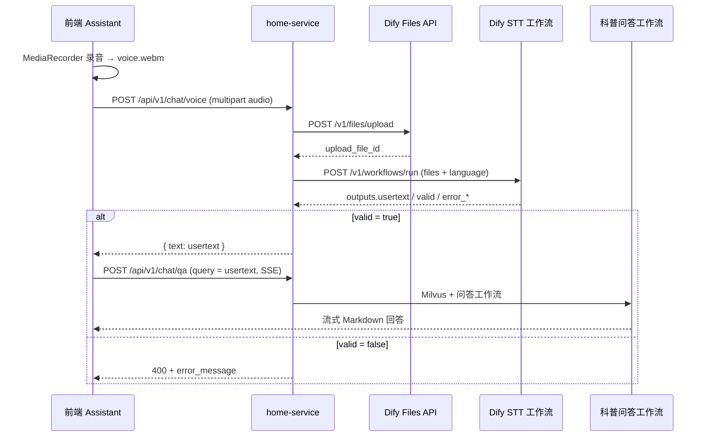
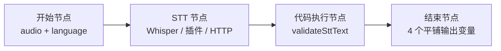

# 语音识别（STT）Dify 工作流数据契约

本文档定义 **AI 科普助手语音输入** 场景下，用户录音后调用的 Dify **语音识别（Speech-to-Text, STT）** 工作流数据契约。依据 [科普问答工作流数据契约.md](./科普问答工作流数据契约.md) 与 [Dify工作流数据契约.md](./Dify工作流数据契约.md) 编写。

> 本工作流由 **home-service** 代理调用 Dify **Workflow API**（`blocking` 模式）。  
> 用户录音上传后，后端先将音频文件提交 Dify Files API，再调用 STT 工作流完成识别；工作流返回 4 个**平铺**输出变量后，后端取 `usertext` 作为科普问答工作流的 `query` 继续问答。  
> 落地时需新增 `DifySttWorkflowContract.java` 与 `VoiceSttService`（规划）。

| 项目 | 说明 |
|------|------|
| 文档版本 | v1.0 |
| 编写日期 | 2026-07-03 |
| 关联服务 | `home-service`（规划新增 `VoiceSttService`） |
| 关联页面 | `frontend/src/views/Assistant/index.vue`、`frontend/src/components/AiChatDialog.vue` |
| 输出变量 | `usertext`、`error_message`、`error_type`、`valid`（结束节点平铺，均来自代码执行节点） |
| 响应模式 | `blocking` |

---

## 1. 业务场景

### 1.1 目标

用户在 AI 科普助手中通过**麦克风**输入健康问题，后端将录音交给 Dify STT 工作流识别为文字；识别通过后，将 `usertext` 传入现有科普问答流程（Milvus 检索 + 问答工作流），最终以文字形式展示回答。

### 1.2 触发时机

| 项目 | 说明 |
|------|------|
| 触发角色 | 用户（登录或未登录均可） |
| 调用方 | `home-service`（规划 `VoiceSttService`） |
| 触发时机 | 用户按住/点击麦克风完成录音后 |
| 工作流职责 | 将音频转为可问答的中文文本，并校验识别结果是否有效 |
| 不替代 | 科普回答仍走现有 `POST /api/v1/chat/qa`（SSE 流式） |

### 1.3 交互时序



---

## 2. 调用方式

| 项目 | 说明 |
|------|------|
| 工作流接口 | `POST {DIFY_BASE_URL}/v1/workflows/run` |
| 文件上传接口 | `POST {DIFY_BASE_URL}/v1/files/upload`（平台内置，**非**独立工作流） |
| 认证 | `Authorization: Bearer {DIFY_STT_API_KEY}` |
| Content-Type（工作流） | `application/json` |
| Content-Type（上传） | `multipart/form-data` |
| 响应模式 | `response_mode: "blocking"`（固定） |
| user 标识 | JWT 用户 ID 或 `guest_xxx` |

### 2.1 环境变量（规划）

```bash
DIFY_STT_API_KEY=app-xxxxxxxx              # STT 工作流 API Key
DIFY_STT_RESPONSE_MODE=blocking
DIFY_STT_MAX_AUDIO_SECONDS=60               # 业务层录音时长上限（秒）
DIFY_STT_MAX_AUDIO_BYTES=5242880            # 5 MB
```

`home-service` 的 `application.yml` 规划配置：

```yaml
dify:
  workflows:
    stt:
      api-key: ${DIFY_STT_API_KEY:}
      response-mode: ${DIFY_STT_RESPONSE_MODE:blocking}
      max-audio-seconds: ${DIFY_STT_MAX_AUDIO_SECONDS:60}
      max-audio-bytes: ${DIFY_STT_MAX_AUDIO_BYTES:5242880}
```

### 2.2 与科普问答的关系

| 项目 | STT 工作流（本文档） | 科普问答工作流 |
|------|---------------------|----------------|
| 输入 | `audio`（单文件）+ `language`（文本） | `query`（文本）+ `knowledge_context`（文本） |
| 输出 | `usertext`、`valid`、`error_message`、`error_type` | `text`（Markdown 回答）等 |
| 响应模式 | `blocking` | `streaming` |
| 多轮对话 | 单次识别，无 `conversation_id` | 支持 `conversation_id` |

---

## 3. 工作流节点设计（Dify 编排）



| 节点 | 类型 | 说明 |
|------|------|------|
| 开始 | Start | 接收 `audio`（**File / 音频**）、`language`（文本，可选） |
| 语音识别 | STT / HTTP / 插件 | 将 `audio` 转为原始文本，输出至代码节点（如变量 `stt_text`） |
| 校验 | 代码执行（JavaScript） | 调用 `validateSttText`，输出 `text`、`valid`、`error_message`、`error_type` |
| 结束 | End | **平铺**映射代码节点 4 个字段（见 §5） |

**结束节点输出变量映射（与 Dify 控制台配置一致）：**

| 结束节点变量名 | 来源节点 | 来源字段 | 类型 |
|----------------|----------|----------|------|
| `usertext` | 代码执行 | `text` | String |
| `error_message` | 代码执行 | `error_message` | String |
| `error_type` | 代码执行 | `error_type` | String |
| `valid` | 代码执行 | `valid` | Boolean |

> `usertext` 为面向业务的用户识别文本；代码节点内部统一使用 `text`，在结束节点映射为 `usertext`。

---

## 4. 传入数据

### 4.1 工作流开始节点变量（与 Dify 控制台一致）

| 变量名 | Dify 类型 | 必填 | 数据来源 | 说明 |
|--------|-----------|------|----------|------|
| `audio` | **File（音频）** | 是 | 用户录音 | 单文件；Dify 支持 **MP3、M4A、WAV、AMR、MPGA**（不支持 WebM） |
| `language` | **文本（String）** | 否 | 后端固定 | 识别语言，默认 `zh-CN` |

### 4.2 开始节点 JSON Schema

```json
{
  "type": "object",
  "properties": {
    "audio": {
      "type": "string",
      "format": "audio"
    },
    "language": {
      "type": "string",
      "default": "zh-CN"
    }
  },
  "required": ["audio"],
  "additionalProperties": false
}
```

### 4.3 第 ① 步：上传音频（Dify Files API）

```
POST {DIFY_BASE_URL}/v1/files/upload
Authorization: Bearer {DIFY_STT_API_KEY}
Content-Type: multipart/form-data
```

| 表单字段 | 类型 | 必填 | 说明 |
|----------|------|------|------|
| `file` | binary | 是 | 录音文件，如 `voice.webm` |
| `user` | string | 是 | 与后续工作流调用的 `user` 一致 |

**响应示例：**

```json
{
  "id": "72fa9618-8f89-4a37-9b33-7e0e5c4f3a21",
  "name": "voice.webm",
  "size": 48231,
  "extension": "webm",
  "mime_type": "audio/webm",
  "created_by": "usr_001",
  "created_at": 1718000000
}
```

### 4.4 第 ② 步：调用 STT 工作流

`audio` 为单文件变量时，Workflow API 将文件映射放在请求体**顶层 `files` 数组**（仅 1 项），`language` 放在 `inputs` 中：

```json
{
  "inputs": {
    "language": "zh-CN"
  },
  "files": [
    {
      "variable": "audio",
      "type": "audio",
      "transfer_method": "local_file",
      "upload_file_id": "72fa9618-8f89-4a37-9b33-7e0e5c4f3a21"
    }
  ],
  "response_mode": "blocking",
  "user": "usr_001"
}
```

| 顶层字段 | 类型 | 必填 | 说明 |
|----------|------|------|------|
| `inputs.language` | string | 否 | 默认 `zh-CN` |
| `files` | array | 是 | 长度固定为 1 |
| `files[].variable` | string | 是 | 固定 `"audio"`，与开始节点变量名一致 |
| `files[].type` | string | 是 | 固定 `"audio"`（与 Dify 上传检测到的 MIME 一致） |
| `files[].transfer_method` | string | 是 | 固定 `"local_file"` |
| `files[].upload_file_id` | string | 是 | §4.3 上传接口返回的 `id` |
| `response_mode` | string | 是 | 固定 `"blocking"` |
| `user` | string | 是 | 用户标识，与上传文件时一致 |

**Dify 编排提示：** STT 节点输入直接选择 `开始.audio`。

### 4.5 业务约束（后端校验，不进 Dify）

| 约束 | 建议值 |
|------|--------|
| 音频时长 | ≤ 60 秒 |
| 文件大小 | ≤ 5 MB |
| 支持格式 | `audio/mp4`（M4A）、`audio/mpeg`（MP3）、`audio/wav`、`audio/amr`；**不支持 WebM** |
| 识别文本上限 | `usertext` ≤ 500 字符（与科普问答 `query` 一致） |

### 4.6 对外 API 请求（用户 → 后端）

用户仅上传音频，不接触 Dify：

```
POST /api/v1/chat/voice
Content-Type: multipart/form-data
Authorization: Bearer {JWT}（可选）
```

| 表单字段 | 类型 | 必填 | 说明 |
|----------|------|------|------|
| `audio` | file | 是 | 浏览器 `MediaRecorder` 产物 |

---

## 5. 工作流返回数据（4 个平铺字段）

工作流结束节点输出以下 **4 个平铺变量**，均映射自**代码执行节点**：

| 字段 | 类型 | 说明 |
|------|------|------|
| `usertext` | string | 校验通过后的用户识别文本；`valid=false` 时为空字符串 |
| `valid` | boolean | 识别结果是否有效、可用于后续问答 |
| `error_message` | string | 失败时展示给用户的提示；成功时为空字符串 |
| `error_type` | string | 错误类型标识；成功时为空字符串 |

### 5.1 输出 JSON Schema（结束节点）

```json
{
  "type": "object",
  "properties": {
    "usertext": {
      "type": "string"
    },
    "valid": {
      "type": "boolean"
    },
    "error_message": {
      "type": "string"
    },
    "error_type": {
      "type": "string"
    }
  },
  "required": ["usertext", "valid", "error_message", "error_type"],
  "additionalProperties": false
}
```

### 5.2 Dify `blocking` 完整响应示例

**识别成功：**

```json
{
  "workflow_run_id": "wr_stt_001",
  "task_id": "task_stt_001",
  "data": {
    "id": "wr_stt_001",
    "workflow_id": "wf_stt_001",
    "status": "succeeded",
    "outputs": {
      "usertext": "糖尿病患者可以吃水果吗？哪些水果比较适合？",
      "valid": true,
      "error_message": "",
      "error_type": ""
    },
    "error": null,
    "elapsed_time": 1.65,
    "created_at": 1718000000,
    "finished_at": 1718000002
  }
}
```

**识别失败（无有效语音）：**

```json
{
  "data": {
    "status": "succeeded",
    "outputs": {
      "usertext": "",
      "valid": false,
      "error_message": "未识别到有效文字，请重新录制",
      "error_type": "empty_text"
    }
  }
}
```

**识别失败（文本过长）：**

```json
{
  "data": {
    "status": "succeeded",
    "outputs": {
      "usertext": "",
      "valid": false,
      "error_message": "识别内容过长，请控制在 500 字以内",
      "error_type": "text_too_long"
    }
  }
}
```

### 5.3 后端解析规则（规划）

```java
JsonNode outputs = response.path("data").path("outputs");
boolean valid = outputs.path("valid").asBoolean(false);
String userText = outputs.path("usertext").asText("").trim();

if (!valid || userText.isBlank()) {
    String err = outputs.path("error_message").asText("语音识别失败");
    throw new BusinessException(400, err);
}
// userText 作为科普问答的 query
```

### 5.4 对外 API 成功响应（后端 → 前端）

```json
{
  "code": 200,
  "message": "success",
  "data": {
    "text": "糖尿病患者可以吃水果吗？",
    "language": "zh-CN"
  }
}
```

> 对外字段名使用 `text`，值为工作流 `outputs.usertext`。

---

## 6. 代码执行节点：识别文本校验（JavaScript）

将以下逻辑放入 Dify **代码执行**节点。STT 节点输出变量假设为 `stt_text`，代码节点输出 `text`、`valid`、`error_message`、`error_type`，再由结束节点映射为 §5 的 4 个平铺字段。

```javascript
/**
 * 校验语音识别文本是否有效。
 * @param {string} rawText
 * @param {object} [options]
 * @returns {{ valid, message, error_message, error_type, text }}
 */
function validateSttText(rawText, options = {}) {
  const { maxLength = 500, minLength = 2 } = options

  const fail = (errorType, errorMessage) => ({
    valid: false,
    message: errorMessage,
    error_message: errorMessage,
    error_type: errorType,
    text: '',
  })

  const ok = (text) => ({
    valid: true,
    message: '识别成功',
    error_message: '',
    error_type: '',
    text,
  })

  if (rawText == null) {
    return fail('empty_text', '未识别到有效文字，请重新录制')
  }

  const text = String(rawText).replace(/\s+/g, ' ').trim()

  if (!text) {
    return fail('empty_text', '未识别到有效文字，请重新录制')
  }

  if (text.length < minLength) {
    return fail('text_too_short', '识别内容过短，请重新录制')
  }

  if (text.length > maxLength) {
    return fail('text_too_long', `识别内容过长，请控制在 ${maxLength} 字以内`)
  }

  const contentWithoutPunct = text.replace(/[\s\p{P}\p{S}]/gu, '')
  if (!contentWithoutPunct) {
    return fail('invalid_content', '未识别到有效内容，请重新录制')
  }

  if (/^(.)\1{4,}$/u.test(contentWithoutPunct)) {
    return fail('invalid_content', '识别结果异常，请重新录制')
  }

  return ok(text)
}

function main({ stt_text }) {
  const result = validateSttText(stt_text, { maxLength: 500, minLength: 2 })
  return {
    text: result.text,
    valid: result.valid,
    error_message: result.error_message,
    error_type: result.error_type,
  }
}
```

### 6.1 `error_type` 枚举

| `error_type` | 触发条件 | `error_message` 示例 |
|--------------|----------|----------------------|
| `empty_text` | 空、纯空白 | 未识别到有效文字，请重新录制 |
| `text_too_short` | 少于 2 个字符 | 识别内容过短，请重新录制 |
| `text_too_long` | 超过 500 字符 | 识别内容过长，请控制在 500 字以内 |
| `invalid_content` | 仅标点或重复噪声 | 未识别到有效内容，请重新录制 |
| `stt_service_error` | STT 节点异常（由编排兜底） | 语音识别服务暂时不可用 |

---

## 7. 与科普问答的衔接

识别成功后，前端或后端使用 `usertext` 调用现有问答接口：

```json
POST /api/v1/chat/qa
Content-Type: application/json

{
  "query": "糖尿病患者可以吃水果吗？",
  "conversationId": "conv_a1b2c3d4"
}
```

| 阶段 | 字段映射 |
|------|----------|
| STT 工作流输出 | `outputs.usertext` |
| 科普问答输入 | `request.query` |
| 前端展示（用户消息气泡） | `usertext` 原文 |

**推荐 UX：** 识别成功后先将 `usertext` 填入输入框供用户确认或编辑，再点击发送；医疗场景下避免未经确认自动发问。

---

## 8. 契约查询 API（规划）

```
GET /api/v1/chat/stt/dify-workflow-spec
```

返回入参/出参 JSON Schema、文件上传说明与示例（风格对齐 `GET /api/v1/chat/dify-workflow-spec`）。

---

## 9. 落地清单

| 层级 | 任务 |
|------|------|
| Dify | 配置开始节点 `audio`（File/音频）+ `language`；STT 节点；代码执行节点；结束节点 4 平铺输出 |
| 后端 | `DifyClient.uploadFile`、`DifySttWorkflowContract`、`VoiceSttService`、`POST /chat/voice` |
| 配置 | `DIFY_STT_API_KEY`、`dify.workflows.stt.*` |
| 前端 | `useVoiceInput`、`voiceToText` API、麦克风按钮 |
| 测试 | 上传 webm → `valid=true` + `usertext` → `chatQA` 端到端 |

---

## 10. 相关文档

- [科普问答工作流数据契约.md](./科普问答工作流数据契约.md) — 识别完成后的问答流程
- [Dify工作流数据契约.md](./Dify工作流数据契约.md) — 全项目工作流汇总
- [大模型技术使用说明.md](./大模型技术使用说明.md) — Dify 与模型接入说明
