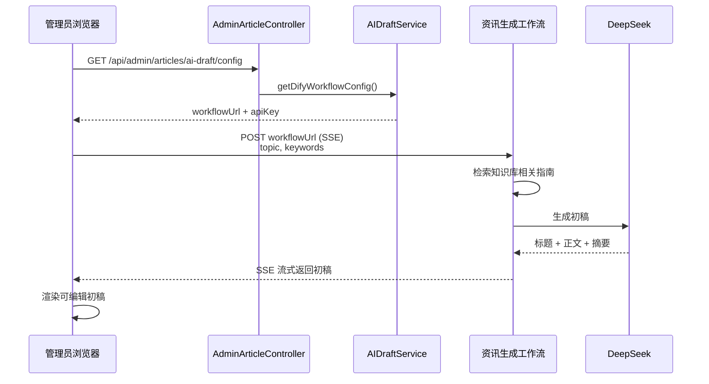

# 资讯生成工作流数据契约

本文档定义**管理端 AI 辅助生成资讯初稿**所调用的 Dify 工作流数据契约，依据 `[模块设计与交互原型设计.md](./模块设计与交互原型设计.md)` **§2.1.8 健康资讯管理模块设计类交互模型** 编写。

> 与 `Dify工作流数据契约.md` 中「后端代理调用」的工作流不同，本工作流由**管理端前端直接调用** Dify Workflow API；后端仅通过 `GET /api/v1/admin/articles/ai-draft/config` 下发 `workflowUrl` 与 `apiKey`。

---

## 1. 业务场景


| 项目    | 说明                                               |
| ----- | ------------------------------------------------ |
| 触发角色  | 管理员（管理端浏览器）                                      |
| 调用方   | 管理端前端（非 article-service 后端）                      |
| 工作流职责 | 检索糖尿病知识库 → LLM 生成 Markdown 初稿（标题、摘要、正文、标签）       |
| 响应模式  | **streaming**（SSE 流式），便于前端逐段渲染正文                 |
| 后续流程  | 管理员编辑初稿 → 调用 `POST /api/v1/admin/articles` 保存为草稿 |


### 1.1 交互时序（摘自 §2.1.8）




---


## 2. 调用方式


| 项目           | 说明                                                          |
| ------------ | ----------------------------------------------------------- |
| 接口           | `POST {workflowUrl}`，通常为 `{DIFY_BASE_URL}/v1/workflows/run` |
| 认证           | `Authorization: Bearer {DIFY_ARTICLE_DRAFT_API_KEY}`        |
| Content-Type | `application/json`                                          |
| Accept       | `text/event-stream`（流式模式）                                   |
| 响应模式         | `response_mode: "streaming"`（固定）                            |
| user 标识      | 建议传管理员 ID，如 `admin_001`                                     |


### 2.1 环境变量


| 变量                           | 说明                                           |
| ---------------------------- | -------------------------------------------- |
| `DIFY_ARTICLE_DRAFT_API_KEY` | 资讯初稿工作流 API Key                              |
| `DIFY_ARTICLE_DRAFT_URL`     | 工作流完整 URL（article-service 读取后通过 config 接口下发） |
| `DIFY_BASE_URL`              | Dify 服务根地址（本地/Docker 部署时使用）                  |


后端配置位置：`backend/article-service/src/main/resources/application.yml` → `dify.workflows.article-draft`。

### 2.2 配置接口响应

`GET /api/v1/admin/articles/ai-draft/config` 返回示例：

```json
{
  "code": 200,
  "data": {
    "workflowUrl": "https://dify.example.com/v1/workflows/run",
    "apiKey": "app-xxxxxxxxxxxx",
    "inputs": {
      "topic": "string(主题)",
      "keywords": "string(关键词)"
    }
  }
}
```

前端仅需从 `inputs` 获知**管理员需填写的字段名**；实际调用时将 `topic`、`keywords` 写入 Dify 请求体 `inputs`。

---


## 3. 传入数据


### 3.1 开始节点变量（平铺 2 字段）

本工作流开始节点配置 **2 个独立 String 变量**（非单个 `inputs` Object 包裹），与打卡分析、健康方案工作流类似。


| 字段         | 类型     | 数据来源      | 说明                              |
| ---------- | ------ | --------- | ------------------------------- |
| `topic`    | string | **管理员输入** | 资讯主题，如「糖尿病饮食管理」                 |
| `keywords` | string | **管理员输入** | 关键词，逗号分隔，如「糖尿病,饮食,GI值,血糖控制」     |


> **前端实际提交字段：** 仅 `topic`、`keywords`。知识库检索与科普写作专家角色（系统提示词）均在 **Dify 工作流内**配置，不作为开始节点入参。


### 3.2 传入数据 JSON Schema（Dify 开始节点）

粘贴至 Dify 工作流各开始变量时使用（2 个变量均为 `{ "type": "string" }`）。以下为合并后的逻辑 Schema，便于对照：

```json
{
  "type": "object",
  "properties": {
    "topic": {
      "type": "string"
    },
    "keywords": {
      "type": "string"
    }
  },
  "required": ["topic"],
  "additionalProperties": true
}
```

### 3.3 HTTP 请求体示例（streaming）

```json
{
  "response_mode": "streaming",
  "user": "admin_001",
  "inputs": {
    "topic": "糖尿病饮食管理",
    "keywords": "糖尿病,饮食,GI值,血糖控制,低糖"
  }
}
```

**curl 示例：**

```bash
curl -N -X POST "https://dify.example.com/v1/workflows/run" \
  -H "Authorization: Bearer app-xxxxxxxxxxxx" \
  -H "Content-Type: application/json" \
  -H "Accept: text/event-stream" \
  -d '{
    "response_mode": "streaming",
    "user": "admin_001",
    "inputs": {
      "topic": "糖尿病饮食管理",
      "keywords": "糖尿病,饮食,GI值,血糖控制,低糖"
    }
  }'
```


### 3.4 工作流内变量赋值示意

Dify 编排时，知识检索结果直接接入 LLM 用户提示词；系统提示词写在 LLM 节点内，不经过开始节点：


| 节点          | 输入                                      | 输出           |
| ----------- | --------------------------------------- | ------------ |
| 开始          | `topic`, `keywords`                     | —            |
| 知识库检索       | query = `{{topic}} {{keywords}}`        | 检索片段（节点内变量）  |
| LLM         | `topic`, `keywords` + 检索片段；系统提示词节点内固定 | 结构化初稿 JSON   |
| 结束 / Answer | —                                       | 见 §4         |


---


## 4. 工作流需返回的数据

管理端前端按 **SSE 事件** 解析流式响应。设计文档约定的业务数据结构如下。

### 4.1 流式事件类型


| event        | 说明                |
| ------------ | ----------------- |
| `text_chunk` | 正文或其他字段增量片段，可多次推送 |
| `complete`   | 生成完成，携带完整初稿对象     |
| `error`      | 生成失败，携带错误信息       |


### 4.2 单次 SSE 数据包结构（`text_chunk`）

流式过程中，`data.content` 随 chunk 累积；`title`、`summary`、`tags` 可在首个 chunk 或 `complete` 事件中给出。

```json
{
  "event": "text_chunk",
  "data": {
    "title": "糖尿病患者的科学饮食指南",
    "summary": "本文详细介绍了糖尿病患者如何通过科学饮食控制血糖...",
    "content": "# 糖尿病患者的科学饮食指南\n\n## 一、饮食原则\n糖尿病患者饮食控制的核心是...\n\n## 二、推荐食物\n### 2.1 低GI食物\n...\n\n## 三、应避免的食物\n...",
    "tags": ["糖尿病", "饮食", "血糖控制", "营养"]
  }
}
```


### 4.3 完成事件（`complete`）

```json
{
  "event": "complete",
  "data": {
    "title": "糖尿病患者的科学饮食指南",
    "summary": "本文详细介绍了糖尿病患者如何通过科学饮食控制血糖，涵盖饮食原则、推荐食物与禁忌事项。",
    "content": "# 糖尿病患者的科学饮食指南\n\n## 一、饮食原则\n...\n\n## 二、推荐食物\n...\n\n## 三、应避免的食物\n...",
    "tags": ["糖尿病", "饮食", "血糖控制", "营养"]
  }
}
```


### 4.4 错误事件（`error`）

```json
{
  "event": "error",
  "data": {
    "code": "GENERATION_FAILED",
    "message": "知识库检索无结果，请调整主题或关键词后重试"
  }
}
```


### 4.5 返回字段说明


| 字段                     | 类型       | 必填          | 说明                                  |
| ---------------------- | -------- | ----------- | ----------------------------------- |
| `event`                | string   | 是           | `text_chunk` / `complete` / `error` |
| `data.title`           | string   | 是（complete） | AI 生成的资讯标题                          |
| `data.summary`         | string   | 是（complete） | AI 生成的资讯摘要（建议 80~200 字）             |
| `data.content`         | string   | 是（complete） | Markdown 格式正文；流式模式下逐段追加             |
| `data.tags`            | string[] | 否           | 推荐标签，3~8 个                          |
| `data.code`            | string   | error 时     | 错误码                                 |
| `data.message`         | string   | error 时     | 错误描述                                |


### 4.6 阻塞模式参考（Dify 控制台调试）

前端正式环境使用 streaming；在 Dify 控制台调试时可临时使用 `response_mode: "blocking"`。建议结束节点输出变量名为 `article_draft`：

**HTTP 响应示例：**

```json
{
  "data": {
    "status": "succeeded",
    "outputs": {
      "article_draft": {
        "title": "糖尿病患者的科学饮食指南",
        "summary": "本文详细介绍了糖尿病患者如何通过科学饮食控制血糖...",
        "content": "# 糖尿病患者的科学饮食指南\n\n## 一、饮食原则\n...",
        "tags": ["糖尿病", "饮食", "血糖控制", "营养"]
      }
    }
  }
}
```

**LLM Structured Output JSON Schema（**`article_draft`**）：**

```json
{
  "type": "object",
  "properties": {
    "title": {
      "type": "string"
    },
    "summary": {
      "type": "string"
    },
    "content": {
      "type": "string"
    },
    "tags": {
      "type": "array",
      "items": {
        "type": "string"
      }
    }
  },
  "required": ["title", "summary", "content"],
  "additionalProperties": true
}
```

> 流式模式下，可由 Code 节点或 Answer 节点将 LLM 输出包装为 §4.2 约定的 `{ event, data }` 格式，再通过 Dify SSE 通道推送。

---


## 5. 与业务对象映射


### 5.1 ArticleDraftVO（设计类）


| 工作流字段                  | ArticleDraftVO | 说明                      |
| ---------------------- | -------------- | ----------------------- |
| `data.title`           | `title`        | 初稿标题                    |
| `data.content`         | `content`      | Markdown 正文             |
| `data.summary`         | `summary`      | 摘要                      |
| `data.tags`            | `tags`         | 标签列表                    |

> **封面图**：工作流不返回封面字段；保存草稿时由管理员在编辑表单中自行上传（`POST /api/v1/admin/articles/{id}/cover`）。


### 5.2 保存草稿 API

管理员确认初稿后，调用创建资讯接口：

```json
POST /api/v1/admin/articles

{
  "title": "糖尿病患者的科学饮食指南",
  "content": "# 糖尿病患者的科学饮食指南\n\n...",
  "summary": "本文详细介绍了糖尿病患者如何通过科学饮食控制血糖...",
  "category": "diet",
  "tags": ["糖尿病", "饮食", "血糖控制", "营养"]
}
```


| 创建字段                                     | 来源                         |
| ---------------------------------------- | -------------------------- |
| `title` / `content` / `summary` / `tags` | 工作流 `complete.data`        |
| `coverImage`                             | 管理员在编辑表单中上传封面图            |
| `category`                               | 管理员选择（工作流不生成）              |


---


## 6. Dify 工作流编排建议

1. **开始节点**：2 个 String 变量 — `topic`、`keywords`。
2. **知识库检索**：使用 Milvus / Dify 知识库，query 拼接 `topic` 与 `keywords`；检索结果直接引用至 LLM 用户提示词，不暴露为开始节点变量。
3. **LLM 节点**：模型 DeepSeek；**系统提示词**内固定「糖尿病科普写作专家」角色与输出约束，要求输出 Markdown、语气通俗、引用知识库片段。
4. **Structured Output**：约束输出 `title`、`summary`、`content`、`tags`（不含封面图）。
5. **流式 Answer**：将 `content` 字段分 chunk 推送，`complete` 时输出完整对象。
6. **结束节点**：blocking 调试时输出 `article_draft` Object。

---


## 7. 相关文档与代码


| 资源           | 路径                                                                            |
| ------------ | ----------------------------------------------------------------------------- |
| 模块设计 §2.1.8  | `docs/模块设计与交互原型设计.md`                                                         |
| 后端 config 接口 | `backend/article-service/.../AdminArticleController.java` → `aiDraftConfig()` |
| 配置读取         | `backend/article-service/.../ArticleService.java` → `aiDraftConfig()`         |
| 管理端 API      | `admin-frontend/src/api/article.js` → `getAiDraftConfig()`                    |
| 后端代理类工作流汇总   | `docs/Dify工作流数据契约.md` §9（注明本工作流为前端直调）                                         |


---


## 8. 变更记录


| 日期         | 说明                               |
| ---------- | -------------------------------- |
| 2026-06-28 | 初版，依据 §2.1.8 交互模型撰写传入/返回 JSON 契约 |
| 2026-06-28 | 开始节点入参精简为 `topic`、`keywords`；`system_prompt`、`knowledge_context` 改为工作流内配置 |
| 2026-06-29 | 移除返回字段 `suggested_cover`；封面图改由管理员自行上传 |


