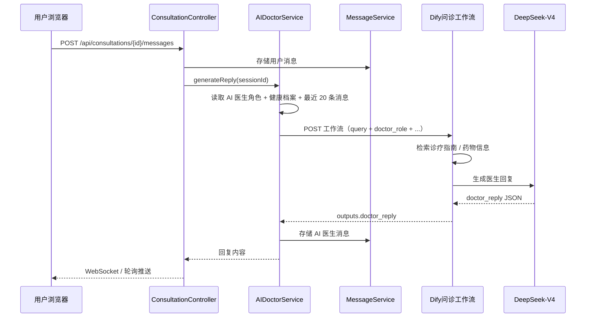

# AI 模拟医生问诊工作流数据契约

本文档定义**医生在线咨询（AI 医生模拟）**所调用的 Dify 工作流数据契约，依据 `[模块设计与交互原型设计.md](./模块设计与交互原型设计.md)` **§2.1.2 医生在线咨询模块设计类交互模型** 编写。

> 本工作流由 **consultation-service** 的 `AIDoctorService` 代理调用 Dify **Workflow API**（`blocking` 模式）。  
> 用户发送消息后，后端组装患者档案、会话历史、AI 医生角色与知识上下文，调用工作流生成 **AI 医生回复**（`doctor_reply`），再写入 `consultation_messages` 并推送给前端。  
> 当前 `consultation-service` 为占位实现，本文档为落地与 Dify 编排的契约基准。

---

## 1. 业务场景


| 项目    | 说明                                                                                      |
| ----- | --------------------------------------------------------------------------------------- |
| 触发角色  | 登录用户                                                                                    |
| 调用方   | `AIDoctorService`（`consultation-service` 后端）                                            |
| 触发时机  | 用户 `POST /api/consultations/{sessionId}/messages` 发送消息后，自动调用 `generateReply(sessionId)` |
| 工作流职责 | 结合 AI 医生角色、患者档案、多轮对话与诊疗知识库，生成面向用户的 Markdown 回复及结构化辅助建议                                  |
| 响应模式  | **blocking**（阻塞，一次返回完整结果）                                                               |
| 输出变量名 | `doctor_reply`                                                                          |


### 1.1 交互时序（摘自 §2.1.2）




---


## 2. 调用方式


| 项目           | 说明                                                  |
| ------------ | --------------------------------------------------- |
| 接口           | `POST {DIFY_BASE_URL}/v1/workflows/run`             |
| 认证           | `Authorization: Bearer {DIFY_CONSULTATION_API_KEY}` |
| Content-Type | `application/json`                                  |
| 响应模式         | `response_mode: "blocking"`（固定）                     |
| user 标识      | 当前用户 ID，如 `usr_001`                                 |


### 2.1 环境变量（规划）


| 变量                                  | 说明                       |
| ----------------------------------- | ------------------------ |
| `DIFY_CONSULTATION_API_KEY`         | AI 问诊工作流 API Key         |
| `DIFY_BASE_URL`                     | Dify 服务根地址               |
| `DIFY_CONSULTATION_RESPONSE_MODE`   | 固定 `blocking`            |
| `DIFY_CONSULTATION_TIMEOUT_SECONDS` | 建议 ≥ 120（问诊 LLM + 知识库检索） |


> 落地时在 `consultation-service` 的 `application.yml` 增加 `dify.workflows.consultation` 配置，并新增 `DifyConsultationWorkflowContract.java` 与 `consultation-input.schema.json`。


### 2.2 契约查询 API（规划）

`GET /api/v1/consultations/dify-workflow-spec` 返回 Schema 与示例（与其他服务 `dify-workflow-spec` 风格一致）。

---


## 3. 传入数据


### 3.1 开始节点变量（平铺 6 字段）

本工作流开始节点配置 **6 个独立变量**（与打卡分析、健康方案工作流相同，**不使用** `inputs.inputs` 双层嵌套）。


| 字段                     | 类型     | 数据来源                      | 说明                                      |
| ---------------------- | ------ | ------------------------- | --------------------------------------- |
| `query`                | string | **用户最新消息**                | 当前问诊消息原文                                |
| `conversation_id`      | string | **会话表**                   | 咨询会话 ID（`sessionId`），用于日志追踪与多轮关联        |
| `doctor_role`          | string | **AI 医生预设配置**             | 角色设定（科室、擅长、语气），如「资深内分泌科主任医师…」           |
| `patient_profile`      | string | **健康档案**                  | 用户基本信息 JSON 字符串或拼接文本（年龄、性别、身高、体重、病史等）   |
| `conversation_history` | string | **consultation_messages** | 当前会话最近 20 条消息，拼接为对话上下文                  |
| `knowledge_context`    | string | **知识库检索**                 | 诊疗指南、药物信息片段；可由后端 Milvus 传入，或工作流内知识库节点生成 |


> **后端组装字段：** `query`、`conversation_id`、`doctor_role`、`patient_profile`、`conversation_history`；`knowledge_context` 二选一由后端检索填充。  
> **不传** `system_prompt`**：** 问诊安全规则、免责声明写在 **LLM 节点系统提示词**中；具体医生人设由 `doctor_role` 传入。


### 3.2 传入数据 JSON Schema（Dify 开始节点）

```json
{
  "type": "object",
  "properties": {
    "query": {
      "type": "string"
    },
    "conversation_id": {
      "type": "string"
    },
    "doctor_role": {
      "type": "string"
    },
    "patient_profile": {
      "type": "string"
    },
    "conversation_history": {
      "type": "string"
    },
    "knowledge_context": {
      "type": "string"
    }
  },
  "required": [],
  "additionalProperties": true
}
```


### 3.3 `patient_profile` 示例（JSON 字符串）

```json
{
  "age": 52,
  "gender": "male",
  "height": 170,
  "weight": 78,
  "bmi": 27.0,
  "fastingGlucose": 7.2,
  "diabetesType": "type2",
  "medications": ["二甲双胍 0.5g bid"],
  "familyHistory": true
}
```


### 3.4 `conversation_history` 示例（拼接文本）

```text
[用户 2024-06-10 10:00] 医生您好，我最近空腹血糖经常在7以上，体重也下降了3公斤。
[AI医生 2024-06-10 10:01] 感谢您的描述。请问这种情况持续多久了？是否有多饮、多尿？
[用户 2024-06-10 10:02] 大概两个月，确实口渴明显，夜尿增多。
```


### 3.5 HTTP 请求体示例（调用 Dify Workflow API）

```json
{
  "response_mode": "blocking",
  "user": "usr_001",
  "inputs": {
    "query": "大概两个月了，确实口渴明显，夜尿增多，需要做什么检查？",
    "conversation_id": "sess_a1b2c3d4",
    "doctor_role": "你是一名资深内分泌科主任医师，擅长糖尿病及代谢综合征诊疗。回复应专业、温和，使用 Markdown 列表组织建议。",
    "patient_profile": "{\"age\":52,\"gender\":\"male\",\"height\":170,\"weight\":78,\"fastingGlucose\":7.2,\"familyHistory\":true}",
    "conversation_history": "[用户 2024-06-10 10:00] 医生您好，我最近空腹血糖经常在7以上...\n[AI医生 2024-06-10 10:01] 感谢您的描述。请问...",
    "knowledge_context": "【片段1 | 中国2型糖尿病防治指南 | 相似度:0.93】\n空腹血糖≥7.0mmol/L 需结合 OGTT 与 HbA1c 进一步评估..."
  }
}
```

**curl 示例：**

```bash
curl -X POST "https://dify.example.com/v1/workflows/run" \
  -H "Authorization: Bearer app-xxxxxxxxxxxx" \
  -H "Content-Type: application/json" \
  -d '{
    "response_mode": "blocking",
    "user": "usr_001",
    "inputs": {
      "query": "大概两个月了，确实口渴明显，夜尿增多，需要做什么检查？",
      "conversation_id": "sess_a1b2c3d4",
      "doctor_role": "你是一名资深内分泌科主任医师...",
      "patient_profile": "{\"age\":52,\"gender\":\"male\"}",
      "conversation_history": "[用户] ...",
      "knowledge_context": "【片段1】..."
    }
  }'
```


### 3.6 对外 API 与 Dify 的对应关系

用户侧仅调用业务 API，**不传** Dify 字段：

```json
POST /api/v1/consultations/{sessionId}/messages

{
  "content": "大概两个月了，确实口渴明显，夜尿增多",
  "imageUrl": null
}
```


| 业务 API             | 映射到 Dify `inputs`      |
| ------------------ | ---------------------- |
| `content`          | `query`                |
| `{sessionId}` 路径参数 | `conversation_id`      |
| JWT `userId`       | HTTP `user`            |
| AI 医生配置            | `doctor_role`          |
| health-service 档案  | `patient_profile`      |
| 本会话历史消息            | `conversation_history` |
| Milvus / Dify KB   | `knowledge_context`    |


---


## 4. 工作流需返回的数据


### 4.1 结束节点输出（`outputs.doctor_reply`）

**HTTP 响应示例（blocking）：**

```json
{
  "data": {
    "status": "succeeded",
    "outputs": {
      "doctor_reply": {
        "content": "根据您描述的餐后血糖偏高和体重下降的情况，建议您：\n1. 完善糖耐量试验（OGTT）明确诊断\n2. 监测空腹及三餐后 2 小时血糖\n3. 内分泌科门诊进一步评估\n\n⚠️ 以上建议仅供参考，不能替代线下就医。",
        "suggestion": {
          "possible_diagnoses": [
            { "name": "2型糖尿病", "probability": "high" },
            { "name": "糖耐量异常", "probability": "medium" }
          ],
          "suggested_questions": [
            "您是否有多饮、多尿的症状？",
            "家族中是否有糖尿病患者？"
          ],
          "recommended_exams": ["空腹血糖", "OGTT", "糖化血红蛋白"],
          "treatment_strategy": "生活方式干预为基础，必要时启动口服降糖药物治疗"
        }
      }
    }
  }
}
```

> 模块设计原文中工作流顶层还包含 `id`、`workflow_id`、`elapsed_time` 等元数据；后端解析以 `data.outputs.doctor_reply` 为准（与 `Dify工作流数据契约.md` §1.4 一致）。


### 4.2 返回字段说明


| 字段                                            | 类型       | 必填  | 说明                                         |
| --------------------------------------------- | -------- | --- | ------------------------------------------ |
| `content`                                     | string   | 是   | AI 医生面向用户的 Markdown 回复                     |
| `suggestion`                                  | object   | 否   | 结构化辅助建议（可供 `GET .../ai-suggestion` 或医生端参考） |
| `suggestion.possible_diagnoses[]`             | array    | 否   | 可能诊断方向                                     |
| `suggestion.possible_diagnoses[].name`        | string   | —   | 诊断名称                                       |
| `suggestion.possible_diagnoses[].probability` | string   | —   | `high` / `medium` / `low`                  |
| `suggestion.suggested_questions[]`            | string[] | 否   | 建议追问的问题                                    |
| `suggestion.recommended_exams[]`              | string[] | 否   | 建议检查项目                                     |
| `suggestion.treatment_strategy`               | string   | 否   | 治疗策略参考                                     |


### 4.3 LLM Structured Output JSON Schema（`doctor_reply`）

粘贴至 Dify LLM 节点或结束节点 Object 变量：

```json
{
  "type": "object",
  "properties": {
    "content": {
      "type": "string"
    },
    "suggestion": {
      "type": "object",
      "properties": {
        "possible_diagnoses": {
          "type": "array",
          "items": {
            "type": "object",
            "properties": {
              "name": { "type": "string" },
              "probability": { "type": "string" }
            },
            "required": [],
            "additionalProperties": true
          }
        },
        "suggested_questions": {
          "type": "array",
          "items": { "type": "string" }
        },
        "recommended_exams": {
          "type": "array",
          "items": { "type": "string" }
        },
        "treatment_strategy": {
          "type": "string"
        }
      },
      "required": [],
      "additionalProperties": true
    }
  },
  "required": ["content"],
  "additionalProperties": true
}
```

> 若结束节点仅引用 LLM 的 `structured_output`，请确保其根对象即为上述结构，或整体赋值给 `doctor_reply`。  
> 后端解析顺序：`data.outputs.doctor_reply` → `outputs.doctor_reply` → `outputs.text` 内嵌 JSON。

---


## 5. 与业务对象映射


### 5.1 `doctor_reply` → MessageVO


| Dify 字段          | MessageVO    | 说明                                    |
| ---------------- | ------------ | ------------------------------------- |
| `content`        | `content`    | AI 医生消息正文                             |
| —                | `senderType` | 固定 `ai_doctor`                        |
| —                | `sessionId`  | 来自路径 / `conversation_id`              |
| `suggestion`（可选） | 关联存储         | 可 JSON 存扩展字段或单独表，供 `ai-suggestion` 查询 |


### 5.2 `suggestion` → AISuggestionVO / API 响应

`GET /api/v1/consultations/{sessionId}/ai-suggestion` 响应示例：

```json
{
  "code": 200,
  "data": {
    "possibleDiagnoses": [
      { "name": "2型糖尿病", "probability": "high" },
      { "name": "糖耐量异常", "probability": "medium" }
    ],
    "suggestedQuestions": [
      "您是否有多饮、多尿的症状？",
      "家族中是否有糖尿病患者？"
    ],
    "recommendedExams": ["空腹血糖", "OGTT", "糖化血红蛋白"],
    "treatmentStrategy": "生活方式干预为基础，必要时启动口服降糖药物治疗"
  }
}
```


| Dify（snake_case）      | API（camelCase）       |
| --------------------- | -------------------- |
| `possible_diagnoses`  | `possibleDiagnoses`  |
| `suggested_questions` | `suggestedQuestions` |
| `recommended_exams`   | `recommendedExams`   |
| `treatment_strategy`  | `treatmentStrategy`  |


---


## 6. Dify 工作流编排建议

1. **开始节点**：6 变量 — `query`、`conversation_id`、`doctor_role`、`patient_profile`、`conversation_history`、`knowledge_context`（均为 String）。
2. **知识库检索**：query + 用户症状关键词检索糖尿病诊疗指南、用药说明；结果写入 `knowledge_context`（若后端已传入则可跳过）。
3. **LLM 节点**：模型 DeepSeek-V3；系统提示词定义问诊安全边界（不直接开处方、建议线下就医等）；用户消息引用 `{{query}}`、`{{conversation_history}}`、`{{patient_profile}}`、`{{knowledge_context}}`；角色由 `{{doctor_role}}` 注入。
4. **Structured Output**：约束输出 `content` + `suggestion`（§4.3 Schema）。
5. **结束节点**：输出变量名 `doctor_reply`，类型 Object，引用 LLM structured output。


### 6.1 系统提示词要点

- 以 AI 模拟医生身份**直接回复患者**（与 §2.1.2 用户侧场景一致）
- 基于 `knowledge_context` 与患者档案作答；信息不足时明确需补充的内容
- 回复使用 Markdown，条理清晰
- 末尾附加免责声明，引导必要时线下就诊
- `suggestion` 供系统结构化展示，**不必**全部复述进 `content`

---


## 7. 降级策略（规划）


| 条件                              | 行为                           |
| ------------------------------- | ---------------------------- |
| 未配置 `DIFY_CONSULTATION_API_KEY` | 返回固定提示「AI 医生暂不可用，请稍后再试」      |
| Dify 调用失败                       | 记录日志；可选返回模板化安全回复，不写入虚假诊断     |
| 会话已关闭                           | 不再调用工作流                      |
| 历史消息为空                          | `conversation_history` 传空字符串 |


---


## 8. 相关文档与代码


| 资源                | 路径                                                             |
| ----------------- | -------------------------------------------------------------- |
| 模块设计 §2.1.2       | `docs/模块设计与交互原型设计.md`                                          |
| Prompt 参考（医生端辅助）  | `docs/系统详细设计说明书.md` §4.2.2                                     |
| 后端占位              | `backend/consultation-service/.../ConsultationController.java` |
| 前端 Mock           | `frontend/src/api/dify.js` → `difyConsultationSuggest()`       |
| 后端代理类 Workflow 汇总 | `docs/Dify工作流数据契约.md` §9                                       |


---


## 9. 变更记录


| 日期         | 说明                           |
| ---------- | ---------------------------- |
| 2026-06-28 | 初版，依据 §2.1.2 撰写传入/返回 JSON 契约 |


