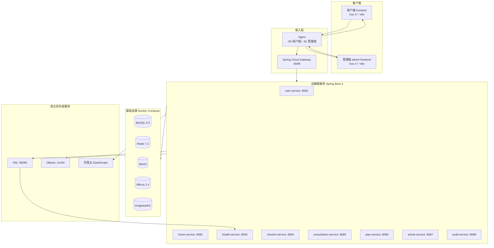

# 糖尿病智能助手项目说明

本文档面向开发者与运维人员，介绍「糖尿病智能助手」平台的整体概况、功能模块、安装部署方式及日常使用流程。

### 1.1 项目定位

**糖尿病智能助手**是一套面向糖尿病患者及关注人群的 **AI 驱动健康管理平台**，提供科普教育、风险评估、AI 问诊、个性化健康方案、日常打卡、行为分析、资讯推荐与主动健康干预等能力。

> 平台所有 AI 生成内容均标注免责声明：**仅供参考，不能替代专业医生诊断与治疗建议。**

### 1.2 技术架构

系统采用 **前后端分离 + 微服务 + AI 编排** 架构：



### 1.3 技术栈一览

| 层级 | 技术 |
|------|------|
| 用户端 / 管理端 | Vue 3.5、Vite 6、Vue Router 4、Element Plus 2.9、ECharts 5.5、Axios |
| API 网关 | Spring Cloud Gateway 2023.0.3 |
| 微服务 | Java 17、Spring Boot 3.3.5、MyBatis 3.0.3 |
| 数据存储 | MySQL 8.0（业务分库）、KingbaseES（审计）、Redis 7.2、MinIO |
| 向量检索 | Milvus 2.4 + OpenAI 兼容 Embedding |
| AI 编排 | Dify |
| 语音能力 | 阿里云百炼 Fun-ASR（识别）、qwen3-tts-flash（朗读） |
| 容器编排 | Docker Compose（Nginx + 全栈服务） |

### 1.4 业务闭环

```text
科普教育 → 风险评估 → AI 问诊 → 健康方案 → 日常打卡 → 行为分析 → 资讯推荐 → 主动干预
```

---

## 2. 功能说明

### 2.1 用户端功能

用户端（`frontend/`）采用移动端优先布局，底部导航包含 **首页、生活打卡、资讯、AI 助手、我的** 五个入口。

#### 2.1.1 首页与科普

| 页面 | 路由 | 说明 | 登录要求 |
|------|------|------|----------|
| 首页 | `/home` | 轮播 Banner、快捷服务入口、热门科普视频 | 公开 |
| 科普视频 | `/science-videos` | 视频列表、搜索与播放 | 公开 |
| 健康资讯 | `/health-info` | 分类浏览、搜索、个性化推荐 | 公开 |
| 资讯详情 | `/health-info/:id` | Markdown 正文、收藏、**AI 听全文（TTS）** | 公开 |
| AI 助手 | `/assistant` | 小糖助手科普问答（SSE 流式）、快捷问题、**语音输入** | 公开 |

#### 2.1.2 健康管理

| 页面 | 路由 | 说明 | 登录要求 |
|------|------|------|----------|
| 风险评估 | `/health-evaluation` | 填写问卷，AI 生成糖尿病风险报告与历史记录 | 需登录 |
| 健康方案 | `/living-plans` | AI 生成饮食/运动/作息方案，支持收藏、导出/打印 | 需登录 |
| 医师咨询 | `/consultation` | AI 医生列表（科室筛选、在线状态） | 需登录 |
| 在线咨询 | `/consultation/chat` | 与 AI 医生图文对话，支持语音输入与会话历史 | 需登录 |

#### 2.1.3 生活打卡

| 页面 | 路由 | 说明 | 登录要求 |
|------|------|------|----------|
| 打卡中心 | `/checkin-records` | 今日统计、积分、连续天数、四类打卡入口 | 需登录 |
| 食物打卡 | `/checkin-records/food` | 手动录入 / 预设食物 / **AI 图片识别** | 需登录 |
| 用药打卡 | `/checkin-records/medication` | 用药记录与预设 | 需登录 |
| 运动打卡 | `/checkin-records/exercise` | 运动类型、时长、消耗 | 需登录 |
| 血糖打卡 | `/checkin-records/glucose` | 血糖值、测量时段 | 需登录 |
| 成就墙 | `/checkin-records/achievements` | 打卡成就与徽章展示 | 需登录 |
| 打卡分析 | `/checkin-analysis` | 周期统计、ECharts 趋势图、**AI 行为分析** | 需登录 |
| 打卡提醒 | `/checkin-reminder-settings` | 四类提醒时段配置、浏览器通知 | 需登录 |

#### 2.1.4 个人中心

| 页面 | 路由 | 说明 |
|------|------|------|
| 个人中心 | `/user-center` | 资料编辑、头像上传、健康档案、AI 月度趋势、异常预警 |
| 消息中心 | 顶栏 Popover | 风险评估/方案生成/问诊回复/打卡分析/健康预警等通知 |
| 账户安全 | 个人中心内 | 修改密码、隐私设置、**数据导出** |

**认证页面**（公开）：`/login` 登录、`/register` 注册（邮箱验证码）、`/forgot-password` 找回密码。

---

### 2.2 管理端功能

管理端（`admin-frontend/`）面向运营与内容管理人员，与 user-service 中的 `ADMINS` 表账号绑定。

| 页面 | 路由 | 功能 |
|------|------|------|
| 管理员登录 | `/login` | 仅管理员账号可进入后台 |
| 管理首页 | `/home` | 运营概览：注册量、活跃用户、打卡量、问诊量等 |
| 数据统计 | `/statistics` | 注册/打卡趋势、性别/年龄/分型/风险/打卡类型分布图表 |
| 资讯管理 | `/articles` | 资讯 CRUD、草稿/待审/发布流转、**AI 生成初稿**（Dify SSE） |
| 科普视频管理 | `/videos` | 上传视频与封面、自动解析时长、同步用户端首页 |
| 审计日志 | `/audit-logs` | 操作审计概览、筛选、详情、CSV 导出 |

---

### 2.3 后端微服务

| 服务 | 端口 | 数据库 | 核心职责 |
|------|------|--------|----------|
| **gateway** | 8099 | — | 统一 API 路由（`/api/v1`、`/api/v2`）、跨域 |
| **user-service** | 8081 | DIABETES_USER | 用户/管理员认证（JWT）、个人资料、头像（MinIO）、消息中心、健康趋势 AI、主动干预编排、管理员统计、QQ 邮件验证码 |
| **home-service** | 8082 | DIABETES_RESOURCES | 首页内容聚合、科普问答 SSE（Milvus 预检索 + Dify）、Fun-ASR 语音识别、管理端视频 CRUD |
| **health-service** | 8083 | DIABETES_HEALTH | 健康档案、糖尿病风险预测（本地计算 + Dify）、供 Dify 回调的内部 API |
| **checkin-service** | 8084 | DIABETES_CHECKIN | 四类打卡、统计/成就、AI 行为分析、食物图片识别、打卡提醒（Redis） |
| **consultation-service** | 8085 | DIABETES_CONSULTATION / DIABETES_DOCTOR | AI 医生档案、模拟医生问诊、会话管理 |
| **plan-service** | 8086 | DIABETES_PLAN | 健康方案生成（Dify blocking → 后端拆 SSE 推送）、历史/收藏 |
| **article-service** | 8087 | DIABETES_ARTICLE | 资讯 CRUD/搜索/收藏、个性化推荐（规则 + Milvus + Dify 重排）、TTS 朗读、管理端审核 |
| **audit-service** | 8088 | KingbaseES | 操作审计日志写入与查询/导出 |

MySQL 分库说明（见 `db/init.sql`）：

```text
DIABETES_USER         用户与管理员
DIABETES_DOCTOR       AI 医生档案
DIABETES_HEALTH       健康档案与风险评估
DIABETES_CHECKIN      生活打卡
DIABETES_CONSULTATION 在线问诊
DIABETES_PLAN         健康方案
DIABETES_ARTICLE      健康资讯
DIABETES_RESOURCES    轮播图、科普视频
```

---

### 2.4 AI 能力集成

#### 2.4.1 Dify 工作流

| 工作流 | 调用服务 | 模式 | 功能 |
|--------|----------|------|------|
| 糖尿病风险评估 | health-service | blocking | 综合问卷与指标生成风险报告 |
| 健康方案生成 | plan-service | blocking | 个性化饮食/运动/作息方案 |
| 科普问答 | home-service | streaming SSE | Milvus 知识检索 + Dify 流式回答 |
| AI 医生问诊 | consultation-service | blocking | 模拟医生角色对话 |
| 健康趋势分析 | user-service | blocking | 个人中心月度趋势与异常检测 |
| 打卡 AI 行为分析 | checkin-service | blocking | 分析打卡规律与改善建议 |
| 食物图片识别 | checkin-service | blocking | 识别打卡图片中的食物与营养 |
| 资讯个性化推荐 | article-service | blocking | 对候选资讯 AI 重排序 |
| 资讯初稿生成 | admin-frontend（经 `/dify-proxy`） | streaming SSE | 按主题生成 Markdown 初稿 |

各工作流入参/出参详见 `docs/Dify工作流数据契约.md` 。

#### 2.4.2 其他 AI 服务

| 能力 | 提供方 | 调用服务 | 说明 |
|------|--------|----------|------|
| 语音识别（STT） | 阿里云百炼 Fun-ASR | home-service | AI 助手 / 问诊语音输入 |
| 语音朗读（TTS） | 阿里云百炼 qwen3-tts-flash | article-service | 资讯详情「听全文」 |
| 向量 Embedding | Ollama / OpenAI 兼容 API | article-service、home-service | Milvus 语义检索与推荐 |
| 医学知识 RAG | Milvus `diabetes_knowledge` | home-service | 科普问答知识注入，详见`docs/Milvus医学知识库落地指南.md` |

#### 2.4.3 主动健康干预

user-service 内置定时任务，结合健康趋势 AI 工作流，向用户推送健康预警消息。可通过环境变量调整：

- `INTERVENTION_COOLDOWN_HOURS`：干预冷却时间（默认 4 小时）
- `INTERVENTION_DAILY_ALERT_MAX`：每日预警上限（默认 2 条）
- `INTERVENTION_SCHEDULER_CRON`：调度 Cron 表达式

---

## 3. 安装部署指南

### 3.1 环境要求

| 项目 | 版本要求 |
|------|----------|
| 操作系统 | Windows 10+ / macOS / Linux |
| Docker | 24.0+ |
| Docker Compose | 2.20+ |
| Node.js（本地前端开发） | 20.x |
| Java（本地后端开发） | 17 |
| Maven（本地后端开发） | 3.9+ |

### 3.2 外部依赖（宿主机部署）

以下服务 **不在** `docker-compose.yml` 内，需在宿主机单独安装：

| 服务 | 默认地址 | 用途 | 是否必须 |
|------|----------|------|----------|
| **Dify** | `http://localhost:58080` | 全部 AI 工作流编排 | **必须**（AI 功能） |
| **Ollama** | `http://localhost:11434` | Embedding 模型（如 `qwen3-embedding:0.6b`） | 推荐（Milvus 语义能力） |
| **阿里云 DashScope** | API 密钥 | 语音识别 + 资讯 TTS | 推荐（语音功能） |
| **ngrok** 或公网地址 | — | Dify 拉取 MinIO 图片/音频 | 本地开发可选 |

> Docker 容器内访问宿主机服务时，使用 `host.docker.internal`（已在 compose 中配置 `extra_hosts`）。

### 3.3 快速部署（Docker Compose）

#### 步骤 1：克隆项目并配置环境变量

```bash
git clone <repository-url> diabetes_dev
cd diabetes_dev
cp .env.example .env
```

编辑 `.env`，至少填写以下项：

```bash
# 必填
MYSQL_ROOT_PASSWORD=your_secure_password
REDIS_PASSWORD=your_redis_password
JWT_SECRET=change_me_to_a_random_string_at_least_32_chars
MINIO_PASSWORD=your_minio_password
KINGBASE_PASSWORD=your_kingbase_password

# Dify（在 Dify 控制台创建各工作流后填入 API Key）
DIFY_BASE_URL=http://host.docker.internal:58080
DIFY_INTERNAL_KEY=your_dify_internal_key
DIFY_RISK_API_KEY=app-your_dify_risk_api_key
DIFY_PLAN_API_KEY=app-your_dify_plan_api_key
# ... 其余 DIFY_*_API_KEY 见 .env.example

# 语音（可选）
DASHSCOPE_API_KEY=sk-your_dashscope_api_key

# 邮件验证码（可选，注册/找回密码）
MAIL_USERNAME=your_qq_email@qq.com
MAIL_PASSWORD=your_qq_smtp_auth_code
```

完整变量说明见根目录 `.env.example`。

#### 步骤 2：启动宿主机 Dify

在宿主机部署 Dify（默认端口 58080），并在控制台创建并发布各工作流，将 API Key 填入 `.env`。

工作流配置参考：`docs/Dify工作流数据契约.md`。

#### 步骤 3：启动全部容器

```bash
docker compose up -d
```

首次启动时 MySQL 会自动执行 `db/init.sql` 初始化分库与测试数据；Kingbase 会执行 `db/kingbase_audit_init.sql` 初始化审计库。

查看服务状态：

```bash
docker compose ps
docker compose logs -f gateway user-service
```

#### 步骤 4：配置前端连接真实后端

**用户端**（`frontend/.env`）：

```bash
cp frontend/.env.example frontend/.env
# 编辑 frontend/.env
VITE_USE_MOCK=false
VITE_ADMIN_PORTAL_URL=http://localhost:81
```

**管理端**（`admin-frontend/.env`）：

```bash
cp admin-frontend/.env.example admin-frontend/.env
# 编辑 admin-frontend/.env
VITE_USE_MOCK=false
VITE_USER_PORTAL_URL=http://localhost
```

#### 步骤 5：验证部署

| 检查项 | 地址 / 命令 |
|--------|-------------|
| 用户端（Nginx） | http://localhost/ |
| 管理端（Nginx） | http://localhost:81/ |
| API 网关 | http://localhost:8099/api/v1/home/banners |
| MinIO 控制台 | http://localhost:9001 |
| MySQL | localhost:3307 |
| Redis | localhost:6380 |

### 3.4 本地开发部署

若不想使用 Docker 前端容器，可在宿主机分别启动各组件：

#### 后端（需 MySQL / Redis / MinIO 等已就绪）

```bash
cd backend
# 构建全部模块
mvn clean package -DskipTests

# 分别启动各服务（示例：gateway）
java -jar gateway/target/gateway-1.0.0-SNAPSHOT.jar
java -jar user-service/target/user-service-1.0.0-SNAPSHOT.jar
# ... 其余服务同理
```

或使用 `docker compose up -d mysql redis minio milvus kingbase` 仅启动基础设施，后端在 IDE 中调试。

#### 前端

```bash
# 用户端
cd frontend
npm install
npm run dev          # http://localhost:5173

# 管理端
cd admin-frontend
npm install
npm run dev          # http://localhost:5174
```

Vite 开发服务器会将 `/api/v1`、`/api/v2` 代理到 `http://localhost:8099`（Gateway）；管理端额外代理 `/dify-proxy` 到 Dify。

#### 单元测试

```bash
# 前端
cd frontend && npm run test:coverage

# 后端
cd backend && mvn test
```

### 3.5 Docker Compose 服务清单

| 容器名 | 镜像/构建 | 端口映射 | 说明 |
|--------|-----------|----------|------|
| diabetes-nginx | nginx:1.26-alpine | 80, 81 | 反向代理 |
| diabetes-mysql | mysql:8.0 | 3307→3306 | 业务数据库 |
| diabetes-redis | redis:7.2-alpine | 6380→6379 | 缓存 |
| diabetes-minio | minio/minio | 9000, 9001 | 对象存储 |
| diabetes-milvus | milvusdb/milvus | 19530 | 向量数据库 |
| diabetes-kingbase | kingbase 镜像 | 54321 | 审计数据库 |
| diabetes-gateway | backend 构建 | 8099 | API 网关 |
| diabetes-*-service | backend 构建 | — | 8 个微服务 |
| diabetes-frontend | node:20-alpine | 5173 | 用户端 dev |
| diabetes-admin-frontend | node:20-alpine | 5174 | 管理端 dev |

### 3.6 Milvus 医学知识库（可选）

若需启用科普问答 RAG 能力，按 `docs/Milvus医学知识库落地指南.md` 导入医学知识向量：

1. 确认 Milvus 容器健康（`docker compose ps milvus`）
2. 配置 `.env` 中 `EMBEDDING_*` 与 `MILVUS_*`
3. 执行 ETL 脚本将知识片段写入 `diabetes_knowledge` Collection

### 3.7 本地开发公网穿透（可选）

食物图片识别与语音识别需要 Dify / DashScope **通过公网 HTTP 拉取** MinIO 中的图片或音频。本地开发时可使用 ngrok：

```bash
ngrok http 9000
# 将生成的 https://xxxx.ngrok-free.app 填入 .env：
# STT_AUDIO_PUBLIC_BASE_URL=https://xxxx.ngrok-free.app
# DIFY_FOOD_RECOGNITION_IMAGE_PUBLIC_BASE_URL=https://xxxx.ngrok-free.app
```

---

## 4. 使用说明

### 4.1 访问地址

| 入口 | Docker Compose（Nginx） | 本地 Vite Dev |
|------|----------------------|---------------|
| 用户端 | http://localhost/ | http://localhost:5173 |
| 管理端 | http://localhost:81/ | http://localhost:5174 |
| API 网关 | http://localhost:8099/api/v1 | 同左（经 Vite 代理） |
| MinIO 控制台 | http://localhost:9001 | 同左 |

### 4.2 测试账号

数据库初始化脚本（`db/init.sql`）预置以下账号，**明文密码均为 `123456`**：

| 类型 | 用户名 | 说明 |
|------|--------|------|
| 普通用户 | `testuser` | 昵称「测试用户」，手机 13800138000 |
| 普通用户 | `zhangsan` | 男，100 积分 |
| 普通用户 | `lisi` | 女，50 积分 |
| **管理员** | **`admin`** | 管理后台登录 |

另预置 4 位 AI 医生（张明德、李雅琴、王建国、陈丽华）及打卡字典数据（食物/用药/运动预设）。

### 4.3 用户端使用流程

#### 4.3.1 注册与登录

1. 访问用户端首页，点击「登录 / 注册」
2. **注册**：填写手机号 → 获取 QQ 邮箱验证码（需配置 `MAIL_*`）→ 设置密码
3. **登录**：用户名 + 密码；登录后可访问风险评估、打卡、问诊等需认证功能

#### 4.3.2 健康评估与方案

1. 进入 **个人中心 → 健康档案**，填写身高、体重、家族史等基础信息
2. 进入 **风险评估**，完成问卷并提交，等待 AI 生成报告（约 30~120 秒）
3. 报告生成后可在消息中心查看通知，进入 **健康方案** 一键生成个性化方案

#### 4.3.3 日常打卡

1. 底部导航进入 **生活打卡**
2. 选择打卡类型（食物 / 用药 / 运动 / 血糖）
3. **食物打卡**可拍照上传，系统自动识别食物名称与营养信息
4. 完成打卡后进入 **打卡分析** 查看趋势与 AI 行为建议
5. 在 **打卡提醒** 中配置各类型提醒时段

#### 4.3.4 AI 助手与问诊

1. **AI 助手**（底部导航）：输入问题或点击快捷问题，获取流式科普回答；可点击麦克风语音输入
2. **医师咨询**：选择 AI 医生 → 进入对话 → 描述症状 → 获取模拟医生回复
3. 所有 AI 回答页面均展示免责声明

#### 4.3.5 资讯与消息

1. **资讯** tab 浏览推荐内容，点击进入详情可收藏或「听全文」
2. 顶栏 **消息铃铛** 查看系统通知（评估完成、方案生成、健康预警等），点击可跳转对应页面

### 4.4 管理端使用流程

#### 4.4.1 登录

1. 访问 http://localhost:81/
2. 使用管理员账号 `admin` / `123456` 登录

#### 4.4.2 资讯管理

1. 进入 **资讯管理**
2. 点击「AI 生成初稿」，输入主题/关键词，Dify 流式生成 Markdown 内容
3. 编辑完善后保存为草稿 → 提交审核 → 审核通过后发布
4. 已发布资讯自动出现在用户端资讯列表

#### 4.4.3 视频管理

1. 进入 **科普视频管理**
2. 上传视频文件与封面图，系统自动解析时长
3. 发布后同步至用户端首页「热门科普视频」

#### 4.4.4 数据统计与审计

1. **数据统计**：查看用户注册、打卡、问诊等运营指标与分布图表
2. **审计日志**：查询用户登录、注册、业务操作记录，支持 CSV 导出

### 4.5 常见问题

| 问题 | 排查方向 |
|------|----------|
| AI 功能无响应 / 超时 | 检查宿主机 Dify 是否运行；`.env` 中 `DIFY_BASE_URL` 与 API Key 是否正确 |
| 科普问答回答质量差 | 确认 Milvus 知识库已导入；检查 `EMBEDDING_*` 配置 |
| 语音识别失败 | 确认 `DASHSCOPE_API_KEY` 有效；音频 URL 需公网可达 |
| 食物识别失败 | 确认 `DIFY_FOOD_RECOGNITION_IMAGE_PUBLIC_BASE_URL` 为公网地址 |
| 注册验证码收不到 | 检查 QQ 邮箱 SMTP 配置（`MAIL_USERNAME` / `MAIL_PASSWORD` 为授权码） |
| 前端显示 Mock 数据 | 确认 `frontend/.env` 中 `VITE_USE_MOCK=false` 并重启 dev 服务 |
| 容器内无法访问 Dify | 使用 `host.docker.internal:58080`，不要用 `localhost` |
| MySQL 连接失败 | 等待 healthcheck 通过（首次启动约 30s）；检查 `MYSQL_ROOT_PASSWORD` |

