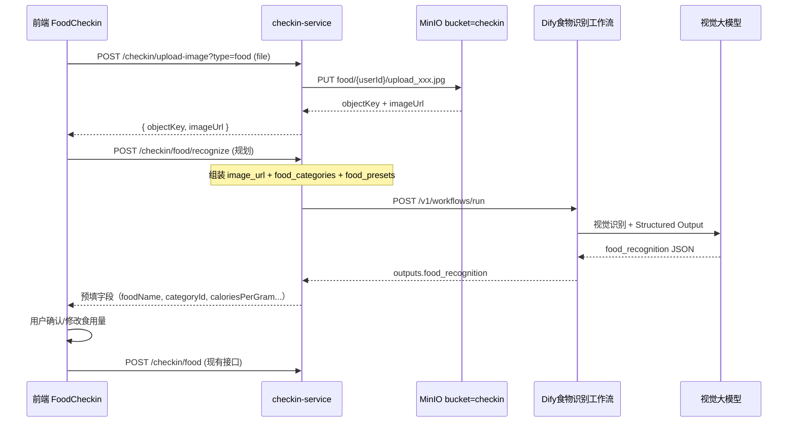
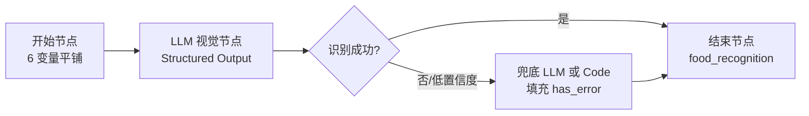

# 食物图片识别 Dify 工作流数据契约

本文档定义**食物打卡 · 自定义食物**场景下，用户上传食物图片后调用的 Dify 工作流数据契约。依据 [健康打卡模块产品设计说明书.md](./健康打卡模块产品设计说明书.md) 与 [Dify工作流数据契约.md](./Dify工作流数据契约.md) 编写。

> 本工作流由 **checkin-service** 代理调用 Dify **Workflow API**（`blocking` 模式）。  
> 用户上传图片成功后，后端将图片 URL 及可选上下文传给工作流，由视觉大模型识别食物并返回结构化营养信息，前端用于**预填表单**；用户确认后再调用现有 `POST /api/v1/checkin/food` 完成打卡。  
> 当前为设计文档；落地时需新增 `DifyFoodRecognitionWorkflowContract.java` 与对应 Schema 文件。

| 项目 | 说明 |
|------|------|
| 文档版本 | v1.0 |
| 编写日期 | 2026-07-03 |
| 关联服务 | `checkin-service`（规划新增） |
| 关联页面 | `frontend/src/views/CheckinRecords/FoodCheckin.vue` 自定义食物模式 |
| 输出变量名 | `food_recognition` |
| 响应模式 | `blocking` |

---

## 1. 业务场景

### 1.1 目标

用户在**食物打卡 → 自定义食物**流程中上传图片后，后端将图片 URL 及可选上下文传给 Dify 工作流，由**视觉大模型**识别食物并返回结构化营养信息，前端用于**预填表单**（名称、分类、每克热量、是否液体、建议食用量等），用户确认后再调用 `POST /api/v1/checkin/food` 完成打卡。

### 1.2 触发时机

| 项目 | 说明 |
|------|------|
| 触发角色 | 登录用户 |
| 调用方 | `checkin-service`（规划 `FoodRecognitionService`） |
| 触发时机 | 用户上传图片成功后（`POST /api/v1/checkin/upload-image?type=food`），或前端点击「AI 识别」按钮 |
| 工作流职责 | 识别图片中的食物、估算营养参数、匹配预设库、给出糖尿病友好提示 |
| 不替代 | 最终打卡仍走现有 `FoodCheckinService.createCheckin`，AI 结果仅作预填 |

### 1.3 交互时序



---

## 2. 调用方式

| 项目 | 说明 |
|------|------|
| 接口 | `POST {DIFY_BASE_URL}/v1/workflows/run` |
| 认证 | `Authorization: Bearer {DIFY_FOOD_RECOGNITION_API_KEY}` |
| Content-Type | `application/json` |
| 响应模式 | `response_mode: "blocking"` |
| user 标识 | 当前用户 ID，如 `usr_001` |
| 入参布局 | **flat**（开始节点多变量平铺，与打卡行为分析工作流一致） |

### 2.1 环境变量（规划）

```bash
DIFY_FOOD_RECOGNITION_API_KEY=app-xxxxxxxx          # 工作流 API Key
DIFY_FOOD_RECOGNITION_RESPONSE_MODE=blocking
DIFY_FOOD_RECOGNITION_TIMEOUT_SECONDS=60              # 视觉识别建议 ≥ 60s
```

`checkin-service` 的 `application.yml` 规划配置：

```yaml
dify:
  workflows:
    food-recognition:
      api-key: ${DIFY_FOOD_RECOGNITION_API_KEY:}
      response-mode: ${DIFY_FOOD_RECOGNITION_RESPONSE_MODE:blocking}
```

### 2.2 契约查询 API（规划）

`GET /api/v1/checkin/food/dify-workflow-spec`  
返回入参/出参 JSON Schema 与示例（与 `GET /api/v1/checkin-management/dify-workflow-spec` 风格一致）。

---

## 3. 工作流节点设计（Dify 编排）



| 节点 | 类型 | 说明 |
|------|------|------|
| 开始 | Start | 接收 6 个平铺变量（见 §4） |
| 食物识别 | LLM（Vision） | 模型需支持图片输入（如 GPT-4o / Qwen-VL / DeepSeek-VL）；开启 **Structured Output**，Schema 见 §5.2 |
| 结束 | End | 输出变量 `food_recognition`，直接引用 LLM 的 `structured_output` |

**系统提示词要点（写在 LLM 节点，不作为入参）：**

- 角色：糖尿病健康管理师 + 营养师，擅长从餐盘照片识别中式/common 食物
- 任务：识别主食物、估算每克热量、判断液体/固体、估算份量
- 约束：若图片非食物或无法识别，返回 `has_error: true`；热量取值合理（常见食物 0.2~3.0 kcal/g）
- 分类：从 `food_categories` 列表中选择最匹配的 `category_id`
- 预设匹配：若与 `food_presets` 中某条高度相似，填写 `matched_food_id`
- 糖尿病视角：给出 `gi_level`（low/medium/high）和简短 `nutrition_tip`

---

## 4. 传入数据（开始节点）

### 4.1 变量一览（6 字段平铺）

| 字段 | 类型 | 必填 | 数据来源 | 说明 |
|------|------|------|----------|------|
| `query` | string | 是 | 后端固定文案 | 识别请求说明 |
| `user_id` | string | 是 | JWT 用户 ID | 日志追踪 |
| `image_url` | string | 是 | MinIO 公开 URL | 上传接口返回的 `imageUrl` |
| `meal_period` | integer | 否 | 前端已选餐次 | 1~6，辅助上下文（非识别结果） |
| `food_categories` | string | 否 | 后端查库序列化 | 食物分类 JSON 数组字符串 |
| `food_presets` | string | 否 | 后端查库序列化 | 预设食物 JSON 数组字符串（Top-N 或全量） |

> **不传** `system_prompt`：专家角色与输出约束写在 LLM 节点系统提示词中。  
> `image_url` 须为 Dify 可访问的 URL（Docker 部署时注意 `MINIO_PUBLIC_URL` 对 Dify 容器可达）。

### 4.2 传入 JSON Schema（Dify 开始节点）

```json
{
  "type": "object",
  "properties": {
    "query": {
      "type": "string"
    },
    "user_id": {
      "type": "string"
    },
    "image_url": {
      "type": "string"
    },
    "meal_period": {
      "type": "integer"
    },
    "food_categories": {
      "type": "string"
    },
    "food_presets": {
      "type": "string"
    }
  },
  "required": [],
  "additionalProperties": true
}
```

### 4.3 字段详细说明

#### `query`（固定值）

```
请识别图片中的食物，返回名称、分类、营养参数及建议食用量，便于糖尿病用户饮食打卡。
```

#### `image_url`

上传成功后由后端拼接，格式：

```
{minio.public-base-url}/checkin/{imageObjectKey}
```

示例：`http://localhost:9000/checkin/food/usr_001/upload_abc123.jpg`

#### `meal_period` 枚举

| 值 | 含义 |
|----|------|
| 1 | 早餐 |
| 2 | 午餐 |
| 3 | 晚餐 |
| 4 | 上午加餐 |
| 5 | 下午加餐 |
| 6 | 晚上加餐 |

#### `food_categories` 解析后结构

后端从 `FOOD_CATEGORIES` 查询，`ORDER BY CATEGORY_NAME ASC`，序列化为 JSON 字符串：

```json
[
  { "category_id": "cat_grain", "category_name": "主食" },
  { "category_id": "cat_protein", "category_name": "蛋白" },
  { "category_id": "cat_veg", "category_name": "蔬菜" },
  { "category_id": "cat_fruit", "category_name": "水果" },
  { "category_id": "cat_drink", "category_name": "饮品" }
]
```

#### `food_presets` 解析后结构

后端从 `FOOD_PRESETS` 查询，建议传入当前分类或全库（≤200 条），序列化为 JSON 字符串：

```json
[
  {
    "food_id": "food_rice_001",
    "category_id": "cat_grain",
    "food_name": "糙米饭",
    "calories_per_gram": 1.16,
    "is_liquid": 0,
    "ml_to_g_ratio": 1.0
  },
  {
    "food_id": "food_milk_001",
    "category_id": "cat_drink",
    "food_name": "牛奶",
    "calories_per_gram": 0.54,
    "is_liquid": 1,
    "ml_to_g_ratio": 1.03
  }
]
```

### 4.4 HTTP 请求体示例

```json
{
  "response_mode": "blocking",
  "user": "usr_001",
  "inputs": {
    "query": "请识别图片中的食物，返回名称、分类、营养参数及建议食用量，便于糖尿病用户饮食打卡。",
    "user_id": "usr_001",
    "image_url": "http://localhost:9000/checkin/food/usr_001/upload_abc123.jpg",
    "meal_period": 2,
    "food_categories": "[{\"category_id\":\"cat_grain\",\"category_name\":\"主食\"},{\"category_id\":\"cat_drink\",\"category_name\":\"饮品\"}]",
    "food_presets": "[{\"food_id\":\"food_rice_001\",\"category_id\":\"cat_grain\",\"food_name\":\"糙米饭\",\"calories_per_gram\":1.16,\"is_liquid\":0,\"ml_to_g_ratio\":1.0}]"
  }
}
```

---

## 5. 工作流返回数据（`outputs.food_recognition`）

### 5.1 设计原则

- 输出字段与 `FoodCheckinRequest` / `CheckinDietDetail` **对齐**，便于前端直接预填
- 采用**浅层 JSON**（深度 ≤ 4），避免 Dify JSON 深度限制
- 单图多食物时，主结果放在顶层，`items[]` 承载次要识别项
- 识别失败时不抛 HTTP 错误，通过 `has_error` 告知前端

### 5.2 返回 JSON Schema（LLM Structured Output / 结束节点）

```json
{
  "type": "object",
  "properties": {
    "food_name": { "type": "string" },
    "category_id": { "type": "string" },
    "category_name": { "type": "string" },
    "calories_per_gram": { "type": "number" },
    "is_liquid": { "type": "boolean" },
    "ml_to_g_ratio": { "type": "number" },
    "suggested_input_unit": { "type": "integer" },
    "suggested_input_amount": { "type": "number" },
    "suggested_grams": { "type": "number" },
    "suggested_total_calories": { "type": "integer" },
    "matched_food_id": { "type": "string" },
    "source_type": { "type": "integer" },
    "confidence": { "type": "string" },
    "gi_level": { "type": "string" },
    "nutrition_tip": { "type": "string" },
    "recognition_summary": { "type": "string" },
    "items": {
      "type": "array",
      "items": {
        "type": "object",
        "properties": {
          "food_name": { "type": "string" },
          "category_name": { "type": "string" },
          "calories_per_gram": { "type": "number" },
          "estimated_grams": { "type": "number" }
        },
        "required": [],
        "additionalProperties": true
      }
    },
    "has_error": { "type": "boolean" },
    "error_message": { "type": "string" }
  },
  "required": [],
  "additionalProperties": true
}
```

### 5.3 返回字段说明

#### 核心识别字段（映射打卡表单）

| 字段 | 类型 | 必填 | 说明 | 对应现有字段 |
|------|------|------|------|--------------|
| `food_name` | string | 推荐 | 识别出的食物名称，如「糙米饭」「苹果」 | `FoodCheckinRequest.foodName` |
| `category_id` | string | 推荐 | 分类 ID，须为 `food_categories` 中之一 | `FoodCheckinRequest.categoryId` |
| `category_name` | string | 推荐 | 分类中文名，冗余展示 | `CheckinDietDetail.categoryName` |
| `calories_per_gram` | number | 推荐 | 每克热量 kcal/g，保留 2~4 位小数 | `FoodCheckinRequest.caloriesPerGram` |
| `is_liquid` | boolean | 推荐 | 是否液体类 | 对应 `FOOD_PRESETS.IS_LIQUID` |
| `ml_to_g_ratio` | number | 否 | ml→g 换算系数；非液体默认 1.0 | `FoodCheckinRequest.mlToGRatio` |
| `suggested_input_unit` | integer | 推荐 | 建议录入单位：1=g，2=ml | `FoodCheckinRequest.inputUnit` |
| `suggested_input_amount` | number | 推荐 | 建议食用量（与用户单位一致） | `FoodCheckinRequest.inputAmount` |
| `suggested_grams` | number | 推荐 | 换算后克数（热量计算基准） | `CheckinDietDetail.grams` |
| `suggested_total_calories` | integer | 推荐 | 建议总热量 = round(calories_per_gram × grams) | `CheckinDietDetail.totalCalories` |

#### 预设匹配字段

| 字段 | 类型 | 说明 |
|------|------|------|
| `matched_food_id` | string | 若与 `food_presets` 匹配则填 `food_id`，否则空字符串 |
| `source_type` | integer | 建议打卡来源：**1**=选用预设（有 `matched_food_id`），**2**=自定义 |

#### AI 辅助字段（仅展示，不入库）

| 字段 | 类型 | 说明 |
|------|------|------|
| `confidence` | string | 识别置信度：`high` / `medium` / `low` |
| `gi_level` | string | 升糖指数级别：`low` / `medium` / `high` |
| `nutrition_tip` | string | 面向糖尿病用户的一句话饮食建议（≤80 字） |
| `recognition_summary` | string | 识别过程简述，如「图片中为一碗米饭约 150g」 |
| `items` | array | 多食物场景下的次要项（可选） |

#### 错误字段

| 字段 | 类型 | 说明 |
|------|------|------|
| `has_error` | boolean | `true` 表示无法识别或非食物图片 |
| `error_message` | string | 失败原因，如「图片模糊，无法识别食物」 |

### 5.4 成功响应示例

**HTTP 响应：**

```json
{
  "data": {
    "status": "succeeded",
    "outputs": {
      "food_recognition": {
        "food_name": "糙米饭",
        "category_id": "cat_grain",
        "category_name": "主食",
        "calories_per_gram": 1.16,
        "is_liquid": false,
        "ml_to_g_ratio": 1.0,
        "suggested_input_unit": 1,
        "suggested_input_amount": 150,
        "suggested_grams": 150,
        "suggested_total_calories": 174,
        "matched_food_id": "food_rice_001",
        "source_type": 1,
        "confidence": "high",
        "gi_level": "medium",
        "nutrition_tip": "糙米饭升糖较白米饭慢，建议控制在一碗以内并搭配蔬菜。",
        "recognition_summary": "识别为一碗糙米饭，估算约 150g。",
        "items": [],
        "has_error": false,
        "error_message": ""
      }
    }
  }
}
```

### 5.5 自定义食物（未匹配预设）示例

```json
{
  "food_name": "全麦面包",
  "category_id": "cat_grain",
  "category_name": "主食",
  "calories_per_gram": 2.47,
  "is_liquid": false,
  "ml_to_g_ratio": 1.0,
  "suggested_input_unit": 1,
  "suggested_input_amount": 60,
  "suggested_grams": 60,
  "suggested_total_calories": 148,
  "matched_food_id": "",
  "source_type": 2,
  "confidence": "medium",
  "gi_level": "low",
  "nutrition_tip": "全麦面包纤维较高，较适合作为加餐，注意总碳水摄入。",
  "recognition_summary": "识别为两片全麦面包，估算约 60g。",
  "items": [],
  "has_error": false,
  "error_message": ""
}
```

### 5.6 识别失败示例

```json
{
  "food_name": "",
  "category_id": "",
  "category_name": "",
  "calories_per_gram": 0,
  "is_liquid": false,
  "ml_to_g_ratio": 1.0,
  "suggested_input_unit": 1,
  "suggested_input_amount": 0,
  "suggested_grams": 0,
  "suggested_total_calories": 0,
  "matched_food_id": "",
  "source_type": 2,
  "confidence": "low",
  "gi_level": "",
  "nutrition_tip": "",
  "recognition_summary": "",
  "items": [],
  "has_error": true,
  "error_message": "未能从图片中识别出食物，请手动填写或重新拍照。"
}
```

### 5.7 多食物场景示例（可选）

```json
{
  "food_name": "糙米饭",
  "category_id": "cat_grain",
  "category_name": "主食",
  "calories_per_gram": 1.16,
  "is_liquid": false,
  "ml_to_g_ratio": 1.0,
  "suggested_input_unit": 1,
  "suggested_input_amount": 120,
  "suggested_grams": 120,
  "suggested_total_calories": 139,
  "matched_food_id": "food_rice_001",
  "source_type": 1,
  "confidence": "high",
  "gi_level": "medium",
  "nutrition_tip": "本餐含主食与蛋白，注意总热量控制。",
  "recognition_summary": "主识别为糙米饭；另检测到清炒时蔬与鸡蛋。",
  "items": [
    {
      "food_name": "清炒时蔬",
      "category_name": "蔬菜",
      "calories_per_gram": 0.35,
      "estimated_grams": 100
    },
    {
      "food_name": "鸡蛋白",
      "category_name": "蛋白",
      "calories_per_gram": 0.52,
      "estimated_grams": 50
    }
  ],
  "has_error": false,
  "error_message": ""
}
```

> 多食物时：前端默认预填 `food_name` 等主项；`items` 可作为「拆分为多条打卡」的候选（二期能力）。

---

## 6. 后端 → 前端映射

规划接口 `POST /api/v1/checkin/food/recognize` 响应体（camelCase）：

```json
{
  "code": 200,
  "data": {
    "foodName": "糙米饭",
    "categoryId": "cat_grain",
    "categoryName": "主食",
    "caloriesPerGram": 1.16,
    "isLiquid": false,
    "mlToGRatio": 1.0,
    "suggestedInputUnit": 1,
    "suggestedInputAmount": 150,
    "suggestedGrams": 150,
    "suggestedTotalCalories": 174,
    "matchedFoodId": "food_rice_001",
    "sourceType": 1,
    "confidence": "high",
    "giLevel": "medium",
    "nutritionTip": "糙米饭升糖较白米饭慢，建议控制在一碗以内并搭配蔬菜。",
    "recognitionSummary": "识别为一碗糙米饭，估算约 150g。",
    "items": [],
    "hasError": false,
    "errorMessage": ""
  }
}
```

前端 `FoodCheckin.vue` 自定义模式预填逻辑：

| AI 返回 | 前端字段 |
|---------|----------|
| `foodName` | `customFood.name` |
| `categoryId` | `customFood.category_id` |
| `caloriesPerGram` | `customFood.calories_per_gram` |
| `isLiquid` | `customFood.is_liquid` |
| `mlToGRatio` | `customFood.ml_to_g_ratio` |
| `suggestedInputAmount` | `customFood.input_amount` |
| `suggestedInputUnit` | `customFood.input_unit` |
| `matchedFoodId` + `sourceType=1` | 可提示「匹配预设，是否切换为预设模式」 |

---

## 7. 与现有打卡提交的关系

AI 识别结果**不直接写库**。用户确认后仍调用现有接口：

```json
POST /api/v1/checkin/food
{
  "checkinDate": "2026-07-03",
  "mealPeriod": 2,
  "sourceType": 2,
  "foodName": "糙米饭",
  "categoryId": "cat_grain",
  "caloriesPerGram": 1.16,
  "inputUnit": 1,
  "inputAmount": 150,
  "imageObjectKey": "food/usr_001/upload_abc123.jpg",
  "recordTime": "12:30"
}
```

若 `sourceType=1` 且存在 `matchedFoodId`，则改为传 `foodId` + 预设 `imageObjectKey`。

---

## 8. 落地清单（后续开发参考）

| 项 | 路径/说明 |
|----|-----------|
| 契约类 | `backend/checkin-service/.../DifyFoodRecognitionWorkflowContract.java` |
| 入参 Schema | `backend/checkin-service/src/main/resources/dify/food-recognition-input.schema.json` |
| 出参 Schema | `backend/checkin-service/src/main/resources/dify/food-recognition-output.schema.json` |
| 业务服务 | `FoodRecognitionService` |
| 控制器 | `POST /api/v1/checkin/food/recognize` |
| 汇总文档 | 追加至 `docs/Dify工作流数据契约.md` |

---

## 9. 输入 / 输出字段速查表

### 9.1 输入（6 个）

| # | 字段 | 类型 | 必填 |
|---|------|------|------|
| 1 | `query` | string | 是 |
| 2 | `user_id` | string | 是 |
| 3 | `image_url` | string | 是 |
| 4 | `meal_period` | integer | 否 |
| 5 | `food_categories` | string (JSON) | 否 |
| 6 | `food_presets` | string (JSON) | 否 |

### 9.2 输出（`food_recognition`，18 个）

| # | 字段 | 类型 | 用途 |
|---|------|------|------|
| 1 | `food_name` | string | 预填食物名称 |
| 2 | `category_id` | string | 预填分类 |
| 3 | `category_name` | string | 展示 |
| 4 | `calories_per_gram` | number | 预填热量密度 |
| 5 | `is_liquid` | boolean | 是否液体 |
| 6 | `ml_to_g_ratio` | number | ml 换算 |
| 7 | `suggested_input_unit` | integer | 建议单位 1=g/2=ml |
| 8 | `suggested_input_amount` | number | 建议食用量 |
| 9 | `suggested_grams` | number | 换算克数 |
| 10 | `suggested_total_calories` | integer | 建议总热量 |
| 11 | `matched_food_id` | string | 预设匹配 ID |
| 12 | `source_type` | integer | 1 预设 / 2 自定义 |
| 13 | `confidence` | string | 置信度 |
| 14 | `gi_level` | string | 升糖指数级别 |
| 15 | `nutrition_tip` | string | 饮食建议 |
| 16 | `recognition_summary` | string | 识别摘要 |
| 17 | `items` | array | 多食物次要项 |
| 18 | `has_error` / `error_message` | boolean / string | 错误处理 |
